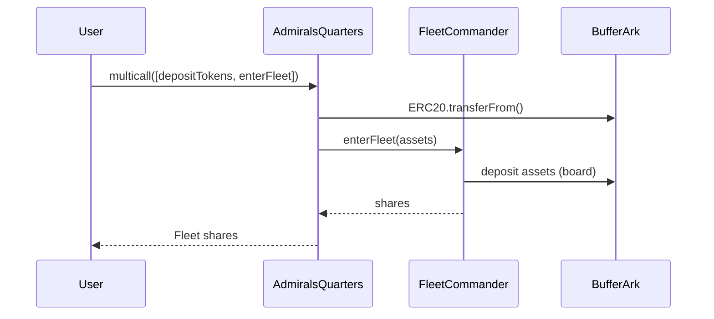
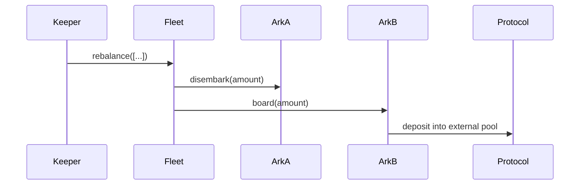

## PROTOCOL OVERVIEW:

# Lazy Summer Protocol – Technical Overview

*(max ≈ 3 900 words – Markdown formatted; suitable for senior Solidity engineers, auditors and integrators)*

---

## 1. Purpose & High-Level Architecture

Lazy Summer is a modular yield-aggregation and governance stack designed to deploy user deposits across multiple yield strategies (ARKs), coordinate those strategies through a central Fleet Commander vault, reward participants, and control the whole system through an on-chain, cross-chain governance process.

The repo is organised in four large verticals:

1. **Core-contracts** – the “Earn” layer (Fleet Commander, ARKs, RAFT, TipJar, HarborCommand, Configuration).
2. **Access-contracts** – shared role-based access control (ProtocolAccessManager) and helper mix-ins.
3. **Gov-contracts** – token, staking, vesting, timelock and Governor V2.
4. **Chain-bridge & Intent-system** – LayerZero / Stargate adapters, Cross-Chain registry, BridgeRouter and a solver-bond based Intent execution framework.
5. **Dutch-auction & Rewards packages** – auxiliary subsystems used by Treasury and emissions.

Each vertical is isolated and can be audited / upgraded independently while re-using the same access-control back-bone.

 *(simplified component map – hub chain)*

---

## 2. Core “Earn” Layer

### 2.1 Fleet Commander (packages/core-contracts/src/contracts/FleetCommander.sol)

An ERC4626 vault that issues Fleet shares and delegates capital to a configurable set of **ARK** strategy adapters at the direction of a **Keeper**.  A mandatory **BufferARK** keeps a liquidity cushion for instant withdrawals.

Key Flow

1. **Deposit** – `deposit()` pulls `asset` from user, mints Fleet shares, pushes the tokens into the BufferARK.
2. **Rebalance** – After `rebalanceCooldown` a Keeper may move funds between ARKs (`board`/`disembark`) or from Buffer to ARKs until caps & flow limits are respected.
3. **Tip** – Every external-facing action mints `tipRate` Fleet shares for the TipJar (protocol revenue).
4. **Withdraw / Redeem** – Tries Buffer first, then falls back to ARKs ordered by withdrawable liquidity.

Important Config Parameters (inside `FleetConfig` struct)

* `depositCap` – hard TVL limit.
* `minimumBufferBalance` – min idle funds inside BufferARK.
* `maxRebalanceOperations` – gas-guard, ≤ 50.
* `tipRate` – Percentage (WAD-1e18) shares minted to TipJar.

Roles (all resolved from ProtocolAccessManager)

* **Governor** – permanent admin, can pause/unpause, force-rebalance, update tip-rate.
* **Curator**  – per-Fleet role, can tune caps & rebalance-cooldown.
* **Keeper**   – per-Fleet role, can `rebalance()` under cooldown.
* **SuperKeeper** – global maintenance, bypasses per-Fleet role.

### 2.2 ARK base class & concrete strategy ARKs

An **ARK** is a thin adapter that receives capital from a single Fleet and executes a specific yield strategy.

Common features (inherited from `Ark.sol` and `ArkAccessManaged.sol`)

* Stateless governance – after deploy no new admin keys.
* `board(amount)` / `disembark(amount)` – internal hooks executed by FleetCommander only.
* `_withdrawableTotalAssets()` – conservative liquidity metric used for partial withdrawals.
* `_harvest()` – forwards rewards to the protocol-level **RAFT** address.

Implemented strategies (non-exhaustive list):

* Lending: AaveV3Ark, SparkArk, CompoundV3Ark, MoonwellArk.
* Vault wrappers: ERC4626Ark, SiloVaultArk(V1/V2), MetaMorphoArk.
* Complex: PendlePTArk / PendleLPArk, StargateV2PoolArk, OriginETHArk (+Super-variant), FluidLiteArk, CrossChainArk (bridging), MorphoArk.
* BufferArk – does nothing, just holds tokens.

Every ARK must respect a per-ARK **depositCap**, **maxRebalanceInflow / Outflow** and (optionally) percentage-of-TVL caps, all configured through the Fleet’s `FleetCommanderConfigProvider`.

### 2.3 RAFT, TipJar, ConfigurationManager & HarborCommand

* **RAFT** – Single rewards sink (not shipped in repo) that converts protocol rewards → deposit asset and redistributes.
* **TipJar** – Collects Fleet shares minted as tips and **shake()**s them periodically into Treasury + custom tip streams.
* **ConfigurationManager** – One registry for RAFT, TipJar, Treasury, HarborCommand, FleetCommanderRewardsManagerFactory.  Governor-only writes.
* **HarborCommand** – Whitelist of active Fleet Commanders so that front-ends & AdmiralsQuarters can validate addresses.

### 2.4 AdmiralsQuarters (AAQ)

A **multicall-only user helper** that bundles:

* Deposit/withdraw underlying to/from itself (`depositTokens`, `withdrawTokens`).
* Enter / exit any active Fleet (`enterFleet`, `exitFleet`).
* Stake / unstake Fleet shares in the Fleet-specific rewards manager.
* 1inch swap helper with min-out checks.
* Import positions from Aave, Compound, generic ERC4626.

Security:

* All state-changing functions are `onlyMulticall` – enforced via EIP-4337 style pattern to force batching.
* Owner (Governor) can `rescueTokens()` – the only admin power.

---

## 3. Access Layer – ProtocolAccessManager

Single AccessControl contract that mints **global roles** (Governor, Guardian, SuperKeeper, DecayController, Foundation, AdmiralsQuarters) and **contract-scoped roles** (Keeper, Curator, Commander).  Contract scoped role ids are generated deterministically:

```solidity
bytes32 role = keccak256(abi.encodePacked(roleName, targetContract));
```

Guardianship is temporary: each guardian address has an expiry timestamp; SummerTimelockController enforces that only *active* guardians may cancel or pause.

Modifier cheatsheet (from `ProtocolAccessManaged.sol` & `ArkAccessManaged.sol`):

```
onlyGovernor                 – global gov role
onlyGuardian                 – guardian & not expired
onlyGuardianOrGovernor       – either of the above
onlyKeeper                   – Fleet-scoped KEEPER_ROLE **or** SUPER_KEEPER_ROLE
onlyCurator(address fleet)   – Fleet-scoped CURATOR_ROLE
onlyAuthorizedToBoard(commander) – Commander itself, the ARK’s RAFT, or an active Ark inside the caller Fleet
```

---

## 4. Governance V2 Stack

### 4.1 Tokens & Staking

* **SUMR**  – omnichain LayerZero OFT, capped supply, transfers disabled until `enableTransfers()` after a cliff.
* **xSUMR** – `StakedSummerToken`, non-transferable ERC20Votes.  Mint/Burn controlled by authorised **staking modules**.
* **SummerStaking** – primary staking module with lock-ups:
  * Lock-up 0 – NoLockup (index 0 aggregate)
  * 2 weeks → 3 years split into six buckets, each with Governor-set cap.
  * Weighted stake: `weighted = amount * (1+7e-16*t^2)` (quadratic, t in seconds) used for rewards (not voting).
  * Early-unstake penalties routed to Treasury.
* **WrappedStakingToken** – internal 1:1 wrapper (also used by GovernanceRewardsManager).
* **SummerVestingWalletsEscrow** – temporary bridge to stake SUMR that sits inside vesting wallets (V1 & V2 factories) and mint same amount of xSUMR.  Tracks `released()` delta while staked.

### 4.2 GovernorV2 + TimelockController

* **Hub-and-Satellite topology** – Only one *hub* chain allows `propose() / castVote() / execute() / cancel()`.  Satellites are passive: they receive finalised proposals via LayerZero and queue them locally.
* **Voting** – standard ERC20Votes (timestamp clock).  Proposal Threshold validated at deploy (1 000 ≤ threshold ≤ 100 000 SUMR).
* **Guardians** – addresses with GUARDIAN_ROLE in ProtocolAccessManager can propose (threshold bypass) and cancel queued proposals *that are not guardian-expiry operations*.
* **Timelock** – `SummerTimelockController` extends OZ with guardian expiry logic: ops that end guardianship (`setGuardianExpiration`) may only be cancelled by Governors.
* **Cross-chain** – `sendProposalToTargetChain(dstEid, …)` encodes targets/values/data/descriptionHash and dispatches via LayerZero OApp; the satellite governor receives (`_lzReceive`) and queues.

Voting flow:

```mermaid
graph TD;
    Stake[Stake SUMR -> xSUMR];
    Stake --> Propose;
    Propose -->{Voting Delay};
    {Voting Delay} --> Vote;
    Vote -->{Voting Period};
    {Voting Period} --> QueueTimelock;
    QueueTimelock --> Execute;
    Execute --> sendProposal; %% cross chain
    sendProposal --> SatelliteQueue;
    SatelliteQueue --> SatelliteExecute;
```

### 4.3 Rewards Layers

* **GovernanceRewardsManager** – simple SUMR staking farm with EMA-smoothed decay factor (used for SUMR un-staked but wrapped supply).
* **SummerRewardsRedeemer** – Merkle-tree distributor; Governor uploads roots, users claim.
* **FleetCommanderRewardsManager** – one per Fleet (factory-deployed); handles Fleet share staking to earn protocol rewards.

---

## 5. Bridge & Cross-Chain Registry

### 5.1 CrossChainRegistry

Centralised mapping: `(source, relationshipType, targetChainId) → targetAddress`.  Supported types: `PEER_RELATIONSHIP`, `ARK_FLEET_RELATIONSHIP`, `EXECUTOR_RELATIONSHIP`.

Governor may register/unregister; adapters and proxy contracts query it to verify peers.

### 5.2 BridgeRouter & Adapters

* **BridgeRouter** – Core orchestrator.  Executors call `executeTransferAssets / executeSendMessage / executeReadState`, Router chooses an adapter (explicit or cheapest), pays fees, tracks `operationId -> adapter` and hands over token custody.  Adapters callback `deliver()` with results.
* **LayerZeroAdapter** – message + read-state adapter using LZ OAppRead.  Maintains read-channel, DVN config, and chain-to-EID mapping.
* **StargateAdapter** – OFT + Stargate V2 “Taxi” mode bridge for ERC20 transfers; supports compose to call Router on arrival.  Handles failed compose via `manualRecovery()`.
* **CrossChainArk** – ARK that bridges funds to a satellite FleetProxy via BridgeRouter and tracks remote balance + in-flight assets.
* **FleetProxy** – satellite side; receives bridged asset, deposits into Fleet; can withdraw & bridge back on keeper request.

All contracts derive `CrossChainReceiverBase` to guarantee only BridgeRouter may invoke the receive hooks.

---

## 6. Intent System (Solver Bonds)

Experimental subsystem that allows Keepers to create **Intents** (yield commitments) that can be solved by **Solvers** who put up a SUMR bond and escrow yield tokens until the term expires.

Flow

1. Governor deploys **IntentBondFactory** and **IntentHandler**; registers IntentHandler as the only `intentHandler` in the factory.
2. Keeper calls `createIntent(ark, requiredNotional, term, ...)` – stored in `intentStates`.
3. Solver must first have a `SolverBond` (created by Keeper via `createBond(solver)`); then `solveIntent()` transferring `escrowedYield` into its dedicated **Escrow**.
4. At/after expiry any account can `settleIntent()` – funds are withdrawn from Escrow and transferred to the Ark’s **BufferArk**, marking the intent `Settled`.
5. Solver can `resignBySolver()` before expiry -> halves its bond.

Security parameters:

* Bond sufficiency checked via SUMR/USD oracle.
* Escrow is per-solver; IntentHandler the single authority.
* MAX_TERM = 365 days, MIN_TERM = 1 day.

---

## 7. Treasury & Auctions

* **BuyAndBurn** – Dutch auction system that sells non-core tokens for SUMR, burns all SUMR raised.
* **DutchAuctionManager** – permissionless Dutch auction engine (linear/exponential decay functions) usable by Treasury or external protocols.

---

## 8. Security & Audit Notes

1. **Single access source of truth** – All contracts rely on `ProtocolAccessManager` (ERC-165 verified).  Changing AccessManager address is impossible after deployment.
2. **Two-step pausing** – Guardian can pause immediately, Governor can unpause after minimum pause time (FleetCommander).
3. **No storage collisions** – ARKs do **NOT** use proxy pattern; each is deployed as standalone implementation – easier auditing.
4. **Upgradeable surface** – Only Governor-managed contracts may be redeployed; no proxy upgrades in this repo.
5. **Cross-chain replay protection** – Adapters verify `operationId` uniqueness and peer validation via CrossChainRegistry.
6. **Non-transferable governance token** – xSUMR can not be moved, reducing vote buy risk.
7. **Reentrancy** – All external functions that move tokens are `nonReentrant` (OpenZeppelin guard).
8. **Math** – Percentage utils use fixed-point WAD 1e18; edge cases around percentage subtraction considered in tests.
9. **Slippage** – Strategy ARKs with swaps (Pendle, Stargate, Origin) accept min-out parameters or internally calc from oracles + `slippagePercentage`.
10. **Caps** – Per-ARK deposit caps & per-Fleet TVL caps hard-limit exposure.

---

## 9. Typical User Journeys

### 9.1 Deposit & Earn



### 9.2 Keeper Rebalance



### 9.3 Governance Proposal Execution (cross-chain)

1. Hub: Proposal passes, executed via Timelock.
2. Governor V2 calls `sendProposalToTargetChain(dstEid, …)`.
3. LayerZero delivers to satellite Governor.
4. Satellite queues operation in its local Timelock.
5. Anyone calls `execute()` after delay.

---

## 10. Integration Checklist

* Use **HarborCommand.getActiveFleetCommanders()** to list official Fleets.
* Validate a FleetCommander before calling: `HarborCommand.activeFleetCommanders(fc)`.
* Retrieve Fleet asset: `IFleetCommander.asset()`.
* To stake Fleet shares: use `FleetCommander.stakingRewardsManager()` then `stakeOnBehalfOf()`.
* For cross-chain deposits/withdrawals interact with **CrossChainArk ↔ FleetProxy** pair; Registry keys: `ARK_FLEET_RELATIONSHIP`.
* To decode/encode 1inch swaps inside AdmiralsQuarters use `OneInchTestHelpers` (test-only) or replicate its helper logic.

---

## 11. Conclusion

Lazy Summer is a composable, access-controlled yield & governance framework consisting of:

* **Fleet layer** – ERC4626 vault with plug-and-play ARK strategies & automated tip stream.
* **Governance layer** – xSUMR-based voting on the hub chain, LayerZero broadcasting, guardian safety net.
* **Access layer** – Single source of truth roles preventing privilege drift.
* **Bridge layer** – Modular adapters + registry for cross-chain asset and message flows.
* **Extensibility hooks** – Rewards managers, solver-bond intents, Dutch auctions.

The design favours **minimised trust**, **gas efficiency** (caching, enumerable sets) and **clear separation of duties** between long-lived managers and short-lived strategy contracts.


 ## DOCUMENTATION: 

 ### summer-docs.md

# Lazy Summer Protocol

## Lazy Vaults

Lazy Vaults (also called `Fleets`) are the primary user-facing component of the Summer Protocol. Each Lazy Vault represents a Fleet - a set of coordinated contracts that include a Fleet Commander, ARKs, and RAFT.

A Fleet exists for each deposit token type (DAI, USDC, ETH) and multiple Fleets may exist per token to accommodate different risk preferences. Every Fleet is supported by the RAFT contract which farms reward tokens and swaps farmed tokens to the underlying Fleet deposit token - boosting Fleet yields at no cost to the user.

At launch, Fleet ARKs support basic lending and staking positions. Over time, advanced ARKs will be introduced to Fleets (subject to governance approval). A concrete example would be an ARK that supports the underlying yield-looping stack that is already available on Summer.fi today.

## Key Components

### Fleet Commander

Controls asset allocation and manages user deposits/withdrawals. Issues shares to depositors representing their ownership of the vault's assets.

### ARKs

Specialized contracts that implement yield strategies through lending, staking, and other DeFi mechanisms. Each Fleet has multiple ARKs plus a Buffer ARK holding token for quick withdrawals.

### RAFT

Automatically harvests rewards from protocols, converts them to the vault's deposit token, and reinvests them to compound yields.

# Summer Governance Contracts

This package contains the core governance contracts for the Summer protocol.

## Main Contracts

### SummerGovernor.sol

`SummerGovernor` is the main governance contract for the Summer protocol. It extends various OpenZeppelin governance modules and includes custom functionality such as whitelisting and voting decay.

Key features:
- Cross-chain proposal execution
- Whitelisting system for proposers
- Integration with LayerZero for cross-chain messaging
- Custom voting power calculation with decay

### SummerToken.sol

`SummerToken` is the governance token for the Summer protocol. It extends OpenZeppelin's ERC20 implementation and includes additional features.

Key features:
- ERC20 with voting capabilities
- Integration with LayerZero's OFT (Omnichain Fungible Token)
- Built-in vesting wallet creation

### SummerVestingWallet.sol

`SummerVestingWallet` is a custom vesting wallet implementation for the Summer protocol.

Key features:
- Two vesting schedules: 6-month cliff and 2-year quarterly vesting
- Built on top of OpenZeppelin's VestingWallet

## Understanding Decayed Voting Power

The Summer protocol implements a unique voting decay mechanism where voting power gradually decreases over time unless actively managed. Here's how it works:

### Core **Concepts**

1. **Decay Rate**: A configurable rate (between 1% and 50% per year / TBD) at which voting power decreases
2. **Decay-Free Window**: An initial period (between 1 day and 180 days / TBD) where no decay occurs
3. **Delegation Chain**: A maximum of 2 levels of delegation are allowed before voting power is zeroed out
4. **Checkpoints**: Records of voting power at specific points in time

### Example Scenarios

#### Scenario 1: Basic Decay

Alice holds 1000 SUMMER tokens and self-delegates:
```
T+0:   Alice self-delegates
       Initial voting power = 1000
       Decay checkpoint created with factor = 1.0 (WAD)

T+30d: Still within decay-free window
       Voting power = 1000 (no decay)

T+395d: After 1 year (including decay-free window)
       Voting power ≈ 900 (10% decay applied)
```

#### Scenario 2: Delegation Chain

Bob has 1000 SUMMER tokens and delegates through a chain:
```
T+0:   Bob delegates to Charlie
       Charlie delegates to Alice
       Valid chain (depth = 2)
       Bob's tokens contribute to Alice's voting power

T+0:   If Alice then delegates to Dave
       Chain becomes: Bob -> Charlie -> Alice -> Dave
       Voting power = 0 (exceeds MAX_DELEGATION_DEPTH)
```

#### Scenario 3: Resetting Decay

Charlie wants to reset their decay factor:
```
1. Create new wallet
2. Transfer tokens to new wallet
3. Delegate from new wallet
   - New decay checkpoint created
   - Decay factor reset to WAD (1.0)
   - New decay-free window begins
```

### Best Practices

1. **Active Management**
   - Regularly update your delegation to refresh decay factors
   - Consider re-delegating before important votes

2. **Delegation Strategy**
   - Keep delegation chains short (max 2 levels)
   - Monitor your current decay factor using `getDecayFactor()`

3. **Decay Protection**
   - Use the decay-free window strategically
   - Create new wallets for fresh decay factors when needed
   - Consider splitting holdings across multiple addresses to manage decay risk

### Technical Details

- Decay is calculated using either linear or exponential functions
- Historical voting power uses current decay factors (not historical ones)
- Checkpoints are created on:
  - Initial delegation
  - Token transfers
  - Decay factor updates
  - Delegation changes

### Important Notes

1. **Irreversible**: Decay cannot be reversed without using a new wallet
2. **Compound Effect**: Long delegation chains can result in zero voting power
3. **Checkpoint Impact**: All voting power calculations use the current decay factor, even for historical queries

### Understanding Delegation vs Decay Inheritance

A critical distinction exists between how voting power and decay factors are handled in delegation chains:

#### Voting Power Flow
```
Alice (1000 SUMMER) -> Bob -> Charlie
Result: Charlie has 1000 voting power
        Bob has 0 voting power
        Alice has 0 voting power
```

#### Decay Factor Inheritance (Reverse Flow)
```
Alice (holder) -> Bob -> Charlie (final delegate)
Result: Alice's decay factor = Charlie's decay factor
        If Charlie is inactive, Alice's rewards decay
        If Bob changes delegate, Alice's decay follows the new chain
```

### Why This Matters

1. **Voting Power**
   - Flows forward through the delegation chain
   - Only the final delegate can use the voting power
   - Previous delegates in the chain have zero voting power

2. **Decay Factor**
   - Inherited backwards through the delegation chain
   - Token holders (like Alice) are affected by their delegate's inactivity
   - Used for both voting power AND rewards calculation
   - Encourages choosing active delegates

### Example Scenario

```
T+0:   Alice holds 1000 SUMMER
       Delegates to Bob, who delegates to Charlie
       All decay factors = 1.0 (WAD)

T+60d: Charlie becomes inactive
       Charlie's decay factor begins decreasing
       Alice's rewards also decay, even though she's active
       Because: Alice inherits Charlie's decay factor

T+90d: Bob changes delegate to Dave (active user)
       Alice's decay factor now follows Dave
       Alice's rewards begin to recover
```

### Strategic Implications

1. **For Token Holders**
   - Monitor your delegate's activity
   - Your rewards depend on your delegate's engagement
   - Consider direct delegation to active participants

2. **For Delegates**
   - Maintain regular activity to prevent decay
   - Communicate delegation changes to your delegators
   - Understand you affect your delegators' reward rates


## Preliminary Documentation (for auditors)

### Overview (concise)

Governance v2 is a hub-and-satellite model. Voting happens exclusively on the hub chain using xSUMR (a non-transferable ERC20Votes token minted 1:1 for staked SUMR or vesting wallet/s/). Approved proposals are executed via a timelock on the hub and can be relayed cross-chain to satellites via LayerZero. Satellites do not accept proposals or votes; they only queue and execute hub-approved operations after the configured delay.

xSUMR mint/burn is restricted to authorized staking modules managed by governance. Guardians (tracked by `accessManager`) can propose below threshold and have specific cancellation and pause privileges, enforced by `SummerTimelockController` and `StakedSummerToken`.

### Staking weights and penalties (summary)

- **Weight multipliers (rewards only)**:
  - Weighted stake uses a quadratic time factor: `weighted = amount * (1 + 7e-16 * t^2)` where `t` is lockup seconds (capped at 3 years).
  - Rewards accounting uses weighted balances (the rewards `totalSupply` equals the sum of weighted stakes).
  - Governance voting power is based on xSUMR balance (1:1 minted for staked SUMR or vesting balances), not the weighted amount.
- **Penalty on early unstake**:
  - If penalties disabled → 0; if lockup expired → 0.
  - If remaining lockup < 110 days → flat 2%; else linear up to 20% at 3 years: `penaltyPct = 20% * (remaining / 3y)`.
  - Penalty applies to the amount being unstaked; penalty is transferred to `treasury()`, remainder to user.
- **Buckets & caps**:
  - Lockups are grouped into buckets (NoLockup, ShortTerm, 2w–3m, 3–6m, 6–12m, 1–2y, 2–3y) with governor-configurable caps; All buckets are disabled by default (cap = 0).
  - A user has a single portfolio; index 0 aggregates NoLockup; up to 1000 stakes; full portfolio can be migrated to a fresh target via `transferStakes(to)`.

### Actors and Roles (who can do what)

- **SUMR holder**: Holds the base token. Can stake into `SummerStaking` or stake via vesting wallets using `SummerVestingWalletsEscrow` to receive xSUMR.
- **xSUMR holder (voter)**: Has voting power on the hub chain. Can propose if voting power ≥ proposal threshold; can always vote on hub.
- **Proposer (threshold-based)**: Any xSUMR holder with voting power ≥ proposal threshold can propose on the hub.
- **Guardian (via `accessManager`)**: Can propose even below threshold on the hub; can cancel certain queued ops via timelock rules; can pause/unpause xSUMR alongside governor.
- **Governor (the governance process + addresses with governor role)**: Adds/removes staking modules on xSUMR, manages vesting factory allowlist in the escrow, toggles pause, can perform emergency minter role actions in xSUMR, and controls configuration via proposals executed through the timelock.
- **Timelock (`SummerTimelockController`)**: Schedules and executes approved operations after a delay. On satellites, anyone permitted by timelock executors can execute after delay.
- **Staking module (`SummerStaking`)**: When authorized by xSUMR, can `mint` and `burnFrom` xSUMR corresponding to stake/unstake flows; cannot transfer xSUMR between users.
- **Vesting wallet owner**: Can stake/unstake from approved vesting wallet factories via `SummerVestingWalletsEscrow` (escrow must already own the vesting wallet during staking period).
- **Protocol Access Manager (`IProtocolAccessManager`)**: Source of truth for guardianship and roles; queried by the governor and timelock for authorization decisions.
- **LayerZero endpoint**: Cross-chain transport used by the governor to distribute finalized proposals to satellites. Governor accepts ETH only from the endpoint or the timelock.

### Contract relationships (high level)

- `SummerGovernorV2`
  - Uses xSUMR (ERC20Votes) as the voting token (no decay in v2)
  - Owns/schedules through `SummerTimelockController`
  - Queries `accessManager` to check guardian status
  - Sends proposals to other chains via LayerZero OApp; satellites only queue received proposals
  - Hub-only for propose/vote/execute/cancel; satellites cannot run these (queue only)

- `StakedSummerToken` (xSUMR)
  - Non-transferable; only mint/burn flows
  - Governor adds/removes staking modules which receive `MINTER_ROLE` and `BURNER_ROLE`
  - `burnFrom` requires owner or `BURNER_ROLE` plus allowance; direct `grantRole`/`revokeRole` are disabled
  - Pausable by guardian/governor

- `SummerStaking`
  - Main staking with lockups (0–3y), weighted staking, penalties, and bucket caps
  - Mints/burns xSUMR 1:1 on stake/unstake via `WrappedStakingToken`
  - Weighted total supply drives rewards accounting

- `SummerVestingWalletsEscrow`
  - Allows staking from vesting wallets owned by the escrow
  - Governor manages allowed vesting factories
  - Mints/burns xSUMR equal to vesting wallet SUMR balance and tracks released amounts during stake

- `SummerTimelockController`
  - Enforces delay and specialized cancellation rules (governors vs guardians; guardian-expiry operations restricted)
  - On satellites, executes queued operations after delay without hub voting (execution path is via timelock)

### Hub/Satellite Governance and Voting Flow

1. Stake to obtain votes
   - Users lock SUMR in `SummerStaking` (or via `SummerVestingWalletsEscrow`) and receive non-transferable xSUMR.
2. Propose (hub-only)
   - Any address with votes ≥ proposal threshold can propose on the hub; guardians can propose even below threshold.
3. Vote (hub-only)
   - xSUMR holders vote; quorum and counting follow OpenZeppelin Governor modules.
4. Queue and execute on hub
   - Successful proposals are queued and then executed through `SummerTimelockController` after the delay.
5. Distribute cross-chain
   - `SummerGovernorV2.sendProposalToTargetChain()` is called on the hub to broadcast the finalized proposal to target chains via LayerZero.
6. Satellite behavior
   - Satellite governors receive the message and `_queueCrossChainProposal(...)` schedules operations in the local timelock. Propose/vote/execute/cancel remain disabled on satellites. After the delay, the satellite timelock executes (per its executor permissions).
7. Safeguards
   - Governor/guardian can pause xSUMR; guardianship checked via `accessManager`; governor accepts ETH only from LayerZero endpoint or the timelock.

### Testing and Coverage (audited scope)

- Build/tests for this package:

```bash
pnpm -F @summerfi/earn-gov-contracts build
pnpm -F @summerfi/earn-gov-contracts test
pnpm -F @summerfi/earn-gov-contracts coverage
pnpm -F @summerfi/earn-gov-contracts coverage:report
```

- Expectations:
  - Tests: 100% passing. Each test should include at least one failure path (e.g., `expectRevert`).
  - Coverage: >80% lines/branches across audited contracts (`SummerStaking.sol`, `SummerVestingWalletsEscrow.sol`, `SummerGovernorV2.sol`, `StakedSummerToken.sol`).
  - Clean environment instructions are in the repo root `README.md`.

### What changed vs Governance v1

- Voting decay is removed in v2. Governance token remains xSUMR (ERC20Votes), but without time-based decay mechanics. Hub/satellite architecture and guardian model are preserved, simplifying analysis and operations.

## Executive Summary for Auditors

This audit covers **new contracts** that extend previously audited functionality. The focus is on:
- **StakedSummerToken.sol** - Governance token with controlled minting
- **SummerGovernorV2.sol** - Governance without voting decay (vs V1 with decay)
- **SummerVestingWalletsEscrow.sol** - MVP staking bridge for vesting wallets
- **SummerStaking.sol** - Advanced staking with lockup periods and weighted rewards

## Key Architectural Changes

### 1. StakedSummerToken.sol - Governance Token Design

**Purpose**: This is the **governance token** (xSUMR) that represents staked SUMMER tokens with voting power.

**Critical Security Features**:
- **Controlled Minting**: Only `MINTER_ROLE` holders can mint
- **Role Management**: Direct `grantRole`/`revokeRole` are **disabled**; only governor can add/remove staking modules or (emergency) grant/revoke minter role
- **Non-transferable**: xSUMR disables user-to-user transfers. Only mint (from address(0)) and burn (to address(0)) are allowed
- **Pausable**: Governor/Guardian can pause, which blocks mint/burn while paused
**Multiple Staking Modules Support**:
- **Before**: Single `stakingModule` address with direct role assignment
- **After**: Multiple staking modules can be added/removed dynamically

**Role Assignment Flow**:
```solidity
addStakingModule() → 
  - Grants MINTER_ROLE to new staking module
  - Grants BURNER_ROLE to new staking module
  - Emits StakingModuleAdded event

removeStakingModule() → 
  - Revokes MINTER_ROLE from staking module
  - Revokes BURNER_ROLE from staking module  
  - Emits StakingModuleRemoved event

// Emergency (governor-only, not part of normal flow)
grantMinterRole(_minter)
revokeMinterRole(_minter)
```

### **Security Implications**

**Enhanced Flexibility**:
- ✅ Multiple staking contracts can mint xSUMR tokens
- ✅ Each staking module has independent minting/burning authority
- ✅ Governor can add/remove staking modules without redeployment

**Risk Considerations**:
- 🔴 **Multiple Minters**: More attack surface - each staking module can mint
- 🔴 **Role Proliferation**: Each added module gets both MINTER and BURNER roles
- 🔴 **Governance Control**: Only governor can add/remove modules

**Authorization Nuances**:
- Burning uses `burnFrom(from, amount)` and enforces standard ERC20 allowances. Having `BURNER_ROLE` does not bypass allowances unless burning own balance. This reduces blast radius of a compromised burner.

**Audit Focus Areas**:
- Role escalation prevention (direct role granting disabled)
- Staking module address validation
- Minting/burning authorization flow (BURNER_ROLE + allowance model)
- Pause semantics impact on mint/burn and governance snapshots

### 2. SummerGovernorV2.sol vs SummerGovernor.sol

**Key Difference**: **V2 removes voting decay functionality**

| Feature | V1 (Audited) | V2 (New) |
|---------|---------------|-----------|
| Voting Decay | ✅ `DecayController` | ❌ Removed |
| `updateDecay` modifier | ✅ Present | ❌ Removed |
| Cross-chain messaging | ✅ LayerZero | ✅ LayerZero |
| Guardian system | ✅ Active | ✅ Active |

**Why This Matters**: V2 simplifies governance by removing time-based voting power decay.

**Hub/Satellite Model**:
- Proposals, votes, execute, cancel: restricted to the hub chain via `onlyHubChain`
- Cross-chain distribution: `sendProposalToTargetChain()` (hub-only) sends to satellites using LayerZero OApp
- Satellite chains queue received proposals via `_queueCrossChainProposal` guarded by `onlySatelliteChain`
- Contract `receive()` accepts ETH only from LayerZero endpoint or the timelock; others revert (`GovernorDisabledDeposit`)

**Thresholds and Guardians**:
- `MIN_PROPOSAL_THRESHOLD = 1,000e18`, `MAX_PROPOSAL_THRESHOLD = 100,000e18` (validated at construction)
- Proposers below threshold can still propose if they are active guardians (`isActiveGuardian` via `accessManager`)

### 3. SummerVestingWalletsEscrow.sol - MVP Staking Bridge

**Purpose**: Temporary staking solution that allows users to stake from vesting wallets.

**Critical Flows**:
```solidity
stakeVesting(address[] factories) →
  - Requires each `factory` is enabled
  - For each factory: resolve `vestingWallets(user)` (initial owner), require nonzero and escrow already owns it
  - Mint xSUMR equal to current SUMR balance in that vesting wallet
  - Track staked amount and the `released(token)` snapshot per factory -> cases where `release()` has been called permisionlessly while staked

unstakeVesting(address[] factories) →
  - For each factory: compute SUMR released while staked and forward to the user (if any)
  - Transfer vesting wallet ownership back to the user
  - Burn recorded xSUMR
  - remove `released` and `balance` tracking for factory/user pair - to enable consequent stakes
```

**Security Considerations**:
- **Ownership Expectations**: Escrow must already own the vesting wallets to stake from them; this contract does not transfer ownership during stake
- **Factory Validation**: Only pre-approved vesting factories allowed
- **Granular Operations**: Users may stake/unstake per-Factory by passing a list of factories

**Audit Focus Areas**:
- Vesting wallet ownership management
- Factory whitelist validation
- Token release calculations during staking

**User/Operator API**:
- `addVestingFactory(address)` / `removeVestingFactory(address)`: governor-only
- `rescueWallet(wallet, newOwner)`: governor-only safety valve
- `rescueToken(token, to)`: governor-only
- Views: `vestingFactories()`, `getVestingFactory(index)`, `userStakedVestingFactories(user)`, `getUserStakedVestingFactory(user, index)`

**Events**:
- `StakedVestingWallet(user, factory, balance, releasedAtStake)`
- `UnstakedVestingWallet(user, factory, balance, releasedAtUnstake)`

### 4. SummerStaking.sol - Advanced Staking with Lockups

**Purpose**: Main staking contract with lockup periods, weighted rewards, and bucket-based caps.

**Key Features**:
- **Lockup Periods**: 0 to 3 years (0 = no lockup via a dedicated aggregated stake at index 0)
- **Weighted Staking**: Longer lockups = higher reward multipliers (quadratic in time)
- **Bucket System**: Configurable caps per lockup duration
- **Penalty System**: Early unstaking incurs time-based penalties (governor can toggle penalties on/off)
- **Stake Portfolio Management**: One portfolio per address; index 0 aggregates no-lockup stake; up to 1000 stakes; full-portfolio transfer supported via `transferStakes(to)` to a fresh target
- **Default Caps**:
  - `NoLockup`: cap = 0 (by default - to be initialized by governance)
  - `ShortTerm` (1 sec – 14 days): cap = 0 (by default - to be initialized by governance)
  - `TwoWeeksToThreeMonths` (>14 days – 90 days): cap = 0 (by default - to be initialized by governance) 
  - `ThreeToSixMonths` (>90 – 180 days): cap = 0 (by default - to be initialized by governance) 
  - `SixToTwelveMonths` (>180 – 365 days): cap = 0 (by default - to be initialized by governance) 
  - `OneToTwoYears` (>365 – 730 days): cap = 0 (by default - to be initialized by governance) 
  - `TwoToThreeYears` (>730 – 1095 days): cap = 0 (by default - to be initialized by governance)


**Critical Calculations**:
```ts
// Weighted stake formula (UD60x18 fixed-point; time in seconds)
// WEIGHTED_STAKE_BASE = 1.0
// WEIGHTED_STAKE_COEFFICIENT = 7e-16
weightedAmount = amount * (1 + 7e-16 * time^2)

// Penalty calculation  
// If penalties disabled → 0
// If lockup expired → 0
// If timeRemaining < 110 days → 2% flat (according to the `formula` the fee is 2% at 9460800 seconds - 109.5days - but it was rounded up)
// Else → 20% * (timeRemaining / 3 years)
penaltyPct = remainingLockup < 110 days ? 2% : 20% * (remainingLockupTime / 3 years);
penaltyAmount = penaltyPct * amount;
```


**Rewards Accounting**:
- The `totalSupply` used for rewards is actually the weighted total supply. Because the base rewards manager requires `rewardPerToken()` to use `totalSupply`, this staking contract accounts `totalSupply` as the sum of weighted amounts to ensure correct reward distribution.

**Token Flows**:
- On stake: transfer SUMR → contract, approve and deposit into `WrappedStakingToken`, mint xSUMR 1:1 to receiver
- On unstake: burn xSUMR, withdraw wrapped SUMR; if a penalty applies, send penalty to `treasury()` and remainder to user

**Security Model**:
- **Bucket Caps**: Governor-controlled limits per lockup duration
- **Penalty Enforcement**: Penalties sent to treasury, not burned
- **Wrapped Token Integration**: Uses `WrappedStakingToken` for internal accounting

**Audit Focus Areas**:
- Weighted stake calculation precision
- Bucket cap enforcement
- Penalty calculation accuracy
- Wrapped token integration security

**User/Operator API**:
- Stake: `stakeLockup(amount, lockupPeriod)`; `stakeLockupOnBehalf(receiver, amount, lockupPeriod)`
- Unstake: `unstakeLockup(stakeIndex, amount)`
- Transfer portfolio: `transferStakes(to)` (to must have no stakes, no xSUMR, and no reward markers)
- Admin: `updateLockupBucketCap(bucket, newCap)`, `updatePenaltyEnabled(bool)`, `rescueToken(token, to)`
- Views: `getUserStakesCount(user)`, `getUserStake(user, index)`, `weightedBalanceOf(user)`, bucket getters
- Disabled (reverts): `stake()`, `unstake()`, `exit()`, `stakeOnBehalfOf()`, `unstakeAndWithdrawOnBehalfOf()`

## Integration Points & Dependencies

### Staking Flow
```
User → SummerStaking.stakeLockup() → 
  - Transfers SUMMER tokens
  - Wraps via WrappedStakingToken
  - Mints xSUMR via StakedSummerToken.mint()
  - Updates weighted balances for rewards
```

### Governance Flow
```
xSUMR holders → SummerGovernorV2.propose() → 
  - Cross-chain proposal distribution
  - Timelock execution
  - No voting decay (unlike V1)
  - Propose/vote/execute/cancel only on hub chain
```

### Vesting Integration
```
Vesting Wallets → SummerVestingWalletsEscrow → 
  - Vesting wallet ownership must be transferred to escrow prior to staking
  - xSUMR minting/burning
  - Release tracking during staking
  - Per-factory granular stake/unstake with validation
```

## Critical Security Considerations

1. **Role Management**: StakedSummerToken disables direct role granting - only governor can manage
2. **Staking Module Control**: The staking module has both minting and burning authority
3. **Vesting Wallet Ownership**: Escrow takes temporary ownership - ensure proper return
4. **Weighted Calculations**: `weightedAmount = amount * (1 + 7e-16 * t^2)` and penalties include a fixed 2% floor near expiry; verify precision and edge cases
5. **Bucket Caps**: Governor-controlled limits that could affect staking economics; ShortTerm bucket disabled by default
6. **Cross-chain Governance**: V2 maintains LayerZero integration; enforce hub/satellite constraints
7. **Pause Behavior**: Pausing xSUMR halts mint/burn; consider operational runbooks

## Previous Audit Coverage

**Already Audited**:
- `StakingRewardsManagerBase.sol` - Base reward distribution logic
- `SummerGovernor.sol` - V1 with voting decay

**New Audit Scope**:
- Role management changes in StakedSummerToken
- Removal of voting decay in V2
- Vesting wallet escrow mechanics
- Advanced staking with lockups and penalties

The contracts build upon proven patterns but introduce new complexity around lockup periods, weighted rewards, and vesting wallet management that requires careful review.

---

## Known Issues and Limitations

### Rewards duration immutability in StakingRewardsManagerBase

In `StakingRewardsManagerBase`, calling `notifyRewardAmount(rewardToken, reward, newRewardsDuration)` for an already-configured reward token will revert if `newRewardsDuration` differs from the stored `rewardsDuration` for that token. This is enforced to prevent mid-stream schedule changes:

```405:409:packages/rewards-contracts/src/contracts/StakingRewardsManagerBase.sol
// For existing reward tokens, check if current period is complete
if (_isRewardToken(rewardToken)) {
    if (newRewardsDuration != rewardTokenData.rewardsDuration) {
        revert CannotChangeRewardsDuration();
    }
}
```

- To change a reward token's `rewardsDuration`, wait until the current reward period finishes, then call `setRewardsDuration(rewardToken, newDuration)`. Passing a different duration via `notifyRewardAmount` will fail for existing tokens.
- Operational implication: integrations that rotate reward programs must either reuse the same duration or sequence a `setRewardsDuration` after the prior period ends. Attempting to extend/shorten during an active period is intentionally disallowed.
- There is a mismatch between comment and code

## Appendix: Quick API Reference (for implementers and auditors)

### StakedSummerToken (xSUMR)
- Transfers: disabled (only mint/burn allowed)
- Roles: `MINTER_ROLE`, `BURNER_ROLE`
- Governance: `addStakingModule(address)`, `removeStakingModule(address)`, `pause()`, `unpause()`
- Emergency: `grantMinterRole(address)`, `revokeMinterRole(address)` (direct `grantRole`/`revokeRole` are disabled and revert)
- Mint/Burn: `mint(to, amount)` (minter only), `burn(amount)`, `burnFrom(from, amount)` (owner or burner + allowance)

### SummerStaking
- Stake: `stakeLockup(amount, lockupPeriod)`; `stakeLockupOnBehalf(receiver, amount, lockupPeriod)`
- Unstake: `unstakeLockup(stakeIndex, amount)`
- Transfer: `transferStakes(to)` (strict preconditions)
- Admin: `updateLockupBucketCap(bucket, cap)`, `updatePenaltyEnabled(bool)`, `rescueToken(token, to)`
- Views: stake getters, bucket getters, `weightedBalanceOf(user)`
- Disabled: `stake()`, `unstake()`, `exit()`, `stakeOnBehalfOf()`, `unstakeAndWithdrawOnBehalfOf()`

### SummerVestingWalletsEscrow
- Configure factories (gov): `addVestingFactory(address)`, `removeVestingFactory(address)`
- User flows: `stakeVesting(address[] factories)`, `unstakeVesting(address[] factories)`
- Safety: `rescueWallet(wallet, newOwner)`, `rescueToken(token, to)` (gov)
- Views: `vestingFactories()`, `getVestingFactory(i)`, `userStakedVestingFactories(user)`, `getUserStakedVestingFactory(user, i)`

### SummerGovernorV2
- Hub-only: `propose(...)`, `castVote(proposalId, support)`, `execute(...)`, `cancel(...)`, `sendProposalToTargetChain(...)`
- Satellite: queue via cross-chain receive
- Params: voting delay/period, quorum fraction, proposal threshold validated within `[1,000; 100,000] SUMR`


## Previous audits (with overlapping scope):
- `StakingRewardsManagerBase.sol`,`ProtocolAccessManaged.sol`,`ConfigurationManaged.sol` [REPORT](https://cdn.prod.website-files.com/65d35b01a4034b72499019e8/68c01d6c3692197b1ecda495_ChainSecurity_Summer_fi_Summer_Earn_Protocol_audit.pdf)
- `StakingRewardsManagerBase.sol`, `SummerGovernor.sol` [REPORT](https://github.com/Prototech-Labs/published-work/blob/main/18012025%20Prototech-SummerFi-Report.pdf)

# Summer Protocol Governance v2 — LayerZero Integration (Auditor Context)

> **Scope:** Architectural context for reviewing a Solidity codebase that uses **LayerZero v2** to propagate **hub-chain** governance decisions to **satellite chains**. External LayerZero contracts/libraries are assumed trusted/out of scope; focus is on integration, configuration, and on-chain security boundaries.

---

## 1) System Overview (Hub–Satellite)

* **Hub chain (source of truth):** Proposals are created and voted **only** on the hub using **xSUMR** (non-transferable ERC20Votes minted 1:1 for staked SUMR or approved vesting balances). Successful proposals are queued & executed via **`SummerTimelockController`** (delay enforced).
* **Satellite chains (execute-only):** No proposing/voting. Satellites **queue and execute** hub-approved operations after their local timelock delay.
* **Cross-chain transport:** **LayerZero v2** message passing sends finalized proposal payloads from hub → satellites. Satellite receivers validate sender (trusted remote) and enqueue locally.

---

## 2) LayerZero Components Used (per repo deps)

* `@layerzerolabs/lz-evm-protocol-v2`, `@layerzerolabs/lz-evm-messagelib-v2` — core v2 protocol + message library.
* `@layerzerolabs/oapp-evm` — OApp base for sending/receiving cross-chain messages (typical `lzSend`/`lzReceive` flow, non-blocking receive).
* `@layerzerolabs/oft-evm` — Omnichain Fungible Token (OFT) stack for **SUMR** cross-chain supply (burn/mint across chains without wrappers).

> **Implication for audit:** Verify **trusted remote** configuration, endpoint checks, adapter parameter usage (gas/fee), and access-control around send/receive entrypoints.

---

## 3) Contracts & Roles (integration-relevant)

* **`SummerGovernorV2` (hub):**

  * Uses xSUMR as voting token.
  * After hub timelock execution, **serializes proposal actions** (targets/values/calldata) and **sends** LayerZero messages to each satellite.
  * **Accepts ETH** only from the **LayerZero endpoint** or the **hub timelock** (defensive receive).
* **`SummerGovernorV2` (satellite mode):**

  * **Receiver** of LayerZero messages from hub.
  * Verifies **trusted remote** (hub gov address) and **queues** actions into local timelock. **No propose/vote paths** enabled.
* **`SummerTimelockController` (hub & satellites):**

  * Enforces delay; supports **guardian cancellation rules**; defines who can **schedule/execute**.
* **`StakedSummerToken` (xSUMR):**

  * Non-transferable ERC20Votes; **only** authorized staking modules may `mint`/`burnFrom`.
  * Pausable by **governor/guardian**.
* **`SummerStaking` / `SummerVestingWalletsEscrow`:**

  * Authorized **minter/burner** of xSUMR in stake/unstake flows (1:1 with SUMR staked or escrowed).
* **`IProtocolAccessManager`:**

  * Source of truth for **guardian**/role checks used by governor & timelock.
* **LayerZero Endpoints (per chain):**

  * Deliver messages; satellite receivers should only accept calls from the **endpoint** and only when **trusted remote** matches the hub sender.

---

## 4) Message Flow (Hub → Satellites)

1. **Stake → xSUMR:** Users stake SUMR (or via vesting escrow) to mint xSUMR (1:1). Voting happens **only** on hub.
2. **Propose & Vote (hub):** xSUMR holders (or **guardian** below threshold) propose; community votes; if passed, **hub timelock** queues actions.
3. **Execute on hub:** After delay, hub timelock executes proposal actions.
4. **Dispatch via LayerZero:** Hub governor **`lzSend`** per target chain with encoded action bundle and adapter params (gas, value).
5. **Receive on satellite:** Satellite governor’s `lzReceive` (or OApp hook) validates **endpoint caller** + **trusted remote**; calls internal **`_queueCrossChainProposal`** → **satellite timelock** schedules actions.
6. **Execute on satellite:** After local delay, permitted executor triggers timelock **execute** → actions run on that chain.

> **Non-blocking delivery:** If one satellite message fails, OApp patterns typically avoid blocking others. Ensure there is **retry/unblocking** logic or admin path to clear failed messages (if implemented).

---

## 5) Trust Model & Security Boundaries

* **Consensus & voting authority:** Centralized on **hub**; satellites **must not** have propose/vote codepaths reachable.
* **Authentication on satellites:**

  * `msg.sender` **must** be the **LayerZero endpoint**.
  * The message **origin** (trusted remote) **must** equal the **hub governor** (per chainID/EID).
  * No other caller should be able to enqueue actions.
* **Timelock invariants:**

  * Only **hub governor** schedules on hub; only **satellite gov (receiver)** schedules on satellites.
  * **Delay respected** before execution.
  * **Guardian cancel** only per defined policy.
* **xSUMR supply control:** Mint/burn only via **authorized** staking/escrow modules; no arbitrary transfer/mint routes.
* **ETH handling:** Governor accepts ETH **only** from endpoint/timelock; prevents griefing via accidental payable paths.
* **OFT (SUMR):** Cross-chain mint/burn aligns total supply; governance voting power comes from **xSUMR on hub**, not from OFT balances on satellites.

---

## 6) Satellite Hardening Checklist

* [ ] **No propose/vote** functions exposed; any inherited OZ Governor methods disabled/reverted on satellites.
* [ ] **`trustedRemote` mapping** correctly set (EID → hub governor address & path). Immutable or governance-controlled with delay.
* [ ] **Endpoint-only gate:** `require(msg.sender == lzEndpoint)` in receiver; **no alternate receive path**.
* [ ] **Replay/duplication:** Message nonce/path enforced by OApp; verify no re-enqueue without intent.
* [ ] **Timelock roles:** Only satellite governor can **schedule**; executor set per policy (often **anyone** can execute after delay).
* [ ] **Adapter params:** Destination gas limits sufficient and **bounded**; no user-controlled param injection that could grief.
* [ ] **Pausability:** Satellite governor/timelock/xSUMR pause hooks correctly wired; guardian can pause if needed.
* [ ] **Upgradeability:** If proxies exist, upgrade authority should be governed (hub-controlled), not EOAs.

---

## 7) Failure Modes & Mitigations

| Risk                                | Description                                         | Mitigation to Verify                                                                    |
| ----------------------------------- | --------------------------------------------------- | --------------------------------------------------------------------------------------- |
| Misconfigured trusted remote        | Satellite accepts messages from wrong address/chain | One-time setup guarded by timelock; tests for mismatch revert                           |
| Bypass receiver checks              | `lzReceive` reachable without endpoint              | `require(msg.sender == endpoint)`; internal only functions                              |
| Message gas grief                   | Insufficient dest gas causes stuck queue            | Reasonable adapter gas; admin retry/unblock path (if implemented)                       |
| Replay / double-queue               | Reuse of payload/nonces                             | OApp path/nonce checks; timelock prevents duplicate `schedule` with same opId           |
| Satellite propose/vote path exposed | Accidental OZ methods left enabled                  | Explicit reverts; tests assert revert                                                   |
| ETH receive grief                   | Anyone sends ETH to governor                        | Payable guarded to endpoint/timelock only                                               |
| xSUMR mint/burn abuse               | Unauthorized module mints votes                     | RBAC: only approved modules; pause on emergency                                         |
| Guardian overreach                  | Guardian can cancel too broadly                     | Narrow rules; eventing; timelock-gated changes to guardian list                         |
| Cross-chain drift                   | Hub executed, satellite didn’t                      | Monitoring: emitted message IDs, delivery status, on-chain assertions; retry mechanisms |

---

## 8) Invariants & Properties (good for automated checks)

* **I1 (Satellite Auth):** Every successful satellite queue event **must** have `msg.sender == lzEndpoint` **and** `trustedRemote == hubGovernor`.
* **I2 (Satellite Authority):** No successful call to any satellite **propose/vote/cancel** function (should revert).
* **I3 (Delay):** All executions (hub & satellites) occur **after** timelock delay ≥ configured seconds.
* **I4 (xSUMR Supply):** ΔxSUMR totalSupply equals net **stake/unstake/escrow** operations; no mint outside authorized modules.
* **I5 (Pause Behavior):** When paused, xSUMR mint/burn (and any gated ops) revert.
* **I6 (ETH Guard):** Governor receives ETH only from endpoint/timelock; any other sender reverts.
* **I7 (Trusted Remote Immutability):** Changing trusted remote requires governance & timelock delay (if mutable at all).

---

## 9) What to Review (Code Pointers / Patterns)

* **Hub governor**: the function that **packages proposal actions** and calls LayerZero send (payload schema; adapter params; fee handling; events).
* **Satellite governor**: the **receive hook** (`lzReceive` or OApp callback) → **trusted remote** check → **timelock.schedule** path.
* **Timelock**: custom cancellation rules (guardian powers), executor permissions, duplicate op ID prevention, delay constants.
* **xSUMR**: RBAC (`MINTER_ROLE`, `BURNER_ROLE`), pause, disable transfer, mint/burn callsites (staking, escrow).
* **Staking / Vesting escrow**: 1:1 mint/burn, lockup & penalty math (not governance power), bucket caps enforcement, `transferStakes(to)` safety.
* **AccessManager**: guardian lookup paths used by governor/timelock; tests for accurate gatekeeping.
* **LZ config**: endpoint addresses, EIDs, `trustedRemote` initialization & upgradability constraints.

---

## 10) Targeted Test Ideas (Foundry)

* **Auth tests (satellite):**

  * `lzReceive` called by non-endpoint → revert.
  * Trusted remote mismatch → revert.
  * Propose/vote on satellite → revert.
* **Happy path (E2E):**

  * Hub vote passes → timelock executes → LZ message delivered → satellite queues → after delay executes exact calldata.
* **Adapter gas boundary:**

  * Undersized gas → delivery fails; retry path (if provided) succeeds.
* **Pause scenarios:**

  * Pause xSUMR → mint/burn blocked; unpause restores.
* **Guardian cancel:**

  * Queued op canceled per policy; cannot execute afterward.
* **xSUMR supply sanity:**

  * Stake/unstake/escrow stake affects xSUMR supply exactly; no drift.

---

## 11) Notes on Staking Weights & Penalties (context)

* **Rewards weighting only:** `weighted = amount * (1 + 7e-16 * t^2)`, capped at 3y; **does not** affect governance voting (xSUMR remains 1:1).
* **Early unlock penalty:** 2% flat if <~110 days remaining; otherwise **linear** up to 20% at 3y remaining. Penalty to `treasury()`.
* **Buckets & caps:** Duration buckets with governor-set caps; **disabled (cap=0)** by default. Portfolio supports up to 1000 stakes; `transferStakes(to)` migrates portfolio.

---

## 12) Assumptions & Out-of-Scope

* LayerZero v2 protocol contracts, endpoints, and OFT libraries are treated as **trusted dependencies**.
* Oracle/Relayer selection & economic assumptions are **out of scope** unless the app configures custom modules (not indicated here).
* Bridging economics (fees) and off-chain monitoring infra are informational only; focus is on **on-chain authorization & safety**.

---

### TL;DR for Reviewers

* **Only hub governs; satellites execute.**
* **Only endpoint can call `lzReceive`; only trusted hub may enqueue.**
* **Timelocks enforce delays; guardians can cancel per strict rules.**
* **xSUMR is non-transferable; mint/burn strictly RBAC-gated.**
* **Verify trusted remote config, payable guards, adapter gas, and that all satellite governance entrypoints besides queue/execute are dead-ended.**


 ## CONFIG FILES: 

 ### package.json

{
  "private": true,
  "scripts": {
    "postinstall": "git submodule update --init",
    "typecheck:ark-rebalancer": "cd packages/ark-rebalancer && venv/bin/mypy ark_rebalancer.py",
    "start:ark-rebalancer": "cd packages/ark-rebalancer && venv/bin/python ark_rebalancer.py",
    "dev": "turbo run dev --concurrency=100",
    "prebuild": "turbo run prebuild --cache-dir=.turbo",
    "build": "turbo run build --cache-dir=.turbo --filter='!./packages/summer-earn-gov-validator' --filter='!./packages/summer-earn-interface' --filter='!./packages/summer-earn-auctions-frontend'",
    "lint": "turbo run lint --cache-dir=.turbo",
    "lint:fix": "turbo run lint:fix",
    "test": "turbo run test --cache-dir=.turbo",
    "test:integration": "turbo run test:integration --cache-dir=.turbo",
    "check-circular": "turbo run check-circular --cache-dir=.turbo",
    "cicheck": "turbo run cicheck --cache-dir=.turbo --filter=./packages/* && pnpm run coverage:total",
    "cicheck:dev": "turbo run cicheck --cache-dir=.turbo --output-logs=new-only --concurrency=100% --continue",
    "graph": "pnpm dlx nx graph",
    "format": "prettier --check \"./**/*.{ts,tsx,js,jsx,json,sol}\"",
    "format:fix": "prettier --write \"./**/*.{ts,tsx,js,jsx,json,sol}\"",
    "coverage": "turbo run coverage --cache-dir=.turbo",
    "prepare": "husky"
  },
  "devDependencies": {
    "@summerfi/eslint-config": "workspace:*",
    "@summerfi/typescript-config": "workspace:*",
    "@tsconfig/node20": "20.1.4",
    "@types/jest": "29.5.12",
    "@types/node": "20.12.7",
    "dotenv": "16.4.5",
    "dotenv-cli": "7.4.2",
    "esbuild": "0.20.2",
    "eslint": "8.57.0",
    "husky": "^9.1.7",
    "jest": "29.7.0",
    "jest-expect-message": "1.1.3",
    "jest-extended": "4.0.2",
    "lcov": "1.16.0",
    "madge": "7.0.0",
    "nyc": "17.0.0",
    "prettier": "3.2.5",
    "prettier-plugin-organize-imports": "4.0.0",
    "prettier-plugin-solidity": "1.3.1",
    "ts-jest": "29.1.2",
    "tsc-alias": "1.8.8",
    "turbo": "1.13.2",
    "typescript": "5.4.5",
    "zx": "8.0.1"
  },
  "name": "summerfi-monorepo",
  "packageManager": "pnpm@8.15.4",
  "engines": {
    "node": ">=20"
  },
  "dependencies": {
    "bignumber.js": "9.1.2",
    "sonner": "^2.0.7",
    "viem": "2.21.55",
    "zod": "3.22.4"
  },
  "version": "1.0.0",
  "description": "## TLDR;",
  "main": "index.js",
  "directories": {
    "doc": "docs"
  },
  "repository": {
    "type": "git",
    "url": "git+https://github.com/OasisDEX/summer-earn-protocol.git"
  },
  "keywords": [],
  "author": "",
  "license": "ISC",
  "bugs": {
    "url": "https://github.com/OasisDEX/summer-earn-protocol/issues"
  },
  "homepage": "https://github.com/OasisDEX/summer-earn-protocol#readme"
}


