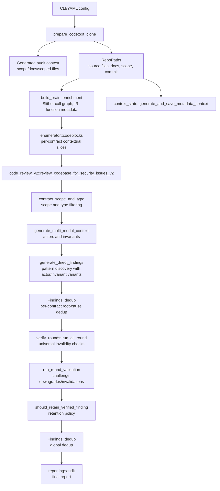

# Phase 1: Algorithm Trace And Benchmark Design

## Purpose

Phase 1 establishes a precise map of how AI Agent Audit currently turns a Solidity repo into validated findings, and how we will benchmark changes without guessing. The central question is:

> Where can a real High/Medium finding be created, lost, duplicated, downgraded, or falsely retained?

This document is intentionally implementation-facing. It names the modules that control each stage and the benchmark labels we need in Phase 2.

## Pipeline Map

## Stage Notes

| Stage | Main Code | Output | Main Failure Modes |
| --- | --- | --- | --- |
| Repo preparation | `src/prepare_code/git_clone.rs` | `RepoPaths` | Wrong branch/commit, bad scope extraction, missing code folders, excluded in-scope files, failed build |
| Audit context | `src/prepare_code/audit_context.rs` | Generated docs, scope, scoped files | Missing docs, wrong scope, excessive summarization, known issues not captured |
| Semantic DB | `src/build_brain/enrichment.rs` | `.ai-agent-audit/semantic.db` | Slither failure, missing call edges, incomplete function metadata, IR mismatch |
| Codeblocks | `src/enumerator/codeblocks.rs` | `.ai-agent-audit/codeblock.db` and saved markdown | Missing cross-contract context, token-budget truncation, BFS depth too shallow, import fallback too broad/narrow |
| Metadata context | `src/llm_review/analysis/context_state.rs` | Cached protocol context | Missing protocol-level invariants or architecture facts |
| Scope/type filter | `src/llm_review/utils/contract_in_scope.rs` | In/out-of-scope decision | Valid contract skipped, libraries skipped by config, interface/proxy mismatch |
| Actor/invariant context | `src/llm_review/analysis/pre_audit_analysis.rs` | Verified actors/invariants | Empty or noisy actors/invariants, true invariant rejected before discovery |
| Pattern discovery | `src/llm_review/pattern_phases/generate_direct_findings.rs` | Raw candidates | Pattern category omitted, prompt too broad/narrow, run count variance, extraction failure |
| Per-contract dedup | `src/llm_review/findings/findings.rs` | Deduped candidates | Distinct root causes merged, duplicates retained, cross-function duplicates missed |
| Verification | `src/llm_review/phases/verify_rounds.rs` | Status-tagged findings | True positive killed as safeguard/by-design/OOS/user-error/governance/speculation/not exploitable |
| Downgrade validation | `src/llm_review/phases/verify_rounds.rs` | Revalidated status | Invalid finding revived, true positive still rejected, weak justification retained |
| Retention | `src/llm_review/phases/verify_rounds.rs` | Reportable findings | H/M finding dropped due to multiple statuses, low/QA policy mismatch by audit type |
| Global dedup/report | `src/reporting/audit.rs` | Markdown report | Final over-merge, unstable ordering, status visibility but no lifecycle trace |

## Finding Lifecycle Labels

Phase 2 instrumentation should assign every candidate and every benchmark root one of these lifecycle labels.

| Label | Meaning |
| --- | --- |
| `not_in_scope_input` | Benchmark root is outside configured scope or intentionally excluded. |
| `context_missing_scope` | Required file/contract was not included because scope extraction missed it. |
| `context_missing_graph` | Required code path exists but was omitted by call graph/BFS/import traversal. |
| `context_missing_token_budget` | Required code path was reachable but excluded due to token budget. |
| `context_present_discovery_miss` | Code/context was present but no matching raw candidate was generated. |
| `discovery_extraction_error` | LLM response failed extraction/retry and candidate was never represented. |
| `dedup_overmerge` | A distinct accepted root was collapsed into another finding. |
| `dedup_undermerge` | Duplicate variants survived as separate reportable findings. |
| `verification_false_reject` | Accepted root was tagged invalid/low/needs-info incorrectly. |
| `validation_false_accept` | Rejected/invalid root survived validation as reportable H/M. |
| `severity_false_downgrade` | Accepted H/M survived but was downgraded below H/M. |
| `report_omission` | Finding survived internally but did not appear in final report. |
| `matched_true_positive` | Final report contains a matching unique accepted H/M root. |
| `unmatched_false_positive` | Final report contains H/M candidate not matching accepted roots. |

## Dedup/Validation Risk Points

Current dedup uses `Finding::hash()` as `contract-function`, title similarity, description similarity, and then an LLM pairwise root-cause check when needed. This is cheap and local, but it can miss:

- Same root cause expressed through different functions.
- Distinct root causes in the same function.
- Proxy/abstract/base contract issues where the meaningful location is spread across contracts.
- Findings where the title is low-similarity but the exploit path is the same.

Current verification is intentionally strict. The biggest Phase 2 question is whether accepted C4 H/M findings are being killed by:

- `InvalidSafeGuardInPlace`
- `InvalidByDesign`
- `InvalidNotExploitable`
- `InvalidOutOfScope`
- `InvalidUserErrorOrMistake`
- `InvalidGovernanceRisk`
- `InvalidFutureSpeculation`

For non-client audits, `should_retain_verified_finding` keeps findings with zero or one status and drops findings with multiple statuses. This makes status attribution critical: one extra false invalidation label can remove a true positive.

## Benchmark Object Model

The benchmark harness should normalize five object types.

### `accepted_root`

Ground-truth accepted H/M issue from Code4rena or a manually curated benchmark.

Required fields:

- `id`
- `source_platform`
- `source_url`
- `benchmark`
- `severity`
- `title`
- `root_contracts`
- `root_functions`
- `root_cause_summary`
- `impact_summary`
- `expected_pattern_family`
- `ground_truth_status`

### `rejected_reference`

Representative rejected, invalid, low, QA, or duplicate issue.

Required fields:

- `id`
- `benchmark`
- `source_url`
- `title`
- `claimed_severity`
- `rejection_category`
- `judge_or_mapping_reason`
- `closest_accepted_root`
- `use_for_precision_eval`

### `candidate_finding`

Finding emitted by the app at any stage.

Required fields:

- `candidate_id`
- `run_id`
- `stage`
- `title`
- `severity`
- `contract`
- `function`
- `exploit_type`
- `derived_from`
- `privilege`
- `description`
- `impact`
- `status`
- `status_justification`
- `source_prompt_kind`
- `source_contract_codeblock`

### `root_match`

Manual or assisted mapping between a candidate and an accepted/rejected benchmark item.

Required fields:

- `candidate_id`
- `benchmark_root_id`
- `match_type`
- `confidence`
- `match_reason`
- `manual_review_required`

Allowed `match_type` values:

- `same_root_cause`
- `duplicate_variant`
- `related_not_same`
- `false_positive`
- `unknown`

### `lifecycle_record`

The complete trace of one candidate or missed benchmark root.

Required fields:

- `entity_id`
- `entity_type`
- `run_id`
- `benchmark`
- `stages_seen`
- `terminal_label`
- `dropped_at_stage`
- `drop_reason`
- `evidence_paths`
- `notes`

## Initial Olas Benchmark

The first benchmark is `2026-01-olas` because it has the best local data:

- Accepted roots: `C4_APPROVED_FINDINGS.md`
- Rejected/invalid mappings: `C4_REJECTED_FINDINGS_KEY.md`
- C4 snapshots: `c4_snaps/`
- App report: `2026-01-olas/report/audit-report.md`
- Three-shot config: `validation-three-shot/2026-01-olas-config.yaml`
- Generated context: `audit-docs/2026-01-olas/`

Initial accepted root count:

- High: 11
- Medium: 12
- Total H/M roots: 23

The manifest lives at `benchmarks/code4rena-2026-01-olas/manifest.yaml`.

## Phase 2 Instrumentation Targets

Minimal additive artifacts:

- `raw_candidates.jsonl` after each discovery prompt family.
- `dedup_clusters.jsonl` for per-contract and global dedup.
- `verification_decisions.jsonl` for universal verification and downgrade validation.
- `codeblock_manifest.jsonl` for each generated contract codeblock.
- `finding_lifecycle.jsonl` connecting raw candidates to final report rows.

These artifacts should be benchmark-only or controlled by a config flag. They should not change default audit behavior.

## Open Questions For Phase 2

1. Should lifecycle artifacts live under the final audit output folder or `.ai-agent-audit/benchmarks/`?
2. Should benchmark parsing start as scripts before becoming Rust code?
3. How much manual adjudication is acceptable for the first Olas baseline?
4. Should matching use only final reports first, or also intermediate raw candidates once instrumentation exists?
5. Do we want a hard "no leakage" mode that refuses to load known C4 reports during live evaluations?
