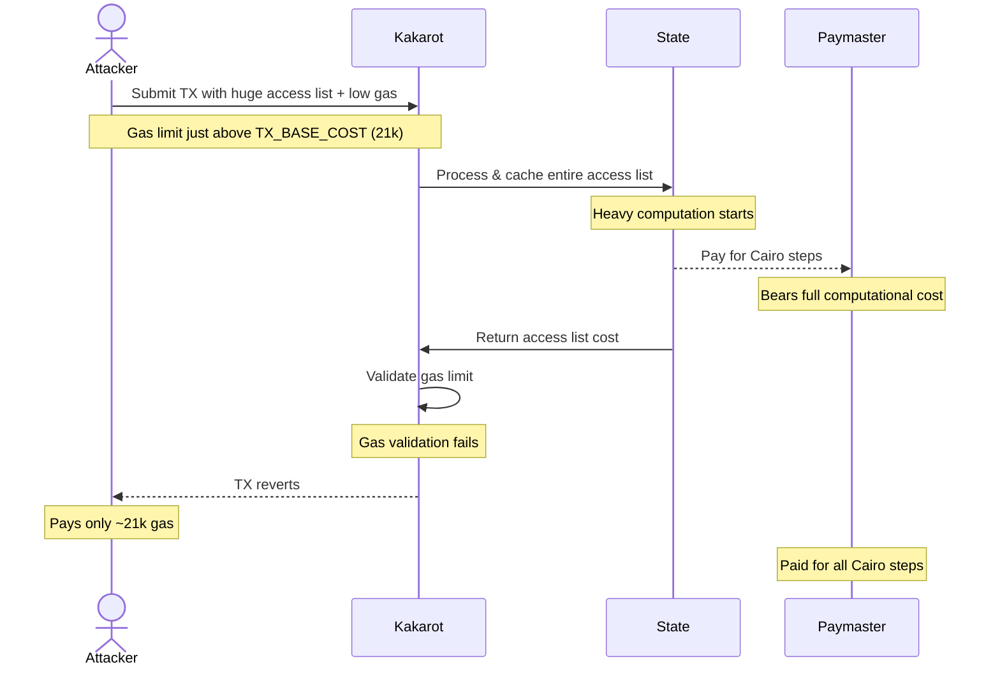

# Lines of code

https://github.com/kkrt-labs/kakarot/blob/7411a5520e8a00be6f5243a50c160e66ad285563/src/kakarot/interpreter.cairo#L922-L930


# Vulnerability details


## Impact
An attacker can force expensive Starknet computations (Cairo steps) while only paying for minimal EVM gas. This creates an economic imbalance where the paymaster bears the computational cost of processing large access lists, while the attacker only pays minimal EVM gas. The attack can be repeated causing significant economic damage to the paymaster.

## Proof of Concept
The exists in Kakarot's execution flow where access list entries are processed and cached before validating if the transaction has sufficient gas to cover all operations.


```cairo
// First calculates base gas
let count = count_not_zero(calldata_len, calldata);
let zeroes = calldata_len - count;
let calldata_gas = zeroes * 4 + count * 16;
let intrinsic_gas = Gas.TX_BASE_COST + calldata_gas;

// Then caches access list BEFORE gas validation
with state {
    let coinbase = State.get_account(env.coinbase); 
    State.cache_precompiles();
    State.get_account(address.evm);
    let access_list_cost = State.cache_access_list(access_list_len, access_list);
}

// Only validates gas AFTER access list is cached
let intrinsic_gas = intrinsic_gas + access_list_cost;
let is_gas_limit_enough = is_le_felt(intrinsic_gas, gas_limit);
if (is_gas_limit_enough == FALSE) {
    let evm = EVM.halt_validation_failed(evm);
    State.finalize{state=state}();
    return (evm, stack, memory, state, 0, 0);
}
```

[Interpreter.cairo:L922](https://github.com/kkrt-labs/kakarot/blob/7411a5520e8a00be6f5243a50c160e66ad285563/src/kakarot/interpreter.cairo#L922-L930)

Access list caching happens in [State.cairo:L175](https://github.com/kkrt-labs/kakarot/blob/7411a5520e8a00be6f5243a50c160e66ad285563/src/kakarot/state.cairo#L175)


Attack Flow:


Attack Steps:
1. Attacker creates a transaction with:
   - Huge access list (big enough to fit into the virtual EVM block limit and Starknet 10M Cairo step limit)
   - Gas limit set just above TX_BASE_COST (~21,000 gas)  
   - Valid signatures and other parameters
2. Submit transaction to Kakarot 
3. Kakarot processes entire access list (Reading from Storage):
   - Creates account entries in state 
   - Caches all storage keys
   - Paymaster pays for all Cairo computation steps
4. Only after caching, Kakarot validates gas limit is insufficient 
5. Transaction reverts but paymaster has already paid for computation on Starknet
6. Attacker pays only ~21k gas while causing massive computation
7. Attack can be repeated indefinitely 

## Tools Used
Manual Review

## Recommended Mitigation Steps
Calculate and validate minimum required gas (including access list costs) before processing any access list entries.


## Assessed type

Other