# Lines of code

https://github.com/kkrt-labs/kakarot/blob/7411a5520e8a00be6f5243a50c160e66ad285563/src/kakarot/interpreter.cairo#L79-L100


# Vulnerability details


## Impact
Precompiles in Kakarot can execute computationally expensive operations before verifying sufficient gas is available, leading to:

- Free computation at the expense of the Starknet paymaster who covers Cairo step costs
- Deviation from Ethereum's behavior where precompiles require upfront gas checks

The issue exists because while EVM gas would be charged preventing true "free" execution, the underlying Starknet Cairo program steps are executed during the precompile computation *before* the gas check. These computational costs are covered by the paymaster, not the EVM transaction sender.

## Proof of Concept

Executing precompiles before verifying gas in Kakarot's:

```cairo
	let (output_len, output, gas_used, revert_code) = Precompiles.exec_precompile(
		evm.message.code_address.evm,
		evm.message.calldata_len,
		evm.message.calldata,
		caller_code_address,
		caller_address,
	);

	let precompile_reverted = is_not_zero(revert_code);
	if (precompile_reverted != FALSE) {
		// No need to charge gas as precompiles can only trigger EXCEPTIONAL_REVERT
		// which will consume the entire gas of the context.
		let evm = EVM.stop(evm, output_len, output, revert_code);
		tempvar range_check_ptr = range_check_ptr;
		tempvar evm = evm;
	} else {
		// Charge gas before stopping
		let evm = EVM.charge_gas(evm, gas_used);
		let evm = EVM.stop(evm, output_len, output, evm.reverted);
		tempvar range_check_ptr = range_check_ptr;
		tempvar evm = evm;
	}
```

[Interpreter.cairo:L79](https://github.com/kkrt-labs/kakarot/blob/7411a5520e8a00be6f5243a50c160e66ad285563/src/kakarot/interpreter.cairo#L79-L100)


By contrast, Geth performs gas validation before execution in:

```go
func RunPrecompiledContract(p PrecompiledContract, input []byte, suppliedGas uint64, logger *tracing.Hooks) (ret []byte, remainingGas uint64, err error) {
	gasCost := p.RequiredGas(input)
	if suppliedGas < gasCost {
		return nil, 0, ErrOutOfGas
	}
	if logger != nil && logger.OnGasChange != nil {
		logger.OnGasChange(suppliedGas, suppliedGas-gasCost, tracing.GasChangeCallPrecompiledContract)
	}
	suppliedGas -= gasCost
	output, err := p.Run(input)
	return output, suppliedGas, err
}
```

[core/vm/contracts.go:L223](https://github.com/ethereum/go-ethereum/blob/master/core/vm/contracts.go#L223)


Flow:

```mermaid
sequenceDiagram
    actor Attacker
    participant Kakarot
    participant Precompile
    participant Starknet

    
    rect rgb(0,0,0)
    Note over Attacker,Starknet: Kakarot Implementation (Vulnerable)
        Attacker->>Kakarot: Call precompile with insufficient gas
        activate Kakarot
        Kakarot->>Precompile: Execute computation
        activate Precompile
        Note right of Precompile: Cairo steps executed!
        Precompile-->>Kakarot: Return result
        deactivate Precompile
        Kakarot->>Kakarot: Check gas (Too late!)
        Note right of Kakarot: Transaction reverts but<br/>computation already done
        Kakarot-->>Attacker: Revert
        deactivate Kakarot
    end


```


Key differences:

- Geth validates gas availability before any precompile execution, preventing any computation without sufficient gas
- Kakarot executes first, checks gas later
- In Kakarot, Cairo computation costs are already incurred when gas check fails

## Tools Used
Manual Review

## Recommended Mitigation Steps
Add upfront gas validation before precompile execution by implementing a `check_precompile_gas` function that validates available gas. Only proceed with execution if sufficient gas exists, otherwise revert immediately with an out-of-gas error.


## Assessed type

Other