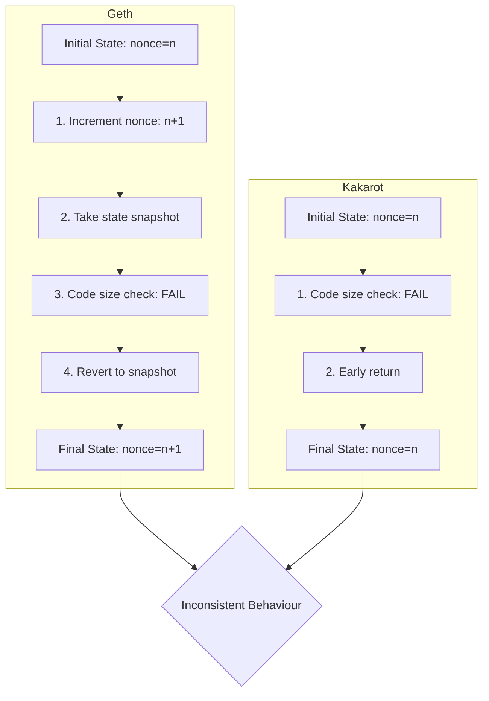

# Lines of code

https://github.com/kkrt-labs/kakarot/blob/7411a5520e8a00be6f5243a50c160e66ad285563/src/kakarot/instructions/system_operations.cairo#L145-L149


# Vulnerability details


## Impact
Critical inconsistency between Kakarot and Geth in nonce handling during contract creation failures. Geth always increments nonce regardless of error type (except a few such as nonce overflow), while Kakarot only increments nonce in limited scenarios. This causes state divergence between Kakarot and Geth, particularly with cases like max code size exceeded.

## Proof of Concept

In Geth's implementation, nonce is incremented early in the process and persisted regardless of most failure scenarios:

```go
// Increment nonce early
nonce := evm.StateDB.GetNonce(caller.Address())
evm.StateDB.SetNonce(caller.Address(), nonce+1)

// Take snapshot after nonce increment
snapshot := evm.StateDB.Snapshot()

// Later errors will revert to snapshot but won't undo nonce increment
if err != nil && (evm.chainRules.IsHomestead || err != ErrCodeStoreOutOfGas) {
    evm.StateDB.RevertToSnapshot(snapshot)
}
```
[vm/evm.go#L449](https://github.com/ethereum/go-ethereum/blob/master/core/vm/evm.go#L449)

However, in Kakarot, nonce increment happens conditionally in different paths:

The issue lies in how nonce increments are handled during contract creation in 


- Code size validation happens before nonce increment:
```cairo 
// Check code size
let code_size_too_big = is_nn(size.low - (2 * Constants.MAX_CODE_SIZE + 1));
if (code_size_too_big != FALSE) {
	let evm = EVM.charge_gas(evm, evm.gas_left + 1);
	return evm;
}

// Increment nonce
let sender = Account.set_nonce(sender, sender.nonce + 1);
State.update_account(sender);
```
[system_operations.cairo:L145-L149](https://github.com/kkrt-labs/kakarot/blob/7411a5520e8a00be6f5243a50c160e66ad285563/src/kakarot/instructions/system_operations.cairo#L145-L149)

- Nonce is incremented in collision case and normal path:
```cairo
// Collision path => matches with Geth
if (is_collision != 0) {
    let sender = Account.set_nonce(sender, sender.nonce + 1);
    State.update_account(sender);
    Stack.push_uint128(0);
    return evm;
}

// Normal path
let sender = Account.set_nonce(sender, sender.nonce + 1);
State.update_account(sender);
```

Flow showing inconsistency:



## Tools Used
Manual Review

## Recommended Mitigation Steps
Move nonce increment to the beginning of the function after only checking for nonce overflow, matching EVM standard behavior. Please make sure to check other type of errors (e.g. ErrCodeStoreOutOfGas)


## Assessed type

Other