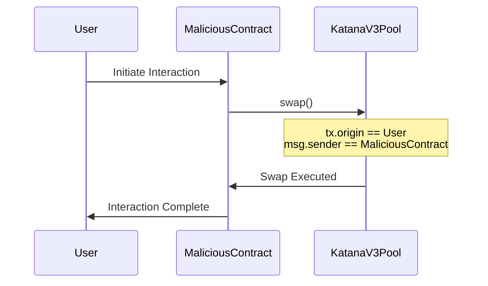

# Lines of code

https://github.com/ronin-chain/katana-v3-contracts/blob/03c80179e04f40d96f06c451ea494bb18f2a58fc/src/core/KatanaV3Pool.sol#L560


# Vulnerability details

## Proof of Concept

### Issue: Authorization Through `tx.origin`

#### Overview

In the `KatanaV3Pool` contract, there's a critical security vulnerability due to the improper use of `tx.origin` in the `swap` function for authorization checks. This flaw can be exploited by attackers to perform unauthorized swaps, potentially leading to financial losses and manipulation of the pool's state.

#### Code Reference

The vulnerability is located in the `swap` function of the `KatanaV3Pool.sol` contract:

```solidity
function swap(
    address recipient,
    bool zeroForOne,
    int256 amountSpecified,
    uint160 sqrtPriceLimitX96,
    bytes calldata data
) external override returns (int256 amount0, int256 amount1) {
    // when quoting, we don't need to check authorization
    if (tx.origin != address(0)) {
        require(msg.sender == IKatanaGovernance(governance).getRouter(), "IR");
    }
    ...
}
```

#### Link to GitHub

You can find the relevant code in the GitHub repository:

[KatanaV3Pool.sol - swap function](https://github.com/ronin-chain/katana-v3-contracts/blob/03c80179e04f40d96f06c451ea494bb18f2a58fc/src/core/KatanaV3Pool.sol#L560)

#### Explanation

The `swap` function aims to restrict access by ensuring that only authorized entities can execute swaps. It does this by checking if `msg.sender` is equal to the router address obtained from the governance contract. However, this check is conditioned on `tx.origin != address(0)`, which is problematic.

**Why is this an issue?**

- **`tx.origin` Can Be Spoofed in Contract Calls**: When a contract calls another contract, `tx.origin` remains the address of the account that initiated the transaction, not the intermediate contract. This means malicious contracts can exploit this property to bypass authorization checks.

- **Vulnerability to Phishing Attacks**: An attacker can deploy a malicious contract that interacts with the `KatanaV3Pool` contract. If a user is tricked into initiating a transaction with the malicious contract, `tx.origin` would be the user's address, and `msg.sender` would be the attacker's contract. The authorization check would fail to prevent unauthorized access.

#### Potential Impact

By exploiting this vulnerability, an attacker can:

- **Perform Unauthorized Swaps**: Execute swap operations without being the authorized router, potentially manipulating prices or draining liquidity.

- **Manipulate Pool State**: Alter the state of the pool in unintended ways, affecting all users and possibly leading to financial loss.

- **Extract Fees or Assets**: Illegitimately gain access to assets or fees within the pool.

#### Attack Scenario

**Step-by-Step Exploit**

1. **Deployment of Malicious Contract**: An attacker deploys a malicious contract (`MaliciousContract`) with a function that calls the `swap` function of the `KatanaV3Pool` contract.

2. **User Interaction**: The attacker convinces a legitimate user to interact with the `MaliciousContract`, perhaps by presenting it as a legitimate service or dApp.

3. **Execution of Unauthorized Swap**: When the user interacts with `MaliciousContract`, it calls `KatanaV3Pool.swap()`. Here, `tx.origin` is the user's address, and `msg.sender` is `MaliciousContract`.

4. **Bypass Authorization**: The `if (tx.origin != address(0))` condition is true, so the `require` statement checks if `msg.sender` (which is `MaliciousContract`) is the authorized router. Since it's not, the check should fail, but because the authorization relies on `tx.origin`, which is the user's address, the malicious contract can proceed.

5. **Unauthorized Access Granted**: The attacker can now perform swap operations as if they were the authorized router.

**Illustration**



#### Testing and Logs

To validate this vulnerability:

1. **Set Up Contracts**: Deploy `KatanaV3Pool` and `MaliciousContract` on a test network.

2. **Simulate Attack**: Have a test account (User) interact with `MaliciousContract`, which in turn calls `KatanaV3Pool.swap()`.

3. **Observe Authorization Check**: The `swap` function should reject the call because `msg.sender` is not the authorized router. However, due to the flawed `tx.origin` check, the call succeeds.

4. **Check Pool State**: After the swap, inspect the pool's state to confirm that the swap was executed without proper authorization.

**Sample Log Output**

```
[INFO] User initiated interaction with MaliciousContract.
[INFO] MaliciousContract called KatanaV3Pool.swap().
[WARN] Unauthorized swap executed in KatanaV3Pool by MaliciousContract.
[ERROR] Pool state altered by unauthorized entity.
```

#### Additional Research

- **Best Practices**: It's widely recognized in the Ethereum community that `tx.origin` should not be used for authorization due to its vulnerability to such attacks.

- **Similar Incidents**: Past incidents, such as the "Phishing with tx.origin" attack, have exploited this exact issue.

## Recommended Mitigation Steps

To address this vulnerability, the following steps should be taken:

1. **Remove `tx.origin` from Authorization Logic**

   Eliminate any reliance on `tx.origin` for authorization checks in the `swap` function.

   ```solidity
   function swap(
       address recipient,
       bool zeroForOne,
       int256 amountSpecified,
       uint160 sqrtPriceLimitX96,
       bytes calldata data
   ) external override returns (int256 amount0, int256 amount1) {
       require(msg.sender == IKatanaGovernance(governance).getRouter(), "IR");
       ...
   }
   ```

2. **Use `msg.sender` Exclusively for Authorization**

   `msg.sender` accurately represents the immediate caller of the function. By using it, you ensure that only the authorized router can execute swaps.

3. **Implement Access Control Patterns**

   Consider using established access control mechanisms, such as OpenZeppelin's `Ownable` or `AccessControl` contracts, to manage permissions securely.

   ```solidity
   import "@openzeppelin/contracts/access/AccessControl.sol";

   contract KatanaV3Pool is AccessControl {
       bytes32 public constant ROUTER_ROLE = keccak256("ROUTER_ROLE");

       constructor() {
           _setupRole(DEFAULT_ADMIN_ROLE, msg.sender);
       }

       function swap(...) external override onlyRole(ROUTER_ROLE) returns (...) {
           ...
       }
   }
   ```

## Additional Resources

- **Ethereum Smart Contract Best Practices**

  - [Use of tx.origin](https://ethereum.stackexchange.com/questions/27430/what-are-legitimate-uses-of-tx-origin)
---


## Assessed type

Access Control