## SUMMARY OF FILE: contracts/plume/src/PlumeStaking.sol
### Main List of Files in Project
The project contains various script and source files related to deployment and upgrade of multiple contracts related to a PlumeStaking and PUSD system. Deployment scripts are in `script/` and `script/deploy/`, while upgrade scripts are organized in `script/upgrade/`. Contracts are found in `src/`, including core logic, facets, libraries, mocks, proxies, spin logic, and interfaces. Lastly, test files are located in `test/`, covering different aspects like diamond, stress, and security tests. This setup aids in systematic development and testing of smart contracts.


## SUMMARY OF FILE: contracts/plume/src/facets/ValidatorFacet.sol
The `ValidatorFacet` smart contract in Solidity manages validator-related operations such as adding, updating, commission settings, and slashing votes. It extends `ReentrancyGuardUpgradeable` and `OwnableInternal` from SolidState modules to enhance security and ownership control.

### Contract Definition
- `ValidatorFacet` is designed for validator management within a blockchain-based staking system.

### Key Functions
1. **addValidator()**
   - Functionality: Adds a new validator with a specific ID, commission rate, and addresses for admin and withdrawal.
   - Signature: `function addValidator(uint16 validatorId, uint256 commission, address l2AdminAddress, address l2WithdrawAddress, string calldata l1ValidatorAddress, string calldata l1AccountAddress, address l1AccountEvmAddress, uint256 maxCapacity) external`.
   - Summary: Ensures that a validator doesn't already exist, verifies addresses, and sets up for reward distribution.

2. **setValidatorCapacity()**
   - Functionality: Updates the maximum staking capacity of an existing validator.
   - Signature: `function setValidatorCapacity(uint16 validatorId, uint256 maxCapacity) external`.
   - Summary: Adjusts the staking limits of a validator and emits update events.

3. **setValidatorStatus()**
   - Functionality: Toggles a validator's active status.
   - Signature: `function setValidatorStatus(uint16 validatorId, bool newActiveStatus) external`.
   - Summary: Validates conditions to change a validator’s ability to accept new stakes and manages rewards accordingly.

4. **setValidatorCommission()**
   - Functionality: Updates the commission rate for a validator.
   - Signature: `function setValidatorCommission(uint16 validatorId, uint256 newCommission) external`.
   - Summary: Ensures commission rate compliance, settles old commissions, and updates new commission checkpoints.

5. **setValidatorAddresses()**
   - Functionality: Updates associated addresses of a validator (admin, withdrawal, etc.).
   - Signature: `function setValidatorAddresses(uint16 validatorId, address newL2AdminAddress, address newL2WithdrawAddress, string calldata newL1ValidatorAddress, string calldata newL1AccountAddress, address newL1AccountEvmAddress) external`.
   - Summary: Facilitates address changes, verifying proposals for admin address changes.

6. **acceptAdmin()**
   - Functionality: Allows a proposed admin to finalize their role.
   - Signature: `function acceptAdmin(uint16 validatorId) external`.
   - Summary: Ensures the new admin is eligible and finalizes reassignment.

7. **requestCommissionClaim()**
   - Functionality: Initiates a commission claim for a validator.
   - Signature: `function requestCommissionClaim(uint16 validatorId, address token) external`.
   - Summary: Prepares commission payouts, locking amounts at request initiation.

8. **finalizeCommissionClaim()**
   - Functionality: Completes a pending commission claim.
   - Signature: `function finalizeCommissionClaim(uint16 validatorId, address token) external returns (uint256)`.
   - Summary: Validates conditions to distribute claimed commissions to admins.

9. **_cleanupExpiredVotes()**
   - Functionality: Removes and counts expired votes relevant to validator slashing.
   - Signature: `function _cleanupExpiredVotes(uint16 validatorId) internal returns (uint256)`.
   - Summary: Filters active votes and assists in slashing logic.

10. **voteToSlashValidator()**
    - Functionality: Processes voting to penalize a validator.
    - Signature: `function voteToSlashValidator(uint16 maliciousValidatorId, uint256 voteExpiration) external`.
    - Summary: Registers votes, ensures validity, and slashes upon consensus.

### Storage Variables
- Consists mostly of mappings and arrays to track validator states, such as `validators`, `validatorExists`, `adminToValidatorId`, and `isAdminAssigned`, among others ensuring efficient data management in validator dynamics.


## SUMMARY OF FILE: contracts/plume/src/facets/StakingFacet.sol
### Main List of Files in Project

The project includes a number of scripts for deploying and upgrading contracts, query operations, and facets for specific functionalities such as access control, rewards, and staking. The source code includes various smart contracts related to staking, reward treasury, facets for staking and rewards, proxies, and spin-related contracts. Additionally, there are interfaces for different components and several tests covering functionalities such as staking, raffle operations, and security.

### StakingFacet Contract Summary

The `StakingFacet` contract handles core user staking operations within a blockchain system, using a proxy pattern for upgradeability. It provides methods for staking, unstaking, withdrawing funds, and managing rewards related to validator nodes.

**Functions:**
- **_checkValidatorSlashedAndRevert**: Ensures a validator isn't slashed before operations.
- **_validateValidatorForStaking**: Validates active status of a validator.
- **_validateStakeAmount**: Ensures minimum stake requirements are met.
- **_validateStaking**: Combines validations for staking operations.
- **_validateValidatorCapacity**: Checks validator capacity limits.
- **_validateValidatorPercentage**: Validates percentage limits against total stakes.
- **_validateCapacityLimits**: Combines capacity and percentage checks.
- **_validateValidatorForUnstaking**: Validates the existence of a validator for unstaking.
- **_performStakeSetup**: Handles all necessary state changes for initiating a stake.
- **_performRestakeWorkflow**: Facilitates restaking using cooled/parked funds.
- **stake**: Begins staking of PLUME tokens to a validator.
- **restake**: Restakes cooled or parked funds to a validator.
- **unstake**: Unstakes all or a specified amount from a validator.
- **withdraw**: Withdraws all matured cooldowns as available funds.
- **stakeOnBehalf**: Allows staking of tokens on behalf of another user.
- **restakeRewards**: Restakes all pending rewards on behalf of the user.

**Storage Variables:**
- Uses `PlumeStakingStorage` to manage all stake and reward-related state variables, ensuring well-organized and upgradeable storage management for staking operations.


## SUMMARY OF FILE: contracts/plume/src/facets/ManagementFacet.sol
The file begins with a documented list of scripts and source files that are part of a project focusing on deploying and upgrading various smart contracts and facets in a system likely dealing with staking and reward logic. The contract `ManagementFacet` handles administrative functionalities such as setting parameters, managing funds, and cleaning stale data records in a staking and rewards system. 

### Contract: **ManagementFacet**
- **Summary**: Implements administrative functionalities for handling parameters, contract funds, and user records associated with staking and validator slashing within a system.

### Functions:
- **`setMinStakeAmount`**: Sets a new minimum staking amount requiring admin rights.
- **`setCooldownInterval`**: Adjusts the unstaking cooldown interval with a new duration.
- **`adminWithdraw`**: Admin withdrawal function for ERC20 or native tokens.
- **`getMinStakeAmount`**: Fetches current minimum staking amount.
- **`getCooldownInterval`**: Fetches current cooldown interval.
- **`setMaxSlashVoteDuration`**: Sets maximal duration for slashing votes.
- **`setMaxAllowedValidatorCommission`**: Establishes maximal commission rates for validators.
- **`setMaxCommissionCheckpoints`**: Sets maximum checkpoints available per validator for commissions.
- **`setMaxValidatorPercentage`**: Limits the percentage a single validator can hold from total stakes.
- **`pruneCommissionCheckpoints`**: Pruning old commission checkpoints to manage gas use.
- **`pruneRewardRateCheckpoints`**: Similar pruning function for reward checkpoints.
- **`adminClearValidatorRecord`**: Clears stale records for validators due to slashing.
- **`adminBatchClearValidatorRecords`**: Batch clears stale data for multiple users linked to a slashed validator.
- **`addHistoricalRewardToken`**: Allows admin to mark a token as historically used for rewards.
- **`removeHistoricalRewardToken`**: Removes historical status from a reward token.
- **`isHistoricalRewardToken`**: Checks historical reward status of a token.
- **`getHistoricalRewardTokens`**: Lists all tokens marked in history for rewards.
- **`adminCreateHistoricalRewardCheckpoint`**: Facilitates creation of a historical reward checkpoint for validator.
- **`adminSetTokenAdditionTimestamp`**: Sets timestamps associated with historical reward tokens.


## SUMMARY OF FILE: contracts/plume/src/facets/RewardsFacet.sol
# Summary of RewardsFacet Contract

## Contract Overview
The `RewardsFacet` contract facilitates reward token management, reward rate settings, reward calculations, and claims. This contract imports various modules for errors, events, storage, and logic to handle the Plume rewards efficiently. It relies on several libraries and interfaces, such as `PlumeRewardLogic`, `PlumeStakingStorage`, `IAccessControl`, and more.

### Stored Variables and Constants
- `uint256 internal constant BASE`: Standardized base for calculations.
- `uint256 internal constant MAX_REWARD_RATE`: Defines the max allowed reward rate.
- `bytes32 internal constant TREASURY_STORAGE_POSITION`: Indicates the storage position for the treasury address.

### Key Functions

#### getTreasuryAddress
- **Purpose**: Retrieves the treasury address from storage.
- **Definition**: `function getTreasuryAddress() internal view returns (address)`
- **Summary**: Utilizes low-level calls to read the treasury address from a predefined storage position.

#### setTreasuryAddress
- **Purpose**: Stores the treasury address in a specific storage position.
- **Definition**: `function setTreasuryAddress(address _treasury) internal`
- **Summary**: Saves the given treasury address using low-level storage access.

#### onlyRole
- **Purpose**: Modifier to restrict function access based on roles.
- **Summary**: Checks if the caller has the necessary role, otherwise reverts.

#### _earned
- **Purpose**: Calculates the earned rewards for a user on a specific validator and token.
- **Definition**: `function _earned(address user, address token, uint16 validatorId) internal returns (uint256 rewards)`
- **Summary**: Uses `PlumeRewardLogic` to determine the rewards earned by a user for a specific validator and token and returns the total.

#### _calculateTotalEarned
- **Purpose**: Calculates total rewards for a user across all validators for a certain token.
- **Definition**: `function _calculateTotalEarned(address user, address token) internal returns (uint256 totalEarned)`
- **Summary**: Sums earned rewards from all validators for a user for a given token.

#### setTreasury
- **Purpose**: Allows setting the treasury address by the ADMIN role.
- **Definition**: `function setTreasury(address _treasury) external onlyRole(PlumeRoles.TIMELOCK_ROLE)`
- **Summary**: Sets a new treasury address and emits the `TreasurySet` event.

#### addRewardToken
- **Purpose**: Adds a new reward token with specified initial and max rates.
- **Definition**: `function addRewardToken(address token, uint256 initialRate, uint256 maxRate) external`
- **Summary**: Adds a new token if it does not already exist and sets its reward rates.

#### removeRewardToken
- **Purpose**: Removes an existing reward token.
- **Definition**: `function removeRewardToken(address token) external`
- **Summary**: Removes the specified token from the list of reward tokens and stops further accrual by creating a final checkpoint.

#### setRewardRates
- **Purpose**: Updates the reward rates for a given list of tokens.
- **Definition**: `function setRewardRates(address[] calldata tokens, uint256[] calldata rewardRates_) external`
- **Summary**: Sets new rates for reward tokens and updates corresponding checkpoints.

#### claim
- **Purpose**: Allows users to claim rewards from either a specific validator or from all validators.
- **Definition**: Overloaded with `function claim(address token, uint16 validatorId) external returns (uint256)` and `function claim(address token) external returns (uint256)`.
- **Summary**: Processes and transfers the accumulated rewards.

#### claimAll
- **Purpose**: Claims rewards for all tokens and validators for a user.
- **Definition**: `function claimAll() external returns (uint256[] memory)`
- **Summary**: Iterates over all reward tokens to calculate and transfer rewards, emitting `RewardClaimed` events.

### Internal Helpers
- **Purpose**: Includes functions like `_updateUserRewardState`, `_finalizeRewardClaim`, among others, assisting main logic with state updates and validations.

### View Functions
- Provides utility functions like `getRewardTokens`, `isRewardToken`, `getMaxRewardRate`, etc., to interface and access state data externally.


## SUMMARY OF FILE: contracts/plume/src/facets/AccessControlFacet.sol
### File: AccessControlFacet.sol

**Contract**: `AccessControlFacet`

**Summary**: This contract is an implementation of an Access Control system, leveraging SolidState's `AccessControl` logic. The main purpose is to manage and initialize roles within a Plume project environment, defining roles such as `ADMIN_ROLE`, `UPGRADER_ROLE`, `VALIDATOR_ROLE`, and others, and setting up their hierarchies. This includes role grants, revocations, and checks using SolidState's internal mechanisms.

#### Storage Variables:

- `DEFAULT_ADMIN_ROLE`, `ADMIN_ROLE`, `UPGRADER_ROLE`, `VALIDATOR_ROLE`, `REWARD_MANAGER_ROLE`, `TIMELOCK_ROLE`
  - **Description**: These are byte32 constants representing role definitions within the contract, used to control access to various functions. These constants facilitate checking and granting permissions for different roles.

#### Functions:

- `initializeAccessControl()`
  - **Summary**: Initializes the roles and permissions structure, granting the invoker default roles and establishing the admin role as the administrative role for all other roles. This function can only be called once.
  - **Interface**: `function initializeAccessControl() external`

- `hasRole()`
  - **Summary**: Checks if a given account possesses a specific role.
  - **Interface**: `function hasRole(bytes32 role, address account) external view returns (bool)`

- `getRoleAdmin()`
  - **Summary**: Returns the admin role responsible for managing a specified role.
  - **Interface**: `function getRoleAdmin(bytes32 role) external view returns (bytes32)`

- `grantRole()`
  - **Summary**: Assigns a specified role to an account, ensuring the caller has admin rights over that role.
  - **Interface**: `function grantRole(bytes32 role, address account) external`

- `revokeRole()`
  - **Summary**: Removes a role from an account, requiring the caller to have admin rights over the role.
  - **Interface**: `function revokeRole(bytes32 role, address account) external`

- `renounceRole()`
  - **Summary**: Allows an account to voluntarily relinquish a role assigned to themselves.
  - **Interface**: `function renounceRole(bytes32 role, address account) external`

- `setRoleAdmin()`
  - **Summary**: Assigns a new admin role for a given role, requiring the caller to possess `ADMIN_ROLE`.
  - **Interface**: `function setRoleAdmin(bytes32 role, bytes32 adminRole) external`


## SUMMARY OF FILE: contracts/plume/src/proxy/PlumeStakingRewardTreasuryProxy.sol
### PlumeStakingRewardTreasuryProxy Contract
This contract provides a proxy implementation for the PlumeStakingRewardTreasury using the ERC1967Proxy from OpenZeppelin. This pattern allows for upgradeability of the underlying logic while maintaining the address and state in the proxy.

#### Constructor
- **Function**: `constructor(address logic, bytes memory data)`
  - **Summary**: Initializes the proxy contract by calling the ERC1967Proxy constructor, providing the address of the logic contract and initialization data.
  - **Interface**: `constructor(address logic, bytes memory data)`

#### Storage Variables
- **`PROXY_NAME`**: `bytes32 public constant PROXY_NAME = keccak256('PlumeStakingRewardTreasuryProxy');`
  - **Explanation**: A constant that holds the name of the proxy for uniqueness in bytecode.


## SUMMARY OF FILE: contracts/plume/src/proxy/SPINProxy.sol
### Plume Project Files Overview

This document outlines the files included in the Plume project.

1. **Script Files (Deployment & Upgrade)**:
   - Files related to the deployment and upgrading of various contracts such as DateTime, MockPUSD, Plume Staking, Raffle Contracts, and more.
   - Contain scripts organized under directories for deployment, upgrade tasks, and querying.

2. **Source Files**:
   - Core smart contracts such as `Plume.sol`, `PlumeStaking.sol`, `PlumeStakingRewardTreasury.sol` and associated facets, helpers, and libraries.
   - Facets are modular contracts that divide the logic into specific domains such as `AccessControlFacet`, `RewardsFacet`, etc.
   - Libraries and interfaces to support core functionality.

3. **Mocks and Proxies**:
   - Includes mock contracts for development testing like `MockPUSD.sol`.
   - Proxy contracts for upgradability and deployment architecture.

4. **Spin and Raffle Logic**:
   - Contracts related to spin and raffle functionalities like `Raffle.sol`, `Spin.sol`.

5. **Test Files**:
   - A comprehensive suite of tests designed to ensure security and functionality through stress testing, migration tests, and more.


## SUMMARY OF FILE: contracts/plume/src/proxy/PlumeStakingProxy.sol
### PlumeStakingProxy Contract Summary

**Contract Definition:** The `PlumeStakingProxy` contract is a proxy contract for `PlumeStaking`. It extends the OpenZeppelin `ERC1967Proxy` to facilitate upgradeable proxy deployments.

**Contract Summary:**
This contract utilizes a proxy pattern to handle interactions with the `PlumeStaking` logic contract. It can receive Ether transactions and ensures that proxy instances are uniquely addressable via a name hash.

**Functions:**
- **Constructor | `constructor(address logic, bytes memory data)`:**
  Initializes the proxy with a logic contract address and delegates calls to it based on the state defined by `data`. This allows for the setup of an upgradeable proxy.

- **receive() | `receive() external payable`:**
  Allows the proxy to accept Ether transactions, making it compatible with Ether payment forwarding if the underlying logic contract requires it.

**Storage Variables:**
- **PROXY_NAME | `bytes32 public constant PROXY_NAME`:**
  A constant hash representing the name of the proxy. It serves as an identifier to ensure that each deployed proxy has a unique bytecode based on its assigned name.


## SUMMARY OF FILE: contracts/plume/src/proxy/RaffleProxy.sol
### Project Structure Documentation

The project organization document lists scripts and source files in a Solidity-based project:

- **Deployment and Upgrade Scripts**: Located in `script/` with subdirectories for different tasks, e.g. deployment (`deploy/`) and upgrades (`upgrade/`). Key deployment files include mock tokens and several staking mechanisms.
- **Contracts**: In the `src/` directory, notable contracts include `Plume.sol`, `PlumeStaking.sol`, and `PlumeStakingRewardTreasury.sol`. Access control, rewards, staking, and validation functionalities are structured as facets, indicating a modular or diamond pattern architecture.
- **Library and Proxy Files**: Include utility files like `PlumeErrors.sol` and proxy contracts such as `MockPUSDProxy.sol` in the `lib/` and `proxy/` directories, respectively.
- **Mocks and Tests**: `mocks/` contains mock implementations, while `test/` includes a variety of test scripts, indicating a comprehensive testing strategy for both functionality and security integrity.


## SUMMARY OF FILE: contracts/plume/src/proxy/PlumeProxy.sol
## Main List of Files in Project

This document provides an organized list of all the scripts and source files within the specified project. It categorizes files into several sections such as deployment scripts, upgrade scripts, facets, proxies, interfaces, libraries, mocks, spins, and tests. Each section contains the respective script or smart contract files related to their functionalities, for instance, under 'script/upgrade,' files focus on upgrading different facets and contracts, whereas 'src/facets' includes files defining various contract facets such as access control, management, and rewards. Libraries provide utilities and logic implementations like error and event definitions. Additionally, the list includes interfaces defining contract interactions, and proxies that handle the deployment process. This structured catalog helps in navigation and management of the project's various components, from smart contract logic to deployment and testing scripts.


## SUMMARY OF FILE: contracts/plume/src/PlumeStakingRewardTreasury.sol
### Contract: PlumeStakingRewardTreasury
The **PlumeStakingRewardTreasury** contract manages the holding and distribution of reward tokens for the PlumeStaking system. It is upgradeable and utilizes the UUPS proxy pattern. This contract incorporates roles for access control, specifically for administrative tasks, distribution, and upgrades.

### Functions
- **initialize**
    - **Interface**: `function initialize(address admin, address distributor) public initializer`
    - **Summary**: Configures initial roles (admin and distributor) and setups necessary upgrade and access control mechanisms. It ensures that the provided addresses are non-zero, and grants appropriate roles using OpenZeppelin’s AccessControl and role-admin configuration.

- **_authorizeUpgrade**
    - **Interface**: `function _authorizeUpgrade(address newImplementation) internal override`
    - **Summary**: Authorizes contract upgrades but restricts this functionality to addresses possessing the UPGRADER_ROLE. This follows the UUPS pattern for upgrade safety.

- **addRewardToken**
    - **Interface**: `function addRewardToken(address token) external`
    - **Summary**: Adds a token to the treasury for rewards, and verifies that the token is not already added and is a valid address. Access is restricted to ADMIN_ROLE.

- **distributeReward**
    - **Interface**: `function distributeReward(address token, uint256 amount, address recipient) external nonReentrant`
    - **Summary**: Distributes a specified amount of either native PLUME or ERC20 reward token to a recipient. It checks for sufficient balances and proper registration of the token, with access limited to DISTRIBUTOR_ROLE.

- **getRewardTokens**
    - **Interface**: `function getRewardTokens() external view returns (address[] memory)`
    - **Summary**: Provides a list of all token addresses currently managed by the treasury for rewards.

- **getBalance**
    - **Interface**: `function getBalance(address token) external view returns (uint256)`
    - **Summary**: Returns the balance of a specified token (or native PLUME) held by the treasury, ensuring the token is registered.

- **isRewardToken**
    - **Interface**: `function isRewardToken(address token) external view returns (bool)`
    - **Summary**: Checks and returns true if the token is registered for rewards.

- **receive**
    - **Interface**: `receive() external payable`
    - **Summary**: Allows the contract to receive Ether, triggering a PlumeReceived event.

### Storage Variables
- **PLUME_NATIVE**: Constant address placeholder for native PLUME, facilitating easier identification of native currency transactions.

- **DISTRIBUTOR_ROLE, ADMIN_ROLE, UPGRADER_ROLE**: Bytes32 constants enabling role-based access control to various operations within the contract.

- **_rewardTokens**: Maintains a dynamic list of addresses of tokens that are authorized for reward distribution.

- **_isRewardToken**: Mapping that confirms whether a specific token address is registered as a reward token, aiding in validation during reward distribution.


## SUMMARY OF FILE: contracts/plume/src/Plume.sol
### Contract: Plume
The `Plume` contract is an ERC20 token designed as the governance token for the Plume Network. It extends functionalities such as burning, pausing, and permitting via OpenZeppelin upgradeable libraries. The contract implements a UUPS upgradeable pattern, allowing secure upgrades.

### Functions

- **initialize**
  ```solidity
  function initialize(address owner) public initializer
  ```
  This function sets up the Plume token with various roles assigned to the specified owner. It initializes various facets of ERC20, burnable, pausable, and upgradeable functionalities.

- **reinitialize**
  ```solidity
  function reinitialize() public reinitializer(1) onlyRole(UPGRADER_ROLE)
  ```
  Allows contract reinitialization by upgrading the symbol to "$PLUME" by authorized upgraders.

- **_authorizeUpgrade**
  ```solidity
  function _authorizeUpgrade(address newImplementation) internal override onlyRole(UPGRADER_ROLE)
  ```
  Ensures that only holders of the `UPGRADER_ROLE` can authorize contract upgrades.

- **_update**
  ```solidity
  function _update(address from, address to, uint256 value) internal override
  ```
  Internal function to handle token transfer updates while considering pausing logic.

- **mint**
  ```solidity
  function mint(address to, uint256 amount) external onlyRole(MINTER_ROLE)
  ```
  Allows minting of new tokens to a specified address by authorized minters.

- **burn**
  ```solidity
  function burn(address from, uint256 amount) external onlyRole(BURNER_ROLE)
  ```
  Enables burning of tokens from a specified address, accessible only by holders of the burner role.

- **pause**
  ```solidity
  function pause() external onlyRole(PAUSER_ROLE)
  ```
  Pauses all token-related activities within the contract, executable by pausers.

- **unpause**
  ```solidity
  function unpause() external onlyRole(PAUSER_ROLE)
  ```
  Resumes operations that were prevented by pause(), accessible by authorized pausers.

### Variables

- **UPGRADER_ROLE**
  ```solidity
  bytes32 public constant UPGRADER_ROLE = keccak256("UPGRADER_ROLE")
  ```
  Defines a unique role for contract upgraders.

- **MINTER_ROLE**
  ```solidity
  bytes32 public constant MINTER_ROLE = keccak256("MINTER_ROLE")
  ```
  Designates a role specifically for minting operations.

- **BURNER_ROLE**
  ```solidity
  bytes32 public constant BURNER_ROLE = keccak256("BURNER_ROLE")
  ```
  Assigns a unique role for burning tokens.

- **PAUSER_ROLE**
  ```solidity
  bytes32 public constant PAUSER_ROLE = keccak256("PAUSER_ROLE")
  ```
  Specifies a role that manages pausing and unpausing abilities of the contract.


## SUMMARY OF FILE: contracts/plume/src/spin/DateTime.sol
### Contract Definition
The `DateTime` contract provides utilities for date and time management in Ethereum smart contracts. It offers functions to convert timestamps into human-readable date and time components and vice versa, highlighting features such as leap year calculations and month/day distinctions.

### Function and Interface Summaries:
- **isLeapYear(uint16 year) → bool**
  
  Determines if a given year is a leap year. Returns `true` if the year is divisible by 4 but not by 100 unless divisible by 400.

- **leapYearsBefore(uint256 year) → uint256**
  
  Calculates the total number of leap years that have occurred up to the specified year.

- **getDaysInMonth(uint8 month, uint16 year) → uint8**
  
  Returns the number of days in a given month and year, accounting for leap years in February.

- **parseTimestamp(uint256 timestamp) → _DateTime**
  
  Decomposes a Unix timestamp into year, month, day, hour, minute, second, and weekday components.

- **getYear(uint256 timestamp) → uint16**
  
  Retrieves the year from a given Unix timestamp.

- **getMonth(uint256 timestamp) → uint8**
  
  Retrieves the month from a given Unix timestamp.

- **getDay(uint256 timestamp) → uint8**
  
  Retrieves the day from a given Unix timestamp.

- **getHour(uint256 timestamp) → uint8**
  
  Retrieves the hour from a given Unix timestamp.

- **getMinute(uint256 timestamp) → uint8**
  
  Retrieves the minute from a given Unix timestamp.

- **getSecond(uint256 timestamp) → uint8**
  
  Retrieves the second from a given Unix timestamp.

- **getWeekday(uint256 timestamp) → uint8**
  
  Calculates the weekday for a given timestamp with Sunday represented as 0.

- **toTimestamp(uint16 year, uint8 month, uint8 day, ...) → uint256**
  
  Converts year, month, day, and optional hour, minute, and second into a Unix timestamp.

- **getWeekNumber(uint256 timestamp) → uint8**
  
  Computes the week number of the year for a timestamp, with weeks starting on Monday.

- **getDaysSinceYearStart(uint16 year, uint8 month, uint8 day) → uint256**
  
  Calculates days elapsed since the beginning of the year for a given date.

### Storage Variables
- **uint256 constant DAY_IN_SECONDS = 86,400:**
  Represents the number of seconds in a day.

- **uint256 constant YEAR_IN_SECONDS = 31,536,000:**
  Represents the number of seconds in a non-leap year.

- **uint256 constant LEAP_YEAR_IN_SECONDS = 31,622,400:**
  Represents the number of seconds in a leap year.

- **uint256 constant HOUR_IN_SECONDS = 3600:**
  Represents the number of seconds in an hour.

- **uint256 constant MINUTE_IN_SECONDS = 60:**
  Represents the number of seconds in a minute.

- **uint16 constant ORIGIN_YEAR = 1970:**
  Serves as the base year from which timestamps are calculated.


## SUMMARY OF FILE: contracts/plume/src/spin/Spin.sol
The `Spin` contract is an upgradable contract that facilitates a spin-based reward system with integrated administrative control and security measures. It implements roles and access control, thus constraining certain functionalities to specific roles. Key features include upgradeability, randomness-based rewards, and daily interaction limits.

### Contract Definition
- **Spin**: The contract enables users to spin for rewards, implementing user data management, reward probabilities, and role-based operations.

**Structs**
- **UserData**: Stores individual user data like spin results and timestamps.
- **RewardProbabilities**: Defines probability thresholds for rewards such as tokens and raffle tickets.

### Key Functions
- **initialize**(address, address): Initializes contract parameters and roles.
- **startSpin**: Initiates a spin, integrating randomness and transaction validation.
- **handleRandomness**: Callback for handling spin results based on randomness delivered by an oracle.
- **determineReward**(uint256, uint256): Decides the type and amount of reward based on a random number and streak status.
- **spendRaffleTickets**: Enables reduction of a user's raffle ticket balance by the raffle contract.
- **adminWithdraw**: Allows admins to withdraw funds from the contract.

### Storage Variables
- **User data mappings and states** such as `userData`, `pendingNonce`, etc.
- **Reward configurations**: Variables like `jackpotProbabilities`, `rewardProbabilities` hold reward-related measures.
- **Security and control parameters**: Role-defining constants and boolean `enableSpin` regulate operations.


## SUMMARY OF FILE: contracts/plume/src/spin/Raffle.sol
### Contract Summary
The `Raffle` contract facilitates a multi-winner raffle utilizing the UUPS upgradeable proxy pattern and integrates with Supra's randomness oracle for verifiable randomness (VRF). The contract defines several structs such as `Prize`, `Range`, and `Winner` to manage prize information, ticket ranges, and winners respectively.

### Key Functions
- **initialize**: Initializes the contract and assigns default roles, sets up the `spinContract` and `supraRouter`.
  ```solidity
  function initialize(address _spinContract, address _supraRouter) public initializer
  ```
- **addPrize**: Admin function to add a new prize to the raffle.
  ```solidity
  function addPrize(string calldata name, string calldata description, uint256 value, uint256 quantity) external onlyRole(ADMIN_ROLE)
  ```
- **editPrize**: Allows admin to edit prize details while active.
  ```solidity
  function editPrize(uint256 prizeId, string calldata name, string calldata description, uint256 value, uint256 quantity) external onlyRole(ADMIN_ROLE) prizeIsActive(prizeId)
  ```
- **removePrize**: Deactivates a prize and removes it from active entries.
  ```solidity
  function removePrize(uint256 prizeId) external onlyRole(ADMIN_ROLE) prizeIsActive(prizeId)
  ```
- **spendRaffle**: Allows users to spend raffle tickets for a chance at prizes.
  ```solidity
  function spendRaffle(uint256 prizeId, uint256 ticketAmount) external prizeIsActive(prizeId)
  ```
- **requestWinner**: Admin initiates a VRF request to select a winner.
  ```solidity
  function requestWinner(uint256 prizeId) external onlyRole(ADMIN_ROLE)
  ```
- **handleWinnerSelection**: Handles VRF callback setting the winner.
  ```solidity
  function handleWinnerSelection(uint256 requestId, uint256[] memory rng) external onlyRole(SUPRA_ROLE)
  ```
- **claimPrize**: Lets a user claim their prize if successful.
  ```solidity
  function claimPrize(uint256 prizeId, uint256 winnerIndex) external
  ```
- **cancelWinnerRequest**: Cancels a pending VRF request.
  ```solidity
  function cancelWinnerRequest(uint256 prizeId) external onlyRole(ADMIN_ROLE)
  ```

### Storage Variables
- **ADMIN_ROLE** (bytes32): Role that has admin rights to execute critical functions.
- **SUPRA_ROLE** (bytes32): Role that allows interaction with the Supra VRF contract.
- **admin** (address): The address of the admin.
- **spinContract** (ISpin): External contract handling ticket transactions.
- **supraRouter** (ISupraRouterContract): Handles interactions with the VRF randomness oracle.
- **prizes** (mapping): Maps prize IDs to Prize structs.
- **prizeIds** (uint256[]): Array of active prize IDs.
- **prizeRanges** (mapping): Tracks user ticket allocations for each prize.
- **totalTickets** (mapping): Total tickets entered for each prize.
- **userHasEnteredPrize** (mapping): Tracks if a user has entered a particular prize.
- **totalUniqueUsers** (mapping): Total unique users per prize.
- **winnings** (mapping): Records prizes won by each address.
- **pendingVRFRequests** (mapping): Maps VRF request IDs to associated prizes.
- **isWinnerRequestPending** (mapping): Flags pending requests for a prize.
- **prizeWinners** (mapping): Stores winner data for each prize.
- **winnersDrawn** (mapping): Counter for winners drawn per prize.
- **userWinCount** (mapping): Number of times a user has won per prize.
- **nextPrizeId** (uint256): Counter for new prize IDs.
- **_migrationComplete** (bool): Indicates if migration processes are complete.


## Main List of Files in Project

script/DeployDateTimeContract.s.sol
script/DeployMockPUSD.s.sol
script/DeployPlumeStaking.s.sol
script/DeployPlumeStakingRewardTreasury.s.sol
script/DeploySpinRaffleContracts.s.sol
script/QueryDiamondState.s.sol
script/UpgradeMockPUSD.s.sol
script/UpgradePlumeStakingRewardTreasury.s.sol
script/UpgradeRaffleContract.s.sol
script/UpgradeSpinContract.s.sol
script/UpgradeStakingFacet.s.sol
script/UpgradeStakingFacetDeployed.s.sol
script/deploy/DeployMockPUSD.s.sol
script/deploy/DeployPlumeStakingRewardTreasury.s.sol
script/deploy/DeployToken.s.sol
script/facets/FixAccessControlRoles.s.sol
script/facets/FixRewardsFacet.s.sol
script/facets/QueryDiamondState.s.sol
script/facets/RemoveOldRewardsSelectors.s.sol
script/facets/UpgradeAccessControlFacet.s.sol
script/facets/UpgradeRewardsFacet.s.sol
script/upgrade/AddGetRewardRateSelector.s.sol
script/upgrade/UpgradeMockPUSD.s.sol
script/upgrade/UpgradePlumeStaking.s.sol
script/upgrade/UpgradePlumeStakingDiamond.s.sol
script/upgrade/UpgradePlumeStakingRewardTreasury.s.sol
script/upgrade/UpgradeRewardFacet.s.sol
script/upgrade/UpgradeRewardsAndStakingFacets.s.sol
script/upgrade/UpgradeStakingAndRewardsFacets.s.sol
script/upgrade/UpgradeValidatorFacet.s.sol
src/Plume.sol
src/PlumeStaking.sol
src/PlumeStakingRewardTreasury.sol
src/facets/AccessControlFacet.sol
src/facets/ManagementFacet.sol
src/facets/RewardsFacet.sol
src/facets/StakingFacet.sol
src/facets/ValidatorFacet.sol
src/helpers/ArbSys.sol
src/interfaces/IAccessControl.sol
src/interfaces/IDateTime.sol
src/interfaces/IDeploy.sol
src/interfaces/IDeployer.sol
src/interfaces/IPlumeStaking.sol
src/interfaces/IPlumeStakingRewardTreasury.sol
src/interfaces/ISupraRouterContract.sol
src/lib/PlumeErrors.sol
src/lib/PlumeEvents.sol
src/lib/PlumeRewardLogic.sol
src/lib/PlumeRoles.sol
src/lib/PlumeStakingStorage.sol
src/lib/PlumeValidatorLogic.sol
src/mocks/MockPUSD.sol
src/proxy/MockPUSDProxy.sol
src/proxy/PlumeProxy.sol
src/proxy/PlumeStakingProxy.sol
src/proxy/PlumeStakingRewardTreasuryProxy.sol
src/proxy/RaffleProxy.sol
src/proxy/SPINProxy.sol
src/spin/DateTime.sol
src/spin/Raffle.sol
src/spin/Spin.sol
test/ForkTestPlumeStaking.s.sol
test/MockPUSD.t.sol
test/PlumeStakingDiamond.t.sol
test/PlumeStakingStressTest.t.sol
test/Raffle.t.sol
test/RaffleMigrationTest.t.sol
test/Security.t.sol
test/Spin.t.sol
test/TestUtils.sol

### README.md

# PlumeStaking and Spin/Raffle Contracts

> [!NOTE]
> **Plume Staking is now live on Plume!**
> Try it out here: [https://staking.plume.org/](https://staking.plume.org/)

## Table of Contents

1. [PlumeStaking System](#plumestaking-system)
   - [Overview](#overview)
   - [Architecture](#architecture)
     - [Diamond Pattern Implementation](#diamond-pattern-implementation)
     - [Treasury System](#treasury-system)
   - [Core Concepts](#core-concepts)
     - [Staking Mechanism](#staking-mechanism)
     - [Reward Distribution](#reward-distribution)
     - [Slashing Mechanism](#slashing-mechanism)
     - [Commission System](#commission-system)
   - [Contract Reference](#contract-reference)
     - [StakingFacet](#stakingfacet)
     - [RewardsFacet](#rewardsfacet)
     - [ValidatorFacet](#validatorfacet)
     - [ManagementFacet](#managementfacet)
     - [AccessControlFacet](#accesscontrolfacet)
   - [Events Reference](#events-reference)
   - [Errors Reference](#errors-reference)
   - [Constants and Roles](#constants-and-roles)
2. [Testing](#testing)
   - [Running Tests](#running-tests)
   - [Gas Considerations](#gas-considerations)
3. [Spin and Raffle Contracts](#spin-and-raffle-contracts)
   - [Environment Setup](#environment-setup)
   - [Build Instructions](#build-instructions)
   - [Deployment Guide](#deployment-guide)
   - [Upgrade Process](#upgrade-process)
   - [Launch Steps](#launch-steps)

---

## PlumeStaking System

### High-Level Architecture Overview

PlumeStaking is a Diamond proxy-based staking system that separates concerns across multiple facets. The system implements a delegated proof-of-stake mechanism where users stake PLUME tokens to validators and earn rewards in multiple ERC20 tokens.

**Core Design Principles:**
- **Diamond Pattern (EIP-2535)**: Modular architecture allowing selective upgrades without full redeployment
- **Checkpoint-Based Rewards**: Historical rate tracking enables accurate reward calculations across rate changes
- **Validator-Specific Accounting**: Each validator maintains independent reward rates and commission structures
- **Lazy Evaluation**: Rewards calculated on-demand rather than continuously updated
- **Separate Treasury**: Reward funds custody isolated from staking logic

**Key Mechanics:**
1. Users stake PLUME to validators, earning rewards based on validator-specific emission rates
2. Validators earn commission on generated rewards (configurable per validator, max 50%)
3. Unstaking initiates a cooldown period before funds become withdrawable
4. Slashing requires unanimous vote from all other active validators
5. All reward distributions flow through a separate treasury contract

**Initialization:**
```solidity
// After Diamond deployment, initialize PlumeStaking
plumeStaking.initializePlume(initialOwner, minStake, cooldown, maxSlashVoteDuration, maxValidatorCommission)

// Initialize AccessControlFacet
accessControlFacet.initializeAccessControl()
```

### Architecture

#### Diamond Pattern Implementation

PlumeStaking uses the EIP-2535 Diamond standard to organize functionality into modular facets:

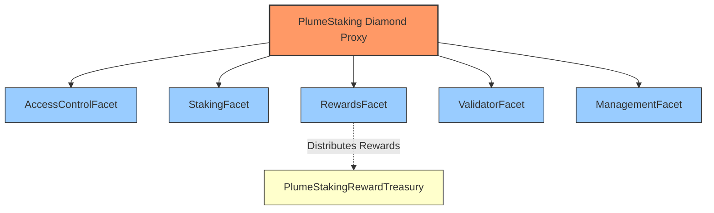

**Facet Responsibilities:**
- **AccessControlFacet**: OpenZeppelin AccessControl implementation
- **StakingFacet**: stake(), unstake(), withdraw(), restake(), restakeRewards()
- **RewardsFacet**: Reward calculation, distribution, treasury integration
- **ValidatorFacet**: Validator lifecycle, slashing, commission management
- **ManagementFacet**: System parameters, admin functions

#### Treasury System

The protocol separates fund custody from staking logic using a dedicated treasury contract:

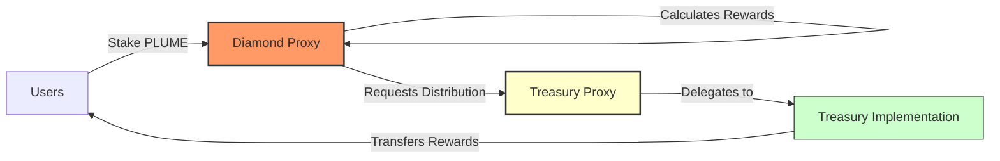

**Treasury Implementation:**
- UUPS upgradeable proxy pattern
- Role-based access (only Diamond can distribute)
- Multi-token support
- Direct transfers to users

### Core Concepts

#### Staking Mechanism

Staking lifecycle:

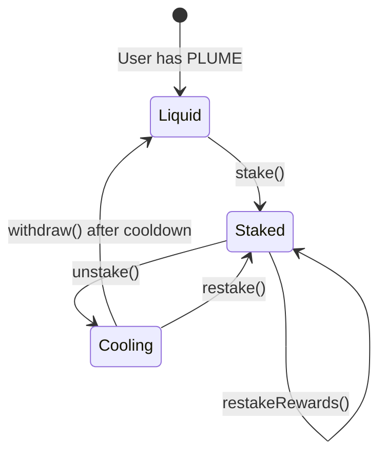

**Implementation Details:**
- Global minimum stake amount check
- Per-validator capacity limits
- Validator must be active and not slashed
- stake() accepts msg.value, stakeOnBehalf() allows third-party staking
- Cooldown period prevents immediate withdrawals after unstaking

#### Reward Calculation System

The reward system uses a sophisticated checkpoint-based mechanism to handle variable rates, validator-specific multipliers, and commission deductions.

##### Core Components

**1. Validator-Level Rate Tracking**
The system tracks reward rates exclusively at the validator level. When a reward token is added or its rate is updated via `setRewardRates`, a rate checkpoint is created for *every* active validator. This ensures all reward calculations are based on a specific validator's rate history.

**2. Checkpoint Structure**
```solidity
struct RateCheckpoint {
    uint256 timestamp;       // When rate changed
    uint256 rate;           // New rate (tokens/second/staked token)
    uint256 cumulativeIndex; // Accumulated rewards up to this point
}
```

**3. Key Storage Mappings**
- `validatorRewardRateCheckpoints[validatorId][token]`: Rate history
- `validatorCommissionCheckpoints[validatorId]`: Commission history
- `validatorRewardPerTokenCumulative[validatorId][token]`: Accumulated rewards
- `userValidatorRewardPerTokenPaid[user][validatorId][token]`: User's last settled index

##### Calculation Algorithm

**Step 1: Time Segmentation**

When calculating rewards, the system identifies all rate change points:

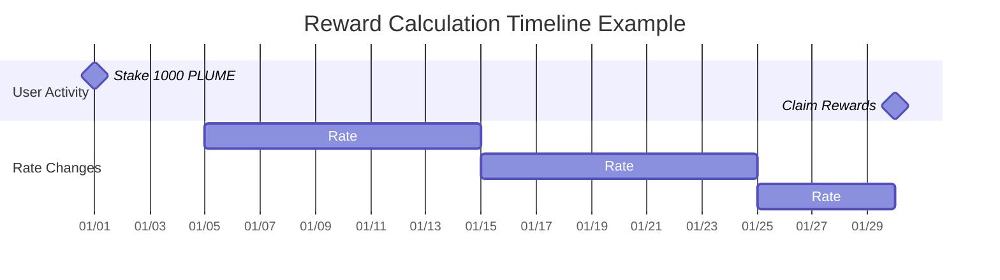

**Step 2: Segment Processing**

For each time segment between checkpoints:

```
Segment Gross Reward = Stake × Rate × Duration
Segment Commission = Gross Reward × Commission Rate
Segment Net Reward = Gross Reward - Commission
```

**Step 3: Mathematical Formula**

For a user with stake `S` over time period `[t₀, t₁]`:

```
Total Net Reward = Σᵢ [Sᵢ × Rᵢ × Δtᵢ × (1 - Cᵢ)]

Where:
- i = each time segment
- Sᵢ = stake amount in segment i
- Rᵢ = reward rate in segment i
- Δtᵢ = duration of segment i
- Cᵢ = commission rate in segment i
```

##### Detailed Calculation Example

**Setup:**
- User stakes 1,000 PLUME on January 1st
- REWARD_TOKEN with 18 decimals
- All rates use REWARD_PRECISION = 1e18

**Timeline:**

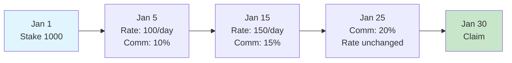

**Checkpoint Creation:**

```javascript
// Reward Rate Checkpoints
Checkpoint 0: { 
    timestamp: Jan 5, 
    rate: 100e18,     // 100 tokens/day/staked token
    cumulativeIndex: 0 
}
Checkpoint 1: { 
    timestamp: Jan 15, 
    rate: 150e18, 
    cumulativeIndex: 1000e18  // Accumulated from previous segment
}

// Commission Checkpoints
Checkpoint 0: { timestamp: Jan 5,  rate: 0.1e18 }   // 10%
Checkpoint 1: { timestamp: Jan 15, rate: 0.15e18 }  // 15%
Checkpoint 2: { timestamp: Jan 25, rate: 0.2e18 }   // 20%
```

**Calculation Process:**

| Segment | Duration | Rate | Stake | Gross Rewards | Commission | Net Rewards |
|---------|----------|------|-------|---------------|------------|-------------|
| Jan 1-5 | 4 days | 0 | 1,000 | 0 | 0% | 0 |
| Jan 5-15 | 10 days | 100/day | 1,000 | 1,000,000 | 10% (100,000) | 900,000 |
| Jan 15-25 | 10 days | 150/day | 1,000 | 1,500,000 | 15% (225,000) | 1,275,000 |
| Jan 25-30 | 5 days | 150/day | 1,000 | 750,000 | 20% (150,000) | 600,000 |
| **Total** | | | | **3,250,000** | **475,000** | **2,775,000** |

##### Implementation Details

**1. Finding Relevant Checkpoints (Binary Search)**

```solidity
function findCheckpointIndex(checkpoints, timestamp) {
    uint256 low = 0;
    uint256 high = checkpoints.length - 1;
    
    while (low <= high) {
        uint256 mid = (low + high) / 2;
        if (checkpoints[mid].timestamp <= timestamp) {
            if (mid == high || checkpoints[mid + 1].timestamp > timestamp) {
                return mid;  // Found the right checkpoint
            }
            low = mid + 1;
        } else {
            high = mid - 1;
        }
    }
    return 0;
}
```

> *Note: The function above is a simplified example for illustrative purposes. The actual implementation in `src/lib/PlumeRewardLogic.sol` is more robust and uses specialized functions such as `findRewardRateCheckpointIndexAtOrBefore` and `findCommissionCheckpointIndexAtOrBefore` to handle edge cases.*

**2. Time Segment Generation**

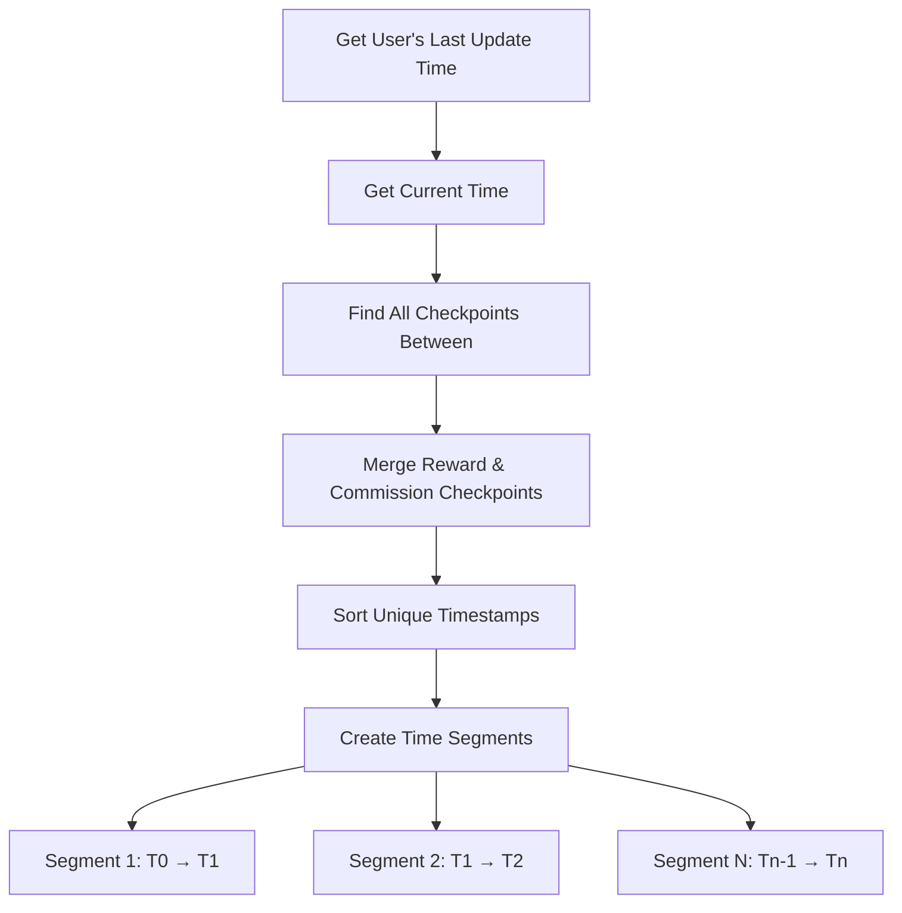

**3. Per-Segment Calculation Flow**

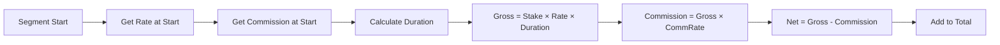

**4. Precision Handling**

All calculations use REWARD_PRECISION (1e18) to maintain accuracy:

```solidity
// Rate stored as tokens per second with 1e18 precision
uint256 ratePerSecond = 100e18 / 86400;  // 100 tokens/day

// Calculation preserves precision
uint256 rewardPerToken = duration * ratePerSecond;
uint256 grossReward = (stake * rewardPerToken) / REWARD_PRECISION;
```

##### Edge Cases

**1. Validator Slashing**
- Rewards stop accruing at slashedAtTimestamp
- Existing unclaimed rewards remain claimable
- No new rewards after slash time

**2. Mid-Stake Rate Changes**
- New stakers start earning from their stake timestamp
- Rate changes don't affect past earnings
- Checkpoint index tracking prevents double-claiming

**3. Zero Rates**
- Supported for pausing rewards
- Checkpoints still created for consistency
- Previous rewards remain claimable

##### Gas Optimization

**1. Checkpoint Efficiency**
- Binary search reduces lookup from O(n) to O(log n)
- Checkpoints only created on rate changes
- User checkpoint indices tracked to avoid re-processing

**2. Batch Operations**
- `claimAll()` processes all tokens in one transaction
- Validator commission settled across all tokens simultaneously
- Single update for all user rewards per validator

This checkpoint-based system ensures perfect accuracy regardless of when users claim, while maintaining gas efficiency through optimized data structures and algorithms.

#### Reward Token Lifecycle & Historical Tokens

Plume supports adding and removing reward tokens without disrupting historical reward accuracy:

- **Adding a token** (`addRewardToken`) immediately pushes the token into `rewardTokens`, marks it `isRewardToken=true`, and creates an *initial* reward-rate checkpoint for **every validator** at the chosen `initialRate`.  The token is also appended to the immutable `historicalRewardTokens` list.
- **Removing a token** (`removeRewardToken`) does **not** delete checkpoints. Instead it:
  1. Records `tokenRemovalTimestamps[token] = block.timestamp` so future calculations cap at this moment.
  2. Forces a final **zero-rate checkpoint** for each validator, guaranteeing no further accrual.
  3. Leaves all historical checkpoints intact so users can still claim previously-earned rewards.
- Users can therefore continue to claim even after a token is no longer active.  View/claim helpers automatically fall back to historical calculations when `isRewardToken[token] == false` but `isHistoricalRewardToken[token] == true`.
- Administrative helpers exist to *manually* add or remove entries from the historical list (`addHistoricalRewardToken`, `removeHistoricalRewardToken`).  These functions were used to migrate the contract state from v1 to v2 version. 
- The events `HistoricalRewardTokenAdded` / `HistoricalRewardTokenRemoved` capture these changes for off-chain indexers.

#### Slashing Mechanism

Slashing is driven by **unanimous votes** from *all other active validators* and can execute in two ways:

1. **Auto-Slash (preferred)** – when the last required validator casts its vote via `voteToSlashValidator`, the contract immediately calls the internal `_performSlash` and the validator is slashed in the *same* transaction. No privileged role is needed.
2. **Timed Slash** – if unanimity was reached but the auto-slash failed (e.g., a re-org removed a vote) anyone with `TIMELOCK_ROLE` may call `slashValidator` to perform the slash once the vote set is valid.

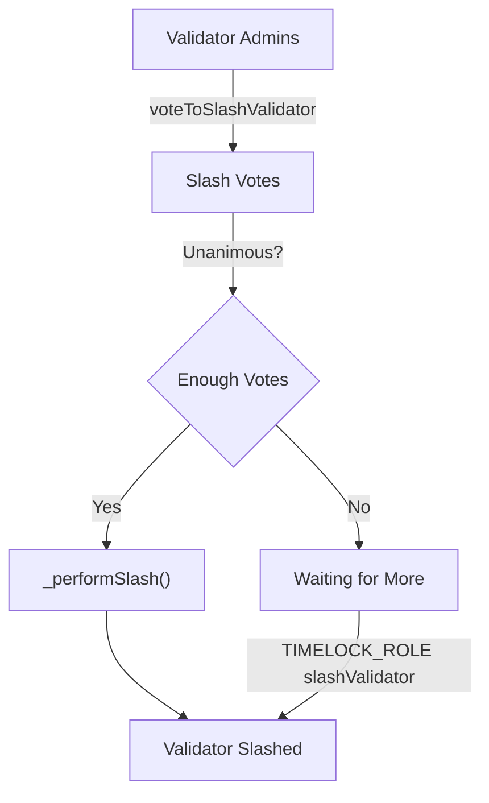

Key details:
- **Vote Expiry:** Each vote carries an `expiration` ≤ `maxSlashVoteDurationInSeconds`. Expired votes are cleaned up automatically by `_cleanupExpiredVotes` (invoked in voting & slashing paths).
- **Eligibility:** Only *active & non-slashed* validators may vote; a validator cannot vote to slash itself.
- **Cooldown Safety:** Admins must ensure `cooldownInterval > maxSlashVoteDuration` (enforced by `setCooldownInterval`). This guarantees users can always withdraw if a slash fails to pass.
- **Commission & Rewards:** Upon slashing, all stake & cooling amounts are burned; reward & commission accrual stops at `slashedAtTimestamp`.
- **Post-Slash Cleanup:** Users cannot recover losses, so admins use `adminClearValidatorRecord` / `adminBatchClearValidatorRecords` to erase orphaned state.

##### Effects of a Successful Slash

When `_performSlash` runs, the contract immediately:

1. **Burns 100 % of the validator’s stake and cooling balances.**  Both `validatorTotalStaked` and `validatorTotalCooling` are zeroed and the global aggregates (`totalStaked`, `totalCooling`) are reduced accordingly.
2. **Marks the validator as `slashed = true` and `active = false`.**  A `slashedAtTimestamp` is stored; reward logic caps accrual at this timestamp for all future calculations.
3. **Stops Reward & Commission Accrual.**  Reward‐rate calculations reference `slashedAtTimestamp`, so no new rewards or commission can accumulate after the slash block.
4. **Clears the stakers list and voting records** to prevent further interactions or double-slashing.
5. **Emits `ValidatorSlashed` and `ValidatorStatusUpdated` events** with the total stake+cooling amount burned so off-chain indexers can reconcile supply changes.

After these state changes, affected users must rely on the admin cleanup functions to remove now-irrecoverable records tied to the slashed validator.

#### Commission System

Validator commission flow:

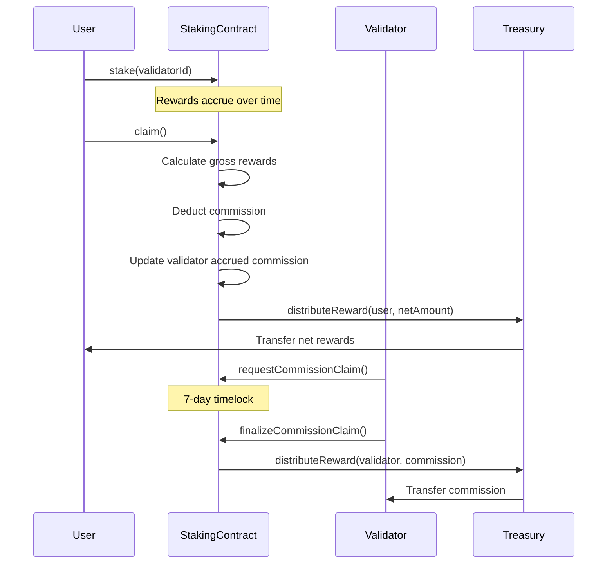

**Implementation:**
- Each validator keeps its **own** commission checkpoint history.  To defend against unbounded growth:
  •  `setMaxCommissionCheckpoints` caps the length (default 500).  Attempts to exceed revert with `MaxCommissionCheckpointsExceeded`.<br>  •  Admins can **prune** old data via `pruneCommissionCheckpoints` / `pruneRewardRateCheckpoints` (gas-heavy, irreversible).  Successful pruning emits `CommissionCheckpointsPruned` or `RewardRateCheckpointsPruned` respectively.
- 7-day timelock on withdrawals (COMMISSION_CLAIM_TIMELOCK)
- forceSettleValidatorCommission() for manual settlement

**Force Settlement Mechanism:**

```solidity
function forceSettleValidatorCommission(uint16 validatorId) external
```

- Permissionless function to trigger commission settlement
- Iterates all reward tokens and calculates accrued commission
- Updates validator's commission balance
- Gas costs borne by caller
- Useful before commission rate changes or validator updates

### Contract Reference

#### StakingFacet

Core staking operations and user balance management.

##### Write Functions

| Function | Description | Requirements |
|----------|-------------|--------------|
| `stake(uint16 validatorId)` | Stake PLUME tokens to a validator | - Payable (msg.value = stake amount)<br>- Validator must be active<br>- Validator not slashed<br>- Amount ≥ minimum stake<br>- Validator has capacity |
| `stakeOnBehalf(uint16 validatorId, address staker)` | Stake PLUME for another user | Same as stake() |
| `unstake(uint16 validatorId)` | Unstake all tokens from a validator | - Has stake with validator<br>- Validator not slashed<br>- Starts cooldown period |
| `unstake(uint16 validatorId, uint256 amount)` | Unstake specific amount | - Has sufficient stake<br>- Validator not slashed<br>- Starts cooldown period |
| `restake(uint16 validatorId, uint256 amount)` | Move cooling tokens back to staked | - Has cooling tokens<br>- Validator active<br>- Validator not slashed |
| `withdraw()` | Withdraw tokens after cooldown | - Has completed cooldowns<br>- Automatically skips slashed validators |
| `restakeRewards(uint16 validatorId)` | Claim and restake PLUME rewards | - Has PLUME rewards<br>- PLUME token must be an active reward token<br>- Transfers rewards from Treasury to back new stake<br>- Validator active<br>- Validator not slashed |

##### View Functions

| Function | Returns | Description |
|----------|---------|-------------|
| `amountStaked()` | `uint256` | Total PLUME staked by caller |
| `amountCooling()` | `uint256` | Total PLUME in cooldown (excludes slashed validators) |
| `amountWithdrawable()` | `uint256` | PLUME ready to withdraw |
| `stakeInfo(address user)` | `StakeInfo struct` | Complete staking information for user |
| `totalAmountStaked()` | `uint256` | System-wide staked PLUME |
| `totalAmountCooling()` | `uint256` | System-wide cooling PLUME |
| `totalAmountWithdrawable()` | `uint256` | System-wide withdrawable PLUME |
| `getUserValidatorStake(address, uint16)` | `uint256` | User's stake with specific validator |
| `getUserCooldowns(address)` | `CooldownEntry[]` | Active cooldowns (excludes slashed validators) |

#### RewardsFacet

Reward token management and distribution system.

##### Write Functions

| Function | Description | Access Control |
|----------|-------------|----------------|
| `setTreasury(address treasury)` | Set reward treasury address | REWARD_MANAGER_ROLE |
| `addRewardToken(address token, uint256 initialRate, uint256 maxRate)` | Add new reward token and set its initial rate for all validators | REWARD_MANAGER_ROLE |
| `removeRewardToken(address token)` | Remove reward token and create a final zero-rate checkpoint | REWARD_MANAGER_ROLE |
| `setRewardRates(address[] tokens, uint256[] rates)` | Set emission rates for multiple tokens, creating new checkpoints for all validators | REWARD_MANAGER_ROLE |
| `setMaxRewardRate(address token, uint256 rate)` | Set maximum rate limit for a token | REWARD_MANAGER_ROLE |
| `claim(address token, uint16 validatorId)` | Claim rewards for a specific token from a specific validator | Public |
| `claim(address token)` | Claim from all validators | Public |
| `claimAll()` | Claim all tokens from all validators | Public |

##### View Functions

| Function | Returns | Description |
|----------|---------|-------------|
| `earned(address user, address token)` | `uint256` | Total accumulated rewards across validators |
| `getClaimableReward(address user, address token)` | `uint256` | Currently claimable amount |
| `getRewardTokens()` | `address[]` | List of reward tokens |
| `getMaxRewardRate(address token)` | `uint256` | Maximum allowed rate |
| `getRewardRate(address token)` | `uint256` | Current emission rate |
| `tokenRewardInfo(address token)` | `RewardInfo struct` | Detailed token information |
| `getTreasury()` | `address` | Current treasury address |
| `getPendingRewardForValidator(address, uint16, address)` | `uint256` | Pending rewards for specific validator |

#### ValidatorFacet

Validator lifecycle management and slashing operations.

##### Write Functions

| Function | Description | Access Control |
|----------|-------------|----------------|
| `addValidator(uint16 validatorId, uint256 commission, address l2AdminAddress, ... , uint256 maxCapacity)` | Register new validator | VALIDATOR_ROLE |
| `setValidatorCapacity(uint16, uint256)` | Update staking capacity | VALIDATOR_ROLE |
| `setValidatorStatus(uint16, bool)` | Activate/deactivate validator | VALIDATOR_ROLE |
| `setValidatorCommission(uint16 validatorId, uint256 newCommission)` | Update commission rate for a validator | Validator Admin |
| `setValidatorAddresses(uint16, ...)` | Update admin/withdraw addresses. Admin changes initiate a two-step transfer. | Validator Admin |
| `acceptAdmin(uint16 validatorId)` | Accept pending admin role and complete two-step validator admin transfer | Pending Admin |
| `requestCommissionClaim(uint16 validatorId, address token)` | Start commission claim timelock for a specific token | Validator Admin |
| `finalizeCommissionClaim(uint16 validatorId, address token)` | Complete commission claim after timelock | Validator Admin |
| `voteToSlashValidator(uint16, uint256)` | Vote to slash another validator | Validator Admin |
| `slashValidator(uint16)` | Execute slashing if unanimity already reached (fallback) | TIMELOCK_ROLE |
| `cleanupExpiredVotes(uint16)` | Remove expired votes and return current valid count | Public |
| `forceSettleValidatorCommission(uint16)` | Manually settle accrued commission | Public |

##### View Functions

| Function | Returns | Description |
|----------|---------|-------------|
| `getValidatorInfo(uint16)` | `ValidatorInfo struct` | Complete validator details including slash status |
| `getValidatorStats(uint16)` | `ValidatorStats struct` | Key metrics for validator |
| `getUserValidators(address)` | `uint16[]` | Validators user has staked with (excludes slashed) |
| `getAccruedCommission(uint16, address)` | `uint256` | Unclaimed commission amount |
| `getValidatorsList()` | `ValidatorData[]` | All validators with core data |
| `getActiveValidatorCount()` | `uint256` | Number of active, non-slashed validators |
| `getSlashVoteCount(uint16)` | `uint256` | Current votes to slash validator |

#### ManagementFacet

System parameter configuration and administrative functions.

##### Write Functions

| Function | Description | Access Control |
|----------|-------------|----------------|
| `setMinStakeAmount(uint256)` | Set minimum stake requirement | ADMIN_ROLE |
| `setCooldownInterval(uint256)` | Set unstaking cooldown duration | ADMIN_ROLE |
| `adminWithdraw(address, uint256, address)` | Emergency fund withdrawal | TIMELOCK_ROLE |
| `setMaxSlashVoteDuration(uint256)` | Set vote expiration time | ADMIN_ROLE |
| `setMaxAllowedValidatorCommission(uint256)` | Set system-wide commission cap | ADMIN_ROLE |
| `adminClearValidatorRecord(address, uint16)` | Clear slashed validator records | ADMIN_ROLE |
| `adminBatchClearValidatorRecords(address[], uint16)` | Batch clear records | ADMIN_ROLE |
| `setMaxCommissionCheckpoints(uint16)` | Set max commission checkpoints per validator | ADMIN_ROLE |
| `setMaxValidatorPercentage(uint256)` | Set max % of total stake a validator can hold | ADMIN_ROLE |
| `pruneCommissionCheckpoints(uint16, uint256)` | Prune oldest commission checkpoints | ADMIN_ROLE |
| `pruneRewardRateCheckpoints(uint16, address, uint256)` | Prune oldest reward rate checkpoints | ADMIN_ROLE |
| `addHistoricalRewardToken(address)` | Add token to historical reward list (non-active) | ADMIN_ROLE |
| `removeHistoricalRewardToken(address)` | Remove token from historical reward list | ADMIN_ROLE |

##### View Functions

| Function | Returns | Description |
|----------|---------|-------------|
| `getMinStakeAmount()` | `uint256` | Current minimum stake |
| `getCooldownInterval()` | `uint256` | Current cooldown duration |

#### AccessControlFacet

OpenZeppelin AccessControl implementation.

##### Initialization

```solidity
// Must be called after facet deployment
accessControlFacet.initializeAccessControl()
```

Grants DEFAULT_ADMIN_ROLE and ADMIN_ROLE to caller, sets up role hierarchy.

### Events Reference

#### Staking Events

| Event | Emitted When | Parameters |
|-------|--------------|------------|
| `Staked` | User stakes tokens | `user`, `validatorId`, `amount`, `fromCooling`, `fromParked`, `pendingRewards` |
| `StakedOnBehalf` | Staking for another user | `sender`, `staker`, `validatorId`, `amount` |
| `Unstaked` | Unstaking initiated | `user`, `validatorId`, `amount` |
| `CooldownStarted` | Cooldown period begins | `staker`, `validatorId`, `amount`, `cooldownEnd` |
| `Withdrawn` | Tokens withdrawn after cooldown | `staker`, `amount` |
| `RewardsRestaked` | Rewards claimed and restaked | `staker`, `validatorId`, `amount` |

#### Reward Events

| Event | Emitted When | Parameters |
|-------|--------------|------------|
| `RewardTokenAdded` | New reward token registered | `token` |
| `RewardTokenRemoved` | Reward token removed | `token` |
| `RewardRatesSet` | Emission rates updated | `tokens[]`, `rates[]` |
| `MaxRewardRateUpdated` | Maximum rate changed | `token`, `newMaxRate` |
| `RewardRateCheckpointCreated` | Rate checkpoint created | `token`, `validatorId`, `rate`, `timestamp`, `index`, `cumulativeIndex` |
| `RewardClaimed` | User claims rewards | `user`, `token`, `amount` |
| `RewardClaimedFromValidator` | Rewards claimed from specific validator | `user`, `token`, `validatorId`, `amount` |
| `TreasurySet` | Treasury address updated | `treasury` |

#### Validator Events

| Event | Emitted When | Parameters |
|-------|--------------|------------|
| `ValidatorAdded` | New validator registered | `validatorId`, `commission`, `l2Admin`, `l2Withdraw`, `l1Val`, `l1Acc`, `l1AccEvm` |
| `ValidatorUpdated` | Validator details modified | Same as ValidatorAdded |
| `ValidatorStatusUpdated` | Active/slash status changed | `validatorId`, `active`, `slashed` |
| `ValidatorCommissionSet` | Commission rate updated | `validatorId`, `oldCommission`, `newCommission` |
| `ValidatorAddressesSet` | Admin/withdraw addresses changed | All old and new addresses |
| `ValidatorCapacityUpdated` | Capacity limit changed | `validatorId`, `oldCapacity`, `newCapacity` |
| `ValidatorCommissionClaimed` | Commission withdrawn | `validatorId`, `token`, `amount` |
| `SlashVoteCast` | Vote to slash submitted | `targetValidatorId`, `voterValidatorId`, `voteExpiration` |
| `ValidatorSlashed` | Validator slashed | `validatorId`, `slasher`, `penaltyAmount` |
| `ValidatorCommissionCheckpointCreated` | Commission checkpoint created | `validatorId`, `rate`, `timestamp` |

#### Administrative Events

| Event | Emitted When | Parameters |
|-------|--------------|------------|
| `MinStakeAmountSet` | Minimum stake updated | `amount` |
| `CooldownIntervalSet` | Cooldown duration updated | `interval` |
| `AdminWithdraw` | Emergency withdrawal | `token`, `amount`, `recipient` |
| `MaxSlashVoteDurationSet` | Vote expiration updated | `duration` |
| `MaxAllowedValidatorCommissionSet` | Commission cap updated | `oldMaxRate`, `newMaxRate` |
| `AdminClearedSlashedStake` | Slashed stake cleared by admin | `user`, `slashedValidatorId`, `amountCleared` |
| `AdminClearedSlashedCooldown` | Slashed cooldown cleared by admin | `user`, `slashedValidatorId`, `amountCleared` |
| `MaxCommissionCheckpointsSet` | Max commission checkpoints updated | `newLimit` |
| `CommissionCheckpointsPruned` | Old commission checkpoints pruned | `validatorId`, `count` |
| `RewardRateCheckpointsPruned` | Old reward rate checkpoints pruned | `validatorId`, `token`, `count` |
| `HistoricalRewardTokenAdded` | Token added to historical list | `token` |
| `HistoricalRewardTokenRemoved` | Token removed from historical list | `token` |
| `AdminProposed` | New validator admin proposed | `validatorId`, `proposedAdmin` |

### Errors Reference

#### Critical Errors

| Error | Thrown When |
|-------|-------------|
| `ValidatorDoesNotExist(uint16)` | Invalid validator ID |
| `ValidatorInactive(uint16)` | Validator not active |
| `ValidatorAlreadySlashed(uint16)` | Validator already slashed |
| `ActionOnSlashedValidatorError(uint16)` | Operation on slashed validator |
| `NotValidatorAdmin(address)` | Caller not validator admin |
| `Unauthorized(address, bytes32)` | Missing required role |
| `TreasuryNotSet()` | Treasury not configured |

#### Staking Errors

| Error | Thrown When |
|-------|-------------|
| `InvalidAmount(uint256)` | Zero or invalid amount |
| `NoActiveStake()` | No stake to unstake |
| `StakeAmountTooSmall(uint256, uint256)` | Below minimum stake |
| `InsufficientFunds(uint256, uint256)` | Insufficient balance |
| `CooldownPeriodNotEnded()` | Cooldown not complete |
| `NoRewardsToRestake()` | No rewards available |
| `ExceedsValidatorCapacity(uint16, uint256, uint256, uint256)` | Over validator capacity |
| `ValidatorPercentageExceeded()` | Over 33% total stake |

#### Commission/Reward Errors

| Error | Thrown When |
|-------|-------------|
| `CommissionExceedsMaxAllowed(uint256, uint256)` | Commission > max allowed |
| `InvalidMaxCommissionRate(uint256, uint256)` | Max rate > 50% |
| `PendingClaimExists(uint16, address)` | Claim already pending |
| `NoPendingClaim(uint16, address)` | No claim to finalize |
| `ClaimNotReady(uint16, address, uint256)` | Timelock not passed |
| `TokenDoesNotExist(address)` | Unknown reward token |
| `RewardRateExceedsMax()` | Rate > max allowed |

#### Slashing Errors

| Error | Thrown When |
|-------|-------------|
| `SlashVoteDurationTooLong()` | Vote expiration > max |
| `CannotVoteForSelf()` | Self-voting attempt |
| `AlreadyVotedToSlash(uint16, uint16)` | Duplicate vote |
| `UnanimityNotReached(uint256, uint256)` | Missing votes |
| `SlashVoteExpired(uint16, uint16)` | Vote expired |
| `CooldownTooShortForSlashVote(uint256, uint256)` | cooldownInterval ≤ maxSlashVoteDuration |
| `SlashVoteDurationTooLongForCooldown(uint256, uint256)` | Proposed vote duration ≥ cooldownInterval |
| `SlashVoteDurationExceedsCommissionTimelock(uint256, uint256)` | Proposed vote duration ≥ commission timelock |
| `NotPendingAdmin(address,uint16)` | Caller tries to accept admin without being the pending admin |
| `NoPendingAdmin(uint16)` | acceptAdmin called with no pending admin |

See PlumeErrors.sol for complete list.

### Constants and Roles

#### System Roles

| Role | Purpose | Key Permissions |
|------|---------|-----------------|
| `ADMIN_ROLE` | System administration | - Manage all other roles<br>- Set system parameters<br>- Emergency functions<br>- Clear slashed records |
| `UPGRADER_ROLE` | Contract upgrades | - Execute diamondCut<br>- Upgrade facets |
| `VALIDATOR_ROLE` | Validator management | - Add validators<br>- Set capacities<br>- Update statuses |
| `REWARD_MANAGER_ROLE` | Reward configuration | - Set reward rates<br>- Manage tokens<br>- Configure treasury |
| `TIMELOCK_ROLE` | Time-sensitive operations | - Execute slashing<br>- Set cooldown interval |

#### System Constants

| Constant | Value | Usage |
|----------|-------|--------|
| `PLUME_NATIVE` | 0xEeeeeEeeeEeEeeEeEeEeeEEEeeeeEeeeeeeeEEeE | Native PLUME token address |
| `REWARD_PRECISION` | 1e18 | Precision for rate calculations |
| `COMMISSION_CLAIM_TIMELOCK` | 7 days | Validator commission withdrawal delay |
| `STORAGE_SLOT` | keccak256("plume.staking.storage") | Diamond storage location |

---

## Testing

### Running Tests
The core test suite can be run using the following Forge command, which specifically targets the `PlumeStakingDiamond` tests with high verbosity:

```bash
forge test --match-contract PlumeStakingDiamond  -vvvv --via-ir
```

### Gas Considerations

**Notice on Loop Operations:** The PlumeStaking contract's design accounts for the current operational scale. At present, the system operates with 10 validators and one primary reward token. As there are no immediate plans to scale to hundreds of validators or tens of reward tokens, functions that loop through all validators or reward tokens are computationally safe and are not expected to exceed block gas limits under these conditions. Developers should remain mindful of these looping patterns if the system's scale significantly increases in the future.

---

## Spin and Raffle Contracts


More detailed info is available [here](SPIN.md).


### Environment Setup

`.env` configuration:

```bash
# Network
RPC_URL="https://rpc.plume.org"
PRIVATE_KEY=<DEPLOY_WALLET_PRIVATE_KEY>

# Contract Addresses (for upgrades)
SPIN_PROXY_ADDRESS=<NEEDED_FOR_UPGRADE>
RAFFLE_PROXY_ADDRESS=<NEEDED_FOR_UPGRADE>

# Supra Oracle
SUPRA_ROUTER_ADDRESS=0xE1062AC81e76ebd17b1e283CEed7B9E8B2F749A5
SUPRA_DEPOSIT_CONTRACT_ADDRESS=0x6DA36159Fe94877fF7cF226DBB164ef7f8919b9b
SUPRA_GENERATOR_CONTRACT_ADDRESS=0x8cC8bbE991d8B4371551B4e666Aa212f9D5f165e

# Utilities
DATETIME_ADDRESS=0x06a40Ec10d03998634d89d2e098F079D06A8FA83
BLOCKSCOUT_URL=https://explorer.plume.org/api?
```

### Build Instructions

```bash
forge clean && forge build --via-ir --build-info
```

### Deployment Guide

Deploy Spin and Raffle contracts with Supra whitelisting:

```bash
source .env && forge script script/DeploySpinRaffleContracts.s.sol \
    --rpc-url https://rpc.plume.org \
    --broadcast \
    --via-ir
```
Save proxy addresses from deployment output for upgrades.

### Upgrade Process

```bash
# Spin Contract
source .env && forge script script/UpgradeSpinContract.s.sol \
    --rpc-url https://rpc.plume.org \
    --broadcast \
    --via-ir

# Raffle Contract
source .env && forge script script/UpgradeRaffleContract.s.sol \
    --rpc-url https://rpc.plume.org \
    --broadcast \
    --via-ir
```

### Launch Steps

```solidity
// 1. Configure Raffle Prizes
raffle.addPrize(prizeId, prizeDetails);

// 2. Set Campaign Start Date (Spin)
spin.setCampaignStartDate(startTimestamp);

// 3. Enable Spin
spin.setEnabledSpin(true);
```

---

*This documentation is maintained alongside the smart contracts. For the latest updates, please refer to the repository.*


### SPIN.md

# Daily Spin & Raffle Contracts

> [!NOTE]
> **The Daily Spin is now live on Plume!**
> Try it out here: [https://portal.plume.org/daily-spin](https://portal.plume.org/daily-spin)

This document provides a technical overview of the `Spin.sol` and `Raffle.sol` smart contracts, which together create a gamified daily spin and raffle system.

## Table of Contents
1.  [High-Level Overview](#high-level-overview)
2.  [The Spin Contract (`Spin.sol`)](#1-the-spin-contract-spin.sol)
    -   [Spinning Process](#spinning-process)
    -   [Reward Determination Logic](#reward-determination-logic)
    -   [Daily Streak Mechanic](#daily-streak-mechanic)
    -   [`Spin.sol` Technical Reference](#spin.sol-technical-reference)
3.  [The Raffle Contract (`Raffle.sol`)](#2-the-raffle-contract-raffle.sol)
    -   [Raffle Process](#raffle-process)
    -   [Multi-Winner Selection](#multi-winner-selection)
    -   [Claiming a Prize](#claiming-a-prize-multi-winner-aware)
    -   [`Raffle.sol` Technical Reference](#raffle.sol-technical-reference)

## High-Level Overview

The daily spin is a feature where users pay a fee to spin a virtual wheel once per day for a chance to win various rewards, including raffle tickets. These tickets can then be used in a separate raffle system to win larger prizes. The system is built around two main contracts, `Spin.sol` and `Raffle.sol`, and uses the Supra oracle for verifiable on-chain randomness.

The overall process can be visualized as follows:

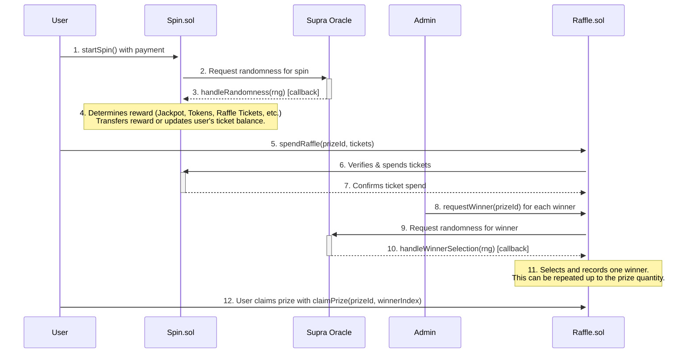

---

## 1. The Spin Contract (`Spin.sol`)

This is the core of the feature. It manages the user's ability to spin, the rewards, and the daily streak mechanic.

### Spinning Process

-   **Initiation**: A user calls the `startSpin()` function, sending a payment equal to the `spinPrice`.
-   **Cooldown**: The `canSpin` modifier ensures a user can only spin once per calendar day. This check is bypassed for whitelisted addresses. An attempt to spin more than once a day will result in an `AlreadySpunToday` error.
-   **Randomness**: The contract requests a random number from the Supra oracle. The spin is considered "pending" until the oracle returns a value.
-   **Reward Callback**: The Supra oracle calls `handleRandomness()` with the random number. This function is protected against re-entrancy and can only be called by the trusted oracle address.

### Reward Determination Logic

The `determineReward` function uses a multi-stage process to assign a reward based on a pseudo-random number (`rng`) from the Supra oracle. The `rng` is normalized to a value between 0 and 999,999.

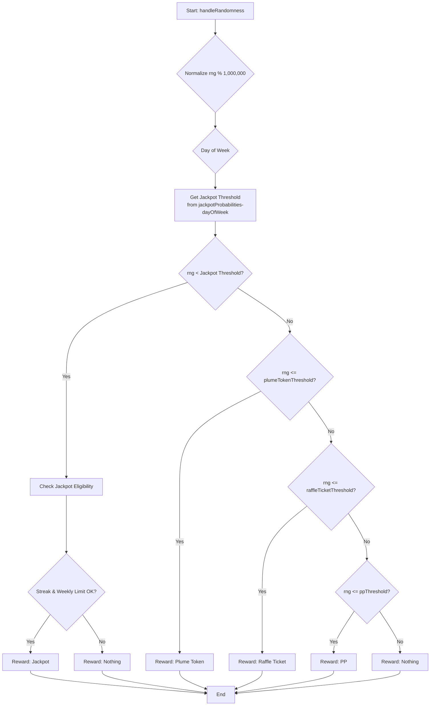

**Reward Tiers & Probabilities:**

| Reward Category | Probability Logic | Notes |
| :--- | :--- |:---|
| **Jackpot** | `rng < jackpotProbabilities-dayOfWeek` | The probability changes daily. Requires passing additional eligibility checks. |
| **Plume Token** | `rng <= plumeTokenThreshold` | A fixed amount of PLUME tokens. |
| **Raffle Ticket** | `rng <= raffleTicketThreshold` | Amount is `baseRaffleMultiplier * streakCount`. |
| **PP** | `rng <= ppThreshold` | A fixed amount of Plume Points. |
| **Nothing** | `rng > ppThreshold` | The default outcome if no other tier is met. |

**Jackpot Eligibility:**
Even if a user's `rng` falls within the jackpot range, they must meet two additional criteria:
1.  **Weekly Limit**: Only one jackpot can be won per campaign week across all users. The `lastJackpotClaimWeek` variable prevents further jackpot rewards within the same week. If this check fails, the reward defaults to "Nothing".
2.  **Streak Requirement**: The user's `streakCount` must be greater than or equal to `currentWeek + 2`. This means the required streak to be eligible for the jackpot increases as the campaign progresses. If this check fails, the reward also defaults to "Nothing".

### Daily Streak Mechanic

The contract calculates a user's streak of consecutive daily spins to reward consistent engagement. The core logic resides in the internal `_computeStreak` function.

- **Calculation**: The streak is based on calendar days, not 24-hour periods. This is achieved by dividing the `lastSpinTimestamp` and `block.timestamp` by `SECONDS_PER_DAY` (86,400) and comparing the resulting day numbers.
    - If `today == lastDaySpun`, the streak is unchanged.
    - If `today == lastDaySpun + 1`, the streak is incremented.
    - If `today > lastDaySpun + 1`, the streak is considered broken and resets to `1` (for the current day's spin).
- **Impact**: The `streakCount` directly multiplies the number of raffle tickets awarded, significantly increasing rewards for daily players. It is also a critical requirement for jackpot eligibility.

---
### `Spin.sol` Technical Reference

#### **Key Functions**
| Function | Description | Access |
|:---|:---|:---|
| `startSpin()` | User-callable function to initiate a spin by sending the required `spinPrice`. | Public |
| `handleRandomness(...)` | The callback function for the Supra oracle. Processes the spin result and updates user state. | `SUPRA_ROLE` |
| `spendRaffleTickets(...)` | Allows the `Raffle` contract to deduct tickets from a user's balance. | `raffleContract` only |
| `pause()` / `unpause()` | Pauses or unpauses the `startSpin` functionality. | `ADMIN_ROLE` |
| `adminWithdraw(...)` | Allows admin to withdraw PLUME tokens from the contract balance. | `ADMIN_ROLE` |
| `cancelPendingSpin(address user)` | Escape hatch to cancel a user's spin request that is stuck pending an oracle callback. | `ADMIN_ROLE` |
| `set...()` functions | A suite of functions (`setSpinPrice`, `setRaffleContract`, etc.) for configuring contract parameters. | `ADMIN_ROLE` |
| `currentStreak(address user)` | View function to get a user's current consecutive daily spin streak. | Public View |
| `getUserData(address user)` | View function that returns a comprehensive struct of a user's spin-related data. | Public View |
| `getWeeklyJackpot()` | View function to get the current week's jackpot prize and required streak. | Public View |

#### **Events**
-   `SpinRequested(uint256 indexed nonce, address indexed user)`: Emitted when a user successfully initiates a spin.
-   `SpinCompleted(address indexed walletAddress, string rewardCategory, uint256 rewardAmount)`: Emitted after the oracle callback is processed, detailing the reward.
-   `RaffleTicketsSpent(address indexed walletAddress, uint256 ticketsUsed, uint256 remainingTickets)`: Emitted when the `Raffle` contract spends a user's tickets.
-   `NotEnoughStreak(string message)`: Emitted if a user meets the odds for a jackpot but does not have the required streak count.
-   `JackpotAlreadyClaimed(string message)`: Emitted if a user meets the odds for a jackpot but it has already been won that week.

#### **Errors**
-   `AlreadySpunToday()`: Reverts if a user tries to spin more than once in a calendar day.
-   `CampaignNotStarted()`: Reverts if `startSpin()` is called before the campaign is enabled by an admin.
-   `InvalidNonce()`: Reverts if the `handleRandomness` callback receives a nonce that does not correspond to a pending spin.
-   `SpinRequestPending(address user)`: Reverts if a user tries to `startSpin()` while another spin is already pending an oracle callback.

---

## 2. The Raffle Contract (`Raffle.sol`)

This contract allows users to spend the raffle tickets they've earned from the Spin contract to enter drawings for prizes that can have **multiple winners**.

### Raffle Process

-   **Prize Management**: An admin can call `addPrize` and `editPrize`. A critical parameter is `quantity`, which defines how many winners a single prize can have.
-   **Entering a Raffle**: A user calls `spendRaffle(prizeId, ticketAmount)` to enter a specific prize drawing. The `Raffle` contract communicates with the `Spin` contract to verify the user has enough `raffleTicketsBalance` and then to deduct the spent amount.

### Multi-Winner Selection

Winner selection is an admin-initiated process that can be repeated for each available prize slot. It is designed to be fair and transparent.

1.  **Request**: The admin calls `requestWinner(prizeId)`. This can be done as long as the number of `winnersDrawn` is less than the prize `quantity`.
2.  **Oracle Callback**: The function requests a random number from the Supra oracle. The oracle's callback, `handleWinnerSelection`, receives the random number and performs a binary search on the ticket entries to find the winner.
3.  **Recording Winner**: The winner's details are stored in the `prizeWinners` array for that prize.
4.  **Repeat**: This process can be repeated by the admin until the `quantity` of winners for that prize has been drawn. Once `winnersDrawn == quantity`, the prize automatically becomes inactive.

### Claiming a Prize (Multi-Winner Aware)

-   **Individual Claims**: Each winner must call `claimPrize(prizeId, winnerIndex)` to claim their specific prize. Since a prize can have multiple winners, the `winnerIndex` (starting from 0) is used to identify which winning slot is being claimed.
-   **Independent Status**: Each winner's claim status is tracked independently. One user claiming their prize has no effect on the ability of other winners to claim theirs. The actual delivery of the prize is handled off-chain.

---
### `Raffle.sol` Technical Reference

#### Data Structures

**`Prize` Struct**
```solidity
struct Prize {
    string name;
    string description;
    uint256 value;
    uint256 endTimestamp;
    bool isActive;
    uint256 quantity;
    // --- Deprecated Fields ---
    address winner;
    uint256 winnerIndex;
    bool claimed;
}
```
> *Note: The `winner`, `winnerIndex`, and `claimed` fields on the `Prize` struct are deprecated and are no longer used in favor of the multi-winner `prizeWinners` mapping.*

**`Winner` Struct**
```solidity
struct Winner {
    address winnerAddress;
    uint256 winningTicketIndex;
    uint256 drawnAt;
    bool claimed;
}
```

#### **Key Functions**
| Function | Description | Access |
|:---|:---|:---|
| `spendRaffle(prizeId, ticketAmount)` | User-callable function to spend raffle tickets and enter a prize drawing. | Public |
| `requestWinner(prizeId)` | Initiates the winner selection process for a specific prize. | `ADMIN_ROLE` |
| `handleWinnerSelection(...)` | The callback from the Supra oracle. Finds and records a winner. | `SUPRA_ROLE` |
| `claimPrize(prizeId, winnerIndex)` | User-callable for a winner to claim their prize slot. | Public |
| `addPrize(...)` / `editPrize(...)` / `removePrize(...)` | Functions for managing prize details. | `ADMIN_ROLE` |
| `setPrizeActive(prizeId, active)` | Manually activates or deactivates a prize. | `ADMIN_ROLE` |
| `cancelWinnerRequest(prizeId)` | Escape hatch to cancel a pending VRF request for a winner drawing. | `ADMIN_ROLE` |
| `getPrizeDetails(...)` | View function to get all public details about a specific prize. | Public View |
| `getPrizeWinners(prizeId)` | View function to get an array of all the `Winner` structs for a prize. | Public View |
| `getUserWinnings(address user)` | View function to get an array of prize IDs that a specific user has won. | Public View |

#### **Events**
-   `PrizeAdded(uint256 indexed prizeId, string name)`: Emitted when a new prize is created.
-   `PrizeEdited(uint256 indexed prizeId, ...)`: Emitted when an existing prize is modified via `editPrize`.
-   `TicketSpent(address indexed user, uint256 indexed prizeId, uint256 tickets)`: Emitted when a user successfully spends tickets on a prize.
-   `WinnerRequested(uint256 indexed prizeId, uint256 indexed requestId)`: Emitted when an admin requests a winner to be drawn.
-   `WinnerSelected(uint256 indexed prizeId, address indexed winner, uint256 winningTicketIndex)`: Emitted when the oracle callback successfully selects and records a winner.
-   `PrizeClaimed(address indexed user, uint256 indexed prizeId, uint256 winnerIndex)`: Emitted when a winner successfully claims their prize.

#### **Errors**
-   `AllWinnersDrawn()`: Reverts if `requestWinner` is called after all available winner slots for a prize have been filled.
-   `EmptyTicketPool()`: Reverts if `requestWinner` is called for a prize that has no ticket entries.
-   `InsufficientTickets()`: Reverts if a user tries to spend more raffle tickets than they have.
-   `WinnerNotDrawn()`: Reverts if a user tries to claim a prize before the winner selection process is complete for that slot.
-   `NotAWinner()`: Reverts if a user tries to claim a prize they did not win.
-   `WinnerClaimed()`: Reverts if a winner tries to claim the same prize slot more than once.
-   `WinnerRequestPending(uint256 prizeId)`: Reverts if `requestWinner` is called for a prize that already has a pending VRF request.

