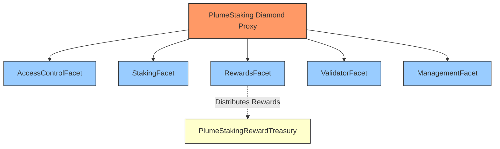
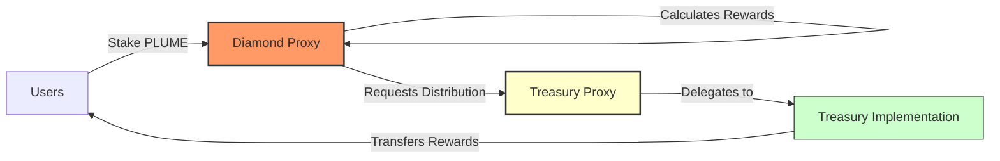
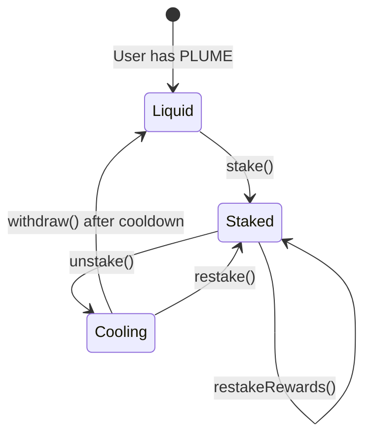
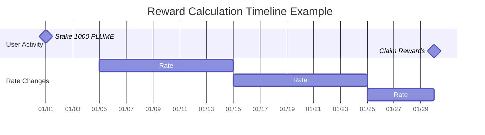
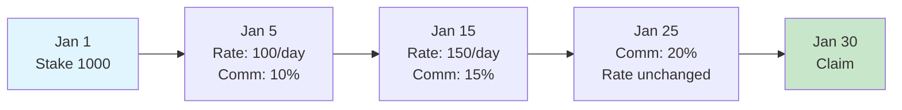
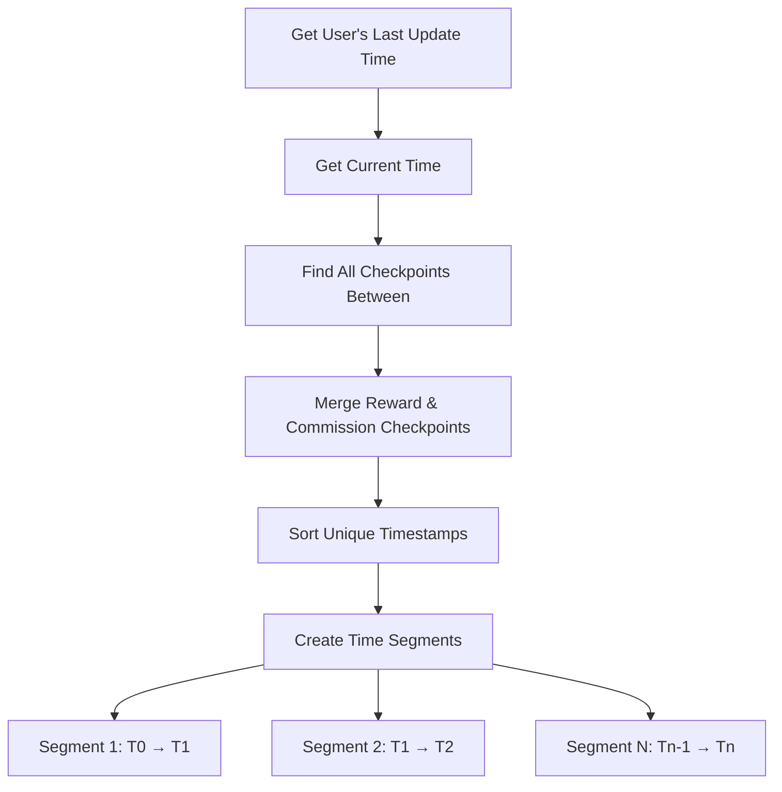
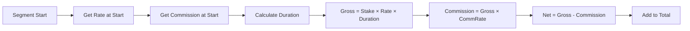
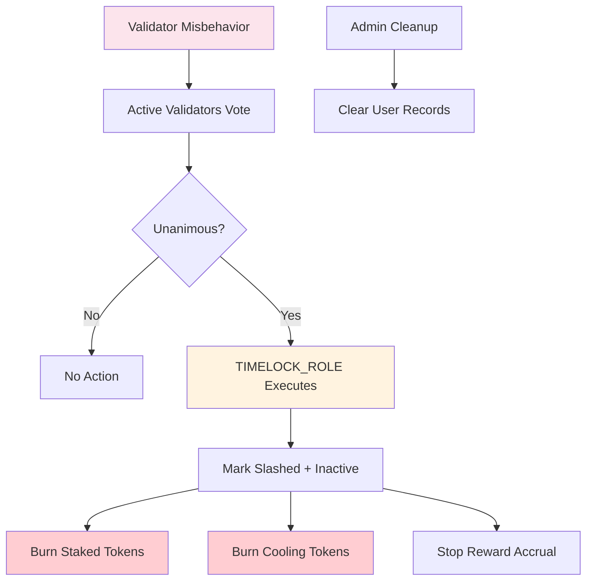
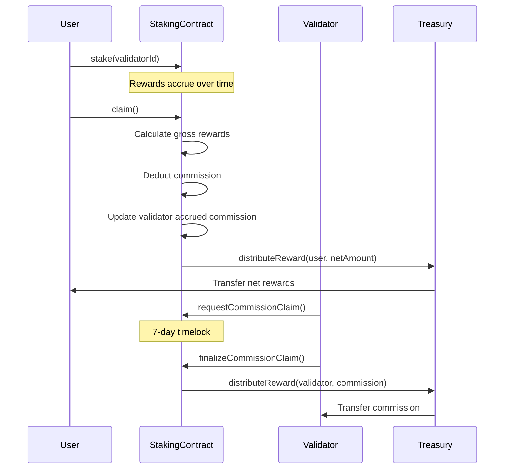

 ## DOCUMENTATION: 

 README.md

# PlumeStaking and Spin/Raffle Contracts

## Table of Contents

1. [PlumeStaking System](#plumestaking-system)
   - [Overview](#overview)
   - [Architecture](#architecture)
     - [Diamond Pattern Implementation](#diamond-pattern-implementation)
     - [Treasury System](#treasury-system)
   - [Core Concepts](#core-concepts)
     - [Staking Mechanism](#staking-mechanism)
     - [Reward Distribution](#reward-distribution)
     - [Slashing Mechanism](#slashing-mechanism)
     - [Commission System](#commission-system)
   - [Contract Reference](#contract-reference)
     - [StakingFacet](#stakingfacet)
     - [RewardsFacet](#rewardsfacet)
     - [ValidatorFacet](#validatorfacet)
     - [ManagementFacet](#managementfacet)
     - [AccessControlFacet](#accesscontrolfacet)
   - [Events Reference](#events-reference)
   - [Errors Reference](#errors-reference)
   - [Constants and Roles](#constants-and-roles)
2. [Spin and Raffle Contracts](#spin-and-raffle-contracts)
   - [Environment Setup](#environment-setup)
   - [Build Instructions](#build-instructions)
   - [Deployment Guide](#deployment-guide)
   - [Upgrade Process](#upgrade-process)
   - [Launch Steps](#launch-steps)

---

## PlumeStaking System

### High-Level Architecture Overview

PlumeStaking is a Diamond proxy-based staking system that separates concerns across multiple facets. The system implements a delegated proof-of-stake mechanism where users stake PLUME tokens to validators and earn rewards in multiple ERC20 tokens.

**Core Design Principles:**
- **Diamond Pattern (EIP-2535)**: Modular architecture allowing selective upgrades without full redeployment
- **Checkpoint-Based Rewards**: Historical rate tracking enables accurate reward calculations across rate changes
- **Validator-Specific Accounting**: Each validator maintains independent reward rates and commission structures
- **Lazy Evaluation**: Rewards calculated on-demand rather than continuously updated
- **Separate Treasury**: Reward funds custody isolated from staking logic

**Key Mechanics:**
1. Users stake PLUME to validators, earning rewards based on validator-specific emission rates
2. Validators earn commission on generated rewards (configurable per validator, max 50%)
3. Unstaking initiates a cooldown period before funds become withdrawable
4. Slashing requires unanimous vote from all other active validators
5. All reward distributions flow through a separate treasury contract

**Initialization:**
```solidity
// After Diamond deployment, initialize PlumeStaking
plumeStaking.initializePlume(initialOwner, minStake, cooldownInterval)

// Initialize AccessControlFacet
accessControlFacet.initializeAccessControl()
```

### Architecture

#### Diamond Pattern Implementation

PlumeStaking uses the EIP-2535 Diamond standard to organize functionality into modular facets:



**Facet Responsibilities:**
- **AccessControlFacet**: OpenZeppelin AccessControl implementation
- **StakingFacet**: stake(), unstake(), withdraw(), restake()
- **RewardsFacet**: Reward calculation, distribution, treasury integration
- **ValidatorFacet**: Validator lifecycle, slashing, commission management
- **ManagementFacet**: System parameters, admin functions

#### Treasury System

The protocol separates fund custody from staking logic using a dedicated treasury contract:



**Treasury Implementation:**
- UUPS upgradeable proxy pattern
- Role-based access (only Diamond can distribute)
- Multi-token support
- Direct transfers to users

### Core Concepts

#### Staking Mechanism

Staking lifecycle:



**Implementation Details:**
- Global minimum stake amount check
- Per-validator capacity limits
- Validator must be active and not slashed
- stake() accepts msg.value, stakeOnBehalf() allows third-party staking
- Cooldown period prevents immediate withdrawals after unstaking

#### Reward Calculation System

The reward system uses a sophisticated checkpoint-based mechanism to handle variable rates, validator-specific multipliers, and commission deductions.

##### Core Components

**1. Multi-Level Rate Tracking**
```
Global Rate → Validator Rate → User Rewards
     ↓              ↓                ↓
  Default      Checkpoint        Calculate
   Rate         History          w/Commission
```

**2. Checkpoint Structure**
```solidity
struct RateCheckpoint {
    uint256 timestamp;       // When rate changed
    uint256 rate;           // New rate (tokens/second/staked token)
    uint256 cumulativeIndex; // Accumulated rewards up to this point
}
```

**3. Key Storage Mappings**
- `validatorRewardRateCheckpoints[validatorId][token]`: Rate history
- `validatorCommissionCheckpoints[validatorId]`: Commission history
- `validatorRewardPerTokenCumulative[validatorId][token]`: Accumulated rewards
- `userValidatorRewardPerTokenPaid[user][validatorId][token]`: User's last settled index

##### Calculation Algorithm

**Step 1: Time Segmentation**

When calculating rewards, the system identifies all rate change points:



**Step 2: Segment Processing**

For each time segment between checkpoints:

```
Segment Gross Reward = Stake × Rate × Duration
Segment Commission = Gross Reward × Commission Rate
Segment Net Reward = Gross Reward - Commission
```

**Step 3: Mathematical Formula**

For a user with stake `S` over time period `[t₀, t₁]`:

```
Total Net Reward = Σᵢ [Sᵢ × Rᵢ × Δtᵢ × (1 - Cᵢ)]

Where:
- i = each time segment
- Sᵢ = stake amount in segment i
- Rᵢ = reward rate in segment i
- Δtᵢ = duration of segment i
- Cᵢ = commission rate in segment i
```

##### Detailed Calculation Example

**Setup:**
- User stakes 1,000 PLUME on January 1st
- REWARD_TOKEN with 18 decimals
- All rates use REWARD_PRECISION = 1e18

**Timeline:**



**Checkpoint Creation:**

```javascript
// Reward Rate Checkpoints
Checkpoint 0: { 
    timestamp: Jan 5, 
    rate: 100e18,     // 100 tokens/day/staked token
    cumulativeIndex: 0 
}
Checkpoint 1: { 
    timestamp: Jan 15, 
    rate: 150e18, 
    cumulativeIndex: 1000e18  // Accumulated from previous segment
}

// Commission Checkpoints
Checkpoint 0: { timestamp: Jan 5,  rate: 0.1e18 }   // 10%
Checkpoint 1: { timestamp: Jan 15, rate: 0.15e18 }  // 15%
Checkpoint 2: { timestamp: Jan 25, rate: 0.2e18 }   // 20%
```

**Calculation Process:**

| Segment | Duration | Rate | Stake | Gross Rewards | Commission | Net Rewards |
|---------|----------|------|-------|---------------|------------|-------------|
| Jan 1-5 | 4 days | 0 | 1,000 | 0 | 0% | 0 |
| Jan 5-15 | 10 days | 100/day | 1,000 | 1,000,000 | 10% (100,000) | 900,000 |
| Jan 15-25 | 10 days | 150/day | 1,000 | 1,500,000 | 15% (225,000) | 1,275,000 |
| Jan 25-30 | 5 days | 150/day | 1,000 | 750,000 | 20% (150,000) | 600,000 |
| **Total** | | | | **3,250,000** | **475,000** | **2,775,000** |

##### Implementation Details

**1. Finding Relevant Checkpoints (Binary Search)**

```solidity
function findCheckpointIndex(checkpoints, timestamp) {
    uint256 low = 0;
    uint256 high = checkpoints.length - 1;
    
    while (low <= high) {
        uint256 mid = (low + high) / 2;
        if (checkpoints[mid].timestamp <= timestamp) {
            if (mid == high || checkpoints[mid + 1].timestamp > timestamp) {
                return mid;  // Found the right checkpoint
            }
            low = mid + 1;
        } else {
            high = mid - 1;
        }
    }
    return 0;
}
```

**2. Time Segment Generation**



**3. Per-Segment Calculation Flow**



**4. Precision Handling**

All calculations use REWARD_PRECISION (1e18) to maintain accuracy:

```solidity
// Rate stored as tokens per second with 1e18 precision
uint256 ratePerSecond = 100e18 / 86400;  // 100 tokens/day

// Calculation preserves precision
uint256 rewardPerToken = duration * ratePerSecond;
uint256 grossReward = (stake * rewardPerToken) / REWARD_PRECISION;
```

##### Edge Cases

**1. Validator Slashing**
- Rewards stop accruing at slashedAtTimestamp
- Existing unclaimed rewards remain claimable
- No new rewards after slash time

**2. Mid-Stake Rate Changes**
- New stakers start earning from their stake timestamp
- Rate changes don't affect past earnings
- Checkpoint index tracking prevents double-claiming

**3. Zero Rates**
- Supported for pausing rewards
- Checkpoints still created for consistency
- Previous rewards remain claimable

##### Gas Optimization

**1. Checkpoint Efficiency**
- Binary search reduces lookup from O(n) to O(log n)
- Checkpoints only created on rate changes
- User checkpoint indices tracked to avoid re-processing

**2. Batch Operations**
- `claimAll()` processes all tokens in one transaction
- Validator commission settled across all tokens simultaneously
- Single update for all user rewards per validator

This checkpoint-based system ensures perfect accuracy regardless of when users claim, while maintaining gas efficiency through optimized data structures and algorithms.

#### Slashing Mechanism

Slashing is a two-step process: voting and execution.



**Implementation:**

1. **Voting:**
   - Only active, non-slashed validator admins can vote
   - Votes expire (configurable max duration)
   - Requires ALL other active validators to vote YES
   - Self-voting prohibited

2. **Execution:**
   - Requires TIMELOCK_ROLE
   - Checks unanimous vote still active
   - Irreversible

3. **Effects:**
   - 100% penalty - all staked and cooling tokens burned
   - Validator marked slashed, set inactive
   - Rewards stop at slashedAtTimestamp
   - Commission forfeited
   - No user recovery mechanism

4. **Cleanup:**
   - adminClearValidatorRecord() - single user cleanup
   - adminBatchClearValidatorRecords() - batch cleanup
   - Only for slashed validators
   - Required since users can't recover funds

#### Commission System

Validator commission flow:



**Implementation:**
- Commission stored as rate (scaled by 1e18, max 50%)
- Changes tracked via checkpoints
- 7-day timelock on withdrawals (COMMISSION_CLAIM_TIMELOCK)
- forceSettleValidatorCommission() for manual settlement

**Force Settlement Mechanism:**

```solidity
function forceSettleValidatorCommission(uint16 validatorId) external
```

- Permissionless function to trigger commission settlement
- Iterates all reward tokens and calculates accrued commission
- Updates validator's commission balance
- Gas costs borne by caller
- Useful before commission rate changes or validator updates

### Contract Reference

#### StakingFacet

Core staking operations and user balance management.

##### Write Functions

| Function | Description | Requirements |
|----------|-------------|--------------|
| `stake(uint16 validatorId)` | Stake PLUME tokens to a validator | - Payable (msg.value = stake amount)<br>- Validator must be active<br>- Validator not slashed<br>- Amount ≥ minimum stake<br>- Validator has capacity |
| `stakeOnBehalf(uint16 validatorId, address staker)` | Stake PLUME for another user | Same as stake() |
| `unstake(uint16 validatorId)` | Unstake all tokens from a validator | - Has stake with validator<br>- Validator not slashed<br>- Starts cooldown period |
| `unstake(uint16 validatorId, uint256 amount)` | Unstake specific amount | - Has sufficient stake<br>- Validator not slashed<br>- Starts cooldown period |
| `restake(uint16 validatorId, uint256 amount)` | Move cooling tokens back to staked | - Has cooling tokens<br>- Validator active<br>- Validator not slashed |
| `withdraw()` | Withdraw tokens after cooldown | - Has completed cooldowns<br>- Automatically skips slashed validators |
| `restakeRewards(uint16 validatorId)` | Claim and restake PLUME rewards | - Has PLUME rewards<br>- Validator active<br>- Validator not slashed |

##### View Functions

| Function | Returns | Description |
|----------|---------|-------------|
| `amountStaked()` | `uint256` | Total PLUME staked by caller |
| `amountCooling()` | `uint256` | Total PLUME in cooldown (excludes slashed validators) |
| `amountWithdrawable()` | `uint256` | PLUME ready to withdraw |
| `stakeInfo(address user)` | `StakeInfo struct` | Complete staking information for user |
| `totalAmountStaked()` | `uint256` | System-wide staked PLUME |
| `totalAmountCooling()` | `uint256` | System-wide cooling PLUME |
| `totalAmountWithdrawable()` | `uint256` | System-wide withdrawable PLUME |
| `getUserValidatorStake(address, uint16)` | `uint256` | User's stake with specific validator |
| `getUserCooldowns(address)` | `CooldownEntry[]` | Active cooldowns (excludes slashed validators) |

#### RewardsFacet

Reward token management and distribution system.

##### Write Functions

| Function | Description | Access Control |
|----------|-------------|----------------|
| `setTreasury(address treasury)` | Set reward treasury address | REWARD_MANAGER_ROLE |
| `addRewardToken(address token)` | Add new reward token | REWARD_MANAGER_ROLE |
| `removeRewardToken(address token)` | Remove reward token | REWARD_MANAGER_ROLE |
| `setRewardRates(address[] tokens, uint256[] rates)` | Set emission rates | REWARD_MANAGER_ROLE |
| `setMaxRewardRate(address token, uint256 rate)` | Set maximum rate limit | REWARD_MANAGER_ROLE |
| `claim(address token, uint16 validatorId)` | Claim from specific validator | Public |
| `claim(address token)` | Claim from all validators | Public |
| `claimAll()` | Claim all tokens from all validators | Public |

##### View Functions

| Function | Returns | Description |
|----------|---------|-------------|
| `earned(address user, address token)` | `uint256` | Total accumulated rewards across validators |
| `getClaimableReward(address user, address token)` | `uint256` | Currently claimable amount |
| `getRewardTokens()` | `address[]` | List of reward tokens |
| `getMaxRewardRate(address token)` | `uint256` | Maximum allowed rate |
| `getRewardRate(address token)` | `uint256` | Current emission rate |
| `tokenRewardInfo(address token)` | `RewardInfo struct` | Detailed token information |
| `getTreasury()` | `address` | Current treasury address |
| `getPendingRewardForValidator(address, uint16, address)` | `uint256` | Pending rewards for specific validator |

#### ValidatorFacet

Validator lifecycle management and slashing operations.

##### Write Functions

| Function | Description | Access Control |
|----------|-------------|----------------|
| `addValidator(...)` | Register new validator | VALIDATOR_ROLE |
| `setValidatorCapacity(uint16, uint256)` | Update staking capacity | VALIDATOR_ROLE |
| `setValidatorStatus(uint16, bool)` | Activate/deactivate validator | VALIDATOR_ROLE |
| `setValidatorCommission(uint16, uint256)` | Update commission rate | Validator Admin |
| `setValidatorAddresses(uint16, ...)` | Update admin/withdraw addresses | Validator Admin |
| `requestCommissionClaim(uint16, address)` | Start commission claim timelock | Validator Admin |
| `finalizeCommissionClaim(uint16, address)` | Complete commission claim | Validator Admin |
| `voteToSlashValidator(uint16, uint256)` | Vote to slash another validator | Validator Admin |
| `slashValidator(uint16)` | Execute slashing (requires unanimous vote) | TIMELOCK_ROLE |
| `forceSettleValidatorCommission(uint16)` | Manually settle accrued commission | Public |

##### View Functions

| Function | Returns | Description |
|----------|---------|-------------|
| `getValidatorInfo(uint16)` | `ValidatorInfo struct` | Complete validator details including slash status |
| `getValidatorStats(uint16)` | `ValidatorStats struct` | Key metrics for validator |
| `getUserValidators(address)` | `uint16[]` | Validators user has staked with (excludes slashed) |
| `getAccruedCommission(uint16, address)` | `uint256` | Unclaimed commission amount |
| `getValidatorsList()` | `ValidatorData[]` | All validators with core data |
| `getActiveValidatorCount()` | `uint256` | Number of active, non-slashed validators |
| `getSlashVoteCount(uint16)` | `uint256` | Current votes to slash validator |

#### ManagementFacet

System parameter configuration and administrative functions.

##### Write Functions

| Function | Description | Access Control |
|----------|-------------|----------------|
| `setMinStakeAmount(uint256)` | Set minimum stake requirement | ADMIN_ROLE |
| `setCooldownInterval(uint256)` | Set unstaking cooldown duration | ADMIN_ROLE |
| `adminWithdraw(address, uint256, address)` | Emergency fund withdrawal | TIMELOCK_ROLE |
| `setMaxSlashVoteDuration(uint256)` | Set vote expiration time | ADMIN_ROLE |
| `setMaxAllowedValidatorCommission(uint256)` | Set system-wide commission cap | ADMIN_ROLE |
| `adminClearValidatorRecord(address, uint16)` | Clear slashed validator records | ADMIN_ROLE |
| `adminBatchClearValidatorRecords(address[], uint16)` | Batch clear records | ADMIN_ROLE |

##### View Functions

| Function | Returns | Description |
|----------|---------|-------------|
| `getMinStakeAmount()` | `uint256` | Current minimum stake |
| `getCooldownInterval()` | `uint256` | Current cooldown duration |

#### AccessControlFacet

OpenZeppelin AccessControl implementation.

##### Initialization

```solidity
// Must be called after facet deployment
accessControlFacet.initializeAccessControl()
```

Grants DEFAULT_ADMIN_ROLE and ADMIN_ROLE to caller, sets up role hierarchy.

### Events Reference

#### Staking Events

| Event | Emitted When | Parameters |
|-------|--------------|------------|
| `Staked` | User stakes tokens | `user`, `validatorId`, `amount`, `fromCooling`, `fromParked`, `pendingRewards` |
| `StakedOnBehalf` | Staking for another user | `sender`, `staker`, `validatorId`, `amount` |
| `Unstaked` | Unstaking initiated | `user`, `validatorId`, `amount` |
| `CooldownStarted` | Cooldown period begins | `staker`, `validatorId`, `amount`, `cooldownEnd` |
| `Withdrawn` | Tokens withdrawn after cooldown | `staker`, `amount` |
| `RewardsRestaked` | Rewards claimed and restaked | `staker`, `validatorId`, `amount` |

#### Reward Events

| Event | Emitted When | Parameters |
|-------|--------------|------------|
| `RewardTokenAdded` | New reward token registered | `token` |
| `RewardTokenRemoved` | Reward token removed | `token` |
| `RewardRatesSet` | Emission rates updated | `tokens[]`, `rates[]` |
| `MaxRewardRateUpdated` | Maximum rate changed | `token`, `newMaxRate` |
| `RewardRateCheckpointCreated` | Rate checkpoint created | `token`, `validatorId`, `rate`, `timestamp`, `index`, `cumulativeIndex` |
| `RewardClaimed` | User claims rewards | `user`, `token`, `amount` |
| `RewardClaimedFromValidator` | Rewards claimed from specific validator | `user`, `token`, `validatorId`, `amount` |
| `TreasurySet` | Treasury address updated | `treasury` |

#### Validator Events

| Event | Emitted When | Parameters |
|-------|--------------|------------|
| `ValidatorAdded` | New validator registered | `validatorId`, `commission`, `l2Admin`, `l2Withdraw`, `l1Val`, `l1Acc`, `l1AccEvm` |
| `ValidatorUpdated` | Validator details modified | Same as ValidatorAdded |
| `ValidatorStatusUpdated` | Active/slash status changed | `validatorId`, `active`, `slashed` |
| `ValidatorCommissionSet` | Commission rate updated | `validatorId`, `oldCommission`, `newCommission` |
| `ValidatorAddressesSet` | Admin/withdraw addresses changed | All old and new addresses |
| `ValidatorCapacityUpdated` | Capacity limit changed | `validatorId`, `oldCapacity`, `newCapacity` |
| `ValidatorCommissionClaimed` | Commission withdrawn | `validatorId`, `token`, `amount` |
| `SlashVoteCast` | Vote to slash submitted | `targetValidatorId`, `voterValidatorId`, `voteExpiration` |
| `ValidatorSlashed` | Validator slashed | `validatorId`, `slasher`, `penaltyAmount` |
| `ValidatorCommissionCheckpointCreated` | Commission checkpoint created | `validatorId`, `rate`, `timestamp` |

#### Administrative Events

| Event | Emitted When | Parameters |
|-------|--------------|------------|
| `MinStakeAmountSet` | Minimum stake updated | `amount` |
| `CooldownIntervalSet` | Cooldown duration updated | `interval` |
| `AdminWithdraw` | Emergency withdrawal | `token`, `amount`, `recipient` |
| `MaxSlashVoteDurationSet` | Vote expiration updated | `duration` |
| `MaxAllowedValidatorCommissionSet` | Commission cap updated | `oldMaxRate`, `newMaxRate` |
| `AdminClearedSlashedStake` | Slashed stake cleared | `user`, `slashedValidatorId`, `amountCleared` |
| `AdminClearedSlashedCooldown` | Slashed cooldown cleared | `user`, `slashedValidatorId`, `amountCleared` |

### Errors Reference

#### Critical Errors

| Error | Thrown When |
|-------|-------------|
| `ValidatorDoesNotExist(uint16)` | Invalid validator ID |
| `ValidatorInactive(uint16)` | Validator not active |
| `ValidatorAlreadySlashed(uint16)` | Validator already slashed |
| `ActionOnSlashedValidatorError(uint16)` | Operation on slashed validator |
| `NotValidatorAdmin(address)` | Caller not validator admin |
| `Unauthorized(address, bytes32)` | Missing required role |
| `TreasuryNotSet()` | Treasury not configured |

#### Staking Errors

| Error | Thrown When |
|-------|-------------|
| `InvalidAmount(uint256)` | Zero or invalid amount |
| `NoActiveStake()` | No stake to unstake |
| `StakeAmountTooSmall(uint256, uint256)` | Below minimum stake |
| `InsufficientFunds(uint256, uint256)` | Insufficient balance |
| `CooldownPeriodNotEnded()` | Cooldown not complete |
| `NoRewardsToRestake()` | No rewards available |
| `ExceedsValidatorCapacity(uint16, uint256, uint256, uint256)` | Over validator capacity |
| `ValidatorPercentageExceeded()` | Over 33% total stake |

#### Commission/Reward Errors

| Error | Thrown When |
|-------|-------------|
| `CommissionExceedsMaxAllowed(uint256, uint256)` | Commission > max allowed |
| `InvalidMaxCommissionRate(uint256, uint256)` | Max rate > 50% |
| `PendingClaimExists(uint16, address)` | Claim already pending |
| `NoPendingClaim(uint16, address)` | No claim to finalize |
| `ClaimNotReady(uint16, address, uint256)` | Timelock not passed |
| `TokenDoesNotExist(address)` | Unknown reward token |
| `RewardRateExceedsMax()` | Rate > max allowed |

#### Slashing Errors

| Error | Thrown When |
|-------|-------------|
| `SlashVoteDurationTooLong()` | Vote expiration > max |
| `CannotVoteForSelf()` | Self-voting attempt |
| `AlreadyVotedToSlash(uint16, uint16)` | Duplicate vote |
| `UnanimityNotReached(uint256, uint256)` | Missing votes |
| `SlashVoteExpired(uint16, uint16)` | Vote expired |

See PlumeErrors.sol for complete list.

### Constants and Roles

#### System Roles

| Role | Purpose | Key Permissions |
|------|---------|-----------------|
| `ADMIN_ROLE` | System administration | - Manage all other roles<br>- Set system parameters<br>- Emergency functions<br>- Clear slashed records |
| `UPGRADER_ROLE` | Contract upgrades | - Execute diamondCut<br>- Upgrade facets |
| `VALIDATOR_ROLE` | Validator management | - Add validators<br>- Set capacities<br>- Update statuses |
| `REWARD_MANAGER_ROLE` | Reward configuration | - Set reward rates<br>- Manage tokens<br>- Configure treasury |
| `TIMELOCK_ROLE` | Time-sensitive operations | - Execute slashing<br>- Set cooldown interval |

#### System Constants

| Constant | Value | Usage |
|----------|-------|--------|
| `PLUME_NATIVE` | 0xEeeeeEeeeEeEeeEeEeEeeEEEeeeeEeeeeeeeEEeE | Native PLUME token address |
| `REWARD_PRECISION` | 1e18 | Precision for rate calculations |
| `COMMISSION_CLAIM_TIMELOCK` | 7 days | Validator commission withdrawal delay |
| `MAX_COMMISSION` | 50% (0.5e18) | Hard cap on validator commission |
| `STORAGE_SLOT` | keccak256("plume.storage.PlumeStaking") | Diamond storage location |

---

## Spin and Raffle Contracts

### Environment Setup

`.env` configuration:

```bash
# Network
RPC_URL="https://rpc.plume.org"
PRIVATE_KEY=<DEPLOY_WALLET_PRIVATE_KEY>

# Contract Addresses (for upgrades)
SPIN_PROXY_ADDRESS=<NEEDED_FOR_UPGRADE>
RAFFLE_PROXY_ADDRESS=<NEEDED_FOR_UPGRADE>

# Supra Oracle
SUPRA_ROUTER_ADDRESS=0xE1062AC81e76ebd17b1e283CEed7B9E8B2F749A5
SUPRA_DEPOSIT_CONTRACT_ADDRESS=0x6DA36159Fe94877fF7cF226DBB164ef7f8919b9b
SUPRA_GENERATOR_CONTRACT_ADDRESS=0x8cC8bbE991d8B4371551B4e666Aa212f9D5f165e

# Utilities
DATETIME_ADDRESS=0x06a40Ec10d03998634d89d2e098F079D06A8FA83
BLOCKSCOUT_URL=https://explorer.plume.org/api?
```

### Build Instructions

```bash
forge clean && forge build --via-ir --build-info
```

### Deployment Guide

Deploy Spin and Raffle contracts with Supra whitelisting:

```bash
source .env && forge script script/DeploySpinRaffleContracts.s.sol \
    --rpc-url https://rpc.plume.org \
    --broadcast \
    --via-ir
```

Save proxy addresses from deployment output for upgrades.

### Upgrade Process

```bash
# Spin Contract
source .env && forge script script/UpgradeSpinContract.s.sol \
    --rpc-url https://rpc.plume.org \
    --broadcast \
    --via-ir

# Raffle Contract
source .env && forge script script/UpgradeRaffleContract.s.sol \
    --rpc-url https://rpc.plume.org \
    --broadcast \
    --via-ir
```

### Launch Steps

```solidity
// 1. Configure Raffle Prizes
raffle.addPrize(prizeId, prizeDetails);

// 2. Set Campaign Start Date (Spin)
spin.setCampaignStartDate(startTimestamp);

// 3. Enable Spin
spin.setEnabledSpin(true);
```

---

*This documentation is maintained alongside the smart contracts. For the latest updates, please refer to the repository.*

README.md

# Forge Standard Library • [](https://github.com/foundry-rs/forge-std/actions/workflows/ci.yml)

Forge Standard Library is a collection of helpful contracts and libraries for use with [Forge and Foundry](https://github.com/foundry-rs/foundry). It leverages Forge's cheatcodes to make writing tests easier and faster, while improving the UX of cheatcodes.

**Learn how to use Forge-Std with the [📖 Foundry Book (Forge-Std Guide)](https://book.getfoundry.sh/forge/forge-std.html).**

## Install

```bash
forge install foundry-rs/forge-std
```

## Contracts
### stdError

This is a helper contract for errors and reverts. In Forge, this contract is particularly helpful for the `expectRevert` cheatcode, as it provides all compiler built-in errors.

See the contract itself for all error codes.

#### Example usage

```solidity

import "forge-std/Test.sol";

contract TestContract is Test {
    ErrorsTest test;

    function setUp() public {
        test = new ErrorsTest();
    }

    function testExpectArithmetic() public {
        vm.expectRevert(stdError.arithmeticError);
        test.arithmeticError(10);
    }
}

contract ErrorsTest {
    function arithmeticError(uint256 a) public {
        a = a - 100;
    }
}
```

### stdStorage

This is a rather large contract due to all of the overloading to make the UX decent. Primarily, it is a wrapper around the `record` and `accesses` cheatcodes. It can *always* find and write the storage slot(s) associated with a particular variable without knowing the storage layout. The one _major_ caveat to this is while a slot can be found for packed storage variables, we can't write to that variable safely. If a user tries to write to a packed slot, the execution throws an error, unless it is uninitialized (`bytes32(0)`).

This works by recording all `SLOAD`s and `SSTORE`s during a function call. If there is a single slot read or written to, it immediately returns the slot. Otherwise, behind the scenes, we iterate through and check each one (assuming the user passed in a `depth` parameter). If the variable is a struct, you can pass in a `depth` parameter which is basically the field depth.

I.e.:
```solidity
struct T {
    // depth 0
    uint256 a;
    // depth 1
    uint256 b;
}
```

#### Example usage

```solidity
import "forge-std/Test.sol";

contract TestContract is Test {
    using stdStorage for StdStorage;

    Storage test;

    function setUp() public {
        test = new Storage();
    }

    function testFindExists() public {
        // Lets say we want to find the slot for the public
        // variable `exists`. We just pass in the function selector
        // to the `find` command
        uint256 slot = stdstore.target(address(test)).sig("exists()").find();
        assertEq(slot, 0);
    }

    function testWriteExists() public {
        // Lets say we want to write to the slot for the public
        // variable `exists`. We just pass in the function selector
        // to the `checked_write` command
        stdstore.target(address(test)).sig("exists()").checked_write(100);
        assertEq(test.exists(), 100);
    }

    // It supports arbitrary storage layouts, like assembly based storage locations
    function testFindHidden() public {
        // `hidden` is a random hash of a bytes, iteration through slots would
        // not find it. Our mechanism does
        // Also, you can use the selector instead of a string
        uint256 slot = stdstore.target(address(test)).sig(test.hidden.selector).find();
        assertEq(slot, uint256(keccak256("my.random.var")));
    }

    // If targeting a mapping, you have to pass in the keys necessary to perform the find
    // i.e.:
    function testFindMapping() public {
        uint256 slot = stdstore
            .target(address(test))
            .sig(test.map_addr.selector)
            .with_key(address(this))
            .find();
        // in the `Storage` constructor, we wrote that this address' value was 1 in the map
        // so when we load the slot, we expect it to be 1
        assertEq(uint(vm.load(address(test), bytes32(slot))), 1);
    }

    // If the target is a struct, you can specify the field depth:
    function testFindStruct() public {
        // NOTE: see the depth parameter - 0 means 0th field, 1 means 1st field, etc.
        uint256 slot_for_a_field = stdstore
            .target(address(test))
            .sig(test.basicStruct.selector)
            .depth(0)
            .find();

        uint256 slot_for_b_field = stdstore
            .target(address(test))
            .sig(test.basicStruct.selector)
            .depth(1)
            .find();

        assertEq(uint(vm.load(address(test), bytes32(slot_for_a_field))), 1);
        assertEq(uint(vm.load(address(test), bytes32(slot_for_b_field))), 2);
    }
}

// A complex storage contract
contract Storage {
    struct UnpackedStruct {
        uint256 a;
        uint256 b;
    }

    constructor() {
        map_addr[msg.sender] = 1;
    }

    uint256 public exists = 1;
    mapping(address => uint256) public map_addr;
    // mapping(address => Packed) public map_packed;
    mapping(address => UnpackedStruct) public map_struct;
    mapping(address => mapping(address => uint256)) public deep_map;
    mapping(address => mapping(address => UnpackedStruct)) public deep_map_struct;
    UnpackedStruct public basicStruct = UnpackedStruct({
        a: 1,
        b: 2
    });

    function hidden() public view returns (bytes32 t) {
        // an extremely hidden storage slot
        bytes32 slot = keccak256("my.random.var");
        assembly {
            t := sload(slot)
        }
    }
}
```

### stdCheats

This is a wrapper over miscellaneous cheatcodes that need wrappers to be more dev friendly. Currently there are only functions related to `prank`. In general, users may expect ETH to be put into an address on `prank`, but this is not the case for safety reasons. Explicitly this `hoax` function should only be used for addresses that have expected balances as it will get overwritten. If an address already has ETH, you should just use `prank`. If you want to change that balance explicitly, just use `deal`. If you want to do both, `hoax` is also right for you.


#### Example usage:
```solidity

// SPDX-License-Identifier: MIT
pragma solidity ^0.8.0;

import "forge-std/Test.sol";

// Inherit the stdCheats
contract StdCheatsTest is Test {
    Bar test;
    function setUp() public {
        test = new Bar();
    }

    function testHoax() public {
        // we call `hoax`, which gives the target address
        // eth and then calls `prank`
        hoax(address(1337));
        test.bar{value: 100}(address(1337));

        // overloaded to allow you to specify how much eth to
        // initialize the address with
        hoax(address(1337), 1);
        test.bar{value: 1}(address(1337));
    }

    function testStartHoax() public {
        // we call `startHoax`, which gives the target address
        // eth and then calls `startPrank`
        //
        // it is also overloaded so that you can specify an eth amount
        startHoax(address(1337));
        test.bar{value: 100}(address(1337));
        test.bar{value: 100}(address(1337));
        vm.stopPrank();
        test.bar(address(this));
    }
}

contract Bar {
    function bar(address expectedSender) public payable {
        require(msg.sender == expectedSender, "!prank");
    }
}
```

### Std Assertions

Contains various assertions.

### `console.log`

Usage follows the same format as [Hardhat](https://hardhat.org/hardhat-network/reference/#console-log).
It's recommended to use `console2.sol` as shown below, as this will show the decoded logs in Forge traces.

```solidity
// import it indirectly via Test.sol
import "forge-std/Test.sol";
// or directly import it
import "forge-std/console2.sol";
...
console2.log(someValue);
```

If you need compatibility with Hardhat, you must use the standard `console.sol` instead.
Due to a bug in `console.sol`, logs that use `uint256` or `int256` types will not be properly decoded in Forge traces.

```solidity
// import it indirectly via Test.sol
import "forge-std/Test.sol";
// or directly import it
import "forge-std/console.sol";
...
console.log(someValue);
```

## Contributing

See our [contributing guidelines](./CONTRIBUTING.md).

## Getting Help

First, see if the answer to your question can be found in [book](https://book.getfoundry.sh).

If the answer is not there:

-   Join the [support Telegram](https://t.me/foundry_support) to get help, or
-   Open a [discussion](https://github.com/foundry-rs/foundry/discussions/new/choose) with your question, or
-   Open an issue with [the bug](https://github.com/foundry-rs/foundry/issues/new/choose)

If you want to contribute, or follow along with contributor discussion, you can use our [main telegram](https://t.me/foundry_rs) to chat with us about the development of Foundry!

## License

Forge Standard Library is offered under either [MIT](LICENSE-MIT) or [Apache 2.0](LICENSE-APACHE) license.


README.md

# Audits

| Date          | Version | Commit                                                                           | Auditor      | Scope                | Links                                                       |
| ------------- | ------- | -------------------------------------------------------------------------------- | ------------ | -------------------- | ----------------------------------------------------------- |
| April 2025    | v5.3.0  | [`d4b2e98`](https://github.com/openzeppelin/openzeppelin-contracts/tree/d4b2e98) | OpenZeppelin | v5.3 Changes         | [🔗](./2025-04-v5.3.pdf)                                    |
| December 2024 | v5.2.0  | [`98d28f9`](https://github.com/openzeppelin/openzeppelin-contracts/tree/98d28f9) | OpenZeppelin | v5.2 Changes         | [🔗](./2024-12-v5.2.pdf)                                    |
| October 2024  | v5.1.0  | [`aba9ff6`](https://github.com/openzeppelin/openzeppelin-contracts/tree/aba9ff6) | OpenZeppelin | v5.1 Changes         | [🔗](./2024-10-v5.1.pdf)                                    |
| October 2023  | v5.0.0  | [`b5a3e69`](https://github.com/openzeppelin/openzeppelin-contracts/tree/b5a3e69) | OpenZeppelin | v5.0 Changes         | [🔗](./2023-10-v5.0.pdf)                                    |
| May 2023      | v4.9.0  | [`91df66c`](https://github.com/openzeppelin/openzeppelin-contracts/tree/91df66c) | OpenZeppelin | v4.9 Changes         | [🔗](./2023-05-v4.9.pdf)                                    |
| October 2022  | v4.8.0  | [`14f98db`](https://github.com/openzeppelin/openzeppelin-contracts/tree/14f98db) | OpenZeppelin | ERC4626, Checkpoints | [🔗](./2022-10-ERC4626.pdf) [🔗](./2022-10-Checkpoints.pdf) |
| October 2018  | v2.0.0  | [`dac5bcc`](https://github.com/openzeppelin/openzeppelin-contracts/tree/dac5bcc) | LevelK       | Everything           | [🔗](./2018-10.pdf)                                         |
| March 2017    | v1.0.4  | [`9c5975a`](https://github.com/openzeppelin/openzeppelin-contracts/tree/9c5975a) | New Alchemy  | Everything           | [🔗](./2017-03.md)                                          |

# Formal Verification

| Date         | Version | Commit    | Tool    | Scope                                                                                                                            | Links                                |
| ------------ | ------- | --------- | ------- | -------------------------------------------------------------------------------------------------------------------------------- | ------------------------------------ |
| May 2022     | v4.7.0  | `109778c` | Certora | Initializable, GovernorPreventLateQuorum, ERC1155Burnable, ERC1155Pausable, ERC1155Supply, ERC1155Holder, ERC1155Receiver        | [🔗](../certora/reports/2022-05.pdf) |
| March 2022   | v4.4.0  | `4088540` | Certora | ERC20Votes, ERC20FlashMint, ERC20Wrapper, TimelockController, ERC721Votes, Votes, AccessControl, ERC1155                         | [🔗](../certora/reports/2022-03.pdf) |
| October 2021 | v4.4.0  | `4088540` | Certora | Governor, GovernorCountingSimple, GovernorProposalThreshold, GovernorTimelockControl, GovernorVotes, GovernorVotesQuorumFraction | [🔗](../certora/reports/2021-10.pdf) |


README.md

Documentation is hosted at https://docs.openzeppelin.com/contracts.

All of the content for the site is in this repository. The guides are in the
[docs](/docs) directory, and the API Reference is extracted from comments in
the source code. If you want to help improve the content, this is the
repository you should be contributing to.

[`solidity-docgen`](https://github.com/OpenZeppelin/solidity-docgen) is the
program that extracts the API Reference from source code.

The [`docs.openzeppelin.com`](https://github.com/OpenZeppelin/docs.openzeppelin.com)
repository hosts the configuration for the entire site, which includes
documentation for all of the OpenZeppelin projects.

To run the docs locally you should run `npm run docs:watch` on this
repository.


README.md

# 

[](https://www.npmjs.org/package/@openzeppelin/contracts)
[](https://codecov.io/gh/OpenZeppelin/openzeppelin-contracts)
[](https://www.gitpoap.io/gh/OpenZeppelin/openzeppelin-contracts)
[](https://docs.openzeppelin.com/contracts)
[](https://forum.openzeppelin.com/)

**A library for secure smart contract development.** Build on a solid foundation of community-vetted code.

 * Implementations of standards like [ERC20](https://docs.openzeppelin.com/contracts/erc20) and [ERC721](https://docs.openzeppelin.com/contracts/erc721).
 * Flexible [role-based permissioning](https://docs.openzeppelin.com/contracts/access-control) scheme.
 * Reusable [Solidity components](https://docs.openzeppelin.com/contracts/utilities) to build custom contracts and complex decentralized systems.

:mage: **Not sure how to get started?** Check out [Contracts Wizard](https://wizard.openzeppelin.com/) — an interactive smart contract generator.

:building_construction: **Want to scale your decentralized application?** Check out [OpenZeppelin Defender](https://openzeppelin.com/defender) — a mission-critical developer security platform to code, audit, deploy, monitor, and operate with confidence.

> [!IMPORTANT]
> OpenZeppelin Contracts uses semantic versioning to communicate backwards compatibility of its API and storage layout. For upgradeable contracts, the storage layout of different major versions should be assumed incompatible, for example, it is unsafe to upgrade from 4.9.3 to 5.0.0. Learn more at [Backwards Compatibility](https://docs.openzeppelin.com/contracts/backwards-compatibility).

+> [!NOTE]
+> You are looking at the upgradeable variant of OpenZeppelin Contracts. Be sure to review the documentation on [Using OpenZeppelin Contracts with Upgrades](https://docs.openzeppelin.com/contracts/upgradeable).
+
## Overview

### Installation

#### Hardhat (npm)

```
$ npm install @openzeppelin/contracts-upgradeable
```

#### Foundry (git)

> [!WARNING]
> When installing via git, it is a common error to use the `master` branch. This is a development branch that should be avoided in favor of tagged releases. The release process involves security measures that the `master` branch does not guarantee.

> [!WARNING]
> Foundry installs the latest version initially, but subsequent `forge update` commands will use the `master` branch.

```
$ forge install OpenZeppelin/openzeppelin-contracts-upgradeable
```

Add `@openzeppelin/contracts-upgradeable/=lib/openzeppelin-contracts-upgradeable/contracts/` in `remappings.txt.`

### Usage

Once installed, you can use the contracts in the library by importing them:

```solidity
pragma solidity ^0.8.20;

import {ERC721Upgradeable} from "@openzeppelin/contracts-upgradeable/token/ERC721/ERC721Upgradeable.sol";

contract MyCollectible is ERC721Upgradeable {
    function initialize() initializer public {
        __ERC721_init("MyCollectible", "MCO");
    }
}
```

_If you're new to smart contract development, head to [Developing Smart Contracts](https://docs.openzeppelin.com/learn/developing-smart-contracts) to learn about creating a new project and compiling your contracts._

To keep your system secure, you should **always** use the installed code as-is, and neither copy-paste it from online sources nor modify it yourself. The library is designed so that only the contracts and functions you use are deployed, so you don't need to worry about it needlessly increasing gas costs.

## Learn More

The guides in the [documentation site](https://docs.openzeppelin.com/contracts) will teach about different concepts, and how to use the related contracts that OpenZeppelin Contracts provides:

* [Access Control](https://docs.openzeppelin.com/contracts/access-control): decide who can perform each of the actions on your system.
* [Tokens](https://docs.openzeppelin.com/contracts/tokens): create tradeable assets or collectives, and distribute them via [Crowdsales](https://docs.openzeppelin.com/contracts/crowdsales).
* [Utilities](https://docs.openzeppelin.com/contracts/utilities): generic useful tools including non-overflowing math, signature verification, and trustless paying systems.

The [full API](https://docs.openzeppelin.com/contracts/api/token/ERC20) is also thoroughly documented, and serves as a great reference when developing your smart contract application. You can also ask for help or follow Contracts' development in the [community forum](https://forum.openzeppelin.com).

Finally, you may want to take a look at the [guides on our blog](https://blog.openzeppelin.com/), which cover several common use cases and good practices. The following articles provide great background reading, though please note that some of the referenced tools have changed, as the tooling in the ecosystem continues to rapidly evolve.

* [The Hitchhiker’s Guide to Smart Contracts in Ethereum](https://blog.openzeppelin.com/the-hitchhikers-guide-to-smart-contracts-in-ethereum-848f08001f05) will help you get an overview of the various tools available for smart contract development, and help you set up your environment.
* [A Gentle Introduction to Ethereum Programming, Part 1](https://blog.openzeppelin.com/a-gentle-introduction-to-ethereum-programming-part-1-783cc7796094) provides very useful information on an introductory level, including many basic concepts from the Ethereum platform.
* For a more in-depth dive, you may read the guide [Designing the Architecture for Your Ethereum Application](https://blog.openzeppelin.com/designing-the-architecture-for-your-ethereum-application-9cec086f8317), which discusses how to better structure your application and its relationship to the real world.

## Security

This project is maintained by [OpenZeppelin](https://openzeppelin.com) with the goal of providing a secure and reliable library of smart contract components for the ecosystem. We address security through risk management in various areas such as engineering and open source best practices, scoping and API design, multi-layered review processes, and incident response preparedness.

The [OpenZeppelin Contracts Security Center](https://contracts.openzeppelin.com/security) contains more details about the secure development process.

The security policy is detailed in [`SECURITY.md`](./SECURITY.md) as well, and specifies how you can report security vulnerabilities, which versions will receive security patches, and how to stay informed about them. We run a [bug bounty program on Immunefi](https://immunefi.com/bounty/openzeppelin) to reward the responsible disclosure of vulnerabilities.

The engineering guidelines we follow to promote project quality can be found in [`GUIDELINES.md`](./GUIDELINES.md).

Past audits can be found in [`audits/`](./audits).

Smart contracts are a nascent technology and carry a high level of technical risk and uncertainty. Although OpenZeppelin is well known for its security audits, using OpenZeppelin Contracts is not a substitute for a security audit.

OpenZeppelin Contracts is made available under the MIT License, which disclaims all warranties in relation to the project and which limits the liability of those that contribute and maintain the project, including OpenZeppelin. As set out further in the Terms, you acknowledge that you are solely responsible for any use of OpenZeppelin Contracts and you assume all risks associated with any such use.

## Contribute

OpenZeppelin Contracts exists thanks to its contributors. There are many ways you can participate and help build high quality software. Check out the [contribution guide](CONTRIBUTING.md)!

## License

OpenZeppelin Contracts is released under the [MIT License](LICENSE).

## Legal

Your use of this Project is governed by the terms found at www.openzeppelin.com/tos (the "Terms").


README.md

The upgradeable variant of OpenZeppelin Contracts is automatically generated from the original Solidity code. We call this process "transpilation" and it is implemented by our [Upgradeability Transpiler](https://github.com/OpenZeppelin/openzeppelin-transpiler/).

When the `master` branch or `release-v*` branches are updated, the code is transpiled and pushed to [OpenZeppelin/openzeppelin-contracts-upgradeable](https://github.com/OpenZeppelin/openzeppelin-contracts-upgradeable) by the `upgradeable.yml` workflow.

## `transpile.sh`

Applies patches and invokes the transpiler with the command line flags we need for our requirements (for example, excluding certain files).

## `transpile-onto.sh`

```
bash scripts/upgradeable/transpile-onto.sh <target> [<base>]
```

Transpiles the contents of the current git branch and commits the result as a new commit on branch `<target>`. If branch `<target>` doesn't exist, it will copy the commit history of `[<base>]` (this is used in GitHub Actions, but is usually not necessary locally).

## `patch-apply.sh` & `patch-save.sh`

Some of the upgradeable contract variants require ad-hoc changes that are not implemented by the transpiler. These changes are implemented by patches stored in `upgradeable.patch` in this directory. `patch-apply.sh` applies these patches.

If the patches fail to apply due to changes in the repo, the conflicts have to be resolved manually. Once fixed, `patch-save.sh` will take the changes staged in Git and update `upgradeable.patch` to match.


README.md

# Halmos Cheat Codes

Halmos cheatcodes are abstract functions designed to facilitate writing symbolic tests, such as the creation of new symbolic values at runtime. While these cheatcodes are currently exclusive to [Halmos][halmos], they are not limited to it and could potentially be supported by other symbolic testing tools in the future.

Please refer to [the list of currently available cheatcodes][list]. More cheatcodes will be added in the future.

Join the [Halmos Telegram Group][chat] for any inquiries or further discussions.

[halmos]: <https://github.com/a16z/halmos>
[list]: <src/SVM.sol>
[chat]: <https://t.me/+4UhzHduai3MzZmUx>

## Installation

To install using Foundry:
```
forge install a16z/halmos-cheatcodes
```
Alternatively, you can directly add it as a submodule:
```
git submodule add https://github.com/a16z/halmos-cheatcodes
```

## Example usage

Below is an example of a symbolic test that checks for potential unauthorized access to others' tokens. The approach involves setting up an initial symbolic state of the token contract, executing an arbitrary function call to the token contract, and checking if there is an execution path that increases the caller's balance and/or decreases the balance of others. This example illustrates how to utilize cheatcodes to set up initial symbolic states and execute arbitrary function calls.

```solidity
// import Halmos cheatcodes
import {SymTest} from "halmos-cheatcodes/SymTest.sol";

import {Test} from "forge-std/Test.sol";

import {Token} from "/path/to/Token.sol";

contract TokenTest is SymTest, Test {
    Token token;

    function setUp() public {
        token = new Token();

        // set the balances of three arbitrary accounts to arbitrary symbolic values
        for (uint256 i = 0; i < 3; i++) {
            address receiver = svm.createAddress('receiver'); // create a new symbolic address
            uint256 amount = svm.createUint256('amount'); // create a new symbolic uint256 value
            token.transfer(receiver, amount);
        }
    }

    function checkBalanceUpdate() public {
        // consider two arbitrary distinct accounts
        address caller = svm.createAddress('caller'); // create a symbolic address
        address others = svm.createAddress('others'); // create another symbolic address
        vm.assume(others != caller); // assume the two addresses are different

        // record their current balances
        uint256 oldBalanceCaller = token.balanceOf(caller);
        uint256 oldBalanceOthers = token.balanceOf(others);

        // execute an arbitrary function call to the token from the caller
        vm.prank(caller);
        uint256 dataSize = 100; // the max calldata size for the public functions in the token
        bytes memory data = svm.createBytes(dataSize, 'data'); // create a symbolic calldata
        address(token).call(data);

        // ensure that the caller cannot spend others' tokens
        assert(token.balanceOf(caller) <= oldBalanceCaller); // cannot increase their own balance
        assert(token.balanceOf(others) >= oldBalanceOthers); // cannot decrease others' balance
    }
}
```

When running the above test against the following buggy token contract, Halmos will provide a counterexample that may be overlooked during manual reviews.

```solidity
/// @notice This is a buggy token contract. DO NOT use it in production.
contract Token {
    mapping(address => uint) public balanceOf;

    constructor() public {
        balanceOf[msg.sender] = 1e27;
    }

    function transfer(address to, uint amount) public {
        _transfer(msg.sender, to, amount);
    }

    function _transfer(address from, address to, uint amount) public {
        balanceOf[from] -= amount;
        balanceOf[to] += amount;
    }
}
```

## Disclaimer

_These smart contracts and code are being provided as is. No guarantee, representation or warranty is being made, express or implied, as to the safety or correctness of the user interface or the smart contracts and code. They have not been audited and as such there can be no assurance they will work as intended, and users may experience delays, failures, errors, omissions or loss of transmitted information. THE SMART CONTRACTS AND CODE CONTAINED HEREIN ARE FURNISHED AS IS, WHERE IS, WITH ALL FAULTS AND WITHOUT WARRANTY OF ANY KIND, EXPRESS OR IMPLIED, INCLUDING ANY WARRANTY OF MERCHANTABILITY, NON-INFRINGEMENT OR FITNESS FOR ANY PARTICULAR PURPOSE. Further, use of any of these smart contracts and code may be restricted or prohibited under applicable law, including securities laws, and it is therefore strongly advised for you to contact a reputable attorney in any jurisdiction where these smart contracts and code may be accessible for any questions or concerns with respect thereto. Further, no information provided in this repo should be construed as investment advice or legal advice for any particular facts or circumstances, and is not meant to replace competent counsel. a16z is not liable for any use of the foregoing, and users should proceed with caution and use at their own risk. See a16z.com/disclosures for more info._


README.md

# Forge Standard Library • [](https://github.com/foundry-rs/forge-std/actions/workflows/ci.yml)

Forge Standard Library is a collection of helpful contracts and libraries for use with [Forge and Foundry](https://github.com/foundry-rs/foundry). It leverages Forge's cheatcodes to make writing tests easier and faster, while improving the UX of cheatcodes.

**Learn how to use Forge-Std with the [📖 Foundry Book (Forge-Std Guide)](https://book.getfoundry.sh/forge/forge-std.html).**

## Install

```bash
forge install foundry-rs/forge-std
```

## Contracts
### stdError

This is a helper contract for errors and reverts. In Forge, this contract is particularly helpful for the `expectRevert` cheatcode, as it provides all compiler builtin errors.

See the contract itself for all error codes.

#### Example usage

```solidity

import "forge-std/Test.sol";

contract TestContract is Test {
    ErrorsTest test;

    function setUp() public {
        test = new ErrorsTest();
    }

    function testExpectArithmetic() public {
        vm.expectRevert(stdError.arithmeticError);
        test.arithmeticError(10);
    }
}

contract ErrorsTest {
    function arithmeticError(uint256 a) public {
        a = a - 100;
    }
}
```

### stdStorage

This is a rather large contract due to all of the overloading to make the UX decent. Primarily, it is a wrapper around the `record` and `accesses` cheatcodes. It can *always* find and write the storage slot(s) associated with a particular variable without knowing the storage layout. The one _major_ caveat to this is while a slot can be found for packed storage variables, we can't write to that variable safely. If a user tries to write to a packed slot, the execution throws an error, unless it is uninitialized (`bytes32(0)`).

This works by recording all `SLOAD`s and `SSTORE`s during a function call. If there is a single slot read or written to, it immediately returns the slot. Otherwise, behind the scenes, we iterate through and check each one (assuming the user passed in a `depth` parameter). If the variable is a struct, you can pass in a `depth` parameter which is basically the field depth.

I.e.:
```solidity
struct T {
    // depth 0
    uint256 a;
    // depth 1
    uint256 b;
}
```

#### Example usage

```solidity
import "forge-std/Test.sol";

contract TestContract is Test {
    using stdStorage for StdStorage;

    Storage test;

    function setUp() public {
        test = new Storage();
    }

    function testFindExists() public {
        // Lets say we want to find the slot for the public
        // variable `exists`. We just pass in the function selector
        // to the `find` command
        uint256 slot = stdstore.target(address(test)).sig("exists()").find();
        assertEq(slot, 0);
    }

    function testWriteExists() public {
        // Lets say we want to write to the slot for the public
        // variable `exists`. We just pass in the function selector
        // to the `checked_write` command
        stdstore.target(address(test)).sig("exists()").checked_write(100);
        assertEq(test.exists(), 100);
    }

    // It supports arbitrary storage layouts, like assembly based storage locations
    function testFindHidden() public {
        // `hidden` is a random hash of a bytes, iteration through slots would
        // not find it. Our mechanism does
        // Also, you can use the selector instead of a string
        uint256 slot = stdstore.target(address(test)).sig(test.hidden.selector).find();
        assertEq(slot, uint256(keccak256("my.random.var")));
    }

    // If targeting a mapping, you have to pass in the keys necessary to perform the find
    // i.e.:
    function testFindMapping() public {
        uint256 slot = stdstore
            .target(address(test))
            .sig(test.map_addr.selector)
            .with_key(address(this))
            .find();
        // in the `Storage` constructor, we wrote that this address' value was 1 in the map
        // so when we load the slot, we expect it to be 1
        assertEq(uint(vm.load(address(test), bytes32(slot))), 1);
    }

    // If the target is a struct, you can specify the field depth:
    function testFindStruct() public {
        // NOTE: see the depth parameter - 0 means 0th field, 1 means 1st field, etc.
        uint256 slot_for_a_field = stdstore
            .target(address(test))
            .sig(test.basicStruct.selector)
            .depth(0)
            .find();

        uint256 slot_for_b_field = stdstore
            .target(address(test))
            .sig(test.basicStruct.selector)
            .depth(1)
            .find();

        assertEq(uint(vm.load(address(test), bytes32(slot_for_a_field))), 1);
        assertEq(uint(vm.load(address(test), bytes32(slot_for_b_field))), 2);
    }
}

// A complex storage contract
contract Storage {
    struct UnpackedStruct {
        uint256 a;
        uint256 b;
    }

    constructor() {
        map_addr[msg.sender] = 1;
    }

    uint256 public exists = 1;
    mapping(address => uint256) public map_addr;
    // mapping(address => Packed) public map_packed;
    mapping(address => UnpackedStruct) public map_struct;
    mapping(address => mapping(address => uint256)) public deep_map;
    mapping(address => mapping(address => UnpackedStruct)) public deep_map_struct;
    UnpackedStruct public basicStruct = UnpackedStruct({
        a: 1,
        b: 2
    });

    function hidden() public view returns (bytes32 t) {
        // an extremely hidden storage slot
        bytes32 slot = keccak256("my.random.var");
        assembly {
            t := sload(slot)
        }
    }
}
```

### stdCheats

This is a wrapper over miscellaneous cheatcodes that need wrappers to be more dev friendly. Currently there are only functions related to `prank`. In general, users may expect ETH to be put into an address on `prank`, but this is not the case for safety reasons. Explicitly this `hoax` function should only be used for addresses that have expected balances as it will get overwritten. If an address already has ETH, you should just use `prank`. If you want to change that balance explicitly, just use `deal`. If you want to do both, `hoax` is also right for you.


#### Example usage:
```solidity

// SPDX-License-Identifier: MIT
pragma solidity ^0.8.0;

import "forge-std/Test.sol";

// Inherit the stdCheats
contract StdCheatsTest is Test {
    Bar test;
    function setUp() public {
        test = new Bar();
    }

    function testHoax() public {
        // we call `hoax`, which gives the target address
        // eth and then calls `prank`
        hoax(address(1337));
        test.bar{value: 100}(address(1337));

        // overloaded to allow you to specify how much eth to
        // initialize the address with
        hoax(address(1337), 1);
        test.bar{value: 1}(address(1337));
    }

    function testStartHoax() public {
        // we call `startHoax`, which gives the target address
        // eth and then calls `startPrank`
        //
        // it is also overloaded so that you can specify an eth amount
        startHoax(address(1337));
        test.bar{value: 100}(address(1337));
        test.bar{value: 100}(address(1337));
        vm.stopPrank();
        test.bar(address(this));
    }
}

contract Bar {
    function bar(address expectedSender) public payable {
        require(msg.sender == expectedSender, "!prank");
    }
}
```

### Std Assertions

Contains various assertions.

### `console.log`

Usage follows the same format as [Hardhat](https://hardhat.org/hardhat-network/reference/#console-log).
It's recommended to use `console2.sol` as shown below, as this will show the decoded logs in Forge traces.

```solidity
// import it indirectly via Test.sol
import "forge-std/Test.sol";
// or directly import it
import "forge-std/console2.sol";
...
console2.log(someValue);
```

If you need compatibility with Hardhat, you must use the standard `console.sol` instead.
Due to a bug in `console.sol`, logs that use `uint256` or `int256` types will not be properly decoded in Forge traces.

```solidity
// import it indirectly via Test.sol
import "forge-std/Test.sol";
// or directly import it
import "forge-std/console.sol";
...
console.log(someValue);
```

## Contributing

See our [contributing guidelines](./CONTRIBUTING.md).

## Getting Help

First, see if the answer to your question can be found in [book](https://book.getfoundry.sh).

If the answer is not there:

-   Join the [support Telegram](https://t.me/foundry_support) to get help, or
-   Open a [discussion](https://github.com/foundry-rs/foundry/discussions/new/choose) with your question, or
-   Open an issue with [the bug](https://github.com/foundry-rs/foundry/issues/new/choose)

If you want to contribute, or follow along with contributor discussion, you can use our [main telegram](https://t.me/foundry_rs) to chat with us about the development of Foundry!

## License

Forge Standard Library is offered under either [MIT](LICENSE-MIT) or [Apache 2.0](LICENSE-APACHE) license.


README.md

# ERC4626 Property Tests

Foundry (dapptools-style) property-based tests for [ERC4626] standard conformance.

[ERC4626]: <https://eips.ethereum.org/EIPS/eip-4626>

You can read our post on "_[Generalized property tests for ERC4626 vaults][post]_."

[post]: <https://a16zcrypto.com/generalized-property-tests-for-erc4626-vaults>

## Overview

#### What is it?
- Test suites for checking if the given ERC4626 implementation satisfies the **standard requirements**.
- Dapptools-style **property-based tests** for fuzzing or symbolic execution testing.
- Tests that are **independent** from implementation details, thus applicable for any ERC4626 vaults.

#### What isn’t it?
- It does NOT test implementation-specific details, e.g., how to generate and distribute yields, how to compute the share price, etc.

#### Testing properties:

- **Round-trip properties**: no one can make a free profit by depositing and immediately withdrawing back and forth.

- **Functional correctness**: the `deposit()`, `mint()`, `withdraw()`, and `redeem()` functions update the balance and allowance properly.

- The `preview{Deposit,Redeem}()` functions **MUST NOT over-estimate** the exact amount.[^1]

[^1]: That is, the `deposit()` and `redeem()` functions “MUST return the same or more amounts as their preview function if called in the same transaction.”

- The `preview{Mint,Withdraw}()` functions **MUST NOT under-estimate** the exact amount.[^2]

[^2]: That is, the `mint()` and `withdraw()` functions “MUST return the same or fewer amounts as their preview function if called in the same transaction.”

- The `convertTo{Shares,Assets}` functions “**MUST NOT show any variations** depending on the caller.”

- The `asset()`, `totalAssets()`, and `max{Deposit,Mint,Withdraw,Redeem}()` functions “**MUST NOT revert**.”

## Usage

**Step 0**: Install [foundry] and add [forge-std] in your vault repo:
```bash
$ curl -L https://foundry.paradigm.xyz | bash

$ cd /path/to/your-erc4626-vault
$ forge install foundry-rs/forge-std
```

[foundry]: <https://getfoundry.sh/>
[forge-std]: <https://github.com/foundry-rs/forge-std>

**Step 1**: Add this [erc4626-tests] as a dependency to your vault:
```bash
$ cd /path/to/your-erc4626-vault
$ forge install a16z/erc4626-tests
```

[erc4626-tests]: <https://github.com/a16z/erc4626-tests>

**Step 2**: Extend the abstract test contract [`ERC4626Test`](ERC4626.test.sol) with your own custom vault setup method, for example:

```solidity
// SPDX-License-Identifier: AGPL-3.0
pragma solidity >=0.8.0 <0.9.0;

import "erc4626-tests/ERC4626.test.sol";

import { ERC20Mock   } from "/path/to/mocks/ERC20Mock.sol";
import { ERC4626Mock } from "/path/to/mocks/ERC4626Mock.sol";

contract ERC4626StdTest is ERC4626Test {
    function setUp() public override {
        _underlying_ = address(new ERC20Mock("Mock ERC20", "MERC20", 18));
        _vault_ = address(new ERC4626Mock(ERC20Mock(__underlying__), "Mock ERC4626", "MERC4626"));
        _delta_ = 0;
        _vaultMayBeEmpty = false;
        _unlimitedAmount = false;
    }
}
```

Specifically, set the state variables as follows:
- `_vault_`: the address of your ERC4626 vault.
- `_underlying_`: the address of the underlying asset of your vault. Note that the default `setupVault()` and `setupYield()` methods of `ERC4626Test` assume that it implements `mint(address to, uint value)` and `burn(address from, uint value)`. You can override the setup methods with your own if such `mint()` and `burn()` are not implemented.
- `_delta_`: the maximum approximation error size to be passed to [`assertApproxEqAbs()`]. It must be given as an absolute value (not a percentage) in the smallest unit (e.g., Wei or Satoshi). Note that all the tests are expected to pass with `__delta__ == 0` as long as your vault follows the [preferred rounding direction] as specified in the standard. If your vault doesn't follow the preferred rounding direction, you can set `__delta__` to a reasonable size of rounding errors where the adversarial profit of exploiting such rounding errors stays sufficiently small compared to the gas cost. (You can read our [post] for more about the adversarial profit.)
- `_vaultMayBeEmpty`: when set to false, fuzz inputs that empties the vault are ignored.
- `_unlimitedAmount`: when set to false, fuzz inputs are restricted to the currently available amount from the caller. Limiting the amount can speed up fuzzing, but may miss some edge cases.

[`assertApproxEqAbs()`]: <https://book.getfoundry.sh/reference/forge-std/assertApproxEqAbs>

[preferred rounding direction]: <https://eips.ethereum.org/EIPS/eip-4626#security-considerations>

**Step 3**: Run `forge test`

```
$ forge test
```

## Examples

Below are examples of adding these property tests to existing ERC4626 vaults:
- [OpenZeppelin ERC4626] [[diff](https://github.com/daejunpark/openzeppelin-contracts/pull/1/files)]
- [Solmate ERC4626] [[diff](https://github.com/daejunpark/solmate/pull/1/files)]
- [Revenue Distribution Token] [[diff](https://github.com/daejunpark/revenue-distribution-token/pull/1/files)]
- [Yield Daddy ERC4626 wrappers] [[diff](https://github.com/daejunpark/yield-daddy/pull/1/files)][^bug]

[OpenZeppelin ERC4626]: <https://github.com/OpenZeppelin/openzeppelin-contracts/blob/a1948250ab8c441f6d327a65754cb20d2b1b4554/contracts/token/ERC20/extensions/ERC4626.sol>
[Solmate ERC4626]: <https://github.com/transmissions11/solmate/blob/c2594bf4635ad773a8f4763e20b7e79582e41535/src/mixins/ERC4626.sol>
[Revenue Distribution Token]: <https://github.com/maple-labs/revenue-distribution-token/blob/be9592fd72bfa7142a217507f2d5500a7856329e/contracts/RevenueDistributionToken.sol>
[Yield Daddy ERC4626 wrappers]: <https://github.com/timeless-fi/yield-daddy>

[^bug]: Our property tests indeed revealed an [issue](https://github.com/timeless-fi/yield-daddy/issues/7) in their eToken testing mock contract. The tests passed after it is [fixed](https://github.com/daejunpark/yield-daddy/commit/721cf4bd766805fd409455434aa5fd1a9b2df25c).

## Disclaimer

_These smart contracts are being provided as is. No guarantee, representation or warranty is being made, express or implied, as to the safety or correctness of the user interface or the smart contracts. They have not been audited and as such there can be no assurance they will work as intended, and users may experience delays, failures, errors, omissions or loss of transmitted information. THE SMART CONTRACTS CONTAINED HEREIN ARE FURNISHED AS IS, WHERE IS, WITH ALL FAULTS AND WITHOUT WARRANTY OF ANY KIND, EXPRESS OR IMPLIED, INCLUDING ANY WARRANTY OF MERCHANTABILITY, NON-INFRINGEMENT OR FITNESS FOR ANY PARTICULAR PURPOSE. Further, use of any of these smart contracts may be restricted or prohibited under applicable law, including securities laws, and it is therefore strongly advised for you to contact a reputable attorney in any jurisdiction where these smart contracts may be accessible for any questions or concerns with respect thereto. Further, no information provided in this repo should be construed as investment advice or legal advice for any particular facts or circumstances, and is not meant to replace competent counsel. a16z is not liable for any use of the foregoing, and users should proceed with caution and use at their own risk. See a16z.com/disclosures for more info._


README.md

# Audits

| Date          | Version | Commit                                                                           | Auditor      | Scope                | Links                                                       |
| ------------- | ------- | -------------------------------------------------------------------------------- | ------------ | -------------------- | ----------------------------------------------------------- |
| April 2025    | v5.3.0  | [`d4b2e98`](https://github.com/openzeppelin/openzeppelin-contracts/tree/d4b2e98) | OpenZeppelin | v5.3 Changes         | [🔗](./2025-04-v5.3.pdf)                                    |
| December 2024 | v5.2.0  | [`98d28f9`](https://github.com/openzeppelin/openzeppelin-contracts/tree/98d28f9) | OpenZeppelin | v5.2 Changes         | [🔗](./2024-12-v5.2.pdf)                                    |
| October 2024  | v5.1.0  | [`aba9ff6`](https://github.com/openzeppelin/openzeppelin-contracts/tree/aba9ff6) | OpenZeppelin | v5.1 Changes         | [🔗](./2024-10-v5.1.pdf)                                    |
| October 2023  | v5.0.0  | [`b5a3e69`](https://github.com/openzeppelin/openzeppelin-contracts/tree/b5a3e69) | OpenZeppelin | v5.0 Changes         | [🔗](./2023-10-v5.0.pdf)                                    |
| May 2023      | v4.9.0  | [`91df66c`](https://github.com/openzeppelin/openzeppelin-contracts/tree/91df66c) | OpenZeppelin | v4.9 Changes         | [🔗](./2023-05-v4.9.pdf)                                    |
| October 2022  | v4.8.0  | [`14f98db`](https://github.com/openzeppelin/openzeppelin-contracts/tree/14f98db) | OpenZeppelin | ERC4626, Checkpoints | [🔗](./2022-10-ERC4626.pdf) [🔗](./2022-10-Checkpoints.pdf) |
| October 2018  | v2.0.0  | [`dac5bcc`](https://github.com/openzeppelin/openzeppelin-contracts/tree/dac5bcc) | LevelK       | Everything           | [🔗](./2018-10.pdf)                                         |
| March 2017    | v1.0.4  | [`9c5975a`](https://github.com/openzeppelin/openzeppelin-contracts/tree/9c5975a) | New Alchemy  | Everything           | [🔗](./2017-03.md)                                          |

# Formal Verification

| Date         | Version | Commit    | Tool    | Scope                                                                                                                            | Links                                |
| ------------ | ------- | --------- | ------- | -------------------------------------------------------------------------------------------------------------------------------- | ------------------------------------ |
| May 2022     | v4.7.0  | `109778c` | Certora | Initializable, GovernorPreventLateQuorum, ERC1155Burnable, ERC1155Pausable, ERC1155Supply, ERC1155Holder, ERC1155Receiver        | [🔗](../certora/reports/2022-05.pdf) |
| March 2022   | v4.4.0  | `4088540` | Certora | ERC20Votes, ERC20FlashMint, ERC20Wrapper, TimelockController, ERC721Votes, Votes, AccessControl, ERC1155                         | [🔗](../certora/reports/2022-03.pdf) |
| October 2021 | v4.4.0  | `4088540` | Certora | Governor, GovernorCountingSimple, GovernorProposalThreshold, GovernorTimelockControl, GovernorVotes, GovernorVotesQuorumFraction | [🔗](../certora/reports/2021-10.pdf) |


README.md

Documentation is hosted at https://docs.openzeppelin.com/contracts.

All of the content for the site is in this repository. The guides are in the
[docs](/docs) directory, and the API Reference is extracted from comments in
the source code. If you want to help improve the content, this is the
repository you should be contributing to.

[`solidity-docgen`](https://github.com/OpenZeppelin/solidity-docgen) is the
program that extracts the API Reference from source code.

The [`docs.openzeppelin.com`](https://github.com/OpenZeppelin/docs.openzeppelin.com)
repository hosts the configuration for the entire site, which includes
documentation for all of the OpenZeppelin projects.

To run the docs locally you should run `npm run docs:watch` on this
repository.


README.md

# 

[](https://www.npmjs.org/package/@openzeppelin/contracts)
[](https://codecov.io/gh/OpenZeppelin/openzeppelin-contracts)
[](https://www.gitpoap.io/gh/OpenZeppelin/openzeppelin-contracts)
[](https://docs.openzeppelin.com/contracts)
[](https://forum.openzeppelin.com/)

**A library for secure smart contract development.** Build on a solid foundation of community-vetted code.

 * Implementations of standards like [ERC20](https://docs.openzeppelin.com/contracts/erc20) and [ERC721](https://docs.openzeppelin.com/contracts/erc721).
 * Flexible [role-based permissioning](https://docs.openzeppelin.com/contracts/access-control) scheme.
 * Reusable [Solidity components](https://docs.openzeppelin.com/contracts/utilities) to build custom contracts and complex decentralized systems.

:mage: **Not sure how to get started?** Check out [Contracts Wizard](https://wizard.openzeppelin.com/) — an interactive smart contract generator.

:building_construction: **Want to scale your decentralized application?** Check out [OpenZeppelin Defender](https://openzeppelin.com/defender) — a mission-critical developer security platform to code, audit, deploy, monitor, and operate with confidence.

> [!IMPORTANT]
> OpenZeppelin Contracts uses semantic versioning to communicate backwards compatibility of its API and storage layout. For upgradeable contracts, the storage layout of different major versions should be assumed incompatible, for example, it is unsafe to upgrade from 4.9.3 to 5.0.0. Learn more at [Backwards Compatibility](https://docs.openzeppelin.com/contracts/backwards-compatibility).

## Overview

### Installation

#### Hardhat (npm)

```
$ npm install @openzeppelin/contracts
```

#### Foundry (git)

> [!WARNING]
> When installing via git, it is a common error to use the `master` branch. This is a development branch that should be avoided in favor of tagged releases. The release process involves security measures that the `master` branch does not guarantee.

> [!WARNING]
> Foundry installs the latest version initially, but subsequent `forge update` commands will use the `master` branch.

```
$ forge install OpenZeppelin/openzeppelin-contracts
```

Add `@openzeppelin/contracts/=lib/openzeppelin-contracts/contracts/` in `remappings.txt.`

### Usage

Once installed, you can use the contracts in the library by importing them:

```solidity
pragma solidity ^0.8.20;

import {ERC721} from "@openzeppelin/contracts/token/ERC721/ERC721.sol";

contract MyCollectible is ERC721 {
    constructor() ERC721("MyCollectible", "MCO") {
    }
}
```

_If you're new to smart contract development, head to [Developing Smart Contracts](https://docs.openzeppelin.com/learn/developing-smart-contracts) to learn about creating a new project and compiling your contracts._

To keep your system secure, you should **always** use the installed code as-is, and neither copy-paste it from online sources nor modify it yourself. The library is designed so that only the contracts and functions you use are deployed, so you don't need to worry about it needlessly increasing gas costs.

## Learn More

The guides in the [documentation site](https://docs.openzeppelin.com/contracts) will teach about different concepts, and how to use the related contracts that OpenZeppelin Contracts provides:

* [Access Control](https://docs.openzeppelin.com/contracts/access-control): decide who can perform each of the actions on your system.
* [Tokens](https://docs.openzeppelin.com/contracts/tokens): create tradeable assets or collectives, and distribute them via [Crowdsales](https://docs.openzeppelin.com/contracts/crowdsales).
* [Utilities](https://docs.openzeppelin.com/contracts/utilities): generic useful tools including non-overflowing math, signature verification, and trustless paying systems.

The [full API](https://docs.openzeppelin.com/contracts/api/token/ERC20) is also thoroughly documented, and serves as a great reference when developing your smart contract application. You can also ask for help or follow Contracts' development in the [community forum](https://forum.openzeppelin.com).

Finally, you may want to take a look at the [guides on our blog](https://blog.openzeppelin.com/), which cover several common use cases and good practices. The following articles provide great background reading, though please note that some of the referenced tools have changed, as the tooling in the ecosystem continues to rapidly evolve.

* [The Hitchhiker’s Guide to Smart Contracts in Ethereum](https://blog.openzeppelin.com/the-hitchhikers-guide-to-smart-contracts-in-ethereum-848f08001f05) will help you get an overview of the various tools available for smart contract development, and help you set up your environment.
* [A Gentle Introduction to Ethereum Programming, Part 1](https://blog.openzeppelin.com/a-gentle-introduction-to-ethereum-programming-part-1-783cc7796094) provides very useful information on an introductory level, including many basic concepts from the Ethereum platform.
* For a more in-depth dive, you may read the guide [Designing the Architecture for Your Ethereum Application](https://blog.openzeppelin.com/designing-the-architecture-for-your-ethereum-application-9cec086f8317), which discusses how to better structure your application and its relationship to the real world.

## Security

This project is maintained by [OpenZeppelin](https://openzeppelin.com) with the goal of providing a secure and reliable library of smart contract components for the ecosystem. We address security through risk management in various areas such as engineering and open source best practices, scoping and API design, multi-layered review processes, and incident response preparedness.

The [OpenZeppelin Contracts Security Center](https://contracts.openzeppelin.com/security) contains more details about the secure development process.

The security policy is detailed in [`SECURITY.md`](./SECURITY.md) as well, and specifies how you can report security vulnerabilities, which versions will receive security patches, and how to stay informed about them. We run a [bug bounty program on Immunefi](https://immunefi.com/bounty/openzeppelin) to reward the responsible disclosure of vulnerabilities.

The engineering guidelines we follow to promote project quality can be found in [`GUIDELINES.md`](./GUIDELINES.md).

Past audits can be found in [`audits/`](./audits).

Smart contracts are a nascent technology and carry a high level of technical risk and uncertainty. Although OpenZeppelin is well known for its security audits, using OpenZeppelin Contracts is not a substitute for a security audit.

OpenZeppelin Contracts is made available under the MIT License, which disclaims all warranties in relation to the project and which limits the liability of those that contribute and maintain the project, including OpenZeppelin. As set out further in the Terms, you acknowledge that you are solely responsible for any use of OpenZeppelin Contracts and you assume all risks associated with any such use.

## Contribute

OpenZeppelin Contracts exists thanks to its contributors. There are many ways you can participate and help build high quality software. Check out the [contribution guide](CONTRIBUTING.md)!

## License

OpenZeppelin Contracts is released under the [MIT License](LICENSE).

## Legal

Your use of this Project is governed by the terms found at www.openzeppelin.com/tos (the "Terms").


README.md

The upgradeable variant of OpenZeppelin Contracts is automatically generated from the original Solidity code. We call this process "transpilation" and it is implemented by our [Upgradeability Transpiler](https://github.com/OpenZeppelin/openzeppelin-transpiler/).

When the `master` branch or `release-v*` branches are updated, the code is transpiled and pushed to [OpenZeppelin/openzeppelin-contracts-upgradeable](https://github.com/OpenZeppelin/openzeppelin-contracts-upgradeable) by the `upgradeable.yml` workflow.

## `transpile.sh`

Applies patches and invokes the transpiler with the command line flags we need for our requirements (for example, excluding certain files).

## `transpile-onto.sh`

```
bash scripts/upgradeable/transpile-onto.sh <target> [<base>]
```

Transpiles the contents of the current git branch and commits the result as a new commit on branch `<target>`. If branch `<target>` doesn't exist, it will copy the commit history of `[<base>]` (this is used in GitHub Actions, but is usually not necessary locally).

## `patch-apply.sh` & `patch-save.sh`

Some of the upgradeable contract variants require ad-hoc changes that are not implemented by the transpiler. These changes are implemented by patches stored in `upgradeable.patch` in this directory. `patch-apply.sh` applies these patches.

If the patches fail to apply due to changes in the repo, the conflicts have to be resolved manually. Once fixed, `patch-save.sh` will take the changes staged in Git and update `upgradeable.patch` to match.


README.md

# Halmos Cheat Codes

Halmos cheatcodes are abstract functions designed to facilitate writing symbolic tests, such as the creation of new symbolic values at runtime. While these cheatcodes are currently exclusive to [Halmos][halmos], they are not limited to it and could potentially be supported by other symbolic testing tools in the future.

Please refer to [the list of currently available cheatcodes][list]. More cheatcodes will be added in the future.

Join the [Halmos Telegram Group][chat] for any inquiries or further discussions.

[halmos]: <https://github.com/a16z/halmos>
[list]: <src/SVM.sol>
[chat]: <https://t.me/+4UhzHduai3MzZmUx>

## Installation

To install using Foundry:
```
forge install a16z/halmos-cheatcodes
```
Alternatively, you can directly add it as a submodule:
```
git submodule add https://github.com/a16z/halmos-cheatcodes
```

## Example usage

Below is an example of a symbolic test that checks for potential unauthorized access to others' tokens. The approach involves setting up an initial symbolic state of the token contract, executing an arbitrary function call to the token contract, and checking if there is an execution path that increases the caller's balance and/or decreases the balance of others. This example illustrates how to utilize cheatcodes to set up initial symbolic states and execute arbitrary function calls.

```solidity
// import Halmos cheatcodes
import {SymTest} from "halmos-cheatcodes/SymTest.sol";

import {Test} from "forge-std/Test.sol";

import {Token} from "/path/to/Token.sol";

contract TokenTest is SymTest, Test {
    Token token;

    function setUp() public {
        token = new Token();

        // set the balances of three arbitrary accounts to arbitrary symbolic values
        for (uint256 i = 0; i < 3; i++) {
            address receiver = svm.createAddress('receiver'); // create a new symbolic address
            uint256 amount = svm.createUint256('amount'); // create a new symbolic uint256 value
            token.transfer(receiver, amount);
        }
    }

    function checkBalanceUpdate() public {
        // consider two arbitrary distinct accounts
        address caller = svm.createAddress('caller'); // create a symbolic address
        address others = svm.createAddress('others'); // create another symbolic address
        vm.assume(others != caller); // assume the two addresses are different

        // record their current balances
        uint256 oldBalanceCaller = token.balanceOf(caller);
        uint256 oldBalanceOthers = token.balanceOf(others);

        // execute an arbitrary function call to the token from the caller
        vm.prank(caller);
        uint256 dataSize = 100; // the max calldata size for the public functions in the token
        bytes memory data = svm.createBytes(dataSize, 'data'); // create a symbolic calldata
        address(token).call(data);

        // ensure that the caller cannot spend others' tokens
        assert(token.balanceOf(caller) <= oldBalanceCaller); // cannot increase their own balance
        assert(token.balanceOf(others) >= oldBalanceOthers); // cannot decrease others' balance
    }
}
```

When running the above test against the following buggy token contract, Halmos will provide a counterexample that may be overlooked during manual reviews.

```solidity
/// @notice This is a buggy token contract. DO NOT use it in production.
contract Token {
    mapping(address => uint) public balanceOf;

    constructor() public {
        balanceOf[msg.sender] = 1e27;
    }

    function transfer(address to, uint amount) public {
        _transfer(msg.sender, to, amount);
    }

    function _transfer(address from, address to, uint amount) public {
        balanceOf[from] -= amount;
        balanceOf[to] += amount;
    }
}
```

## Disclaimer

_These smart contracts and code are being provided as is. No guarantee, representation or warranty is being made, express or implied, as to the safety or correctness of the user interface or the smart contracts and code. They have not been audited and as such there can be no assurance they will work as intended, and users may experience delays, failures, errors, omissions or loss of transmitted information. THE SMART CONTRACTS AND CODE CONTAINED HEREIN ARE FURNISHED AS IS, WHERE IS, WITH ALL FAULTS AND WITHOUT WARRANTY OF ANY KIND, EXPRESS OR IMPLIED, INCLUDING ANY WARRANTY OF MERCHANTABILITY, NON-INFRINGEMENT OR FITNESS FOR ANY PARTICULAR PURPOSE. Further, use of any of these smart contracts and code may be restricted or prohibited under applicable law, including securities laws, and it is therefore strongly advised for you to contact a reputable attorney in any jurisdiction where these smart contracts and code may be accessible for any questions or concerns with respect thereto. Further, no information provided in this repo should be construed as investment advice or legal advice for any particular facts or circumstances, and is not meant to replace competent counsel. a16z is not liable for any use of the foregoing, and users should proceed with caution and use at their own risk. See a16z.com/disclosures for more info._


README.md

# Forge Standard Library • [](https://github.com/foundry-rs/forge-std/actions/workflows/ci.yml)

Forge Standard Library is a collection of helpful contracts and libraries for use with [Forge and Foundry](https://github.com/foundry-rs/foundry). It leverages Forge's cheatcodes to make writing tests easier and faster, while improving the UX of cheatcodes.

**Learn how to use Forge-Std with the [📖 Foundry Book (Forge-Std Guide)](https://book.getfoundry.sh/forge/forge-std.html).**

## Install

```bash
forge install foundry-rs/forge-std
```

## Contracts
### stdError

This is a helper contract for errors and reverts. In Forge, this contract is particularly helpful for the `expectRevert` cheatcode, as it provides all compiler builtin errors.

See the contract itself for all error codes.

#### Example usage

```solidity

import "forge-std/Test.sol";

contract TestContract is Test {
    ErrorsTest test;

    function setUp() public {
        test = new ErrorsTest();
    }

    function testExpectArithmetic() public {
        vm.expectRevert(stdError.arithmeticError);
        test.arithmeticError(10);
    }
}

contract ErrorsTest {
    function arithmeticError(uint256 a) public {
        a = a - 100;
    }
}
```

### stdStorage

This is a rather large contract due to all of the overloading to make the UX decent. Primarily, it is a wrapper around the `record` and `accesses` cheatcodes. It can *always* find and write the storage slot(s) associated with a particular variable without knowing the storage layout. The one _major_ caveat to this is while a slot can be found for packed storage variables, we can't write to that variable safely. If a user tries to write to a packed slot, the execution throws an error, unless it is uninitialized (`bytes32(0)`).

This works by recording all `SLOAD`s and `SSTORE`s during a function call. If there is a single slot read or written to, it immediately returns the slot. Otherwise, behind the scenes, we iterate through and check each one (assuming the user passed in a `depth` parameter). If the variable is a struct, you can pass in a `depth` parameter which is basically the field depth.

I.e.:
```solidity
struct T {
    // depth 0
    uint256 a;
    // depth 1
    uint256 b;
}
```

#### Example usage

```solidity
import "forge-std/Test.sol";

contract TestContract is Test {
    using stdStorage for StdStorage;

    Storage test;

    function setUp() public {
        test = new Storage();
    }

    function testFindExists() public {
        // Lets say we want to find the slot for the public
        // variable `exists`. We just pass in the function selector
        // to the `find` command
        uint256 slot = stdstore.target(address(test)).sig("exists()").find();
        assertEq(slot, 0);
    }

    function testWriteExists() public {
        // Lets say we want to write to the slot for the public
        // variable `exists`. We just pass in the function selector
        // to the `checked_write` command
        stdstore.target(address(test)).sig("exists()").checked_write(100);
        assertEq(test.exists(), 100);
    }

    // It supports arbitrary storage layouts, like assembly based storage locations
    function testFindHidden() public {
        // `hidden` is a random hash of a bytes, iteration through slots would
        // not find it. Our mechanism does
        // Also, you can use the selector instead of a string
        uint256 slot = stdstore.target(address(test)).sig(test.hidden.selector).find();
        assertEq(slot, uint256(keccak256("my.random.var")));
    }

    // If targeting a mapping, you have to pass in the keys necessary to perform the find
    // i.e.:
    function testFindMapping() public {
        uint256 slot = stdstore
            .target(address(test))
            .sig(test.map_addr.selector)
            .with_key(address(this))
            .find();
        // in the `Storage` constructor, we wrote that this address' value was 1 in the map
        // so when we load the slot, we expect it to be 1
        assertEq(uint(vm.load(address(test), bytes32(slot))), 1);
    }

    // If the target is a struct, you can specify the field depth:
    function testFindStruct() public {
        // NOTE: see the depth parameter - 0 means 0th field, 1 means 1st field, etc.
        uint256 slot_for_a_field = stdstore
            .target(address(test))
            .sig(test.basicStruct.selector)
            .depth(0)
            .find();

        uint256 slot_for_b_field = stdstore
            .target(address(test))
            .sig(test.basicStruct.selector)
            .depth(1)
            .find();

        assertEq(uint(vm.load(address(test), bytes32(slot_for_a_field))), 1);
        assertEq(uint(vm.load(address(test), bytes32(slot_for_b_field))), 2);
    }
}

// A complex storage contract
contract Storage {
    struct UnpackedStruct {
        uint256 a;
        uint256 b;
    }

    constructor() {
        map_addr[msg.sender] = 1;
    }

    uint256 public exists = 1;
    mapping(address => uint256) public map_addr;
    // mapping(address => Packed) public map_packed;
    mapping(address => UnpackedStruct) public map_struct;
    mapping(address => mapping(address => uint256)) public deep_map;
    mapping(address => mapping(address => UnpackedStruct)) public deep_map_struct;
    UnpackedStruct public basicStruct = UnpackedStruct({
        a: 1,
        b: 2
    });

    function hidden() public view returns (bytes32 t) {
        // an extremely hidden storage slot
        bytes32 slot = keccak256("my.random.var");
        assembly {
            t := sload(slot)
        }
    }
}
```

### stdCheats

This is a wrapper over miscellaneous cheatcodes that need wrappers to be more dev friendly. Currently there are only functions related to `prank`. In general, users may expect ETH to be put into an address on `prank`, but this is not the case for safety reasons. Explicitly this `hoax` function should only be used for addresses that have expected balances as it will get overwritten. If an address already has ETH, you should just use `prank`. If you want to change that balance explicitly, just use `deal`. If you want to do both, `hoax` is also right for you.


#### Example usage:
```solidity

// SPDX-License-Identifier: MIT
pragma solidity ^0.8.0;

import "forge-std/Test.sol";

// Inherit the stdCheats
contract StdCheatsTest is Test {
    Bar test;
    function setUp() public {
        test = new Bar();
    }

    function testHoax() public {
        // we call `hoax`, which gives the target address
        // eth and then calls `prank`
        hoax(address(1337));
        test.bar{value: 100}(address(1337));

        // overloaded to allow you to specify how much eth to
        // initialize the address with
        hoax(address(1337), 1);
        test.bar{value: 1}(address(1337));
    }

    function testStartHoax() public {
        // we call `startHoax`, which gives the target address
        // eth and then calls `startPrank`
        //
        // it is also overloaded so that you can specify an eth amount
        startHoax(address(1337));
        test.bar{value: 100}(address(1337));
        test.bar{value: 100}(address(1337));
        vm.stopPrank();
        test.bar(address(this));
    }
}

contract Bar {
    function bar(address expectedSender) public payable {
        require(msg.sender == expectedSender, "!prank");
    }
}
```

### Std Assertions

Contains various assertions.

### `console.log`

Usage follows the same format as [Hardhat](https://hardhat.org/hardhat-network/reference/#console-log).
It's recommended to use `console2.sol` as shown below, as this will show the decoded logs in Forge traces.

```solidity
// import it indirectly via Test.sol
import "forge-std/Test.sol";
// or directly import it
import "forge-std/console2.sol";
...
console2.log(someValue);
```

If you need compatibility with Hardhat, you must use the standard `console.sol` instead.
Due to a bug in `console.sol`, logs that use `uint256` or `int256` types will not be properly decoded in Forge traces.

```solidity
// import it indirectly via Test.sol
import "forge-std/Test.sol";
// or directly import it
import "forge-std/console.sol";
...
console.log(someValue);
```

## Contributing

See our [contributing guidelines](./CONTRIBUTING.md).

## Getting Help

First, see if the answer to your question can be found in [book](https://book.getfoundry.sh).

If the answer is not there:

-   Join the [support Telegram](https://t.me/foundry_support) to get help, or
-   Open a [discussion](https://github.com/foundry-rs/foundry/discussions/new/choose) with your question, or
-   Open an issue with [the bug](https://github.com/foundry-rs/foundry/issues/new/choose)

If you want to contribute, or follow along with contributor discussion, you can use our [main telegram](https://t.me/foundry_rs) to chat with us about the development of Foundry!

## License

Forge Standard Library is offered under either [MIT](LICENSE-MIT) or [Apache 2.0](LICENSE-APACHE) license.


README.md

# ERC4626 Property Tests

Foundry (dapptools-style) property-based tests for [ERC4626] standard conformance.

[ERC4626]: <https://eips.ethereum.org/EIPS/eip-4626>

You can read our post on "_[Generalized property tests for ERC4626 vaults][post]_."

[post]: <https://a16zcrypto.com/generalized-property-tests-for-erc4626-vaults>

## Overview

#### What is it?
- Test suites for checking if the given ERC4626 implementation satisfies the **standard requirements**.
- Dapptools-style **property-based tests** for fuzzing or symbolic execution testing.
- Tests that are **independent** from implementation details, thus applicable for any ERC4626 vaults.

#### What isn’t it?
- It does NOT test implementation-specific details, e.g., how to generate and distribute yields, how to compute the share price, etc.

#### Testing properties:

- **Round-trip properties**: no one can make a free profit by depositing and immediately withdrawing back and forth.

- **Functional correctness**: the `deposit()`, `mint()`, `withdraw()`, and `redeem()` functions update the balance and allowance properly.

- The `preview{Deposit,Redeem}()` functions **MUST NOT over-estimate** the exact amount.[^1]

[^1]: That is, the `deposit()` and `redeem()` functions “MUST return the same or more amounts as their preview function if called in the same transaction.”

- The `preview{Mint,Withdraw}()` functions **MUST NOT under-estimate** the exact amount.[^2]

[^2]: That is, the `mint()` and `withdraw()` functions “MUST return the same or fewer amounts as their preview function if called in the same transaction.”

- The `convertTo{Shares,Assets}` functions “**MUST NOT show any variations** depending on the caller.”

- The `asset()`, `totalAssets()`, and `max{Deposit,Mint,Withdraw,Redeem}()` functions “**MUST NOT revert**.”

## Usage

**Step 0**: Install [foundry] and add [forge-std] in your vault repo:
```bash
$ curl -L https://foundry.paradigm.xyz | bash

$ cd /path/to/your-erc4626-vault
$ forge install foundry-rs/forge-std
```

[foundry]: <https://getfoundry.sh/>
[forge-std]: <https://github.com/foundry-rs/forge-std>

**Step 1**: Add this [erc4626-tests] as a dependency to your vault:
```bash
$ cd /path/to/your-erc4626-vault
$ forge install a16z/erc4626-tests
```

[erc4626-tests]: <https://github.com/a16z/erc4626-tests>

**Step 2**: Extend the abstract test contract [`ERC4626Test`](ERC4626.test.sol) with your own custom vault setup method, for example:

```solidity
// SPDX-License-Identifier: AGPL-3.0
pragma solidity >=0.8.0 <0.9.0;

import "erc4626-tests/ERC4626.test.sol";

import { ERC20Mock   } from "/path/to/mocks/ERC20Mock.sol";
import { ERC4626Mock } from "/path/to/mocks/ERC4626Mock.sol";

contract ERC4626StdTest is ERC4626Test {
    function setUp() public override {
        _underlying_ = address(new ERC20Mock("Mock ERC20", "MERC20", 18));
        _vault_ = address(new ERC4626Mock(ERC20Mock(__underlying__), "Mock ERC4626", "MERC4626"));
        _delta_ = 0;
        _vaultMayBeEmpty = false;
        _unlimitedAmount = false;
    }
}
```

Specifically, set the state variables as follows:
- `_vault_`: the address of your ERC4626 vault.
- `_underlying_`: the address of the underlying asset of your vault. Note that the default `setupVault()` and `setupYield()` methods of `ERC4626Test` assume that it implements `mint(address to, uint value)` and `burn(address from, uint value)`. You can override the setup methods with your own if such `mint()` and `burn()` are not implemented.
- `_delta_`: the maximum approximation error size to be passed to [`assertApproxEqAbs()`]. It must be given as an absolute value (not a percentage) in the smallest unit (e.g., Wei or Satoshi). Note that all the tests are expected to pass with `__delta__ == 0` as long as your vault follows the [preferred rounding direction] as specified in the standard. If your vault doesn't follow the preferred rounding direction, you can set `__delta__` to a reasonable size of rounding errors where the adversarial profit of exploiting such rounding errors stays sufficiently small compared to the gas cost. (You can read our [post] for more about the adversarial profit.)
- `_vaultMayBeEmpty`: when set to false, fuzz inputs that empties the vault are ignored.
- `_unlimitedAmount`: when set to false, fuzz inputs are restricted to the currently available amount from the caller. Limiting the amount can speed up fuzzing, but may miss some edge cases.

[`assertApproxEqAbs()`]: <https://book.getfoundry.sh/reference/forge-std/assertApproxEqAbs>

[preferred rounding direction]: <https://eips.ethereum.org/EIPS/eip-4626#security-considerations>

**Step 3**: Run `forge test`

```
$ forge test
```

## Examples

Below are examples of adding these property tests to existing ERC4626 vaults:
- [OpenZeppelin ERC4626] [[diff](https://github.com/daejunpark/openzeppelin-contracts/pull/1/files)]
- [Solmate ERC4626] [[diff](https://github.com/daejunpark/solmate/pull/1/files)]
- [Revenue Distribution Token] [[diff](https://github.com/daejunpark/revenue-distribution-token/pull/1/files)]
- [Yield Daddy ERC4626 wrappers] [[diff](https://github.com/daejunpark/yield-daddy/pull/1/files)][^bug]

[OpenZeppelin ERC4626]: <https://github.com/OpenZeppelin/openzeppelin-contracts/blob/a1948250ab8c441f6d327a65754cb20d2b1b4554/contracts/token/ERC20/extensions/ERC4626.sol>
[Solmate ERC4626]: <https://github.com/transmissions11/solmate/blob/c2594bf4635ad773a8f4763e20b7e79582e41535/src/mixins/ERC4626.sol>
[Revenue Distribution Token]: <https://github.com/maple-labs/revenue-distribution-token/blob/be9592fd72bfa7142a217507f2d5500a7856329e/contracts/RevenueDistributionToken.sol>
[Yield Daddy ERC4626 wrappers]: <https://github.com/timeless-fi/yield-daddy>

[^bug]: Our property tests indeed revealed an [issue](https://github.com/timeless-fi/yield-daddy/issues/7) in their eToken testing mock contract. The tests passed after it is [fixed](https://github.com/daejunpark/yield-daddy/commit/721cf4bd766805fd409455434aa5fd1a9b2df25c).

## Disclaimer

_These smart contracts are being provided as is. No guarantee, representation or warranty is being made, express or implied, as to the safety or correctness of the user interface or the smart contracts. They have not been audited and as such there can be no assurance they will work as intended, and users may experience delays, failures, errors, omissions or loss of transmitted information. THE SMART CONTRACTS CONTAINED HEREIN ARE FURNISHED AS IS, WHERE IS, WITH ALL FAULTS AND WITHOUT WARRANTY OF ANY KIND, EXPRESS OR IMPLIED, INCLUDING ANY WARRANTY OF MERCHANTABILITY, NON-INFRINGEMENT OR FITNESS FOR ANY PARTICULAR PURPOSE. Further, use of any of these smart contracts may be restricted or prohibited under applicable law, including securities laws, and it is therefore strongly advised for you to contact a reputable attorney in any jurisdiction where these smart contracts may be accessible for any questions or concerns with respect thereto. Further, no information provided in this repo should be construed as investment advice or legal advice for any particular facts or circumstances, and is not meant to replace competent counsel. a16z is not liable for any use of the foregoing, and users should proceed with caution and use at their own risk. See a16z.com/disclosures for more info._


README.md

# Running the certora verification tool

These instructions detail the process for running Certora Verification Tool on OpenZeppelin Contracts.

Documentation for CVT and the specification language is available [here](https://certora.atlassian.net/wiki/spaces/CPD/overview).

## Prerequisites

Follow the [Certora installation guide](https://docs.certora.com/en/latest/docs/user-guide/getting-started/install.html) in order to get the Certora Prover Package and the `solc` executable folder in your path.

> **Note**
> An API Key is required for local testing. Although the prover will run on a GitHub Actions' CI environment on selected Pull Requests.

## Running the verification

The Certora Verification Tool proves specs for contracts, which are defined by the `./specs.json` file along with their pre-configured options.

The verification script `./run.js` is used to submit verification jobs to the Certora Verification service.

You can run it from the root of the repository with the following command:

```bash
node certora/run.js [[CONTRACT_NAME:]SPEC_NAME] [OPTIONS...]
```

Where:

- `CONTRACT_NAME` matches the `contract` key in the `./spec.json` file and may be empty. It will run all matching contracts if not provided.
- `SPEC_NAME` refers to a `spec` key from the `./specs.json` file. It will run every spec if not provided.
- `OPTIONS` extend the [Certora Prover CLI options](https://docs.certora.com/en/latest/docs/prover/cli/options.html#certora-prover-cli-options) and will respect the preconfigured options in the `specs.json` file.

> **Note**
> A single spec may be configured to run for multiple contracts, whereas a single contract may run multiple specs.

Example usage:

```bash
node certora/run.js AccessControl # Run the AccessControl spec against every contract implementing it
```

## Adapting to changes in the contracts

Some of our rules require the code to be simplified in various ways. Our primary tool for performing these simplifications is to run verification on a contract that extends the original contracts and overrides some of the methods. These "harness" contracts can be found in the `certora/harness` directory.

This pattern does require some modifications to the original code: some methods need to be made virtual or public, for example. These changes are handled by applying a patch
to the code before verification by running:

```bash
make -C certora apply
```

Before running the `certora/run.js` script, it's required to apply the corresponding patches to the `contracts` directory, placing the output in the `certora/patched` directory. Then, the contracts are verified by running the verification for the `certora/patched` directory.

If the original contracts change, it is possible to create a conflict with the patch. In this case, the verify scripts will report an error message and output rejected changes in the `patched` directory. After merging the changes, run `make record` in the `certora` directory; this will regenerate the patch file, which can then be checked into git.

For more information about the `make` scripts available, run:

```bash
make -C certora help
```


README.md

# Running the certora verification tool

These instructions detail the process for running Certora Verification Tool on OpenZeppelin Contracts.

Documentation for CVT and the specification language is available [here](https://certora.atlassian.net/wiki/spaces/CPD/overview).

## Prerequisites

Follow the [Certora installation guide](https://docs.certora.com/en/latest/docs/user-guide/getting-started/install.html) in order to get the Certora Prover Package and the `solc` executable folder in your path.

> **Note**
> An API Key is required for local testing. Although the prover will run on a GitHub Actions' CI environment on selected Pull Requests.

## Running the verification

The Certora Verification Tool proves specs for contracts, which are defined by the `./specs.json` file along with their pre-configured options.

The verification script `./run.js` is used to submit verification jobs to the Certora Verification service.

You can run it from the root of the repository with the following command:

```bash
node certora/run.js [[CONTRACT_NAME:]SPEC_NAME] [OPTIONS...]
```

Where:

- `CONTRACT_NAME` matches the `contract` key in the `./spec.json` file and may be empty. It will run all matching contracts if not provided.
- `SPEC_NAME` refers to a `spec` key from the `./specs.json` file. It will run every spec if not provided.
- `OPTIONS` extend the [Certora Prover CLI options](https://docs.certora.com/en/latest/docs/prover/cli/options.html#certora-prover-cli-options) and will respect the preconfigured options in the `specs.json` file.

> **Note**
> A single spec may be configured to run for multiple contracts, whereas a single contract may run multiple specs.

Example usage:

```bash
node certora/run.js AccessControl # Run the AccessControl spec against every contract implementing it
```

## Adapting to changes in the contracts

Some of our rules require the code to be simplified in various ways. Our primary tool for performing these simplifications is to run verification on a contract that extends the original contracts and overrides some of the methods. These "harness" contracts can be found in the `certora/harness` directory.

This pattern does require some modifications to the original code: some methods need to be made virtual or public, for example. These changes are handled by applying a patch
to the code before verification by running:

```bash
make -C certora apply
```

Before running the `certora/run.js` script, it's required to apply the corresponding patches to the `contracts` directory, placing the output in the `certora/patched` directory. Then, the contracts are verified by running the verification for the `certora/patched` directory.

If the original contracts change, it is possible to create a conflict with the patch. In this case, the verify scripts will report an error message and output rejected changes in the `patched` directory. After merging the changes, run `make record` in the `certora` directory; this will regenerate the patch file, which can then be checked into git.

For more information about the `make` scripts available, run:

```bash
make -C certora help
```


README.md

# OpenZeppelin Foundry Upgrades

[](https://docs.openzeppelin.com/upgrades-plugins/foundry-upgrades)

Foundry library for deploying and managing upgradeable contracts, which includes upgrade safety validations.

## Installing

Follow one of the sections below depending on which version of OpenZeppelin Contracts you are using. OpenZeppelin Contracts v5 is required for new deployments.

### Using OpenZeppelin Contracts v5

Run these commands:
```console
forge install foundry-rs/forge-std
forge install OpenZeppelin/openzeppelin-foundry-upgrades
forge install OpenZeppelin/openzeppelin-contracts-upgradeable
```

Set the following in `remappings.txt`, replacing any previous definitions of these remappings:
```
@openzeppelin/contracts/=lib/openzeppelin-contracts-upgradeable/lib/openzeppelin-contracts/contracts/
@openzeppelin/contracts-upgradeable/=lib/openzeppelin-contracts-upgradeable/contracts/
```

> **Note**
> The above remappings mean that both `@openzeppelin/contracts/` (including proxy contracts deployed by this library) and `@openzeppelin/contracts-upgradeable/` come from your installation of the `openzeppelin-contracts-upgradeable` submodule and its subdirectories, which includes its own transitive copy of `openzeppelin-contracts` of the same release version number. This format is needed for Etherscan verification to work. Particularly, any copies of `openzeppelin-contracts` that you install separately are NOT used.

### Using OpenZeppelin Contracts v4

Run these commands, replacing `v4.9.6` with the specific version of OpenZeppelin Contracts that you are using:
```console
forge install foundry-rs/forge-std
forge install OpenZeppelin/openzeppelin-foundry-upgrades
forge install OpenZeppelin/openzeppelin-contracts@v4.9.6
forge install OpenZeppelin/openzeppelin-contracts-upgradeable@v4.9.6
```

Set the following in `remappings.txt`:
```
@openzeppelin/contracts/=lib/openzeppelin-contracts/contracts/
@openzeppelin/contracts-upgradeable/=lib/openzeppelin-contracts-upgradeable/contracts/
```

> **Note**
> Use [LegacyUpgrades.sol](src/LegacyUpgrades.sol) instead of `Upgrades.sol` to upgrade existing deployments that were created with OpenZeppelin Contracts v4.

### Optional: Alternative installation methods

#### NPM

Follow the steps above, but instead of running `forge install OpenZeppelin/openzeppelin-foundry-upgrades`, use this command instead:
```
npm install @openzeppelin/foundry-upgrades
```

Then add the following additional line to `remappings.txt`, in addition to the ones described above:
```
openzeppelin-foundry-upgrades/=node_modules/@openzeppelin/foundry-upgrades/src/
```

#### Soldeer

Follow the steps above, but instead of running `forge install OpenZeppelin/openzeppelin-foundry-upgrades`, use one of the install commands described in https://soldeer.xyz/project/openzeppelin-foundry-upgrades

Then add the following additional line to `remappings.txt`, in addition to the ones described above (replace `0.3.6` with the version of the plugin that you installed):
```
openzeppelin-foundry-upgrades/=dependencies/openzeppelin-foundry-upgrades-0.3.6/src/
```

## OpenZeppelin Defender integration

See [DEFENDER.md](DEFENDER.md)

## Foundry Requirements

This library requires [forge-std](https://github.com/foundry-rs/forge-std) version 1.9.5 or higher.

## Before Running

This library uses the [OpenZeppelin Upgrades CLI](https://docs.openzeppelin.com/upgrades-plugins/api-core) for upgrade safety validations, which are run by default during deployments and upgrades.

If you want to be able to run upgrade safety validations, the following are needed:
1. Install [Node.js](https://nodejs.org/).
2. Configure your `foundry.toml` to enable ffi, ast, build info and storage layout:
```toml
[profile.default]
ffi = true
ast = true
build_info = true
extra_output = ["storageLayout"]
```
3. If you are upgrading your contract from a previous version, add the `@custom:oz-upgrades-from <reference>` annotation to the new version of your contract according to [Define Reference Contracts](https://docs.openzeppelin.com/upgrades-plugins/api-core#define-reference-contracts) or specify the `referenceContract` option when calling the library's functions.
4. Run `forge clean` before running your Foundry script or tests, or include the `--force` option when running `forge script` or `forge test`.

If you do not want to run upgrade safety validations, you can skip the above steps and use the [`unsafeSkipAllChecks` option](src/Options.sol) when calling the `Upgrades` library's functions, or use the `UnsafeUpgrades` library instead. Note that these are dangerous options meant to be used as a last resort.

### Optional: Custom output directory

By default, this library assumes your Foundry output directory is set to "out".

If you want to use a custom output directory, set it in your `foundry.toml` and provide read permissions for the directory. For example (replace `my-output-dir` with the directory that you want to use):
```toml
[profile.default]
out = "my-output-dir"
fs_permissions = [{ access = "read", path = "my-output-dir" }]
```
Then in a `.env` at your project root, set the `FOUNDRY_OUT` environment variable to match the custom output directory, for example:
```env
FOUNDRY_OUT=my-output-dir
```

### Windows environments

If you are using Windows, set the `OPENZEPPELIN_BASH_PATH` environment variable to the fully qualified path of the `bash` executable.
For example, if you are using [Git for Windows](https://gitforwindows.org/), add the following line in the `.env` file of your project (using forward slashes):
```env
OPENZEPPELIN_BASH_PATH="C:/Program Files/Git/bin/bash"
```

## Usage

Depending on which major version of OpenZeppelin Contracts you are using, and whether you want to run upgrade safety validations and/or use OpenZeppelin Defender, use the table below to determine which library to import:

|     | OpenZeppelin Contracts v5 | OpenZeppelin Contracts v4 |
| --- | --- | --- |
| **Runs validations, supports Defender** | `import {Upgrades} from "openzeppelin-foundry-upgrades/Upgrades.sol";` | `import {Upgrades} from "openzeppelin-foundry-upgrades/LegacyUpgrades.sol";` |
| **No validations, does not support Defender** | `import {UnsafeUpgrades} from "openzeppelin-foundry-upgrades/Upgrades.sol";` | `import {UnsafeUpgrades} from "openzeppelin-foundry-upgrades/LegacyUpgrades.sol";` |


Import one of the above libraries in your Foundry scripts or tests, for example:
```solidity
import {Upgrades} from "openzeppelin-foundry-upgrades/Upgrades.sol";
```

Also import the implementation contract that you want to validate, deploy, or upgrade to, for example:
```solidity
import {MyToken} from "src/MyToken.sol";
```

Then call functions from the imported library to run validations, deployments, or upgrades.

## Examples

The following examples assume you are using OpenZeppelin Contracts v5 and want to run upgrade safety validations.

### Deploy a proxy

Deploy a UUPS proxy:
```solidity
address proxy = Upgrades.deployUUPSProxy(
    "MyContract.sol",
    abi.encodeCall(MyContract.initialize, ("arguments for the initialize function"))
);
```

Deploy a transparent proxy:
```solidity
address proxy = Upgrades.deployTransparentProxy(
    "MyContract.sol",
    INITIAL_OWNER_ADDRESS_FOR_PROXY_ADMIN,
    abi.encodeCall(MyContract.initialize, ("arguments for the initialize function"))
);
```

Deploy an upgradeable beacon and a beacon proxy:
```solidity
address beacon = Upgrades.deployBeacon("MyContract.sol", INITIAL_OWNER_ADDRESS_FOR_BEACON);

address proxy = Upgrades.deployBeaconProxy(
    beacon,
    abi.encodeCall(MyContract.initialize, ("arguments for the initialize function"))
);
```

### Use your contract

Call your contract's functions as normal, but remember to always use the proxy address:
```solidity
MyContract instance = MyContract(proxy);
instance.myFunction();
```

### Upgrade a proxy or beacon

Upgrade a transparent or UUPS proxy and call an arbitrary function (such as a reinitializer) during the upgrade process:
```solidity
Upgrades.upgradeProxy(
    transparentProxy,
    "MyContractV2.sol",
    abi.encodeCall(MyContractV2.foo, ("arguments for foo"))
);
```

Upgrade a transparent or UUPS proxy without calling any additional function:
```solidity
Upgrades.upgradeProxy(
    transparentProxy,
    "MyContractV2.sol",
    ""
);
```

Upgrade a beacon:
```solidity
Upgrades.upgradeBeacon(beacon, "MyContractV2.sol");
```

> **Warning**
> When upgrading a proxy or beacon, ensure that the new contract either has its `@custom:oz-upgrades-from <reference>` annotation set to the current implementation contract used by the proxy or beacon, or set it with the `referenceContract` option, for example:
> ```solidity
> Options memory opts;
> opts.referenceContract = "MyContractV1.sol";
> Upgrades.upgradeProxy(proxy, "MyContractV2.sol", "", opts);
> // or Upgrades.upgradeBeacon(beacon, "MyContractV2.sol", opts);
> ```

> **Tip**
> If possible, keep the old version of the implementation contract's source code somewhere in your project to use as a reference as above. This requires the new version to be in a different directory, Solidity file, or using a different contract name. Otherwise, if you want to use the same directory and name for the new version, keep the build info directory from the previous deployment (or build it from an older branch of your project repository) and reference it as follows:
> ```solidity
> Options memory opts;
> opts.referenceBuildInfoDir = "/old-builds/build-info-v1";
> opts.referenceContract = "build-info-v1:MyContract";
> Upgrades.upgradeProxy(proxy, "MyContract.sol", "", opts);
> // or Upgrades.upgradeBeacon(beacon, "MyContract.sol", opts);
> ```

## Coverage Testing

To enable code coverage reports with `forge coverage`, use the following deployment pattern in your tests: instantiate your implementation contracts directly and use the `UnsafeUpgrades` library. For example:
```solidity
address implementation = address(new MyContract());
address proxy = UnsafeUpgrades.deployUUPSProxy(
    implementation,
    abi.encodeCall(MyContract.initialize, ("arguments for the initialize function"))
);
```

> **Warning**
`UnsafeUpgrades` is not recommended for use in Forge scripts. It does not validate whether your contracts are upgrade safe or whether new implementations are compatible with previous ones. Ensure you run validations before any actual deployments or upgrades, such as by using the `Upgrades` library in scripts.

## Deploying and Verifying

Run your script with `forge script` to broadcast and deploy. See Foundry's [Solidity Scripting](https://book.getfoundry.sh/guides/scripting-with-solidity) guide.

> **Important**
> Include the `--sender <ADDRESS>` flag for the `forge script` command when performing upgrades, specifying an address that owns the proxy or proxy admin. Otherwise, `OwnableUnauthorizedAccount` errors will occur.

> **Note**
> Include the `--verify` flag for the `forge script` command if you want to verify source code such as on Etherscan. This will verify your implementation contracts along with any proxy contracts as part of the deployment.

## API

See [Foundry Upgrades API](https://docs.openzeppelin.com/upgrades-plugins/api-foundry-upgrades) for the full API documentation.


README.md

# Forge Standard Library • [](https://github.com/foundry-rs/forge-std/actions/workflows/ci.yml)

Forge Standard Library is a collection of helpful contracts and libraries for use with [Forge and Foundry](https://github.com/foundry-rs/foundry). It leverages Forge's cheatcodes to make writing tests easier and faster, while improving the UX of cheatcodes.

**Learn how to use Forge-Std with the [📖 Foundry Book (Forge-Std Guide)](https://book.getfoundry.sh/forge/forge-std.html).**

## Install

```bash
forge install foundry-rs/forge-std
```

## Contracts
### stdError

This is a helper contract for errors and reverts. In Forge, this contract is particularly helpful for the `expectRevert` cheatcode, as it provides all compiler builtin errors.

See the contract itself for all error codes.

#### Example usage

```solidity

import "forge-std/Test.sol";

contract TestContract is Test {
    ErrorsTest test;

    function setUp() public {
        test = new ErrorsTest();
    }

    function testExpectArithmetic() public {
        vm.expectRevert(stdError.arithmeticError);
        test.arithmeticError(10);
    }
}

contract ErrorsTest {
    function arithmeticError(uint256 a) public {
        uint256 a = a - 100;
    }
}
```

### stdStorage

This is a rather large contract due to all of the overloading to make the UX decent. Primarily, it is a wrapper around the `record` and `accesses` cheatcodes. It can *always* find and write the storage slot(s) associated with a particular variable without knowing the storage layout. The one _major_ caveat to this is while a slot can be found for packed storage variables, we can't write to that variable safely. If a user tries to write to a packed slot, the execution throws an error, unless it is uninitialized (`bytes32(0)`).

This works by recording all `SLOAD`s and `SSTORE`s during a function call. If there is a single slot read or written to, it immediately returns the slot. Otherwise, behind the scenes, we iterate through and check each one (assuming the user passed in a `depth` parameter). If the variable is a struct, you can pass in a `depth` parameter which is basically the field depth.

I.e.:
```solidity
struct T {
    // depth 0
    uint256 a;
    // depth 1
    uint256 b;
}
```

#### Example usage

```solidity
import "forge-std/Test.sol";

contract TestContract is Test {
    using stdStorage for StdStorage;

    Storage test;

    function setUp() public {
        test = new Storage();
    }

    function testFindExists() public {
        // Lets say we want to find the slot for the public
        // variable `exists`. We just pass in the function selector
        // to the `find` command
        uint256 slot = stdstore.target(address(test)).sig("exists()").find();
        assertEq(slot, 0);
    }

    function testWriteExists() public {
        // Lets say we want to write to the slot for the public
        // variable `exists`. We just pass in the function selector
        // to the `checked_write` command
        stdstore.target(address(test)).sig("exists()").checked_write(100);
        assertEq(test.exists(), 100);
    }

    // It supports arbitrary storage layouts, like assembly based storage locations
    function testFindHidden() public {
        // `hidden` is a random hash of a bytes, iteration through slots would
        // not find it. Our mechanism does
        // Also, you can use the selector instead of a string
        uint256 slot = stdstore.target(address(test)).sig(test.hidden.selector).find();
        assertEq(slot, uint256(keccak256("my.random.var")));
    }

    // If targeting a mapping, you have to pass in the keys necessary to perform the find
    // i.e.:
    function testFindMapping() public {
        uint256 slot = stdstore
            .target(address(test))
            .sig(test.map_addr.selector)
            .with_key(address(this))
            .find();
        // in the `Storage` constructor, we wrote that this address' value was 1 in the map
        // so when we load the slot, we expect it to be 1
        assertEq(uint(vm.load(address(test), bytes32(slot))), 1);
    }

    // If the target is a struct, you can specify the field depth:
    function testFindStruct() public {
        // NOTE: see the depth parameter - 0 means 0th field, 1 means 1st field, etc.
        uint256 slot_for_a_field = stdstore
            .target(address(test))
            .sig(test.basicStruct.selector)
            .depth(0)
            .find();

        uint256 slot_for_b_field = stdstore
            .target(address(test))
            .sig(test.basicStruct.selector)
            .depth(1)
            .find();

        assertEq(uint(vm.load(address(test), bytes32(slot_for_a_field))), 1);
        assertEq(uint(vm.load(address(test), bytes32(slot_for_b_field))), 2);
    }
}

// A complex storage contract
contract Storage {
    struct UnpackedStruct {
        uint256 a;
        uint256 b;
    }

    constructor() {
        map_addr[msg.sender] = 1;
    }

    uint256 public exists = 1;
    mapping(address => uint256) public map_addr;
    // mapping(address => Packed) public map_packed;
    mapping(address => UnpackedStruct) public map_struct;
    mapping(address => mapping(address => uint256)) public deep_map;
    mapping(address => mapping(address => UnpackedStruct)) public deep_map_struct;
    UnpackedStruct public basicStruct = UnpackedStruct({
        a: 1,
        b: 2
    });

    function hidden() public view returns (bytes32 t) {
        // an extremely hidden storage slot
        bytes32 slot = keccak256("my.random.var");
        assembly {
            t := sload(slot)
        }
    }
}
```

### stdCheats

This is a wrapper over miscellaneous cheatcodes that need wrappers to be more dev friendly. Currently there are only functions related to `prank`. In general, users may expect ETH to be put into an address on `prank`, but this is not the case for safety reasons. Explicitly this `hoax` function should only be used for addresses that have expected balances as it will get overwritten. If an address already has ETH, you should just use `prank`. If you want to change that balance explicitly, just use `deal`. If you want to do both, `hoax` is also right for you.


#### Example usage:
```solidity

// SPDX-License-Identifier: MIT
pragma solidity ^0.8.0;

import "forge-std/Test.sol";

// Inherit the stdCheats
contract StdCheatsTest is Test {
    Bar test;
    function setUp() public {
        test = new Bar();
    }

    function testHoax() public {
        // we call `hoax`, which gives the target address
        // eth and then calls `prank`
        hoax(address(1337));
        test.bar{value: 100}(address(1337));

        // overloaded to allow you to specify how much eth to
        // initialize the address with
        hoax(address(1337), 1);
        test.bar{value: 1}(address(1337));
    }

    function testStartHoax() public {
        // we call `startHoax`, which gives the target address
        // eth and then calls `startPrank`
        //
        // it is also overloaded so that you can specify an eth amount
        startHoax(address(1337));
        test.bar{value: 100}(address(1337));
        test.bar{value: 100}(address(1337));
        vm.stopPrank();
        test.bar(address(this));
    }
}

contract Bar {
    function bar(address expectedSender) public payable {
        require(msg.sender == expectedSender, "!prank");
    }
}
```

### Std Assertions

Contains various assertions.

### `console.log`

Usage follows the same format as [Hardhat](https://hardhat.org/hardhat-network/reference/#console-log).
It's recommended to use `console2.sol` as shown below, as this will show the decoded logs in Forge traces.

```solidity
// import it indirectly via Test.sol
import "forge-std/Test.sol";
// or directly import it
import "forge-std/console2.sol";
...
console2.log(someValue);
```

If you need compatibility with Hardhat, you must use the standard `console.sol` instead.
Due to a bug in `console.sol`, logs that use `uint256` or `int256` types will not be properly decoded in Forge traces.

```solidity
// import it indirectly via Test.sol
import "forge-std/Test.sol";
// or directly import it
import "forge-std/console.sol";
...
console.log(someValue);
```

## Contributing

See our [contributing guidelines](./CONTRIBUTING.md).

## Getting Help

First, see if the answer to your question can be found in [book](https://book.getfoundry.sh).

If the answer is not there:

-   Join the [support Telegram](https://t.me/foundry_support) to get help, or
-   Open a [discussion](https://github.com/foundry-rs/foundry/discussions/new/choose) with your question, or
-   Open an issue with [the bug](https://github.com/foundry-rs/foundry/issues/new/choose)

If you want to contribute, or follow along with contributor discussion, you can use our [main telegram](https://t.me/foundry_rs) to chat with us about the development of Foundry!

## License

Forge Standard Library is offered under either [MIT](LICENSE-MIT) or [Apache 2.0](LICENSE-APACHE) license.


README.md

# Proxy Contracts

## Variants

### Base Proxy

Solidstate includes a base `Proxy` implementation which handle call delegation to an implementation contract. To get one running, inherit from `Proxy` and do either of the following:

- Add a constructor which writes an implementation address to `ERC1967Storage.implementation`.
- Override `_getImplementation` to return a constant or immutable implementation address.

The latter approach is recommended for basic proxies because it is more gas-efficient. The storage-based approach is useful only for upgradeable proxies.

### Transparent Proxies

A `TransparentProxy` is a secure upgradeable proxy. It is "transparent" in the sense that no administrative functions are defined on its interface; instead, calls made by the admin with certain selectors are routed internally to administrative functions. This prevents undetected function selector clashes between the proxy and its implementation, which can cause security issues in some situations.

The EIP-173 `owner` account (from the `Ownable` contract) is not used as the proxy admin because the implementation contract might make use of the same storage slot. The owner of a proxy

### Beacon Proxies

`BeaconProxy` is used when multiple proxies must reference the same implementation contract. The implementation address is stored in a `Beacon` and exposed though its external interface. If the implementation address is changed, all proxies are upgraded at once.

`DiamondBeacon` is a beacon which supports multiple implementations.

| beacon proxy             | beacon          | description                                                                                      |
| ------------------------ | --------------- | ------------------------------------------------------------------------------------------------ |
| `BeaconProxy`            | `Beacon`        | Standard beacon which fetches its implementation through `IERC1967Beacon#implementation()`.      |
| `TransparentBeaconProxy` | `Beacon`        | Variant of `BeaconProxy` with transparently upgradeable beacon address.                          |
| `DiamondBeaconProxy`     | `DiamondBeacon` | Nonstandard beacon variant with support for multiple function-selector-specific implementations. |

See the `contracts/beacon/` directory for the beacon implementations.

### Diamond Proxies

ERC-2535 "Diamond" proxies support multiple implementations.

The diamond proxy modules are unique in that they are defined separately, despite the ERC's requirement that all diamonds implement the `IERC2535DiamondLoupe` functions. However, they also rely on shared behavior defined in `_DiamondProxy`; the internal module contracts inherit from `_DiamondProxy`, but not all of the external module contracts inherit from `DiamondProxy`.

| module                 | description                                                                                                                                                | required? |
| ---------------------- | ---------------------------------------------------------------------------------------------------------------------------------------------------------- | --------- |
| `DiamondProxy`         | Base diamond proxy implementation without external accessors to its internal structure.                                                                    | yes       |
| `DiamondProxyReadable` | External interface for the "Diamond Loupe" view functions.                                                                                                 | yes       |
| `DiamondProxyWritable` | External interface for the `diamondCut` function.                                                                                                          | no        |
| `DiamondProxyFallback` | Extension of proxy functionality which introduces a last-resort fallback for situations in which no matching selector has been added to the diamond proxy. | no        |

The `SolidstateDiamondProxy` includes all of these modules in the same contract, and registers their selectors as "immutable".

The ERC stipulates that all instances of `DiamondProxy` must register their immutable function selectors. This precludes the need for "transparent" administration - any new functions added via `diamondCut` are validated against the existing funtions to prevent selector clashes.

### Minimal Proxies

EIP-1167 minimal proxies can be deployed by the `MinimalProxyFactory` library. These are the most gas-efficient proxies, but come with two drawbacks:

- Constructors are not supported, so any initialization must be done through a dedicated external function (see `Initializable`).
- Upgrades are not possible.

### Summary

| proxy type                 | upgradeable | multi-instance | multi-implementation | notes                                                                                             |
| -------------------------- | ----------- | -------------- | -------------------- | ------------------------------------------------------------------------------------------------- |
| `Proxy`                    |             |                |                      | Extensible for advanced use-cases. Base contract for most other proxies.                          |
| `TransparentProxy`         | ✔️          |                |                      | Simple and safely upgradeable.                                                                    |
| `BeaconProxy`              | ✔️          | ✔️             |                      | Multiple deployments can be upgraded at once via a `Beacon`.                                      |
| `DiamondProxy`             | ✔️          |                | ✔️                   | Most flexible upgradeability. Workaround for the contract size limit.                             |
| `TransparentBeaconProxy`   | ✔️          | ✔️             |                      | Same as `BeaconProxy`, but the beacon can be updated.                                             |
| `DiamondBeaconProxy`       | ✔️          | ✔️             | ✔️                   | Same as `BeaconProxy`, but the beacon is a `DiamondBeacon` and supports multiple implementations. |
| **EIP-1167 minimal proxy** |             | ✔️             |                      | Most gas-efficient multi-instance solution.                                                       |


README.md

# Solidstate Contracts

Solidstate contract library. Part of the Solidstate Solidity monorepo.

> **Note**: An old version of this library has been audited by Hacken. More details are available in [the report](https://hacken.io/wp-content/uploads/2021/10/15092021_Premia_SC_Audit_Report.pdf).

## Installation

Install the package as a development dependency:

```bash
npm install --save-dev @solidstate/contracts
# or
yarn add --dev @solidstate/contracts
```

## Contents

| directory       | description                                                         | 📕                      |
| --------------- | ------------------------------------------------------------------- | ----------------------- |
| `access/`       | modules for restricting calls to certain senders or certain times   |                         |
| `cryptography/` | libraries for generating cryptographic hashes and validating proofs |                         |
| `data/`         | data strucutures and manipulators                                   |                         |
| `factory/`      | factories for programmatic deployment with `CREATE` and `CREATE2`   |                         |
| `interfaces/`   | standard ERC interfaces                                             |                         |
| `meta/`         | metadata accessors and extensions with metatransaction support      |                         |
| `proxy/`        | proxy contracts for upgradeability and mass deployments             | [📖](./proxy/README.md) |
| `signature/`    | modules for contract-based signatures                               |                         |
| `storage/`      | ERC-7201 storage accessors                                          |                         |
| `token/`        | token contracts and extensions                                      |                         |
| `utils/`        | primitive type extensions and other utilities                       |                         |

## Code Structure

All contracts are designed to either be deployed through the standard `constructor` method, or referenced by a proxy. To this end, the [ERC-7201 namespaced storage](https://eips.ethereum.org/EIPS/eip-7201) pattern is employed exclusively.

### Layers Pattern

Each of the Solidstate contracts is split into multiple "layers" across multiple files: external contracts, internal contracts, external interfaces, internal interfaces, and storage libraries.

This is done to give the developer granular control over which functions are available in each context. Some examples:

- A proxy may need to be initialized by calling some `internal` functions. It should not inherit any `external` functions because these should be defined on its implementation contract. Instead, it can inherit `internal` functions only from an internal contract and call them in its `constructor`.
- A diamond proxy may require that some code be shared among its implementation contracts. To avoid code duplication or making external calls between implementations, each implementation can inherit the shared `internal` functions from a single internal contract.
- On the client side, a diamond proxy is typically interacted with through the use of a composite ABI which includes the functions, errors, and events from each of the implementation contracts. The compiler can create such an ABI if the implementations are all inherited into a single contract, but this composite contract may exceed the size limit. Instead, the implementations' respective interfaces may be imported and combined without running this risk.
- An upgradeable contract might change drastically over its lifetime, and some of its functions (including `internal` functions) might be removed entirely. The storage data corresponding to old code will remain, however, and can be accessed using a storage library.

An overview of the uses of each layer is as follows:

| layer              | contents                                                                                                                 | description                                                                                                                                                                                        | example               |
| ------------------ | ------------------------------------------------------------------------------------------------------------------------ | -------------------------------------------------------------------------------------------------------------------------------------------------------------------------------------------------- | --------------------- |
| External Contract  | `external` functions                                                                                                     | set of externally callable functions                                                                                                                                                               | `FungibleToken.sol`   |
| Internal Contract  | `internal` functions                                                                                                     | set of internal functions that define a module's core logic; may be called by inheriting contracts                                                                                                 | `_FungibleToken.sol`  |
| External Interface | `external` function declarations and NatSpec documentation                                                               | set of function declarations that constitute a module's external interface                                                                                                                         | `IFungibleToken.sol`  |
| Internal Interface | `event`, `error`, `enum`, `struct`                                                                                       | set of non-function elements of a module's interface                                                                                                                                               | `_IFungibleToken.sol` |
| Storage Library    | storage layout `struct` (`Layout`), getter function (`layout()`), and standard storage location (`DEFAULT_STORAGE_SLOT`) | library for accessing and modifying storage; useful when sharing access to storage between implementation contracts that will be deployed separately (such as in the "diamond" proxy architecture) | `ERC20Storage.sol`    |

### Solidstate Pre-Configured Contracts

Solidstate maintains "recommended" implementations of various standards, which are suitable for most users. Internally, these implementations may be composed of several modules, which themselves may be composed of several "visibility layers". Visibility layers are subject to a consistent naming convention so that their purposes may be easily identified.

For example, the `SolidstateFungibleToken` contract contains `FungibleToken`, `FungibleTokenExtended` and `FungibleTokenMetadata` modules (among others), which are recommended for most projects.

### Standard Interfaces

The repository also contains a set of standard interfaces for interacting with third-party contracts. These interfaces are typically taken directly from their EIPs (`IERC20`, `IERC721`) sometimes correspond to conventions that aren't defined standards (`IWETH`). These are found in the [interfaces/](./interfaces/) directory, and also follow the layers pattern.


README.md

# Solidstate Spec

Portable specifications for Solidstate contracts. Part of the Solidstate Solidity monorepo.

## Installation

Install the package as a development dependency:

```bash
npm install --save-dev @solidstate/spec
# or
yarn add --dev @solidstate/spec
```

## Usage

Where possible, automated tests are designed to be imported by repositories which make use of the Solidstate contracts and run against any derived contracts. This is to help prevent unintended changes to the base contract behavior.

For example, consider a custom `FungibleToken` implementation:

```solidity
import '@solidstate/contracts/token/fungible/FungibleToken.sol';

contract CustomToken is FungibleToken {
  // custom code...
}
```

Rather than rewrite the `FungibleToken` tests or assume that all core behavior remains untouched, one can import the included tests and run them against the custom implementation:

```javascript
describe('CustomToken', () => {
  let instance;

  beforeEach(async () => {
    const factory = await ethers.getContractFactory('CustomToken');
    instance = await factory.deploy();
    await instance.deployed();
  });

  describeBehaviorOfFungibleToken(
    async () => instance,
    {
      args: ...,
    }
  );

  // custom tests...
});
```

If parts of the base implementation are changed intentionally, tests can be selectively skipped:

```javascript
describeBehaviorOfFungibleToken(
  async () => instance,
  {
    args: ...
  },
  ['#balanceOf'],
);

describe('#balanceOf', () => {
  // custom tests
});
```


README.md

# Solidstate ABI

Solidstate smart contract ABIs. Part of the Solidstate Solidity monorepo.

## Installation

Install the package as a development dependency:

```bash
npm install --save-dev @solidstate/abi
# or
yarn add --dev @solidstate/abi
```

## Development

The contents of this package are generated automatically as a part of the contract compilation process.


README.md

<div align="center">
  <h1>Solidstate Solidity</h1>
  <br/>
  
  <h5 align="center">The Solidstate smart contract development library.</h5>
  <br/>
  
  
  
  
  <br/>
  <br/>
</div>

## Packages

Solidstate is an upgradeable-first Solidity smart contract development library.

It consists of the following packages:

| package                 | description                                                                           | 📕                          |
| ----------------------- | ------------------------------------------------------------------------------------- | --------------------------- |
| `@solidstate/abi`       | contract ABIs                                                                         | [📖](./abi/README.md)       |
| `@solidstate/contracts` | core contracts                                                                        | [📖](./contracts/README.md) |
| `@solidstate/library`   | functions for interacting with and validating contracts                               | [📖](./lib/README.md)       |
| `@solidstate/spec`      | portable tests which may be run against third-party implementations of core contracts | [📖](./spec/README.md)      |

## Development

Install dependencies via Yarn:

```bash
yarn install
```

Setup Husky to format code on commit:

```bash
yarn prepare
```

Compile contracts via Hardhat:

```bash
yarn run hardhat compile
```

### Testing

Test contracts with Hardhat and generate gas report using `hardhat-gas-reporter`:

```bash
yarn run hardhat test
```

Generate a code coverage report using `solidity-coverage`:

```bash
yarn run hardhat coverage
```

### Publication

Publish packages via Lerna:

```bash
yarn lerna-publish
```


README.md

# Solidstate Library

Utility functions for interaction with Solidstate contracts. Part of the Solidstate Solidity monorepo.

## Installation

Install the package as a development dependency:

```bash
npm install --save-dev @solidstate/library
# or
yarn add --dev @solidstate/library
```


README.md

# SolidState Contracts

SolidState contract library. Part of the SolidState Solidity monorepo.

> **Note**: An old version of this library has been audited by Hacken. More details are available in [the report](https://hacken.io/wp-content/uploads/2021/10/15092021_Premia_SC_Audit_Report.pdf).

## Installation

Install the package as a development dependency:

```bash
npm install --save-dev @solidstate/contracts
# or
yarn add --dev @solidstate/contracts
```

## Layout

SolidState maintains "recommended" implementations of various EIP standards, which are suitable for most users. Internally, these implementations may be composed of several modules, which themselves may be composed of several "visibility layers". Visibility layers are subject to a consistent naming convention so that their purposes may be easily identified.

For example, the `SolidStateERC20` contract contains `ERC20Base`, `ERC20Extended` and `ERC20Metadata` modules. The `ERC20Base` module is composed of the external functions specified by the `IERC20` interface, `ERC20BaseInternal`, and `ERC20BaseStorage`.

An overview of the uses of each visibility layer is as follows:

| layer      | contents                            | description                                                                                                                                                                                        | example                 |
| ---------- | ----------------------------------- | -------------------------------------------------------------------------------------------------------------------------------------------------------------------------------------------------- | ----------------------- |
| `external` | external and public functions       | set of functions that constitute a module's external interface; useful for most common situations                                                                                                  | `ERC20Base.sol`         |
| `internal` | internal functions, events          | set of internal functions that define a module's core logic; may be called by inheriting contracts                                                                                                 | `ERC20BaseInternal.sol` |
| `storage`  | internal library functions, structs | library for accessing and modifying storage; useful when sharing access to storage between implementation contracts that will be deployed separately (such as in the "diamond" proxy architecture) | `ERC20BaseStorage.sol`  |


## List of Files in Src Folder
contracts/plume/src/mocks/MockPUSD.sol
contracts/plume/src/PlumeStaking.sol
contracts/plume/src/facets/ValidatorFacet.sol
contracts/plume/src/facets/StakingFacet.sol
contracts/plume/src/facets/ManagementFacet.sol
contracts/plume/src/facets/RewardsFacet.sol
contracts/plume/src/facets/AccessControlFacet.sol
contracts/plume/src/proxy/PlumeStakingRewardTreasuryProxy.sol
contracts/plume/src/proxy/SPINProxy.sol
contracts/plume/src/proxy/MockPUSDProxy.sol
contracts/plume/src/proxy/PlumeStakingProxy.sol
contracts/plume/src/proxy/RaffleProxy.sol
contracts/plume/src/proxy/PlumeProxy.sol
contracts/plume/src/PlumeStakingRewardTreasury.sol
contracts/plume/src/Plume.sol
contracts/plume/src/spin/DateTime.sol
contracts/plume/src/spin/Spin.sol
contracts/plume/src/spin/Raffle.sol
contracts/plume/src/lib/PlumeRoles.sol
contracts/plume/src/lib/PlumeValidatorLogic.sol
contracts/plume/src/lib/PlumeEvents.sol
contracts/plume/src/lib/PlumeErrors.sol
contracts/plume/src/lib/PlumeStakingStorage.sol
contracts/plume/src/lib/PlumeRewardLogic.sol
contracts/plume/src/lib/vendor/solidstate-solidity/contracts/token/ERC20/SolidStateERC20Mock.sol
contracts/plume/src/lib/vendor/solidstate-solidity/contracts/token/ERC20/implicit_approval/ERC20ImplicitApprovalStorage.sol
contracts/plume/src/lib/vendor/solidstate-solidity/contracts/token/ERC20/implicit_approval/IERC20ImplicitApproval.sol
contracts/plume/src/lib/vendor/solidstate-solidity/contracts/token/ERC20/implicit_approval/ERC20ImplicitApprovalInternal.sol
contracts/plume/src/lib/vendor/solidstate-solidity/contracts/token/ERC20/implicit_approval/ERC20ImplicitApproval.sol
contracts/plume/src/lib/vendor/solidstate-solidity/contracts/token/ERC20/implicit_approval/ERC20ImplicitApprovalMock.sol
contracts/plume/src/lib/vendor/solidstate-solidity/contracts/token/ERC20/snapshot/ERC20SnapshotStorage.sol
contracts/plume/src/lib/vendor/solidstate-solidity/contracts/token/ERC20/snapshot/ERC20SnapshotInternal.sol
contracts/plume/src/lib/vendor/solidstate-solidity/contracts/token/ERC20/snapshot/ERC20Snapshot.sol
contracts/plume/src/lib/vendor/solidstate-solidity/contracts/token/ERC20/permit/ERC20PermitInternal.sol
contracts/plume/src/lib/vendor/solidstate-solidity/contracts/token/ERC20/permit/IERC2612.sol
contracts/plume/src/lib/vendor/solidstate-solidity/contracts/token/ERC20/permit/IERC20Permit.sol
contracts/plume/src/lib/vendor/solidstate-solidity/contracts/token/ERC20/permit/ERC20PermitStorage.sol
contracts/plume/src/lib/vendor/solidstate-solidity/contracts/token/ERC20/permit/ERC20Permit.sol
contracts/plume/src/lib/vendor/solidstate-solidity/contracts/token/ERC20/permit/IERC2612Internal.sol
contracts/plume/src/lib/vendor/solidstate-solidity/contracts/token/ERC20/permit/IERC20PermitInternal.sol
contracts/plume/src/lib/vendor/solidstate-solidity/contracts/token/ERC20/permit/ERC20PermitMock.sol
contracts/plume/src/lib/vendor/solidstate-solidity/contracts/token/ERC20/ISolidStateERC20.sol
contracts/plume/src/lib/vendor/solidstate-solidity/contracts/token/ERC20/SolidStateERC20.sol
contracts/plume/src/lib/vendor/solidstate-solidity/contracts/token/ERC20/extended/IERC20Extended.sol
contracts/plume/src/lib/vendor/solidstate-solidity/contracts/token/ERC20/extended/ERC20Extended.sol
contracts/plume/src/lib/vendor/solidstate-solidity/contracts/token/ERC20/extended/IERC20ExtendedInternal.sol
contracts/plume/src/lib/vendor/solidstate-solidity/contracts/token/ERC20/extended/ERC20ExtendedMock.sol
contracts/plume/src/lib/vendor/solidstate-solidity/contracts/token/ERC20/extended/ERC20ExtendedInternal.sol
contracts/plume/src/lib/vendor/solidstate-solidity/contracts/token/ERC20/metadata/ERC20MetadataMock.sol
contracts/plume/src/lib/vendor/solidstate-solidity/contracts/token/ERC20/metadata/ERC20MetadataInternal.sol
contracts/plume/src/lib/vendor/solidstate-solidity/contracts/token/ERC20/metadata/IERC20Metadata.sol
contracts/plume/src/lib/vendor/solidstate-solidity/contracts/token/ERC20/metadata/ERC20MetadataStorage.sol
contracts/plume/src/lib/vendor/solidstate-solidity/contracts/token/ERC20/metadata/IERC20MetadataInternal.sol
contracts/plume/src/lib/vendor/solidstate-solidity/contracts/token/ERC20/metadata/ERC20Metadata.sol
contracts/plume/src/lib/vendor/solidstate-solidity/contracts/token/ERC20/base/IERC20BaseInternal.sol
contracts/plume/src/lib/vendor/solidstate-solidity/contracts/token/ERC20/base/IERC20Base.sol
contracts/plume/src/lib/vendor/solidstate-solidity/contracts/token/ERC20/base/ERC20BaseStorage.sol
contracts/plume/src/lib/vendor/solidstate-solidity/contracts/token/ERC20/base/ERC20Base.sol
contracts/plume/src/lib/vendor/solidstate-solidity/contracts/token/ERC20/base/ERC20BaseInternal.sol
contracts/plume/src/lib/vendor/solidstate-solidity/contracts/token/ERC20/base/ERC20BaseMock.sol
contracts/plume/src/lib/vendor/solidstate-solidity/contracts/token/ERC4626/SolidStateERC4626.sol
contracts/plume/src/lib/vendor/solidstate-solidity/contracts/token/ERC4626/SolidStateERC4626Mock.sol
contracts/plume/src/lib/vendor/solidstate-solidity/contracts/token/ERC4626/ISolidStateERC4626.sol
contracts/plume/src/lib/vendor/solidstate-solidity/contracts/token/ERC4626/base/ERC4626Base.sol
contracts/plume/src/lib/vendor/solidstate-solidity/contracts/token/ERC4626/base/ERC4626BaseStorage.sol
contracts/plume/src/lib/vendor/solidstate-solidity/contracts/token/ERC4626/base/IERC4626Base.sol
contracts/plume/src/lib/vendor/solidstate-solidity/contracts/token/ERC4626/base/ERC4626BaseMock.sol
contracts/plume/src/lib/vendor/solidstate-solidity/contracts/token/ERC4626/base/ERC4626BaseInternal.sol
contracts/plume/src/lib/vendor/solidstate-solidity/contracts/token/ERC4626/base/IERC4626BaseInternal.sol
contracts/plume/src/lib/vendor/solidstate-solidity/contracts/token/common/ERC2981/ERC2981Internal.sol
contracts/plume/src/lib/vendor/solidstate-solidity/contracts/token/common/ERC2981/ERC2981.sol
contracts/plume/src/lib/vendor/solidstate-solidity/contracts/token/common/ERC2981/ERC2981Storage.sol
contracts/plume/src/lib/vendor/solidstate-solidity/contracts/token/common/ERC2981/ERC2981Mock.sol
contracts/plume/src/lib/vendor/solidstate-solidity/contracts/token/ERC1404/SolidStateERC1404Mock.sol
contracts/plume/src/lib/vendor/solidstate-solidity/contracts/token/ERC1404/SolidStateERC1404.sol
contracts/plume/src/lib/vendor/solidstate-solidity/contracts/token/ERC1404/ISolidStateERC1404.sol
contracts/plume/src/lib/vendor/solidstate-solidity/contracts/token/ERC1404/base/IERC1404Base.sol
contracts/plume/src/lib/vendor/solidstate-solidity/contracts/token/ERC1404/base/ERC1404BaseInternal.sol
contracts/plume/src/lib/vendor/solidstate-solidity/contracts/token/ERC1404/base/ERC1404Base.sol
contracts/plume/src/lib/vendor/solidstate-solidity/contracts/token/ERC1404/base/ERC1404BaseStorage.sol
contracts/plume/src/lib/vendor/solidstate-solidity/contracts/token/ERC1404/base/IERC1404BaseInternal.sol
contracts/plume/src/lib/vendor/solidstate-solidity/contracts/token/ERC1404/base/ERC1404BaseMock.sol
contracts/plume/src/lib/vendor/solidstate-solidity/contracts/token/ERC721/SolidStateERC721.sol
contracts/plume/src/lib/vendor/solidstate-solidity/contracts/token/ERC721/enumerable/IERC721Enumerable.sol
contracts/plume/src/lib/vendor/solidstate-solidity/contracts/token/ERC721/enumerable/ERC721EnumerableInternal.sol
contracts/plume/src/lib/vendor/solidstate-solidity/contracts/token/ERC721/enumerable/ERC721Enumerable.sol
contracts/plume/src/lib/vendor/solidstate-solidity/contracts/token/ERC721/enumerable/ERC721EnumerableMock.sol
contracts/plume/src/lib/vendor/solidstate-solidity/contracts/token/ERC721/SolidStateERC721Mock.sol
contracts/plume/src/lib/vendor/solidstate-solidity/contracts/token/ERC721/metadata/IERC721Metadata.sol
contracts/plume/src/lib/vendor/solidstate-solidity/contracts/token/ERC721/metadata/ERC721Metadata.sol
contracts/plume/src/lib/vendor/solidstate-solidity/contracts/token/ERC721/metadata/IERC721MetadataInternal.sol
contracts/plume/src/lib/vendor/solidstate-solidity/contracts/token/ERC721/metadata/ERC721MetadataInternal.sol
contracts/plume/src/lib/vendor/solidstate-solidity/contracts/token/ERC721/metadata/ERC721MetadataMock.sol
contracts/plume/src/lib/vendor/solidstate-solidity/contracts/token/ERC721/metadata/ERC721MetadataStorage.sol
contracts/plume/src/lib/vendor/solidstate-solidity/contracts/token/ERC721/base/ERC721BaseInternal.sol
contracts/plume/src/lib/vendor/solidstate-solidity/contracts/token/ERC721/base/ERC721BaseMock.sol
contracts/plume/src/lib/vendor/solidstate-solidity/contracts/token/ERC721/base/ERC721Base.sol
contracts/plume/src/lib/vendor/solidstate-solidity/contracts/token/ERC721/base/ERC721BaseStorage.sol
contracts/plume/src/lib/vendor/solidstate-solidity/contracts/token/ERC721/base/IERC721Base.sol
contracts/plume/src/lib/vendor/solidstate-solidity/contracts/token/ERC721/base/IERC721BaseInternal.sol
contracts/plume/src/lib/vendor/solidstate-solidity/contracts/token/ERC721/ISolidStateERC721.sol
contracts/plume/src/lib/vendor/solidstate-solidity/contracts/token/ERC1155/SolidStateERC1155Mock.sol
contracts/plume/src/lib/vendor/solidstate-solidity/contracts/token/ERC1155/enumerable/IERC1155Enumerable.sol
contracts/plume/src/lib/vendor/solidstate-solidity/contracts/token/ERC1155/enumerable/ERC1155EnumerableMock.sol
contracts/plume/src/lib/vendor/solidstate-solidity/contracts/token/ERC1155/enumerable/ERC1155EnumerableStorage.sol
contracts/plume/src/lib/vendor/solidstate-solidity/contracts/token/ERC1155/enumerable/ERC1155Enumerable.sol
contracts/plume/src/lib/vendor/solidstate-solidity/contracts/token/ERC1155/enumerable/ERC1155EnumerableInternal.sol
contracts/plume/src/lib/vendor/solidstate-solidity/contracts/token/ERC1155/ISolidStateERC1155.sol
contracts/plume/src/lib/vendor/solidstate-solidity/contracts/token/ERC1155/metadata/IERC1155Metadata.sol
contracts/plume/src/lib/vendor/solidstate-solidity/contracts/token/ERC1155/metadata/ERC1155Metadata.sol
contracts/plume/src/lib/vendor/solidstate-solidity/contracts/token/ERC1155/metadata/ERC1155MetadataMock.sol
contracts/plume/src/lib/vendor/solidstate-solidity/contracts/token/ERC1155/metadata/ERC1155MetadataStorage.sol
contracts/plume/src/lib/vendor/solidstate-solidity/contracts/token/ERC1155/metadata/ERC1155MetadataInternal.sol
contracts/plume/src/lib/vendor/solidstate-solidity/contracts/token/ERC1155/metadata/IERC1155MetadataInternal.sol
contracts/plume/src/lib/vendor/solidstate-solidity/contracts/token/ERC1155/SolidStateERC1155.sol
contracts/plume/src/lib/vendor/solidstate-solidity/contracts/token/ERC1155/base/IERC1155Base.sol
contracts/plume/src/lib/vendor/solidstate-solidity/contracts/token/ERC1155/base/ERC1155BaseInternal.sol
contracts/plume/src/lib/vendor/solidstate-solidity/contracts/token/ERC1155/base/ERC1155Base.sol
contracts/plume/src/lib/vendor/solidstate-solidity/contracts/token/ERC1155/base/ERC1155BaseMock.sol
contracts/plume/src/lib/vendor/solidstate-solidity/contracts/token/ERC1155/base/IERC1155BaseInternal.sol
contracts/plume/src/lib/vendor/solidstate-solidity/contracts/token/ERC1155/base/ERC1155BaseStorage.sol
contracts/plume/src/lib/vendor/solidstate-solidity/contracts/proxy/diamond/fallback/DiamondFallback.sol
contracts/plume/src/lib/vendor/solidstate-solidity/contracts/proxy/diamond/fallback/IDiamondFallback.sol
contracts/plume/src/lib/vendor/solidstate-solidity/contracts/proxy/diamond/fallback/DiamondFallbackMock.sol
contracts/plume/src/lib/vendor/solidstate-solidity/contracts/proxy/diamond/writable/DiamondWritableInternal.sol
contracts/plume/src/lib/vendor/solidstate-solidity/contracts/proxy/diamond/writable/IDiamondWritableInternal.sol
contracts/plume/src/lib/vendor/solidstate-solidity/contracts/proxy/diamond/writable/DiamondWritableMock.sol
contracts/plume/src/lib/vendor/solidstate-solidity/contracts/proxy/diamond/writable/DiamondWritable.sol
contracts/plume/src/lib/vendor/solidstate-solidity/contracts/proxy/diamond/writable/IDiamondWritable.sol
contracts/plume/src/lib/vendor/solidstate-solidity/contracts/proxy/diamond/SolidStateDiamond.sol
contracts/plume/src/lib/vendor/solidstate-solidity/contracts/proxy/diamond/readable/DiamondReadableInternal.sol
contracts/plume/src/lib/vendor/solidstate-solidity/contracts/proxy/diamond/readable/IDiamondReadable.sol
contracts/plume/src/lib/vendor/solidstate-solidity/contracts/proxy/diamond/readable/IDiamondReadableInternal.sol
contracts/plume/src/lib/vendor/solidstate-solidity/contracts/proxy/diamond/readable/DiamondReadable.sol
contracts/plume/src/lib/vendor/solidstate-solidity/contracts/proxy/diamond/readable/DiamondReadableMock.sol
contracts/plume/src/lib/vendor/solidstate-solidity/contracts/proxy/diamond/SolidStateDiamondMock.sol
contracts/plume/src/lib/vendor/solidstate-solidity/contracts/proxy/diamond/base/DiamondBaseStorage.sol
contracts/plume/src/lib/vendor/solidstate-solidity/contracts/proxy/diamond/base/DiamondBase.sol
contracts/plume/src/lib/vendor/solidstate-solidity/contracts/proxy/diamond/base/DiamondBaseMock.sol
contracts/plume/src/lib/vendor/solidstate-solidity/contracts/proxy/diamond/base/IDiamondBase.sol
contracts/plume/src/lib/vendor/solidstate-solidity/contracts/proxy/diamond/ISolidStateDiamond.sol
contracts/plume/src/lib/vendor/solidstate-solidity/contracts/proxy/managed/ManagedProxy.sol
contracts/plume/src/lib/vendor/solidstate-solidity/contracts/proxy/managed/ManagedProxyMock.sol
contracts/plume/src/lib/vendor/solidstate-solidity/contracts/proxy/managed/ManagedProxyOwnable.sol
contracts/plume/src/lib/vendor/solidstate-solidity/contracts/proxy/managed/IManagedProxy.sol
contracts/plume/src/lib/vendor/solidstate-solidity/contracts/proxy/managed/ManagedProxyOwnableMock.sol
contracts/plume/src/lib/vendor/solidstate-solidity/contracts/proxy/managed/IManagedProxyOwnable.sol
contracts/plume/src/lib/vendor/solidstate-solidity/contracts/proxy/Proxy.sol
contracts/plume/src/lib/vendor/solidstate-solidity/contracts/proxy/ProxyMock.sol
contracts/plume/src/lib/vendor/solidstate-solidity/contracts/proxy/IProxy.sol
contracts/plume/src/lib/vendor/solidstate-solidity/contracts/proxy/upgradeable/UpgradeableProxyMock.sol
contracts/plume/src/lib/vendor/solidstate-solidity/contracts/proxy/upgradeable/UpgradeableProxy.sol
contracts/plume/src/lib/vendor/solidstate-solidity/contracts/proxy/upgradeable/UpgradeableProxyStorage.sol
contracts/plume/src/lib/vendor/solidstate-solidity/contracts/proxy/upgradeable/UpgradeableProxyOwnableMock.sol
contracts/plume/src/lib/vendor/solidstate-solidity/contracts/proxy/upgradeable/UpgradeableProxyOwnable.sol
contracts/plume/src/lib/vendor/solidstate-solidity/contracts/proxy/upgradeable/IUpgradeableProxyOwnable.sol
contracts/plume/src/lib/vendor/solidstate-solidity/contracts/proxy/upgradeable/IUpgradeableProxy.sol
contracts/plume/src/lib/vendor/solidstate-solidity/contracts/access/ownable/IOwnable.sol
contracts/plume/src/lib/vendor/solidstate-solidity/contracts/access/ownable/SafeOwnableInternal.sol
contracts/plume/src/lib/vendor/solidstate-solidity/contracts/access/ownable/Ownable.sol
contracts/plume/src/lib/vendor/solidstate-solidity/contracts/access/ownable/OwnableInternal.sol
contracts/plume/src/lib/vendor/solidstate-solidity/contracts/access/ownable/OwnableMock.sol
contracts/plume/src/lib/vendor/solidstate-solidity/contracts/access/ownable/IOwnableInternal.sol
contracts/plume/src/lib/vendor/solidstate-solidity/contracts/access/ownable/ISafeOwnableInternal.sol
contracts/plume/src/lib/vendor/solidstate-solidity/contracts/access/ownable/SafeOwnable.sol
contracts/plume/src/lib/vendor/solidstate-solidity/contracts/access/ownable/ISafeOwnable.sol
contracts/plume/src/lib/vendor/solidstate-solidity/contracts/access/ownable/SafeOwnableStorage.sol
contracts/plume/src/lib/vendor/solidstate-solidity/contracts/access/ownable/OwnableStorage.sol
contracts/plume/src/lib/vendor/solidstate-solidity/contracts/access/ownable/SafeOwnableMock.sol
contracts/plume/src/lib/vendor/solidstate-solidity/contracts/access/access_control/AccessControlInternal.sol
contracts/plume/src/lib/vendor/solidstate-solidity/contracts/access/access_control/IAccessControl.sol
contracts/plume/src/lib/vendor/solidstate-solidity/contracts/access/access_control/AccessControlMock.sol
contracts/plume/src/lib/vendor/solidstate-solidity/contracts/access/access_control/IAccessControlInternal.sol
contracts/plume/src/lib/vendor/solidstate-solidity/contracts/access/access_control/AccessControlStorage.sol
contracts/plume/src/lib/vendor/solidstate-solidity/contracts/access/access_control/AccessControl.sol
contracts/plume/src/lib/vendor/solidstate-solidity/contracts/signature/ownable/IERC1271Ownable.sol
contracts/plume/src/lib/vendor/solidstate-solidity/contracts/signature/ownable/ERC1271Ownable.sol
contracts/plume/src/lib/vendor/solidstate-solidity/contracts/signature/ownable/ERC1271OwnableInternal.sol
contracts/plume/src/lib/vendor/solidstate-solidity/contracts/signature/ownable/ERC1271OwnableMock.sol
contracts/plume/src/lib/vendor/solidstate-solidity/contracts/signature/base/ERC1271BaseInternal.sol
contracts/plume/src/lib/vendor/solidstate-solidity/contracts/signature/base/IERC1271Base.sol
contracts/plume/src/lib/vendor/solidstate-solidity/contracts/signature/base/ERC1271Base.sol
contracts/plume/src/lib/vendor/solidstate-solidity/contracts/signature/stored/ERC1271StoredStorage.sol
contracts/plume/src/lib/vendor/solidstate-solidity/contracts/signature/stored/IERC1271Stored.sol
contracts/plume/src/lib/vendor/solidstate-solidity/contracts/signature/stored/ERC1271Stored.sol
contracts/plume/src/lib/vendor/solidstate-solidity/contracts/signature/stored/ERC1271StoredInternal.sol
contracts/plume/src/lib/vendor/solidstate-solidity/contracts/signature/stored/ERC1271StoredMock.sol
contracts/plume/src/lib/vendor/solidstate-solidity/contracts/security/initializable/Initializable.sol
contracts/plume/src/lib/vendor/solidstate-solidity/contracts/security/initializable/InitializableMock.sol
contracts/plume/src/lib/vendor/solidstate-solidity/contracts/security/initializable/IInitializableInternal.sol
contracts/plume/src/lib/vendor/solidstate-solidity/contracts/security/initializable/InitializableStorage.sol
contracts/plume/src/lib/vendor/solidstate-solidity/contracts/security/initializable/IInitializable.sol
contracts/plume/src/lib/vendor/solidstate-solidity/contracts/security/initializable/InitializableInternal.sol
contracts/plume/src/lib/vendor/solidstate-solidity/contracts/security/partially_pausable/PartiallyPausable.sol
contracts/plume/src/lib/vendor/solidstate-solidity/contracts/security/partially_pausable/IPartiallyPausableInternal.sol
contracts/plume/src/lib/vendor/solidstate-solidity/contracts/security/partially_pausable/PartiallyPausableStorage.sol
contracts/plume/src/lib/vendor/solidstate-solidity/contracts/security/partially_pausable/IPartiallyPausable.sol
contracts/plume/src/lib/vendor/solidstate-solidity/contracts/security/partially_pausable/PartiallyPausableInternal.sol
contracts/plume/src/lib/vendor/solidstate-solidity/contracts/security/partially_pausable/PartiallyPausableMock.sol
contracts/plume/src/lib/vendor/solidstate-solidity/contracts/security/reentrancy_guard/ReentrancyGuard.sol
contracts/plume/src/lib/vendor/solidstate-solidity/contracts/security/reentrancy_guard/IReentrancyGuard.sol
contracts/plume/src/lib/vendor/solidstate-solidity/contracts/security/reentrancy_guard/ReentrancyGuardStorage.sol
contracts/plume/src/lib/vendor/solidstate-solidity/contracts/security/reentrancy_guard/ReentrancyGuardMock.sol
contracts/plume/src/lib/vendor/solidstate-solidity/contracts/security/pausable/Pausable.sol
contracts/plume/src/lib/vendor/solidstate-solidity/contracts/security/pausable/PausableInternal.sol
contracts/plume/src/lib/vendor/solidstate-solidity/contracts/security/pausable/IPausable.sol
contracts/plume/src/lib/vendor/solidstate-solidity/contracts/security/pausable/IPausableInternal.sol
contracts/plume/src/lib/vendor/solidstate-solidity/contracts/security/pausable/PausableStorage.sol
contracts/plume/src/lib/vendor/solidstate-solidity/contracts/security/pausable/PausableMock.sol
contracts/plume/src/lib/vendor/solidstate-solidity/contracts/cryptography/EIP712Mock.sol
contracts/plume/src/lib/vendor/solidstate-solidity/contracts/cryptography/ECDSAMock.sol
contracts/plume/src/lib/vendor/solidstate-solidity/contracts/cryptography/ECDSA.sol
contracts/plume/src/lib/vendor/solidstate-solidity/contracts/cryptography/MerkleProofMock.sol
contracts/plume/src/lib/vendor/solidstate-solidity/contracts/cryptography/MerkleProof.sol
contracts/plume/src/lib/vendor/solidstate-solidity/contracts/cryptography/EIP712.sol
contracts/plume/src/lib/vendor/solidstate-solidity/contracts/multisig/ECDSAMultisigWalletInternal.sol
contracts/plume/src/lib/vendor/solidstate-solidity/contracts/multisig/ECDSAMultisigWallet.sol
contracts/plume/src/lib/vendor/solidstate-solidity/contracts/multisig/IECDSAMultisigWalletInternal.sol
contracts/plume/src/lib/vendor/solidstate-solidity/contracts/multisig/ECDSAMultisigWalletStorage.sol
contracts/plume/src/lib/vendor/solidstate-solidity/contracts/multisig/IECDSAMultisigWallet.sol
contracts/plume/src/lib/vendor/solidstate-solidity/contracts/multisig/ECDSAMultisigWalletMock.sol
contracts/plume/src/lib/vendor/solidstate-solidity/contracts/utils/IMulticall.sol
contracts/plume/src/lib/vendor/solidstate-solidity/contracts/utils/ArrayUtils.sol
contracts/plume/src/lib/vendor/solidstate-solidity/contracts/utils/StorageUtilsMock.sol
contracts/plume/src/lib/vendor/solidstate-solidity/contracts/utils/SafeERC20.sol
contracts/plume/src/lib/vendor/solidstate-solidity/contracts/utils/UintUtilsMock.sol
contracts/plume/src/lib/vendor/solidstate-solidity/contracts/utils/Multicall.sol
contracts/plume/src/lib/vendor/solidstate-solidity/contracts/utils/Math.sol
contracts/plume/src/lib/vendor/solidstate-solidity/contracts/utils/AddressUtilsMock.sol
contracts/plume/src/lib/vendor/solidstate-solidity/contracts/utils/ArrayUtilsMock.sol
contracts/plume/src/lib/vendor/solidstate-solidity/contracts/utils/AddressUtils.sol
contracts/plume/src/lib/vendor/solidstate-solidity/contracts/utils/SafeCast.sol
contracts/plume/src/lib/vendor/solidstate-solidity/contracts/utils/StorageUtils.sol
contracts/plume/src/lib/vendor/solidstate-solidity/contracts/utils/MulticallMock.sol
contracts/plume/src/lib/vendor/solidstate-solidity/contracts/utils/UintUtils.sol
contracts/plume/src/lib/vendor/solidstate-solidity/contracts/utils/MathMock.sol
contracts/plume/src/lib/vendor/solidstate-solidity/contracts/introspection/ERC165/base/IERC165BaseInternal.sol
contracts/plume/src/lib/vendor/solidstate-solidity/contracts/introspection/ERC165/base/ERC165Base.sol
contracts/plume/src/lib/vendor/solidstate-solidity/contracts/introspection/ERC165/base/IERC165Base.sol
contracts/plume/src/lib/vendor/solidstate-solidity/contracts/introspection/ERC165/base/ERC165BaseStorage.sol
contracts/plume/src/lib/vendor/solidstate-solidity/contracts/introspection/ERC165/base/ERC165BaseMock.sol
contracts/plume/src/lib/vendor/solidstate-solidity/contracts/introspection/ERC165/base/ERC165BaseInternal.sol
contracts/plume/src/lib/vendor/solidstate-solidity/contracts/data/DoublyLinkedListUint256Mock.sol
contracts/plume/src/lib/vendor/solidstate-solidity/contracts/data/EnumerableSetUintMock.sol
contracts/plume/src/lib/vendor/solidstate-solidity/contracts/data/IncrementalMerkleTreeMock.sol
contracts/plume/src/lib/vendor/solidstate-solidity/contracts/data/IncrementalMerkleTree.sol
contracts/plume/src/lib/vendor/solidstate-solidity/contracts/data/DoublyLinkedListAddressMock.sol
contracts/plume/src/lib/vendor/solidstate-solidity/contracts/data/EnumerableMap.sol
contracts/plume/src/lib/vendor/solidstate-solidity/contracts/data/DoublyLinkedListBytes32Mock.sol
contracts/plume/src/lib/vendor/solidstate-solidity/contracts/data/BinaryHeap.sol
contracts/plume/src/lib/vendor/solidstate-solidity/contracts/data/BinaryHeapAddressMock.sol
contracts/plume/src/lib/vendor/solidstate-solidity/contracts/data/DoublyLinkedList.sol
contracts/plume/src/lib/vendor/solidstate-solidity/contracts/data/EnumerableSet.sol
contracts/plume/src/lib/vendor/solidstate-solidity/contracts/data/EnumerableMapAddressToAddressMock.sol
contracts/plume/src/lib/vendor/solidstate-solidity/contracts/data/BinaryHeapBytes32Mock.sol
contracts/plume/src/lib/vendor/solidstate-solidity/contracts/data/EnumerableMapUintToAddressMock.sol
contracts/plume/src/lib/vendor/solidstate-solidity/contracts/data/EnumerableSetAddressMock.sol
contracts/plume/src/lib/vendor/solidstate-solidity/contracts/data/BinaryHeapUintMock.sol
contracts/plume/src/lib/vendor/solidstate-solidity/contracts/data/EnumerableSetBytes32Mock.sol
contracts/plume/src/lib/vendor/solidstate-solidity/contracts/factory/Factory.sol
contracts/plume/src/lib/vendor/solidstate-solidity/contracts/factory/MinimalProxyFactory.sol
contracts/plume/src/lib/vendor/solidstate-solidity/contracts/factory/MinimalProxyFactoryMock.sol
contracts/plume/src/lib/vendor/solidstate-solidity/contracts/factory/CloneFactoryMock.sol
contracts/plume/src/lib/vendor/solidstate-solidity/contracts/factory/CloneFactory.sol
contracts/plume/src/lib/vendor/solidstate-solidity/contracts/factory/FactoryMock.sol
contracts/plume/src/lib/vendor/solidstate-solidity/contracts/interfaces/IERC2981Internal.sol
contracts/plume/src/lib/vendor/solidstate-solidity/contracts/interfaces/IERC20.sol
contracts/plume/src/lib/vendor/solidstate-solidity/contracts/interfaces/IERC1155Internal.sol
contracts/plume/src/lib/vendor/solidstate-solidity/contracts/interfaces/IERC721Internal.sol
contracts/plume/src/lib/vendor/solidstate-solidity/contracts/interfaces/IERC1155Receiver.sol
contracts/plume/src/lib/vendor/solidstate-solidity/contracts/interfaces/IERC721Receiver.sol
contracts/plume/src/lib/vendor/solidstate-solidity/contracts/interfaces/IERC2981.sol
contracts/plume/src/lib/vendor/solidstate-solidity/contracts/interfaces/IERC4626Internal.sol
contracts/plume/src/lib/vendor/solidstate-solidity/contracts/interfaces/IERC3156FlashBorrower.sol
contracts/plume/src/lib/vendor/solidstate-solidity/contracts/interfaces/IERC2535DiamondCut.sol
contracts/plume/src/lib/vendor/solidstate-solidity/contracts/interfaces/IERC2535DiamondCutInternal.sol
contracts/plume/src/lib/vendor/solidstate-solidity/contracts/interfaces/IERC1155.sol
contracts/plume/src/lib/vendor/solidstate-solidity/contracts/interfaces/IERC721.sol
contracts/plume/src/lib/vendor/solidstate-solidity/contracts/interfaces/IWETH.sol
contracts/plume/src/lib/vendor/solidstate-solidity/contracts/interfaces/IERC20Internal.sol
contracts/plume/src/lib/vendor/solidstate-solidity/contracts/interfaces/IERC165Internal.sol
contracts/plume/src/lib/vendor/solidstate-solidity/contracts/interfaces/IERC1404.sol
contracts/plume/src/lib/vendor/solidstate-solidity/contracts/interfaces/IERC2535DiamondLoupeInternal.sol
contracts/plume/src/lib/vendor/solidstate-solidity/contracts/interfaces/IERC1404Internal.sol
contracts/plume/src/lib/vendor/solidstate-solidity/contracts/interfaces/IERC4626.sol
contracts/plume/src/lib/vendor/solidstate-solidity/contracts/interfaces/IERC3156FlashLender.sol
contracts/plume/src/lib/vendor/solidstate-solidity/contracts/interfaces/IERC173Internal.sol
contracts/plume/src/lib/vendor/solidstate-solidity/contracts/interfaces/IERC165.sol
contracts/plume/src/lib/vendor/solidstate-solidity/contracts/interfaces/IERC173.sol
contracts/plume/src/lib/vendor/solidstate-solidity/contracts/interfaces/IERC1271.sol
contracts/plume/src/lib/vendor/solidstate-solidity/contracts/interfaces/IERC2535DiamondLoupe.sol
contracts/plume/src/helpers/ArbSys.sol
contracts/plume/src/interfaces/IDeployer.sol
contracts/plume/src/interfaces/IPlumeStaking.sol
contracts/plume/src/interfaces/ISupraRouterContract.sol
contracts/plume/src/interfaces/IDeploy.sol
contracts/plume/src/interfaces/IPlumeStakingRewardTreasury.sol
contracts/plume/src/interfaces/IAccessControl.sol
contracts/plume/src/interfaces/IDateTime.sol
## contracts/plume/src/PlumeStaking.sol summary
### PlumeStaking Contract
The `PlumeStaking` contract serves as a proxy for Plume Staking operations and inherits from `SolidStateDiamond`. It assists in staking-related tasks and manages internal functionalities such as ownership and state initialization.

---

### Contract Interface
- **`initializePlume(address initialOwner, uint256 minStake, uint256 cooldown) external virtual onlyOwner`**
  This function initializes the staking contract by setting up ownership, minimum staking amount, and cooldown interval. Additional checks ensure that the contract has not been initialized before and `minStake` is valid. Ownership can be transferred if necessary.
  
- **`isInitialized() external view returns (bool)`**
  A view function checking if the Plume contract's specific initialization has been completed.

### Variables
- **`$`**: `PlumeStakingStorage.Layout` is a struct reference pointing to the layout of storage variables used within PlumeStaking, such as `minStakeAmount`, `cooldownInterval`, and `initialized`.


## contracts/plume/src/facets/ValidatorFacet.sol summary
The `ValidatorFacet` contract is part of a staking system, managing validators' roles, commissions, and status, with functions for validator management and permissions, using multiple imported libraries.

### Storage Variables:
- **ValidatorListData (struct):** Contains validator details with fields for ID, total staked, and commission.

### Major Functions:

- **addValidator:** (`function addValidator(uint16, uint256, address, address, string, string, address, uint256) external`) Adds a new validator with a specific ID, commission rate, and associated addresses.
- **setValidatorCapacity:** (`function setValidatorCapacity(uint16, uint256) external`) Sets the maximum staking capacity for a validator.
- **setValidatorStatus:** (`function setValidatorStatus(uint16, bool) external`) Toggles a validator's active status.
- **setValidatorCommission:** (`function setValidatorCommission(uint16, uint256) external`) Updates a validator's commission rate.
- **setValidatorAddresses:** (`function setValidatorAddresses(uint16, address, address, string, string, address) external`) Updates validator's associated addresses.
- **requestCommissionClaim:** (`function requestCommissionClaim(uint16, address) external`) Initiates a commission claim.
- **finalizeCommissionClaim:** (`function finalizeCommissionClaim(uint16, address) external returns (uint256)`) Pays out a commission claim if conditions are met.
- **voteToSlashValidator:** (`function voteToSlashValidator(uint16, uint256) external`) Casts a vote to slash a malicious validator.
- **slashValidator:** (`function slashValidator(uint16) external`) Slashes a validator if enough votes are recorded.


## contracts/plume/src/facets/StakingFacet.sol summary
# StakingFacet Contract
The `StakingFacet` contract is a comprehensive Ethereum-based smart contract designed for managing the staking, unstaking, and restaking of PLUME tokens among users and validators. It utilizes features from `openzeppelin`, as well as custom libraries contained within the project.

## Key Features:
- **Staking Management**: Functions for staking, unstaking, and restaking of the PLUME token.
- **Validator Checks**: Methods to ensure validators are valid and active.
- **Rewards Handling**: Includes logic for reward calculation and restaking.
- **Cooling and Parked States**: Manages the transition of funds through cooling periods to a parked state before withdrawal.

### Functions:
- **stake**: Allows a user to stake PLUME to a validator; performs validation and updates related states.
- **restake**: Enables a user to restake PLUME from cooled or parked amounts after validation. It involves balance checks and ensures capacity limits are maintained.
- **unstake**: Manages unstaking operations, transitioning stakes into a cooling period with post-unstake processing.
- **withdraw**: Enables users to withdraw parked funds safely, with checks and event emissions.
- **stakeOnBehalf**: Permits staking to a validator on behalf of another user, updating stakes and emitting events.
- **restakeRewards**: Handles restaking of all pending rewards to a specific validator after processing matured cooldowns.
- **amountStaked, amountCooling, amountWithdrawable**: View functions to report back the amounts staked, in cooling, and withdrawable for the caller.
- **stakeInfo, totalAmountStaked, totalAmountCooling, totalAmountWithdrawable**: Further informational functions detailing stake amounts across various states.
- **getUserValidatorStake, getUserCooldowns**: Retrieve specific stake and cooldown details per user-validator pair.

### Storage Variables:
- **Layout**: Centralized storage for user and validator data including stake amounts, cooling periods, and parked funds. Managed via `PlumeStakingStorage`.

This contract is tailored for robust staking functionalities on the Ethereum blockchain, integrating error handling for seamless operation across multiple stakeholders.


## contracts/plume/src/facets/ManagementFacet.sol summary
### ManagementFacet Contract Summary

**Contract Definition:**
The `ManagementFacet` contract provides administrative functionalities for managing and configuring aspects of a staking mechanism, inheriting from ReentrancyGuardUpgradeable and OwnableInternal.

#### Functions:

- **modifier onlyRole(bytes32 _role):**
  - Ensures that the caller has the specified role using AccessControlFacet, crucial for role-based access control.

- **function setMinStakeAmount(uint256 _minStakeAmount):**
  - Sets the minimum stake amount, requiring ADMIN_ROLE. Reverts if the _minStakeAmount is zero.

- **function setCooldownInterval(uint256 interval):**
  - Updates the cooldown interval for unstaking, requires ADMIN_ROLE. Checks for interval validity and compatibility with maxSlashVoteDuration.

- **function adminWithdraw(address token, uint256 amount, address recipient):**
  - Allows administrators (TIMELOCK_ROLE) to withdraw tokens or native PLUME, supporting management of contract-held funds.

- **function getMinStakeAmount():**
  - Returns the current minimum stake amount.

- **function getCooldownInterval():**
  - Returns the current cooldown interval.

- **function setMaxSlashVoteDuration(uint256 duration):**
  - Sets the duration for slashing votes, requires ADMIN_ROLE, ensuring it does not surpass the cooldown interval.

- **function setMaxAllowedValidatorCommission(uint256 newMaxRate):**
  - Sets the maximum commission rate validators can charge, ensuring it does not exceed 50%.

- **function adminClearValidatorRecord(address user, uint16 slashedValidatorId):**
  - Clears stale records associated with a slashed validator for a specific user, requiring ADMIN_ROLE.

- **function adminBatchClearValidatorRecords(address[] calldata users, uint16 slashedValidatorId):**
  - Similar to `adminClearValidatorRecord`, but cleans up records for multiple users in batch, managing gas limits for efficient processing.

The contract employs checks and events for reliable management of staking parameters and funds, leveraging Plume-specific roles and events imported from external libraries.


## contracts/plume/src/facets/RewardsFacet.sol summary
The `RewardsFacet` contract handles the management and claiming of reward tokens in a staking system. It provides various functionalities for setting and updating reward rates, managing the treasury, and processing claims for reward tokens. 

### Contract Definition
- **Contract Name:** RewardsFacet
- **Author(s):** Eugene Y. Q. Shen, Alp Guneysel
- **Purpose:** Manage reward tokens, set reward rates, and enable reward claiming in a staking system.

### Key Functions
- **`setTreasury(address _treasury)`**: Sets the treasury address, callable only by an admin.
  - **Purpose:** Update the storage address for the treasury contract.
- **`addRewardToken(address token)`**: Adds a new reward token authorized by the reward manager role.
  - **Purpose:** Add new tokens eligible for distributing rewards.
- **`removeRewardToken(address token)`**: Removes a token from the system, preventing further claims.
  - **Purpose:** Stop distribution and claiming of rewards associated with a token.
- **`setRewardRates(address[] calldata tokens, uint256[] calldata rewardRates_)`**: Updates reward rates for specified tokens.
  - **Purpose:** Adjust reward distribution rates for different tokens.
- **`claimAll()`**: Allows a user to claim all rewards they have earned across tokens and validators.
  - **Purpose:** Enable users to collect their due rewards in a single operation.

### Key Variables
- **`BASE`**: Tokenomics precision base.
  - **Type:** `uint256`. 
  - **Usage:** A constant defining the multiplication factor for reward calculations.
- **`TREASURY_STORAGE_POSITION`**: Storage slot position for treasury address.
  - **Type:** `bytes32`. 
  - **Usage:** Reference pointer for locating the treasury address within contract storage.

The contract is built using OpenZeppelin's `ReentrancyGuardUpgradeable` and uses the `SafeERC20` library for safe token operations. It is structured to work with a multi-role access control system for enhanced security.


## contracts/plume/src/facets/AccessControlFacet.sol summary
The `AccessControlFacet` contract extends SolidState's AccessControl logic to manage roles within a diamond architecture. It imports necessary contracts for access control and role management and defines specific roles like ADMIN_ROLE and UPGRADER_ROLE using the PlumeRoles library. The contract uses the AccessControlStorage slot defined in SolidState to manage role assignments and permissions.

### Contract Definition
- **Name**: AccessControlFacet
- **Inherits**: IAccessControl, AccessControlInternal
- **Purpose**: To manage roles using SolidState's AccessControl logic within the context of a diamond architecture.

### Key Storage Variables
- **DEFAULT_ADMIN_ROLE, ADMIN_ROLE, UPGRADER_ROLE, VALIDATOR_ROLE, REWARD_MANAGER_ROLE, TIMELOCK_ROLE**
   - **Definition**: Directly derived from PlumeRoles, these constants define standard roles in the contract.
   - **Summary**: These constants store unique role identifiers, defining levels of permissions and responsibilities.

### Key Functions
- **initializeAccessControl()**
   - **Interface**: `function initializeAccessControl() external`
   - **Summary**: Initializes the access control system setting up roles and their hierarchy. Grants default roles, ensuring it is only called once.

- **hasRole()**
   - **Interface**: `function hasRole(bytes32 role, address account) external view returns (bool)`
   - **Summary**: Checks if an account has been granted a specific role.

- **getRoleAdmin()**
   - **Interface**: `function getRoleAdmin(bytes32 role) external view returns (bytes32)`
   - **Summary**: Retrieves the admin role of a given role.

- **grantRole()**
   - **Interface**: `function grantRole(bytes32 role, address account) external`
   - **Summary**: Grants a defined role to an account, requiring admin role verification.

- **revokeRole()**
   - **Interface**: `function revokeRole(bytes32 role, address account) external`
   - **Summary**: Revokes a role from an account, needing admin role verification.

- **renounceRole()**
   - **Interface**: `function renounceRole(bytes32 role, address account) external`
   - **Summary**: Allows an account to renounce their role.

- **setRoleAdmin()**
   - **Interface**: `function setRoleAdmin(bytes32 role, bytes32 adminRole) external`
   - **Summary**: Requires ADMIN_ROLE to change the admin of a role.


## contracts/plume/src/proxy/PlumeStakingRewardTreasuryProxy.sol summary
### PlumeStakingRewardTreasuryProxy Contract
This is a Solidity contract named `PlumeStakingRewardTreasuryProxy` that extends from OpenZeppelin's `ERC1967Proxy`. It's designed as a proxy for the `PlumeStakingRewardTreasuryProxy` smart contract. The contract features a unique identifier for the proxy using a constant bytes32 `PROXY_NAME`. 

#### Constructor
- **Interface:** `constructor(address logic, bytes memory data) ERC1967Proxy(logic, data)`
- **Summary:** Initializes the proxy contract by passing the `logic` address and initialization `data` to the `ERC1967Proxy`. This is crucial for setting up the proxy with the correct logic contract and initialization state.

#### Storage Variables
- **`PROXY_NAME`**: `bytes32 public constant PROXY_NAME = keccak256("PlumeStakingRewardTreasuryProxy");`
  - A constant that stores a unique identifier for the proxy to ensure that each named proxy has unique bytecode. Used for distinguishing instances across the system.

#### Function: receive
- **Interface:** `receive() external payable`
- **Summary:** Allows the contract to receive Ether (`ETH`) directly, making it compatible with native token transfers.


## contracts/plume/src/proxy/SPINProxy.sol summary
The `SpinProxy` contract is a proxy contract extending `ERC1967Proxy` from OpenZeppelin. Its main purpose is to act as a proxy for another contract, likely a faucet. The contract contains a constant `PROXY_NAME` to ensure uniqueness in bytecode for named proxies. It features a constructor that initializes the proxy with a logic contract address and additional data, enabling interactions with the logic contract's functions. Moreover, the contract includes a fallback function to receive Ether, making it suitable for contracts needing to handle ETH transactions.

### Contract Definition

```solidity
contract SpinProxy is ERC1967Proxy
```

### Storage Variable

- **`PROXY_NAME`:**
  - **Definition:** `bytes32 public constant PROXY_NAME = keccak256("SpinProxy");`
  - **Explanation:** A constant byte string representing the proxy's name, ensuring that each proxy has a unique bytecode.

### Constructor

- **`constructor`:**
  - **Definition:** `constructor(address logic, bytes memory data)`
  - **Explanation:** Initializes the `ERC1967Proxy` with a logic contract address and data to set up the proxy's functionality according to the logic contract.

### Functions

- **`receive`:**
  - **Definition:** `receive() external payable`
  - **Explanation:** A fallback function allowing the contract to receive Ether, enabling it to handle ETH transactions and interact with contracts that require Ether.


## contracts/plume/src/proxy/PlumeStakingProxy.sol summary
### PlumeStakingProxy Contract

**Contract Summary:**  
The `PlumeStakingProxy` is a smart contract, designed as a proxy to handle interactions with the PlumeStaking logic contract. Built upon the ERC1967 proxy standard from OpenZeppelin, it allows delegation of function calls to the implementation contract.

**Constructor: `constructor(address logic, bytes memory data)`**
```solidity
constructor(address logic, bytes memory data) ERC1967Proxy(logic, data)
```
- **Summary:** Initializes a new instance of the contract with logic and data parameters, setting up the proxy with link to the logic contract (the implementation it delegates calls to).

**Storage Variable: `bytes32 public constant PROXY_NAME`**
- **Definition:** `bytes32 public constant PROXY_NAME = keccak256("PlumeStakingProxy");`
- **Summary:** A unique identifier for the proxy contract, ensuring distinct bytecode for each uniquely named proxy on the network.

**Function: `receive()`**
```solidity
receive() external payable
```
- **Summary:** A special payable function allowing the contract to accept incoming Ether, necessary for contracts that intend to handle ETH directly.


## contracts/plume/src/proxy/RaffleProxy.sol summary
### RaffleProxy Contract:
The `RaffleProxy` contract is a smart contract that inherits from OpenZeppelin's `ERC1967Proxy`. It is designed to implement a proxy pattern, allowing the upgrade of the underlying logic contract without changing the proxy address. The contract is particularly focused on a 'Raffle' functionality, as indicated by its name and constant identifier.

#### Storage Variables:
- **`PROXY_NAME`:** 
  - **Definition:** `bytes32 public constant PROXY_NAME`
  - **Explanation:** A constant variable storing the hashed name "RaffleProxy". Its primary purpose is to ensure the uniqueness of the proxy's bytecode.

#### Functions:
- **Constructor:** 
  - **Interface:** `constructor(address logic, bytes memory data)`
  - **Summary:** Initializes the `RaffleProxy` by calling the `ERC1967Proxy` constructor with the logic contract address and any data necessary for initialization.

- **receive Function:**
  - **Interface:** `receive() external payable`
  - **Summary:** A fallback function that prevents the proxy from receiving Ether by reverting transactions with the `ETHTransferUnsupported` error.


## contracts/plume/src/proxy/PlumeProxy.sol summary
### Contract: PlumeProxy
- **Author**: Eugene Y. Q. Shen
- **Purpose**: Acts as a proxy for the Plume contract using the OpenZeppelin's ERC1967Proxy.

### Summary

PlumeProxy is a smart contract extending OpenZeppelin’s ERC1967Proxy, designed to serve as a proxy layer for the Plume project. It ensures that each proxy instance has unique bytecode through a unique `PROXY_NAME`. This ERC1967 standard proxy supports upgradeable contracts by storing essential logic contract details in EIP1967 storage slots.

#### Storage Variable

- **`PROXY_NAME` (bytes32)**: 
  - A constant hash for the proxy name to ensure unique bytecode for each named instance.

#### Functions and Features

- **Constructor**: 
  - **`constructor(address logic, bytes memory data)`**: 
    - Deploys the proxy pointing it to the `logic` contract address and potentially executes the initialization data.

- **Error**: 
  - **`ETHTransferUnsupported`**: Custom error triggered when an ETH transfer to the proxy is attempted.

- **Fallback function**:
  - **`receive() external payable`**:
    - Reverts any ETH transfers to the proxy, enforcing the proxy's non-acceptance of ETH directly.


## contracts/plume/src/PlumeStakingRewardTreasury.sol summary
### PlumeStakingRewardTreasury Contract Summary

#### Contract Definition
- **Name:** `PlumeStakingRewardTreasury`
- **Purpose:** Manages and distributes reward tokens for the PlumeStaking system.
- **Authors:** Eugene Y. Q. Shen and Alp Guneysel.
- **Key Features:** UUPS upgradeable, uses AccessControl for role-based access.

#### Key Functions

- **`initialize(address admin, address distributor)`**
  - **Summary:** Initializes the contract, setting up roles.
  - **Interface:** `function initialize(address admin, address distributor) public initializer`

- **`_authorizeUpgrade(address newImplementation)`**
  - **Summary:** Authorizes contract upgrades, restricted by the UPGRADER_ROLE.
  - **Interface:** `function _authorizeUpgrade(address newImplementation) internal override`

- **`addRewardToken(address token)`**
  - **Summary:** Adds a token to the list of reward tokens, callable only by ADMIN_ROLE.
  - **Interface:** `function addRewardToken(address token) external`

- **`distributeReward(address token, uint256 amount, address recipient)`**
  - **Summary:** Distributes specified rewards to a recipient, callable by DISTRIBUTOR_ROLE.
  - **Interface:** `function distributeReward(address token, uint256 amount, address recipient) external override`

- **`getRewardTokens()`**
  - **Summary:** Returns all reward tokens managed by the treasury.
  - **Interface:** `function getRewardTokens() external view override returns (address[] memory)`

- **`getBalance(address token)`**
  - **Summary:** Retrieves the balance of a specified token in the treasury.
  - **Interface:** `function getBalance(address token) external view override returns (uint256)`

- **`isRewardToken(address token)`**
  - **Summary:** Checks if a token is registered as a reward token.
  - **Interface:** `function isRewardToken(address token) external view returns (bool)`

- **`receive()`**
  - **Summary:** Allows the treasury to receive PLUME and emits an event.
  - **Interface:** `receive() external payable`

#### Storage Variables

- **`PLUME_NATIVE`**
  - **Definition:** `address public constant PLUME_NATIVE = 0xEeeeeEeeeEeEeeEeEeEeeEEEeeeeEeeeeeeeEEeE;`
  - **Purpose:** Constant address representing native PLUME tokens.

- **`DISTRIBUTOR_ROLE`, `ADMIN_ROLE`, `UPGRADER_ROLE`**
  - **Definition:** Holds role identifiers for access control.
  - **Purpose:** Manages role-based permissions within the contract.

- **`_rewardTokens`**
  - **Definition:** `address[] private _rewardTokens;`
  - **Purpose:** Stores a list of reward token addresses.

- **`_isRewardToken`**
  - **Definition:** `mapping(address => bool) private _isRewardToken;`
  - **Purpose:** Mapping to quickly check if a token is a registered reward token.


## contracts/plume/src/Plume.sol summary
### Plume Contract:
The Plume contract is an upgradable ERC20 token designed for the Plume Network. It integrates multiple functionalities like burning, pausing, and permitting via roles defined within. The contract uses OpenZeppelin's upgradable and access control features for secure contract management.

#### ERC20 and OpenZeppelin Integration:
It inherits from OpenZeppelin contracts: `ERC20Upgradeable`, `ERC20BurnableUpgradeable`, `ERC20PausableUpgradeable`, `AccessControlUpgradeable`, `ERC20PermitUpgradeable`, and `UUPSUpgradeable`. These imports facilitate creating a flexible and expandable token with comprehensive features essential for complex ecosystems.

### Functions:

#### `constructor`
```solidity
constructor() public
```
Disables initializers on the contract to prevent it from being initialized potentially maliciously after deployment.

#### `initialize`
```solidity
function initialize(address owner) public initializer
```
Initializes the contract, setting up roles for an admin and implementing token functionalities.

#### `reinitialize`
```solidity
function reinitialize() public reinitializer(1) onlyRole(UPGRADER_ROLE)
```
Allows upgrade role holders to reinitialize the token symbol.

#### `_authorizeUpgrade`
```solidity
function _authorizeUpgrade(address newImplementation) internal override onlyRole(UPGRADER_ROLE)
```
Prevents unauthorized contract upgrades.

#### `_update`
```solidity
function _update(address from, address to, uint256 value) internal override
```
Ensures that token transfer operations update the balance correctly.

#### `mint`
```solidity
function mint(address to, uint256 amount) external onlyRole(MINTER_ROLE)
```
Allows minting new tokens to a given address by authorized minters.

#### `burn`
```solidity
function burn(address from, uint256 amount) external onlyRole(BURNER_ROLE)
```
Allows burning tokens from a specified address if the caller has the burner role.

#### `pause`
```solidity
function pause() external onlyRole(PAUSER_ROLE)
```
Pauses the token contract to restrict all operations until it’s unpaused.

#### `unpause`
```solidity
function unpause() external onlyRole(PAUSER_ROLE)
```
Resumes operations on the token by unpausing the contract.

### Storage Variables:

#### `UPGRADER_ROLE`
```solidity
bytes32 public constant UPGRADER_ROLE
```
Used to define accounts authorized to upgrade contract versions.

#### `MINTER_ROLE`
```solidity
bytes32 public constant MINTER_ROLE
```
Designates accounts eligible to mint new tokens on the network.

#### `BURNER_ROLE`
```solidity
bytes32 public constant BURNER_ROLE
```
Specifies accounts authorized to burn tokens, allowing supply control.

#### `PAUSER_ROLE`
```solidity
bytes32 public constant PAUSER_ROLE
```
Grants permission to pause and unpause the contract to handle scenarios needing emergency stops.


## contracts/plume/src/spin/DateTime.sol summary
The `DateTime` contract provides utilities for handling dates and times in Ethereum smart contracts. Its primary purpose is to enable conversion between timestamp values and human-readable date formats, as well as perform date-related calculations.


## contracts/plume/src/spin/Spin.sol summary
### Contract: Spin
The Spin contract is a complex smart contract implemented using Solidity that provides a random spin game mechanism involving multiple rewards and roles for users. This contract integrates upgradeability, access control, pausable functionality, and reentrancy guard through OpenZeppelin's upgradeable libraries.

**Key Concepts**:
- **Roles**: `ADMIN_ROLE` for primary control and `SUPRA_ROLE` for Supra Router operations.
- **Rewards**: Users can earn different categories of rewards based on VRF random number generation.
- **Streaks and Jackpots**: Users maintain daily streaks, and jackpots are claimed weekly with thresholds.

### Storage Variables
- **UserData** Struct to keep track of user-related data.
- **RewardProbabilities** Struct to define daily reward probabilities.
- **ADMIN_ROLE, SUPRA_ROLE**: Role identifiers for access control.
- **userData**: Mapping to store user data.
- **jackpotProbabilities**: Array that stores daily jackpot probability thresholds.
- **rewardProbabilities**: Stores non-jackpot reward thresholds.
- **spinPrice**: The price for each user to perform a spin.

### Core Functions
- **initialize**: Initializes the contract, setting roles, configuring default parameters, and preparing necessary access controls.
- **startSpin**: Initiates a spin for the user by interacting with Supra Router for randomness.
- **handleRandomness**: Handles the random number, determines the reward, and updates user data.
- **determineReward**: Determines the reward category and amount based on randomness and user state.
- **currentStreak**: Returns the ongoing streak for a given user.
- **spendRaffleTickets**: Allows deduction of raffle tickets by the raffle contract.
- **adminWithdraw**: Allows the admin to withdraw PLUME tokens from the contract.
- **pause/unpause**: Pauses or resumes the contract functionality.
- **setJackpotProbabilities, setCampaignStartDate**: Configuration functions for setting up the campaign details.
- **getUserData**: Fetches user data related to spins and rewards.

### Utility & View Functions
These include date checks `isSameDay`, `isNextDay`, utility functions like `_safeTransferPlume` for secure token transfers, and getters for contract configurations like `getSpinPrice`.


## contracts/plume/src/spin/Raffle.sol summary
The Raffle contract in Solidity facilitates a decentralized raffle system. Utilizing upgradeable proxies and access control from OpenZeppelin, it manages prize offerings where users can participate by entering raffle tickets. The contract defines main roles for administration and utilizes the SupraVRF service for pseudo-random winner selection. Events signal various stages from prize addition, ticket spending, to winner selection and claim.

### Key Features:
- **Prize Management**: Allows adding, editing, and removing prizes. Each prize has attributes including name, description, value, and status.
- **Raffle Ticket System**: Users can spend tickets to enter raffles, with tracking for total tickets and unique participant numbers.
- **Decentralized Winner Selection**: Admins can request winner selection through the Supra Router, with callbacks for setting winners using a virtual random function.
- **Prize Claiming**: Users can claim their prizes once drawn and not previously claimed.
- **Access Control**: Supports roles such as `ADMIN_ROLE` and `SUPRA_ROLE` to manage different functionalities.
- **Upgradeable**: The contract supports upgrades through the UUPS proxy pattern.

### Storage Variables:
- `prizes`: Maps prize IDs to their respective Prize structs.
- `prizeIds`: Stores all active prize ID numbers.
- `totalTickets`: Keeps track of the total tickets entered for each prize.
- `admin`: Stores the address of the admin.
- `spinContract`, `supraRouter`: Store instances of related contracts providing additional functionality like ticket management and VRF.
- `userHasEnteredPrize`, `totalUniqueUsers`: Maps for tracking user participation and unique entrants per prize.

Overall, the Raffle contract efficiently manages a raffle system, integrating role-based access and secure pseudo-random winner selection within an upgradeable and decentralized framework.

