## SUMMARY OF FILE: contracts/plume/src/PlumeStaking.sol
### Project File Directory Summary:
This project contains a series of smart contracts and scripts within the Plume staking and rewards architecture. The directories are structured to include deployment scripts, upgrade scripts, facets related to various functionality, proxy contracts, and test scripts. Key sections include:

- **Scripts for Deployment and Upgrading**: These are primarily organized into general scripts (`script/`) for deploying various contracts such as date-time, mock token (PUSD), staking, reward treasury, raffle contracts, and their respective upgrade scripts.
- **Facets**: Include access control, management, rewards, staking, and validator composites.
- **Lib and Interfaces**: Libraries and interfaces define errors, events, business logic, storage patterns, and communicate contract specs (e.g., `IAccessControl`, `IPlumeStaking`).
- **Proxies**: Proxy patterns are used for various components to decouple contract logic from deployment specifics.
- **Tests**: Comprehensive testing structure to ensure code reliability and robustness.


## SUMMARY OF FILE: contracts/plume/src/facets/ValidatorFacet.sol
3. **setValidatorStatus**
   - **Interface**: `function setValidatorStatus(uint16 validatorId, bool newActiveStatus) external`.
   - **Purpose**: Updates validator's active status.
   - **Details**: Enforces status consistency, prevents updates for slashed validators, and emits status update events.
   
4. **setValidatorCommission**
   - **Interface**: `function setValidatorCommission(uint16 validatorId, uint256 newCommission) external`.
   - **Purpose**: Change commission rate for a validator.
   - **Details**: Only callable by the admin, enforces maximum commission limits, and updates user rewards rates.
   
5. **setValidatorAddresses**
   - **Interface**: `function setValidatorAddresses(uint16 validatorId, address newL2AdminAddress, address newL2WithdrawAddress, string calldata newL1ValidatorAddress, string calldata newL1AccountAddress, address newL1AccountEvmAddress) external`.
   - **Purpose**: Updates various addresses for a validator.
   - **Details**: Delays immediate changes, requiring acceptance by a new admin. Emits relevant events.

6. **acceptAdmin**
   - **Interface**: `function acceptAdmin(uint16 validatorId) external`.
   - **Purpose**: Completes the admin role transfer process.
   - **Details**: Requires verification of the intended admin before finalizing the change.

7. **requestCommissionClaim**
   - **Interface**: `function requestCommissionClaim(uint16 validatorId, address token) external`.
   - **Purpose**: Initiates the claim process for validator commission.
   - **Details**: Locks the amount at request, validates the token and admin status.

8. **finalizeCommissionClaim**
   - **Interface**: `function finalizeCommissionClaim(uint16 validatorId, address token) external`.
   - **Purpose**: Completes the withdrawal of previously requested commission.
   - **Details**: Ensures timelocks have expired and transfers funds to a specified address.

9. **_cleanupExpiredVotes**
   - **Purpose**: Cleans up expired votes for a validator, updates active vote count.
   
10. **voteToSlashValidator**
    - **Interface**: `function voteToSlashValidator(uint16 maliciousValidatorId, uint256 voteExpiration) external`.
    - **Purpose**: Facilitates voting to slash malicious validators.
    - **Details**: Checks caller association, slashing criteria, schedules automatic slashing.

11. **slashValidator**
    - **Interface**: `function slashValidator(uint16 validatorId) external`.
    - **Purpose**: Manually slashes validator if conditions meet unanimity.

### Storage Variables
- **validatorExists, validatorTotalStaked, slashVoteCounts, pendingAdmins**: Manage validator status, staked amount, and admin changes. Check against slashing conditions.


## SUMMARY OF FILE: contracts/plume/src/facets/StakingFacet.sol
### StakingFacet Contract
The `StakingFacet` contract is a robust implementation within the Plume staking ecosystem, providing core staking, unstaking, and withdrawing logic while ensuring rewards are effectively managed on behalf of users.

### Functions
- **_checkValidatorSlashedAndRevert(uint16 validatorId):** Internal function to verify if a validator is slashed before allowing staking actions.
- **_validateValidatorForStaking(uint16 validatorId):** Ensures that a validator exists and is active, throwing errors if otherwise.
- **_validateStakeAmount(uint256 amount):** Checks if the stake amount meets the minimum requirements.
- **_validateStaking(uint16 validatorId, uint256 amount):** Combines both validator and stake amount validations.
- **_validateValidatorCapacity(uint16 validatorId, uint256 stakeAmount):** Checks against validator capacity limits to prevent overflow.
- **_validateValidatorPercentage(uint16 validatorId, uint256 stakeAmount):** Ensures staked amounts do not exceed validator stakes percentage limits.
- **_validateCapacityLimits(uint16 validatorId, uint256 stakeAmount):** Performs combined capacity and percentage checks.
- **_validateValidatorForUnstaking(uint16 validatorId):** Similar to staking validation but for unstaking processes.
- **_performStakeSetup(address user, uint16 validatorId, uint256 stakeAmount):** Handles initial stake setup and capacity checks, also adding users to validator lists.
- **_performRestakeWorkflow(address user, uint16 validatorId, uint256 amount, string memory fromSource):** Manages restaking mechanisms while validating staking conditions.
- **stake(uint16 validatorId):** External function allowing users to stake using wallet funds.
- **restake(uint16 validatorId, uint256 amount):** Allows users to restake cooled or parked funds to a specified validator.
- **unstake(uint16 validatorId):** Externally exposes unstaking logic for a full stake amount.
- **unstake(uint16 validatorId, uint256 amount):** Allows unstaking specific amounts.
- **_unstake(uint16 validatorId, uint256 amount):** Internal logic managing unstake operations and cooldown initiation.
- **withdraw():** Manages withdrawals for parked funds, transferring them to users after validating conditions.
- **stakeOnBehalf(uint16 validatorId, address staker):** Facilitates staking on behalf of another user.
- **restakeRewards(uint16 validatorId):** Manages restaking of native rewards for a user.
- **amountStaked():** Returns the current amount the caller has staked.
- **amountCooling():** Provides the amount currently in the cooling period for the caller.
- **amountWithdrawable():** Returns total withdrawable funds for the caller, including matured cooldowns.
- **stakeInfo(address user):** Returns global stake information for a specified user.
- **totalAmountStaked():** Retrieves the entire amount staked within the contract.
- **totalAmountCooling():** Provides the total amount in cooling within the contract.
- **totalAmountWithdrawable():** Retrieves total withdrawable amounts.
- **totalAmountClaimable(address token):** Shows the total claimable amount of a specific token across all stakeholders.
- **getUserValidatorStake(address user, uint16 validatorId):** Returns the stake amount for a user on a specific validator.
- **getUserCooldowns(address user):** Lists all active cooldown entries for a user.

### Storage Variables
- **PlumeStakingStorage.Layout:** Mantains the core layout for tracking stakes, validators, rewards, and cooldowns across the contract.
- **PlumeRewardLogic and PlumeValidatorLogic Libraries:** Provides additional logic layers for reward and validator management, ensuring modular updates.
- **ReentrancyGuardUpgradeable:** Ensures operations are protected against reentrant calls, preserving contract integrity.

This implementation effectively addresses validation, stake management, and reward tracking, offering a comprehensive suite for users to engage in staking activities securely.


## SUMMARY OF FILE: contracts/plume/src/facets/ManagementFacet.sol
### ManagementFacet

The **ManagementFacet** contract, authored by Eugene Y. Q. Shen and Alp Guneysel, handles administrative functions in a staking system, such as setting parameters and managing contract funds. It integrates with SafeERC20 for secure token transfers and utilizes OpenZeppelin's ReentrancyGuard to prevent reentrancy attacks.

### Functions:

**Modifiers**

- **onlyRole(bytes32 _role)**: Verifies if the caller has a specific role using IAccessControl.

**setMinStakeAmount(uint256 _minStakeAmount)**: `external`
- Updates the minimum stake amount required. Needs ADMIN_ROLE.
- Reverts if the amount is zero.
- Emits an event when a new minimum stake amount is set.
- Updates storage with the new minimum stake amount.

**setCooldownInterval(uint256 interval)**: `external`
- Sets the cooldown period for unstaking, ensuring it is longer than maximum slash vote duration.
- Needs ADMIN_ROLE.
- Emits an event once the cooldown interval is set.

**adminWithdraw(address token, uint256 amount, address recipient)**: `external`
- Allows admin withdrawal of ERC20 or native tokens from contract balance.
- Needs TIMELOCK_ROLE and verifies validity of inputs.
- Uses SafeERC20 for safe transfers and handles native token transfers cautiously.
- Emits an AdminWithdraw event.

**getMinStakeAmount()**: `external view`
- Returns the current minimum stake amount from storage.

**getCooldownInterval()**: `external view`
- Returns the current cooldown interval for unstaking.

**setMaxSlashVoteDuration(uint256 duration)**: `external`
- Establishes a maximum duration for slash votes, constrained by a claim timelock.
- Needs ADMIN_ROLE and ensures it does not violate conditions.
- Emits MaxSlashVoteDurationSet.

**setMaxAllowedValidatorCommission(uint256 newMaxRate)**: `external`
- Sets a cap on validator commission rates, ensuring it’s not higher than 50%.
- Adjusts validators’ commissions if needed.
- Needs TIMELOCK_ROLE and enforces a global rate adjustment.
- Emits MaxAllowedValidatorCommissionSet and ValidatorCommissionSet when applicable.

**setMaxCommissionCheckpoints(uint16 newLimit)**: `external`
- Defines how many commission checkpoints validators can have.
- Needs ADMIN_ROLE.
- Emit MaxCommissionCheckpointsSet upon update.

**setMaxValidatorPercentage(uint256 newPercentage)**: `external`
- Sets maximum stake a validator can hold in basis points.
- Needs ADMIN_ROLE and ensures it does not exceed 10000.
- Emits MaxValidatorPercentageUpdated.

**pruneCommissionCheckpoints(uint16 validatorId, uint256 count)**: `external`
- Prunes old commission checkpoints for a validator.
- Needs ADMIN_ROLE and avoids removal of all checkpoints.
- Emits CommissionCheckpointsPruned.

**pruneRewardRateCheckpoints(uint16 validatorId, address token, uint256 count)**: `external`
- Prunes reward rate checkpoints for validator and token.
- Similar to pruneCommissionCheckpoints, requires ADMIN_ROLE.
- Emits RewardRateCheckpointsPruned.

--- Slash Cleanup Functions ---

**adminClearValidatorRecord(address user, uint16 slashedValidatorId)**: `external`
- Cleans up stale user records for slashed validators.
- Needs ADMIN_ROLE and handles zero or non-existent records.
- Adjusts user stakes and ensures consistency.

**adminBatchClearValidatorRecords(address[] calldata users, uint16 slashedValidatorId)**: `external`
- Similar to the single user function but for multiple users.
- Needs ADMIN_ROLE and again ensures consistency.

--- Historical Reward Tokens ---

**addHistoricalRewardToken(address token)**: `external`
- Adds a token to historical rewards list if absent.
- Needs ADMIN_ROLE and prevents duplicates.
- Emits HistoricalRewardTokenAdded.

**removeHistoricalRewardToken(address token)**: `external`
- Removes token from historical rewards list considerately.
- Needs ADMIN_ROLE and ensures it’s not an active token.
- Emits HistoricalRewardTokenRemoved.

**isHistoricalRewardToken(address token)**: `external view`
- Determines if a token is part of historical rewards.

**getHistoricalRewardTokens()**: `external view`
- Lists all tokens ever part of historical rewards.

--- Migration Functions ---

**adminCreateHistoricalRewardCheckpoint(uint16 validatorId, address token, uint256 timestamp, uint256 rate)**: `external`
- Creates a historical reward checkpoint for migration.
- Needs ADMIN_ROLE and bypasses normal logic.

**adminSetTokenAdditionTimestamp(address token, uint256 timestamp)**: `external`
- Sets addition timestamp for historical token.
- Ensures consistency and needs ADMIN_ROLE.


## SUMMARY OF FILE: contracts/plume/src/facets/RewardsFacet.sol
### RewardsFacet Contract Summary

#### Contract Overview
The `RewardsFacet` manages reward token operations, including setting rates, calculating, claiming, and managing tokens within a staking system.

#### Core Concepts and Functionality
1. **Constants**:
   - `BASE`: Sets a scalar of `1e18`.
   - `MAX_REWARD_RATE`: Maximum reward rate, set to 3171 * 1e9.

2. **Storage Variables**:
   - `TREASURY_STORAGE_POSITION`: Stores treasury address.
     ```solidity
     bytes32 internal constant TREASURY_STORAGE_POSITION;
     ```
   - `setTreasuryAddress()`: Sets treasury address in storage.
     ```solidity
     function setTreasuryAddress(address _treasury) internal 
     ```
   - `getTreasuryAddress()`: Retrieves treasury address.
     ```solidity
     function getTreasuryAddress() internal view returns (address) 
     ```

3. **Modifiers**:
   - `onlyRole()`: Checks if caller has the specified role.
     ```solidity
     modifier onlyRole(bytes32 _role) 
     ```

4. **Reward Calculation Functions**:
   - `_earned()`: Calculates earned rewards for a user and updates state.
     ```solidity
     function _earned(address user, address token, uint16 validatorId) internal returns (uint256 rewards) 
     ```

   - `_calculateTotalEarned()`: Calculates total earned rewards across all validators for a user.
     ```solidity
     function _calculateTotalEarned(address user, address token) internal returns (uint256 totalEarned) 
     ```

5. **Admin Functions**:
   - `setTreasury()`: Sets the treasury address.
     ```solidity
     function setTreasury(address _treasury) external onlyRole(PlumeRoles.TIMELOCK_ROLE) 
     ```

   - `addRewardToken()`: Adds a new reward token with its rate.
     ```solidity
     function addRewardToken(address token, uint256 initialRate, uint256 maxRate) external onlyRole(PlumeRoles.REWARD_MANAGER_ROLE) 
     ```

6. **Claim Functions**:
   - `claim()`: Claims rewards for a user from a specific validator.
     ```solidity
     function claim(address token, uint16 validatorId) external nonReentrant returns (uint256) 
     ```

   - `claimAll()`: Claims all rewards for a user across all validators.
     ```solidity
     function claimAll() external nonReentrant returns (uint256[] memory) 
     ```

7. **View Functions**:
   - `earned()`: Retrieves total earned rewards for a user.
     ```solidity
     function earned(address user, address token) external view returns (uint256) 
     ```


## SUMMARY OF FILE: contracts/plume/src/facets/AccessControlFacet.sol
### Contract: AccessControlFacet
The `AccessControlFacet` contract is a facet for managing roles in a system using SolidState's AccessControl logic. It defines role hierarchies and is integrated with role management functions to set, modify, and check permissions in a smart contract context.

#### Function Summaries:
- **initializeAccessControl**: `function initializeAccessControl() external`
  - Initializes the access control facet, assigns roles to the caller, and sets up the role hierarchy. Ensures it’s called once by checking a flag in `PlumeStakingStorage`.

- **hasRole**: `function hasRole(bytes32 role, address account) external view returns (bool)`
  - Checks if an account has a specific role, leveraging internal access control logic.

- **getRoleAdmin**: `function getRoleAdmin(bytes32 role) external view returns (bytes32)`
  - Returns the admin role associated with a given role.

- **grantRole**: `function grantRole(bytes32 role, address account) external`
  - Grants a role to an account, requiring caller to have the admin role for the specific role.

- **revokeRole**: `function revokeRole(bytes32 role, address account) external`
  - Revokes a role, requiring the caller has the admin authority for the role.

- **renounceRole**: `function renounceRole(bytes32 role, address account) external`
  - Allows an account to renounce a role themselves, confirming the account matches the caller.

- **setRoleAdmin**: `function setRoleAdmin(bytes32 role, bytes32 adminRole) external`
  - Sets a new admin role for a given role, requiring ADMIN_ROLE authority by the caller.

#### Storage Variables:
- **DEFAULT_ADMIN_ROLE, ADMIN_ROLE, UPGRADER_ROLE, VALIDATOR_ROLE, REWARD_MANAGER_ROLE, TIMELOCK_ROLE**
  - These are the constants defining various roles' identifiers throughout the access control system.

- **PlumeStakingStorage.Layout storage \$**
  - Manages access control initialization flag (`accessControlFacetInitialized`) to prevent re-initiation.


## SUMMARY OF FILE: contracts/plume/src/proxy/PlumeStakingRewardTreasuryProxy.sol
### File: Project Directory Documentation

This file lists all the script and source files in a project, divided into main directories such as `script`, `src`, `test`, etc. Each file name gives a hint of its purpose or content, such as deployment (`Deploy`), upgrades (`Upgrade`), contracts (`Plume.sol`), facets, interfaces, libraries, mocks, proxies, and others. There are test files for different functionalities such as PlumeStaking, Raffle, and security tests.

---


## SUMMARY OF FILE: contracts/plume/src/proxy/SPINProxy.sol
### SpinProxy Contract

The `SpinProxy` contract is a Solidity smart contract designed to act as a proxy for the Spin component of a decentralized application. It inherits from OpenZeppelin's `ERC1967Proxy`, which is a minimal upgradeable proxy contract adhering to the EIP-1967 standard. 

#### Contract Definition
- **Contract Name**: SpinProxy

#### Proxy Name Storage Variable
- **Definition**: `bytes32 public constant PROXY_NAME = keccak256("SpinProxy");`
- **Summary**: A constant variable `PROXY_NAME` stores the keccak256 hash of the string "SpinProxy". This ensures that each instance of such a proxy contract has unique bytecode, which helps in verifying and identifying implementations.

#### Constructor
- **Interface**: `constructor(address logic, bytes memory data) ERC1967Proxy(logic, data)`
- **Summary**: The constructor accepts an address of the logic contract and optional initialization data in bytes. It calls the super constructor from `ERC1967Proxy` to set up the initial proxy with the logic address and initialization data.

#### Receive Ether Function
- **Interface**: `receive() external payable`
- **Summary**: This is a fallback function to allow the contract to receive Ether transactions. The function is marked payable to enable it to accept Ether.


## SUMMARY OF FILE: contracts/plume/src/proxy/PlumeStakingProxy.sol
The file list provides a detailed inventory of scripts, source files, and tests included in a project. It categorically lists scripts for deploying and upgrading contracts, facets for specific functionalities, libraries for shared logic, proxies for managing contract implementations, and interfaces for defining contract standards. It also includes mock and testing contracts, necessary for validating contract operations and integration. This comprehensive listing showcases a sophisticated project structure that facilitates the deployment, upgrade, and validation of smart contracts.


## SUMMARY OF FILE: contracts/plume/src/proxy/RaffleProxy.sol
## RaffleProxy Contract Summary

#### Contract Definition
`RaffleProxy` is a contract that extends OpenZeppelin's `ERC1967Proxy`, a standard transparent proxy implementation. This proxy pattern facilitates upgradable smart contracts by separating logic and data portions.

#### Constructor
- **Function Interface:** `constructor(address logic, bytes memory data)`
- **Summary:** Initialises the `RaffleProxy` with a logic contract and initialization data. It calls the constructor of `ERC1967Proxy` with the same parameters, thus deploying the proxy and using the logic contract.

#### Storage Variables
- **`PROXY_NAME`**
  - **Definition:** `bytes32 public constant PROXY_NAME = keccak256("RaffleProxy");`
  - **Explanation:** Constant variable storing the hash of "RaffleProxy". This ensures the uniqueness of the proxy's bytecode, by associating a specific identifier with the proxy, preventing conflicts with other proxies.

#### Functions
1. **receive()**
   - **Function Interface:** `receive() external payable`
   - **Summary:** Fallback function that reverts any Ether transfers to the contract, as ETH transfers are unsupported for this proxy.


## SUMMARY OF FILE: contracts/plume/src/proxy/PlumeProxy.sol
The project documentation provides an overview of various scripts and Solidity (sol) files involved in different operations such as deploying, upgrading, and managing various contracts related to a project named Plume. The main directories include 'script', 'src', and 'test' with further subdivisions for different functionalities including deployment, upgrading, facets management, and testing. Key components in the 'src' directory include the Plume core contracts, helper libraries, interfaces, and mock contracts used primarily for testing purposes. The deployment scripts are responsible for setting up fresh contracts, while upgrade scripts focus on updating or improving existing contracts ensuring forward compatibility. The various facets like AccessControlFacet and ManagementFacet are likely responsible for role-based security and management logic. Overall, this structured organization allows for modular development of the Plume project ensuring cleaner code maintenance and expansion.


## SUMMARY OF FILE: contracts/plume/src/PlumeStakingRewardTreasury.sol
The PlumeStakingRewardTreasury contract governs the holding and distributing of reward tokens in the PlumeStaking system, providing UUPS upgradeability and using AccessControl for role management.

### Contract Overview:
- **PlumeStakingRewardTreasury**: Coordinates the reward mechanism for Plume by holding and distributing tokens. The contract is designed with upgradeability and role-based access controls.

### Function Summaries:
- **initialize**: Initializes role assignments for admin and distributor, ensuring compliant access per roles.
  ```solidity
  function initialize(address admin, address distributor) public initializer
  ```
- **_authorizeUpgrade**: Ensures that only authorized roles can upgrade the contract's implementation.
  ```solidity
  function _authorizeUpgrade(address newImplementation) internal override onlyRole(UPGRADER_ROLE)
  ```
- **addRewardToken**: Registers a new token as a reward token, enforcing admin-only access.
  ```solidity
  function addRewardToken(address token) external onlyRole(ADMIN_ROLE)
  ```
- **distributeReward**: Handles the distribution of rewards to specified accounts, conditional on proper authorization.
  ```solidity
  function distributeReward(address token, uint256 amount, address recipient) external override nonReentrant onlyRole(DISTRIBUTOR_ROLE)
  ```
- **getRewardTokens**: Returns a list of all registered reward tokens.
  ```solidity
  function getRewardTokens() external view override returns (address[] memory)
  ```
- **getBalance**: Returns the token balance of the treasury for a specified token.
  ```solidity
  function getBalance(address token) external view override returns (uint256)
  ```
- **isRewardToken**: Checks the registration status of a specified token.
  ```solidity
  function isRewardToken(address token) external view returns (bool)
  ```

### Storage Variables:
- **PLUME_NATIVE**: A constant denoting the native PLUME token address.
  ```
  address public constant PLUME_NATIVE = 0xEeeeeEeeeEeEeeEeEeEeeEEEeeeeEeeeeeeeEEeE;
  ```
- **DISTRIBUTOR_ROLE, ADMIN_ROLE, UPGRADER_ROLE**: Constants describing role-based access control.
  ```
  bytes32 public constant DISTRIBUTOR_ROLE = keccak256("DISTRIBUTOR_ROLE")
  ```
- **_rewardTokens**: Internal array storing listed reward tokens.
  ```
  address[] private _rewardTokens;
  ```
- **_isRewardToken**: A mapping to verify if a token is flagged as reward.
  ```
  mapping(address => bool) private _isRewardToken;
  ```


## SUMMARY OF FILE: contracts/plume/src/Plume.sol
## List of Files in Project
The project contains a variety of scripts, source files, and test files pertinent to Decentralized Finance (DeFi) and blockchain development. The scripts can be further divided into deployment scripts (to deploy contracts like Spin Raffle, MockPUSD, Plume Staking, and more) and upgrade scripts (to upgrade existing contracts such as MockPUSD and various facets). Moreover, there are utilities like `FixAccessControlRoles.s.sol` for role management and logic enhancement scripts like `UpgradeRewardsFacet.s.sol`. 

In the `src/` directory, main contracts like `Plume.sol`, various facets like `AccessControlFacet.sol`, and libraries for error, event, and logic specifications are present. There are also interface and proxy contracts in this directory. Mocks of smart contract implementations can be found in `src/mocks/`, while `src/proxy/` includes proxy contracts supporting upgradeable contracts.

Tests are housed in a dedicated `test/` directory, targeting functionalities like mock testing, stress testing for `PlumeStaking`, security, Raffle mechanisms, and utilities.


## SUMMARY OF FILE: contracts/plume/src/spin/DateTime.sol
# Main List of Files in Project

The project contains multiple scripts, source files, interfaces, libraries, proxies, and test files relating to the Plume project. Key directories like `script/`, `src/`, and `test/` contain scripts for deployment, upgrades, facets, interfaces, helpers, mocks, proxies, and tests of contracts such as Plume, PlumeStaking, and more. Notable files include `Plume.sol`, `PlumeStaking.sol`, and various upgrade and deployment scripts. The project seems to be well-structured to handle proxies, upgrades, and testing of functionalities related to Plume and associated tokens or modules.


## SUMMARY OF FILE: contracts/plume/src/spin/Spin.sol
The **Spin** contract is an upgradeable, pausable, and role-based access managed gaming mechanism that allows users to spin a wheel for rewards like jackpot, raffle tickets, plume tokens, etc. It uses date-time handling and randomness from the Supra Router for spinning outcomes, aims to manage the distribution of various rewards based on probability.

### Contracts and Interfaces:
- **Plume: `Spin`** - Handles user interactions for spinning and receiving rewards.

### Main Storage Variables
- **UserData (struct):** Holds user-specific data related to spins, including wins, balances, and timestamps.
- **RewardProbabilities (struct):** Specifies thresholds for different reward ranges in a spin.
- **Constants/Admin Variables:** Define various roles, probabilities, and key addresses.
- **Mappings and Arrays:** Track user-specific spins, rewards, white lists, jackpot probabilities, and nonce management.

### Functions Summary
**initialize:**
```solidity
function initialize(address supraRouterAddress, address dateTimeAddress) public initializer
```
Initializes the contract, setting up roles, enabling spin, and specifying defaults for rewards and jackpot probabilities. Potentially callable by an admin to start the contract's operation.

**canSpin (modifier):** Restricts a user to spin only once per day based on timestamp checks.

**startSpin:**
```solidity
function startSpin() external payable whenNotPaused canSpin
```
Initiates a spin with a randomness request from Supra Router. Requires spin fee payment and that no pending spin exists for the user. Emits a `SpinRequested` event.

**handleRandomness:**
```solidity
function handleRandomness(uint256 nonce, uint256[] memory rngList) external
```
Handles VRF randomness callback, determining reward based on predefined rules, and executes rewards allocation and user streak updates.

**determineReward:**
```solidity
function determineReward(uint256 randomness, uint256 streakForReward) internal view returns (string memory, uint256)
```
Decides the reward category and amount using randomness and the user's streak count. Returns the result for application in further logic.

**_computeStreak:**
```solidity
function _computeStreak(address user, uint256 nowTs, bool justSpun) internal view returns (uint256)
```
Calculates user spin streak based on last spin timestamp, potentially incrementing streak if conditions are met.

**spendRaffleTickets:**
```solidity
function spendRaffleTickets(address user, uint256 amount) external
```
Allows raffle contract to deduct tickets from user's account.

**Admin Controls:** Manage contract operation including enabling spins, adjusting rewards, whitelisting addresses, and striplining operations after campaigns.


## SUMMARY OF FILE: contracts/plume/src/spin/Raffle.sol
### Overview
The `Raffle` contract is an upgradeable smart contract that implements a raffle system, leveraging access control and proxy utilities from OpenZeppelin. This contract allows creating, managing, and conducting raffles with prizes and ticket entries. It supports multi-winners and uses Verifiable Random Function (VRF) for winner selection through an external supra router.

### Contract: Raffle
- **Storage Variables**:
  - `ADMIN_ROLE`: Role for admin operations, defined with a keccak hash.
  - `SUPRA_ROLE`: Role for interacting with a supra router.
  - `admin`: Address of the admin managing the raffle.
  - `spinContract`: Address of the contract handling spins and user data related to tickets.
  - `supraRouter`: Interface for external randomness provider.
  - `prizes`: Mapping to store prize details per ID.
  - `prizeIds`: List of all prize IDs.
  - `prizeRanges`: Maps prize ID to ranges representing ticket allocations per user.
  - `totalTickets`: Total tickets entered per prize.
  - `userHasEnteredPrize`: Tracks user entries per prize ID.
  - `totalUniqueUsers`: Unique user count per prize.
  - `winnings`: Maps user address to a list of prize IDs they have won.
  - `pendingVRFRequests`: Maps VRF request ID to prize ID.
  - `isWinnerRequestPending`: Whether a winner request is pending per prize.
  - `prizeWinners`: Stores list of winners per prize.
  - `winnersDrawn`: Number of winners drawn per prize.
  - `userWinCount`: Tracks the number of wins per user for each prize.
  - `_migrationComplete`: Tracks if migration is complete.
  - `__gap`: Storage gap for upgradeability.
  - `nextPrizeId`: Tracks the next prize ID to be assigned.

- **Functions**:
  - `initialize`: Initializes the contract with addresses for the spin contract and supra router, and assigns roles.
  - `addPrize`: Adds a new prize, specifying its details.
  - `editPrize`: Edits the description and details of an active prize.
  - `removePrize`: Deactivates a prize and removes it from the list.
  - `spendRaffle`: Allows users to spend tickets to participate in a raffle.
  - `requestWinner`: Requests a winner to be drawn, employing VRF for randomness.
  - `handleWinnerSelection`: Handles VRF callback to decide the winner.
  - `setWinner`: Deprecated function for manually setting a winner.
  - `getWinner`: Retrieves winner by prize ID and index.
  - `claimPrize`: Allows users to claim their prizes once won.
  - `cancelWinnerRequest`: Allows the admin to cancel a pending VRF request.
  - `getPrizeIds`: Retrieves all prize IDs.
  - `getPrizeDetails`: Provides details of a specific prize or all prizes.
  - `getPrizeWinners`: Lists all winners for a particular prize.
  - `getUserWinnings`: Lists all prizes won by a user.
  - `updatePrizeEndTimestamp`: Updates the end timestamp of a prize.
  - `setPrizeActive`: Manually sets a prize's active status.
  - `_authorizeUpgrade`: Internal function authorizing upgrades with admin role.
  - `receive`: Allows contract to accept ETH payments.


## Main List of Files in Project

script/DeployDateTimeContract.s.sol
script/DeployMockPUSD.s.sol
script/DeployPlumeStaking.s.sol
script/DeployPlumeStakingRewardTreasury.s.sol
script/DeploySpinRaffleContracts.s.sol
script/QueryDiamondState.s.sol
script/UpgradeMockPUSD.s.sol
script/UpgradePlumeStakingRewardTreasury.s.sol
script/UpgradeRaffleContract.s.sol
script/UpgradeSpinContract.s.sol
script/UpgradeStakingFacet.s.sol
script/UpgradeStakingFacetDeployed.s.sol
script/deploy/DeployMockPUSD.s.sol
script/deploy/DeployPlumeStakingRewardTreasury.s.sol
script/deploy/DeployToken.s.sol
script/facets/FixAccessControlRoles.s.sol
script/facets/FixRewardsFacet.s.sol
script/facets/QueryDiamondState.s.sol
script/facets/RemoveOldRewardsSelectors.s.sol
script/facets/UpgradeAccessControlFacet.s.sol
script/facets/UpgradeRewardsFacet.s.sol
script/upgrade/AddGetRewardRateSelector.s.sol
script/upgrade/UpgradeMockPUSD.s.sol
script/upgrade/UpgradePlumeStaking.s.sol
script/upgrade/UpgradePlumeStakingDiamond.s.sol
script/upgrade/UpgradePlumeStakingRewardTreasury.s.sol
script/upgrade/UpgradeRewardFacet.s.sol
script/upgrade/UpgradeRewardsAndStakingFacets.s.sol
script/upgrade/UpgradeStakingAndRewardsFacets.s.sol
script/upgrade/UpgradeValidatorFacet.s.sol
src/Plume.sol
src/PlumeStaking.sol
src/PlumeStakingRewardTreasury.sol
src/facets/AccessControlFacet.sol
src/facets/ManagementFacet.sol
src/facets/RewardsFacet.sol
src/facets/StakingFacet.sol
src/facets/ValidatorFacet.sol
src/helpers/ArbSys.sol
src/interfaces/IAccessControl.sol
src/interfaces/IDateTime.sol
src/interfaces/IDeploy.sol
src/interfaces/IDeployer.sol
src/interfaces/IPlumeStaking.sol
src/interfaces/IPlumeStakingRewardTreasury.sol
src/interfaces/ISupraRouterContract.sol
src/lib/PlumeErrors.sol
src/lib/PlumeEvents.sol
src/lib/PlumeRewardLogic.sol
src/lib/PlumeRoles.sol
src/lib/PlumeStakingStorage.sol
src/lib/PlumeValidatorLogic.sol
src/mocks/MockPUSD.sol
src/proxy/MockPUSDProxy.sol
src/proxy/PlumeProxy.sol
src/proxy/PlumeStakingProxy.sol
src/proxy/PlumeStakingRewardTreasuryProxy.sol
src/proxy/RaffleProxy.sol
src/proxy/SPINProxy.sol
src/spin/DateTime.sol
src/spin/Raffle.sol
src/spin/Spin.sol
test/ForkTestPlumeStaking.s.sol
test/MockPUSD.t.sol
test/PlumeStakingDiamond.t.sol
test/PlumeStakingStressTest.t.sol
test/Raffle.t.sol
test/RaffleMigrationTest.t.sol
test/Security.t.sol
test/Spin.t.sol
test/TestUtils.sol

### README.md

# PlumeStaking and Spin/Raffle Contracts

> [!NOTE]
> **Plume Staking is now live on Plume!**
> Try it out here: [https://staking.plume.org/](https://staking.plume.org/)

## Table of Contents

1. [PlumeStaking System](#plumestaking-system)
   - [Overview](#overview)
   - [Architecture](#architecture)
     - [Diamond Pattern Implementation](#diamond-pattern-implementation)
     - [Treasury System](#treasury-system)
   - [Core Concepts](#core-concepts)
     - [Staking Mechanism](#staking-mechanism)
     - [Reward Distribution](#reward-distribution)
     - [Slashing Mechanism](#slashing-mechanism)
     - [Commission System](#commission-system)
   - [Contract Reference](#contract-reference)
     - [StakingFacet](#stakingfacet)
     - [RewardsFacet](#rewardsfacet)
     - [ValidatorFacet](#validatorfacet)
     - [ManagementFacet](#managementfacet)
     - [AccessControlFacet](#accesscontrolfacet)
   - [Events Reference](#events-reference)
   - [Errors Reference](#errors-reference)
   - [Constants and Roles](#constants-and-roles)
2. [Testing](#testing)
   - [Running Tests](#running-tests)
   - [Gas Considerations](#gas-considerations)
3. [Spin and Raffle Contracts](#spin-and-raffle-contracts)
   - [Environment Setup](#environment-setup)
   - [Build Instructions](#build-instructions)
   - [Deployment Guide](#deployment-guide)
   - [Upgrade Process](#upgrade-process)
   - [Launch Steps](#launch-steps)

---

## PlumeStaking System

### High-Level Architecture Overview

PlumeStaking is a Diamond proxy-based staking system that separates concerns across multiple facets. The system implements a delegated proof-of-stake mechanism where users stake PLUME tokens to validators and earn rewards in multiple ERC20 tokens.

**Core Design Principles:**
- **Diamond Pattern (EIP-2535)**: Modular architecture allowing selective upgrades without full redeployment
- **Checkpoint-Based Rewards**: Historical rate tracking enables accurate reward calculations across rate changes
- **Validator-Specific Accounting**: Each validator maintains independent reward rates and commission structures
- **Lazy Evaluation**: Rewards calculated on-demand rather than continuously updated
- **Separate Treasury**: Reward funds custody isolated from staking logic

**Key Mechanics:**
1. Users stake PLUME to validators, earning rewards based on validator-specific emission rates
2. Validators earn commission on generated rewards (configurable per validator, max 50%)
3. Unstaking initiates a cooldown period before funds become withdrawable
4. Slashing requires unanimous vote from all other active validators
5. All reward distributions flow through a separate treasury contract

**Initialization:**
```solidity
// After Diamond deployment, initialize PlumeStaking
plumeStaking.initializePlume(initialOwner, minStake, cooldown, maxSlashVoteDuration, maxValidatorCommission)

// Initialize AccessControlFacet
accessControlFacet.initializeAccessControl()
```

### Architecture

#### Diamond Pattern Implementation

PlumeStaking uses the EIP-2535 Diamond standard to organize functionality into modular facets:

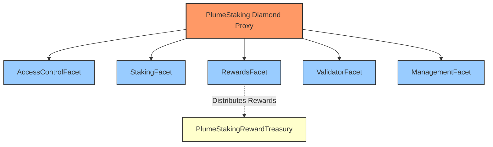

**Facet Responsibilities:**
- **AccessControlFacet**: OpenZeppelin AccessControl implementation
- **StakingFacet**: stake(), unstake(), withdraw(), restake(), restakeRewards()
- **RewardsFacet**: Reward calculation, distribution, treasury integration
- **ValidatorFacet**: Validator lifecycle, slashing, commission management
- **ManagementFacet**: System parameters, admin functions

#### Treasury System

The protocol separates fund custody from staking logic using a dedicated treasury contract:

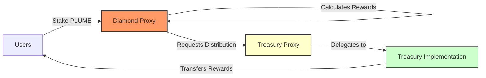

**Treasury Implementation:**
- UUPS upgradeable proxy pattern
- Role-based access (only Diamond can distribute)
- Multi-token support
- Direct transfers to users

### Core Concepts

#### Staking Mechanism

Staking lifecycle:

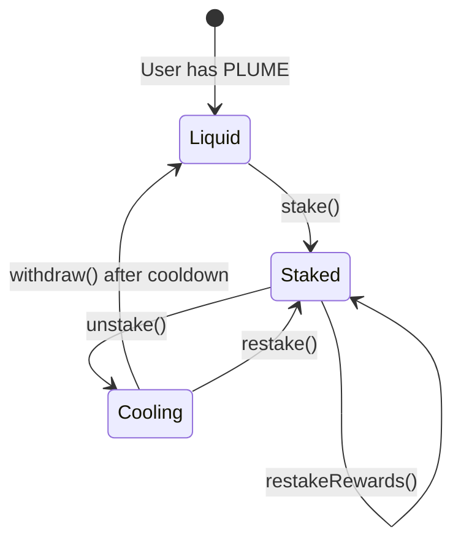

**Implementation Details:**
- Global minimum stake amount check
- Per-validator capacity limits
- Validator must be active and not slashed
- stake() accepts msg.value, stakeOnBehalf() allows third-party staking
- Cooldown period prevents immediate withdrawals after unstaking

#### Reward Calculation System

The reward system uses a sophisticated checkpoint-based mechanism to handle variable rates, validator-specific multipliers, and commission deductions.

##### Core Components

**1. Validator-Level Rate Tracking**
The system tracks reward rates exclusively at the validator level. When a reward token is added or its rate is updated via `setRewardRates`, a rate checkpoint is created for *every* active validator. This ensures all reward calculations are based on a specific validator's rate history.

**2. Checkpoint Structure**
```solidity
struct RateCheckpoint {
    uint256 timestamp;       // When rate changed
    uint256 rate;           // New rate (tokens/second/staked token)
    uint256 cumulativeIndex; // Accumulated rewards up to this point
}
```

**3. Key Storage Mappings**
- `validatorRewardRateCheckpoints[validatorId][token]`: Rate history
- `validatorCommissionCheckpoints[validatorId]`: Commission history
- `validatorRewardPerTokenCumulative[validatorId][token]`: Accumulated rewards
- `userValidatorRewardPerTokenPaid[user][validatorId][token]`: User's last settled index

##### Calculation Algorithm

**Step 1: Time Segmentation**

When calculating rewards, the system identifies all rate change points:

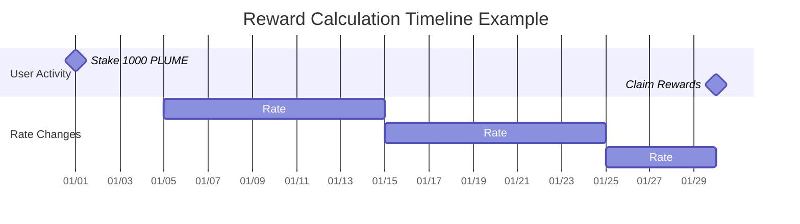

**Step 2: Segment Processing**

For each time segment between checkpoints:

```
Segment Gross Reward = Stake × Rate × Duration
Segment Commission = Gross Reward × Commission Rate
Segment Net Reward = Gross Reward - Commission
```

**Step 3: Mathematical Formula**

For a user with stake `S` over time period `[t₀, t₁]`:

```
Total Net Reward = Σᵢ [Sᵢ × Rᵢ × Δtᵢ × (1 - Cᵢ)]

Where:
- i = each time segment
- Sᵢ = stake amount in segment i
- Rᵢ = reward rate in segment i
- Δtᵢ = duration of segment i
- Cᵢ = commission rate in segment i
```

##### Detailed Calculation Example

**Setup:**
- User stakes 1,000 PLUME on January 1st
- REWARD_TOKEN with 18 decimals
- All rates use REWARD_PRECISION = 1e18

**Timeline:**

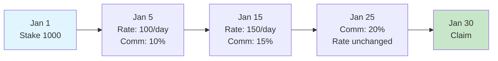

**Checkpoint Creation:**

```javascript
// Reward Rate Checkpoints
Checkpoint 0: { 
    timestamp: Jan 5, 
    rate: 100e18,     // 100 tokens/day/staked token
    cumulativeIndex: 0 
}
Checkpoint 1: { 
    timestamp: Jan 15, 
    rate: 150e18, 
    cumulativeIndex: 1000e18  // Accumulated from previous segment
}

// Commission Checkpoints
Checkpoint 0: { timestamp: Jan 5,  rate: 0.1e18 }   // 10%
Checkpoint 1: { timestamp: Jan 15, rate: 0.15e18 }  // 15%
Checkpoint 2: { timestamp: Jan 25, rate: 0.2e18 }   // 20%
```

**Calculation Process:**

| Segment | Duration | Rate | Stake | Gross Rewards | Commission | Net Rewards |
|---------|----------|------|-------|---------------|------------|-------------|
| Jan 1-5 | 4 days | 0 | 1,000 | 0 | 0% | 0 |
| Jan 5-15 | 10 days | 100/day | 1,000 | 1,000,000 | 10% (100,000) | 900,000 |
| Jan 15-25 | 10 days | 150/day | 1,000 | 1,500,000 | 15% (225,000) | 1,275,000 |
| Jan 25-30 | 5 days | 150/day | 1,000 | 750,000 | 20% (150,000) | 600,000 |
| **Total** | | | | **3,250,000** | **475,000** | **2,775,000** |

##### Implementation Details

**1. Finding Relevant Checkpoints (Binary Search)**

```solidity
function findCheckpointIndex(checkpoints, timestamp) {
    uint256 low = 0;
    uint256 high = checkpoints.length - 1;
    
    while (low <= high) {
        uint256 mid = (low + high) / 2;
        if (checkpoints[mid].timestamp <= timestamp) {
            if (mid == high || checkpoints[mid + 1].timestamp > timestamp) {
                return mid;  // Found the right checkpoint
            }
            low = mid + 1;
        } else {
            high = mid - 1;
        }
    }
    return 0;
}
```

> *Note: The function above is a simplified example for illustrative purposes. The actual implementation in `src/lib/PlumeRewardLogic.sol` is more robust and uses specialized functions such as `findRewardRateCheckpointIndexAtOrBefore` and `findCommissionCheckpointIndexAtOrBefore` to handle edge cases.*

**2. Time Segment Generation**

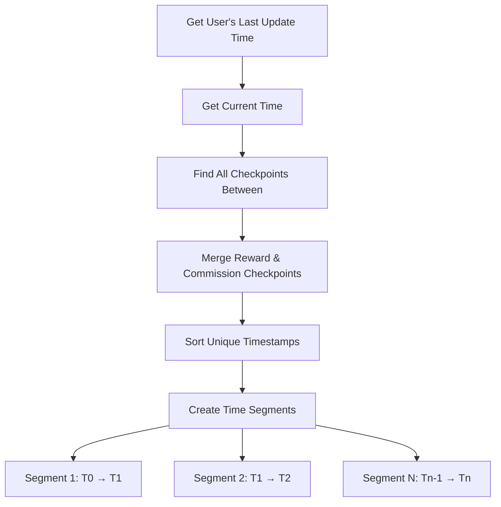

**3. Per-Segment Calculation Flow**

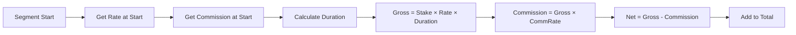

**4. Precision Handling**

All calculations use REWARD_PRECISION (1e18) to maintain accuracy:

```solidity
// Rate stored as tokens per second with 1e18 precision
uint256 ratePerSecond = 100e18 / 86400;  // 100 tokens/day

// Calculation preserves precision
uint256 rewardPerToken = duration * ratePerSecond;
uint256 grossReward = (stake * rewardPerToken) / REWARD_PRECISION;
```

##### Edge Cases

**1. Validator Slashing**
- Rewards stop accruing at slashedAtTimestamp
- Existing unclaimed rewards remain claimable
- No new rewards after slash time

**2. Mid-Stake Rate Changes**
- New stakers start earning from their stake timestamp
- Rate changes don't affect past earnings
- Checkpoint index tracking prevents double-claiming

**3. Zero Rates**
- Supported for pausing rewards
- Checkpoints still created for consistency
- Previous rewards remain claimable

##### Gas Optimization

**1. Checkpoint Efficiency**
- Binary search reduces lookup from O(n) to O(log n)
- Checkpoints only created on rate changes
- User checkpoint indices tracked to avoid re-processing

**2. Batch Operations**
- `claimAll()` processes all tokens in one transaction
- Validator commission settled across all tokens simultaneously
- Single update for all user rewards per validator

This checkpoint-based system ensures perfect accuracy regardless of when users claim, while maintaining gas efficiency through optimized data structures and algorithms.

#### Reward Token Lifecycle & Historical Tokens

Plume supports adding and removing reward tokens without disrupting historical reward accuracy:

- **Adding a token** (`addRewardToken`) immediately pushes the token into `rewardTokens`, marks it `isRewardToken=true`, and creates an *initial* reward-rate checkpoint for **every validator** at the chosen `initialRate`.  The token is also appended to the immutable `historicalRewardTokens` list.
- **Removing a token** (`removeRewardToken`) does **not** delete checkpoints. Instead it:
  1. Records `tokenRemovalTimestamps[token] = block.timestamp` so future calculations cap at this moment.
  2. Forces a final **zero-rate checkpoint** for each validator, guaranteeing no further accrual.
  3. Leaves all historical checkpoints intact so users can still claim previously-earned rewards.
- Users can therefore continue to claim even after a token is no longer active.  View/claim helpers automatically fall back to historical calculations when `isRewardToken[token] == false` but `isHistoricalRewardToken[token] == true`.
- Administrative helpers exist to *manually* add or remove entries from the historical list (`addHistoricalRewardToken`, `removeHistoricalRewardToken`).  These functions were used to migrate the contract state from v1 to v2 version. 
- The events `HistoricalRewardTokenAdded` / `HistoricalRewardTokenRemoved` capture these changes for off-chain indexers.

#### Slashing Mechanism

Slashing is driven by **unanimous votes** from *all other active validators* and can execute in two ways:

1. **Auto-Slash (preferred)** – when the last required validator casts its vote via `voteToSlashValidator`, the contract immediately calls the internal `_performSlash` and the validator is slashed in the *same* transaction. No privileged role is needed.
2. **Timed Slash** – if unanimity was reached but the auto-slash failed (e.g., a re-org removed a vote) anyone with `TIMELOCK_ROLE` may call `slashValidator` to perform the slash once the vote set is valid.

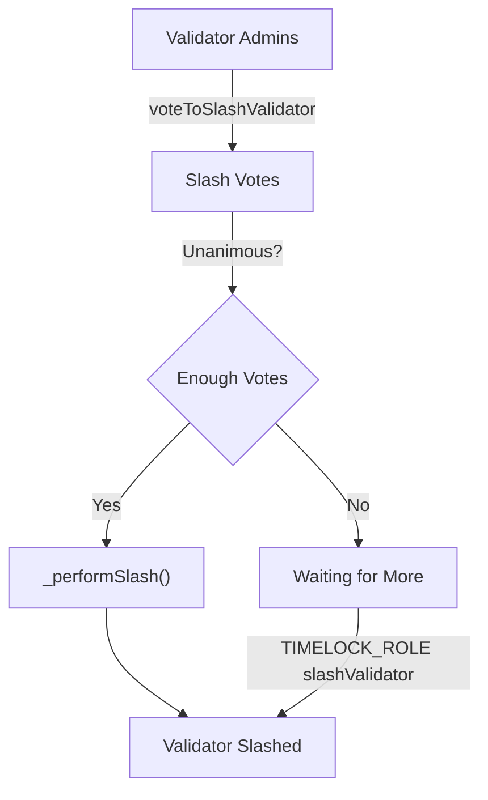

Key details:
- **Vote Expiry:** Each vote carries an `expiration` ≤ `maxSlashVoteDurationInSeconds`. Expired votes are cleaned up automatically by `_cleanupExpiredVotes` (invoked in voting & slashing paths).
- **Eligibility:** Only *active & non-slashed* validators may vote; a validator cannot vote to slash itself.
- **Cooldown Safety:** Admins must ensure `cooldownInterval > maxSlashVoteDuration` (enforced by `setCooldownInterval`). This guarantees users can always withdraw if a slash fails to pass.
- **Commission & Rewards:** Upon slashing, all stake & cooling amounts are burned; reward & commission accrual stops at `slashedAtTimestamp`.
- **Post-Slash Cleanup:** Users cannot recover losses, so admins use `adminClearValidatorRecord` / `adminBatchClearValidatorRecords` to erase orphaned state.

##### Effects of a Successful Slash

When `_performSlash` runs, the contract immediately:

1. **Burns 100 % of the validator’s stake and cooling balances.**  Both `validatorTotalStaked` and `validatorTotalCooling` are zeroed and the global aggregates (`totalStaked`, `totalCooling`) are reduced accordingly.
2. **Marks the validator as `slashed = true` and `active = false`.**  A `slashedAtTimestamp` is stored; reward logic caps accrual at this timestamp for all future calculations.
3. **Stops Reward & Commission Accrual.**  Reward‐rate calculations reference `slashedAtTimestamp`, so no new rewards or commission can accumulate after the slash block.
4. **Clears the stakers list and voting records** to prevent further interactions or double-slashing.
5. **Emits `ValidatorSlashed` and `ValidatorStatusUpdated` events** with the total stake+cooling amount burned so off-chain indexers can reconcile supply changes.

After these state changes, affected users must rely on the admin cleanup functions to remove now-irrecoverable records tied to the slashed validator.

#### Commission System

Validator commission flow:

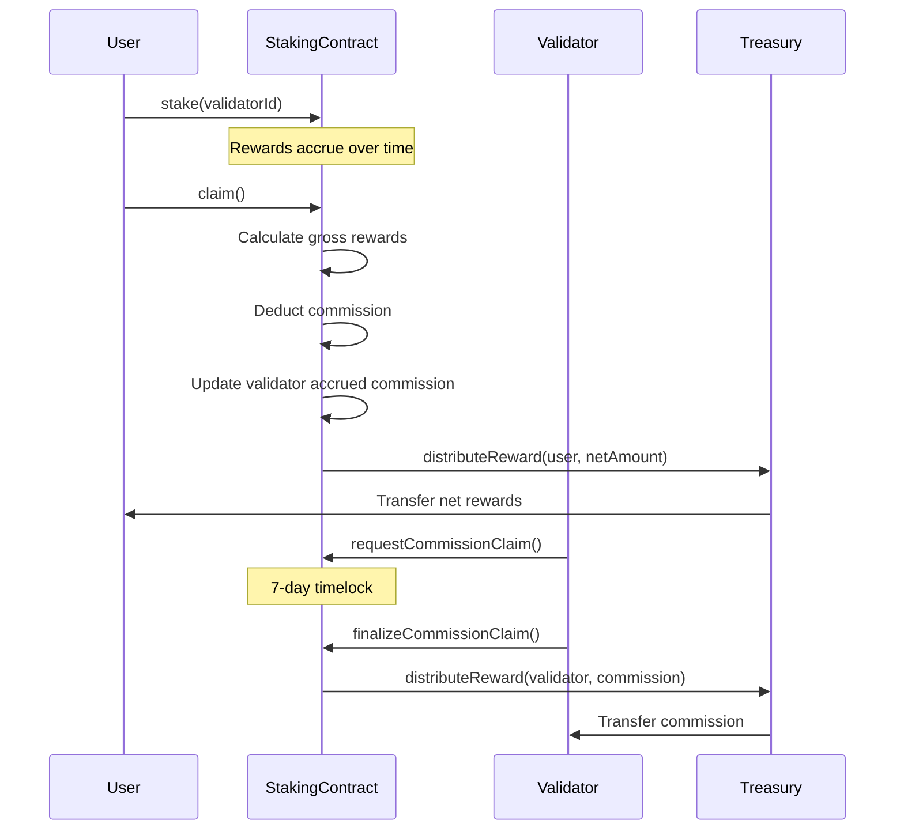

**Implementation:**
- Each validator keeps its **own** commission checkpoint history.  To defend against unbounded growth:
  •  `setMaxCommissionCheckpoints` caps the length (default 500).  Attempts to exceed revert with `MaxCommissionCheckpointsExceeded`.<br>  •  Admins can **prune** old data via `pruneCommissionCheckpoints` / `pruneRewardRateCheckpoints` (gas-heavy, irreversible).  Successful pruning emits `CommissionCheckpointsPruned` or `RewardRateCheckpointsPruned` respectively.
- 7-day timelock on withdrawals (COMMISSION_CLAIM_TIMELOCK)
- forceSettleValidatorCommission() for manual settlement

**Force Settlement Mechanism:**

```solidity
function forceSettleValidatorCommission(uint16 validatorId) external
```

- Permissionless function to trigger commission settlement
- Iterates all reward tokens and calculates accrued commission
- Updates validator's commission balance
- Gas costs borne by caller
- Useful before commission rate changes or validator updates

### Contract Reference

#### StakingFacet

Core staking operations and user balance management.

##### Write Functions

| Function | Description | Requirements |
|----------|-------------|--------------|
| `stake(uint16 validatorId)` | Stake PLUME tokens to a validator | - Payable (msg.value = stake amount)<br>- Validator must be active<br>- Validator not slashed<br>- Amount ≥ minimum stake<br>- Validator has capacity |
| `stakeOnBehalf(uint16 validatorId, address staker)` | Stake PLUME for another user | Same as stake() |
| `unstake(uint16 validatorId)` | Unstake all tokens from a validator | - Has stake with validator<br>- Validator not slashed<br>- Starts cooldown period |
| `unstake(uint16 validatorId, uint256 amount)` | Unstake specific amount | - Has sufficient stake<br>- Validator not slashed<br>- Starts cooldown period |
| `restake(uint16 validatorId, uint256 amount)` | Move cooling tokens back to staked | - Has cooling tokens<br>- Validator active<br>- Validator not slashed |
| `withdraw()` | Withdraw tokens after cooldown | - Has completed cooldowns<br>- Automatically skips slashed validators |
| `restakeRewards(uint16 validatorId)` | Claim and restake PLUME rewards | - Has PLUME rewards<br>- PLUME token must be an active reward token<br>- Transfers rewards from Treasury to back new stake<br>- Validator active<br>- Validator not slashed |

##### View Functions

| Function | Returns | Description |
|----------|---------|-------------|
| `amountStaked()` | `uint256` | Total PLUME staked by caller |
| `amountCooling()` | `uint256` | Total PLUME in cooldown (excludes slashed validators) |
| `amountWithdrawable()` | `uint256` | PLUME ready to withdraw |
| `stakeInfo(address user)` | `StakeInfo struct` | Complete staking information for user |
| `totalAmountStaked()` | `uint256` | System-wide staked PLUME |
| `totalAmountCooling()` | `uint256` | System-wide cooling PLUME |
| `totalAmountWithdrawable()` | `uint256` | System-wide withdrawable PLUME |
| `getUserValidatorStake(address, uint16)` | `uint256` | User's stake with specific validator |
| `getUserCooldowns(address)` | `CooldownEntry[]` | Active cooldowns (excludes slashed validators) |

#### RewardsFacet

Reward token management and distribution system.

##### Write Functions

| Function | Description | Access Control |
|----------|-------------|----------------|
| `setTreasury(address treasury)` | Set reward treasury address | REWARD_MANAGER_ROLE |
| `addRewardToken(address token, uint256 initialRate, uint256 maxRate)` | Add new reward token and set its initial rate for all validators | REWARD_MANAGER_ROLE |
| `removeRewardToken(address token)` | Remove reward token and create a final zero-rate checkpoint | REWARD_MANAGER_ROLE |
| `setRewardRates(address[] tokens, uint256[] rates)` | Set emission rates for multiple tokens, creating new checkpoints for all validators | REWARD_MANAGER_ROLE |
| `setMaxRewardRate(address token, uint256 rate)` | Set maximum rate limit for a token | REWARD_MANAGER_ROLE |
| `claim(address token, uint16 validatorId)` | Claim rewards for a specific token from a specific validator | Public |
| `claim(address token)` | Claim from all validators | Public |
| `claimAll()` | Claim all tokens from all validators | Public |

##### View Functions

| Function | Returns | Description |
|----------|---------|-------------|
| `earned(address user, address token)` | `uint256` | Total accumulated rewards across validators |
| `getClaimableReward(address user, address token)` | `uint256` | Currently claimable amount |
| `getRewardTokens()` | `address[]` | List of reward tokens |
| `getMaxRewardRate(address token)` | `uint256` | Maximum allowed rate |
| `getRewardRate(address token)` | `uint256` | Current emission rate |
| `tokenRewardInfo(address token)` | `RewardInfo struct` | Detailed token information |
| `getTreasury()` | `address` | Current treasury address |
| `getPendingRewardForValidator(address, uint16, address)` | `uint256` | Pending rewards for specific validator |

#### ValidatorFacet

Validator lifecycle management and slashing operations.

##### Write Functions

| Function | Description | Access Control |
|----------|-------------|----------------|
| `addValidator(uint16 validatorId, uint256 commission, address l2AdminAddress, ... , uint256 maxCapacity)` | Register new validator | VALIDATOR_ROLE |
| `setValidatorCapacity(uint16, uint256)` | Update staking capacity | VALIDATOR_ROLE |
| `setValidatorStatus(uint16, bool)` | Activate/deactivate validator | VALIDATOR_ROLE |
| `setValidatorCommission(uint16 validatorId, uint256 newCommission)` | Update commission rate for a validator | Validator Admin |
| `setValidatorAddresses(uint16, ...)` | Update admin/withdraw addresses. Admin changes initiate a two-step transfer. | Validator Admin |
| `acceptAdmin(uint16 validatorId)` | Accept pending admin role and complete two-step validator admin transfer | Pending Admin |
| `requestCommissionClaim(uint16 validatorId, address token)` | Start commission claim timelock for a specific token | Validator Admin |
| `finalizeCommissionClaim(uint16 validatorId, address token)` | Complete commission claim after timelock | Validator Admin |
| `voteToSlashValidator(uint16, uint256)` | Vote to slash another validator | Validator Admin |
| `slashValidator(uint16)` | Execute slashing if unanimity already reached (fallback) | TIMELOCK_ROLE |
| `cleanupExpiredVotes(uint16)` | Remove expired votes and return current valid count | Public |
| `forceSettleValidatorCommission(uint16)` | Manually settle accrued commission | Public |

##### View Functions

| Function | Returns | Description |
|----------|---------|-------------|
| `getValidatorInfo(uint16)` | `ValidatorInfo struct` | Complete validator details including slash status |
| `getValidatorStats(uint16)` | `ValidatorStats struct` | Key metrics for validator |
| `getUserValidators(address)` | `uint16[]` | Validators user has staked with (excludes slashed) |
| `getAccruedCommission(uint16, address)` | `uint256` | Unclaimed commission amount |
| `getValidatorsList()` | `ValidatorData[]` | All validators with core data |
| `getActiveValidatorCount()` | `uint256` | Number of active, non-slashed validators |
| `getSlashVoteCount(uint16)` | `uint256` | Current votes to slash validator |

#### ManagementFacet

System parameter configuration and administrative functions.

##### Write Functions

| Function | Description | Access Control |
|----------|-------------|----------------|
| `setMinStakeAmount(uint256)` | Set minimum stake requirement | ADMIN_ROLE |
| `setCooldownInterval(uint256)` | Set unstaking cooldown duration | ADMIN_ROLE |
| `adminWithdraw(address, uint256, address)` | Emergency fund withdrawal | TIMELOCK_ROLE |
| `setMaxSlashVoteDuration(uint256)` | Set vote expiration time | ADMIN_ROLE |
| `setMaxAllowedValidatorCommission(uint256)` | Set system-wide commission cap | ADMIN_ROLE |
| `adminClearValidatorRecord(address, uint16)` | Clear slashed validator records | ADMIN_ROLE |
| `adminBatchClearValidatorRecords(address[], uint16)` | Batch clear records | ADMIN_ROLE |
| `setMaxCommissionCheckpoints(uint16)` | Set max commission checkpoints per validator | ADMIN_ROLE |
| `setMaxValidatorPercentage(uint256)` | Set max % of total stake a validator can hold | ADMIN_ROLE |
| `pruneCommissionCheckpoints(uint16, uint256)` | Prune oldest commission checkpoints | ADMIN_ROLE |
| `pruneRewardRateCheckpoints(uint16, address, uint256)` | Prune oldest reward rate checkpoints | ADMIN_ROLE |
| `addHistoricalRewardToken(address)` | Add token to historical reward list (non-active) | ADMIN_ROLE |
| `removeHistoricalRewardToken(address)` | Remove token from historical reward list | ADMIN_ROLE |

##### View Functions

| Function | Returns | Description |
|----------|---------|-------------|
| `getMinStakeAmount()` | `uint256` | Current minimum stake |
| `getCooldownInterval()` | `uint256` | Current cooldown duration |

#### AccessControlFacet

OpenZeppelin AccessControl implementation.

##### Initialization

```solidity
// Must be called after facet deployment
accessControlFacet.initializeAccessControl()
```

Grants DEFAULT_ADMIN_ROLE and ADMIN_ROLE to caller, sets up role hierarchy.

### Events Reference

#### Staking Events

| Event | Emitted When | Parameters |
|-------|--------------|------------|
| `Staked` | User stakes tokens | `user`, `validatorId`, `amount`, `fromCooling`, `fromParked`, `pendingRewards` |
| `StakedOnBehalf` | Staking for another user | `sender`, `staker`, `validatorId`, `amount` |
| `Unstaked` | Unstaking initiated | `user`, `validatorId`, `amount` |
| `CooldownStarted` | Cooldown period begins | `staker`, `validatorId`, `amount`, `cooldownEnd` |
| `Withdrawn` | Tokens withdrawn after cooldown | `staker`, `amount` |
| `RewardsRestaked` | Rewards claimed and restaked | `staker`, `validatorId`, `amount` |

#### Reward Events

| Event | Emitted When | Parameters |
|-------|--------------|------------|
| `RewardTokenAdded` | New reward token registered | `token` |
| `RewardTokenRemoved` | Reward token removed | `token` |
| `RewardRatesSet` | Emission rates updated | `tokens[]`, `rates[]` |
| `MaxRewardRateUpdated` | Maximum rate changed | `token`, `newMaxRate` |
| `RewardRateCheckpointCreated` | Rate checkpoint created | `token`, `validatorId`, `rate`, `timestamp`, `index`, `cumulativeIndex` |
| `RewardClaimed` | User claims rewards | `user`, `token`, `amount` |
| `RewardClaimedFromValidator` | Rewards claimed from specific validator | `user`, `token`, `validatorId`, `amount` |
| `TreasurySet` | Treasury address updated | `treasury` |

#### Validator Events

| Event | Emitted When | Parameters |
|-------|--------------|------------|
| `ValidatorAdded` | New validator registered | `validatorId`, `commission`, `l2Admin`, `l2Withdraw`, `l1Val`, `l1Acc`, `l1AccEvm` |
| `ValidatorUpdated` | Validator details modified | Same as ValidatorAdded |
| `ValidatorStatusUpdated` | Active/slash status changed | `validatorId`, `active`, `slashed` |
| `ValidatorCommissionSet` | Commission rate updated | `validatorId`, `oldCommission`, `newCommission` |
| `ValidatorAddressesSet` | Admin/withdraw addresses changed | All old and new addresses |
| `ValidatorCapacityUpdated` | Capacity limit changed | `validatorId`, `oldCapacity`, `newCapacity` |
| `ValidatorCommissionClaimed` | Commission withdrawn | `validatorId`, `token`, `amount` |
| `SlashVoteCast` | Vote to slash submitted | `targetValidatorId`, `voterValidatorId`, `voteExpiration` |
| `ValidatorSlashed` | Validator slashed | `validatorId`, `slasher`, `penaltyAmount` |
| `ValidatorCommissionCheckpointCreated` | Commission checkpoint created | `validatorId`, `rate`, `timestamp` |

#### Administrative Events

| Event | Emitted When | Parameters |
|-------|--------------|------------|
| `MinStakeAmountSet` | Minimum stake updated | `amount` |
| `CooldownIntervalSet` | Cooldown duration updated | `interval` |
| `AdminWithdraw` | Emergency withdrawal | `token`, `amount`, `recipient` |
| `MaxSlashVoteDurationSet` | Vote expiration updated | `duration` |
| `MaxAllowedValidatorCommissionSet` | Commission cap updated | `oldMaxRate`, `newMaxRate` |
| `AdminClearedSlashedStake` | Slashed stake cleared by admin | `user`, `slashedValidatorId`, `amountCleared` |
| `AdminClearedSlashedCooldown` | Slashed cooldown cleared by admin | `user`, `slashedValidatorId`, `amountCleared` |
| `MaxCommissionCheckpointsSet` | Max commission checkpoints updated | `newLimit` |
| `CommissionCheckpointsPruned` | Old commission checkpoints pruned | `validatorId`, `count` |
| `RewardRateCheckpointsPruned` | Old reward rate checkpoints pruned | `validatorId`, `token`, `count` |
| `HistoricalRewardTokenAdded` | Token added to historical list | `token` |
| `HistoricalRewardTokenRemoved` | Token removed from historical list | `token` |
| `AdminProposed` | New validator admin proposed | `validatorId`, `proposedAdmin` |

### Errors Reference

#### Critical Errors

| Error | Thrown When |
|-------|-------------|
| `ValidatorDoesNotExist(uint16)` | Invalid validator ID |
| `ValidatorInactive(uint16)` | Validator not active |
| `ValidatorAlreadySlashed(uint16)` | Validator already slashed |
| `ActionOnSlashedValidatorError(uint16)` | Operation on slashed validator |
| `NotValidatorAdmin(address)` | Caller not validator admin |
| `Unauthorized(address, bytes32)` | Missing required role |
| `TreasuryNotSet()` | Treasury not configured |

#### Staking Errors

| Error | Thrown When |
|-------|-------------|
| `InvalidAmount(uint256)` | Zero or invalid amount |
| `NoActiveStake()` | No stake to unstake |
| `StakeAmountTooSmall(uint256, uint256)` | Below minimum stake |
| `InsufficientFunds(uint256, uint256)` | Insufficient balance |
| `CooldownPeriodNotEnded()` | Cooldown not complete |
| `NoRewardsToRestake()` | No rewards available |
| `ExceedsValidatorCapacity(uint16, uint256, uint256, uint256)` | Over validator capacity |
| `ValidatorPercentageExceeded()` | Over 33% total stake |

#### Commission/Reward Errors

| Error | Thrown When |
|-------|-------------|
| `CommissionExceedsMaxAllowed(uint256, uint256)` | Commission > max allowed |
| `InvalidMaxCommissionRate(uint256, uint256)` | Max rate > 50% |
| `PendingClaimExists(uint16, address)` | Claim already pending |
| `NoPendingClaim(uint16, address)` | No claim to finalize |
| `ClaimNotReady(uint16, address, uint256)` | Timelock not passed |
| `TokenDoesNotExist(address)` | Unknown reward token |
| `RewardRateExceedsMax()` | Rate > max allowed |

#### Slashing Errors

| Error | Thrown When |
|-------|-------------|
| `SlashVoteDurationTooLong()` | Vote expiration > max |
| `CannotVoteForSelf()` | Self-voting attempt |
| `AlreadyVotedToSlash(uint16, uint16)` | Duplicate vote |
| `UnanimityNotReached(uint256, uint256)` | Missing votes |
| `SlashVoteExpired(uint16, uint16)` | Vote expired |
| `CooldownTooShortForSlashVote(uint256, uint256)` | cooldownInterval ≤ maxSlashVoteDuration |
| `SlashVoteDurationTooLongForCooldown(uint256, uint256)` | Proposed vote duration ≥ cooldownInterval |
| `SlashVoteDurationExceedsCommissionTimelock(uint256, uint256)` | Proposed vote duration ≥ commission timelock |
| `NotPendingAdmin(address,uint16)` | Caller tries to accept admin without being the pending admin |
| `NoPendingAdmin(uint16)` | acceptAdmin called with no pending admin |

See PlumeErrors.sol for complete list.

### Constants and Roles

#### System Roles

| Role | Purpose | Key Permissions |
|------|---------|-----------------|
| `ADMIN_ROLE` | System administration | - Manage all other roles<br>- Set system parameters<br>- Emergency functions<br>- Clear slashed records |
| `UPGRADER_ROLE` | Contract upgrades | - Execute diamondCut<br>- Upgrade facets |
| `VALIDATOR_ROLE` | Validator management | - Add validators<br>- Set capacities<br>- Update statuses |
| `REWARD_MANAGER_ROLE` | Reward configuration | - Set reward rates<br>- Manage tokens<br>- Configure treasury |
| `TIMELOCK_ROLE` | Time-sensitive operations | - Execute slashing<br>- Set cooldown interval |

#### System Constants

| Constant | Value | Usage |
|----------|-------|--------|
| `PLUME_NATIVE` | 0xEeeeeEeeeEeEeeEeEeEeeEEEeeeeEeeeeeeeEEeE | Native PLUME token address |
| `REWARD_PRECISION` | 1e18 | Precision for rate calculations |
| `COMMISSION_CLAIM_TIMELOCK` | 7 days | Validator commission withdrawal delay |
| `STORAGE_SLOT` | keccak256("plume.staking.storage") | Diamond storage location |

---

## Testing

### Running Tests
The core test suite can be run using the following Forge command, which specifically targets the `PlumeStakingDiamond` tests with high verbosity:

```bash
forge test --match-contract PlumeStakingDiamond  -vvvv --via-ir
```

### Gas Considerations

**Notice on Loop Operations:** The PlumeStaking contract's design accounts for the current operational scale. At present, the system operates with 10 validators and one primary reward token. As there are no immediate plans to scale to hundreds of validators or tens of reward tokens, functions that loop through all validators or reward tokens are computationally safe and are not expected to exceed block gas limits under these conditions. Developers should remain mindful of these looping patterns if the system's scale significantly increases in the future.

---

## Spin and Raffle Contracts


More detailed info is available [here](SPIN.md).


### Environment Setup

`.env` configuration:

```bash
# Network
RPC_URL="https://rpc.plume.org"
PRIVATE_KEY=<DEPLOY_WALLET_PRIVATE_KEY>

# Contract Addresses (for upgrades)
SPIN_PROXY_ADDRESS=<NEEDED_FOR_UPGRADE>
RAFFLE_PROXY_ADDRESS=<NEEDED_FOR_UPGRADE>

# Supra Oracle
SUPRA_ROUTER_ADDRESS=0xE1062AC81e76ebd17b1e283CEed7B9E8B2F749A5
SUPRA_DEPOSIT_CONTRACT_ADDRESS=0x6DA36159Fe94877fF7cF226DBB164ef7f8919b9b
SUPRA_GENERATOR_CONTRACT_ADDRESS=0x8cC8bbE991d8B4371551B4e666Aa212f9D5f165e

# Utilities
DATETIME_ADDRESS=0x06a40Ec10d03998634d89d2e098F079D06A8FA83
BLOCKSCOUT_URL=https://explorer.plume.org/api?
```

### Build Instructions

```bash
forge clean && forge build --via-ir --build-info
```

### Deployment Guide

Deploy Spin and Raffle contracts with Supra whitelisting:

```bash
source .env && forge script script/DeploySpinRaffleContracts.s.sol \
    --rpc-url https://rpc.plume.org \
    --broadcast \
    --via-ir
```
Save proxy addresses from deployment output for upgrades.

### Upgrade Process

```bash
# Spin Contract
source .env && forge script script/UpgradeSpinContract.s.sol \
    --rpc-url https://rpc.plume.org \
    --broadcast \
    --via-ir

# Raffle Contract
source .env && forge script script/UpgradeRaffleContract.s.sol \
    --rpc-url https://rpc.plume.org \
    --broadcast \
    --via-ir
```

### Launch Steps

```solidity
// 1. Configure Raffle Prizes
raffle.addPrize(prizeId, prizeDetails);

// 2. Set Campaign Start Date (Spin)
spin.setCampaignStartDate(startTimestamp);

// 3. Enable Spin
spin.setEnabledSpin(true);
```

---

*This documentation is maintained alongside the smart contracts. For the latest updates, please refer to the repository.*


### SPIN.md

# Daily Spin & Raffle Contracts

> [!NOTE]
> **The Daily Spin is now live on Plume!**
> Try it out here: [https://portal.plume.org/daily-spin](https://portal.plume.org/daily-spin)

This document provides a technical overview of the `Spin.sol` and `Raffle.sol` smart contracts, which together create a gamified daily spin and raffle system.

## Table of Contents
1.  [High-Level Overview](#high-level-overview)
2.  [The Spin Contract (`Spin.sol`)](#1-the-spin-contract-spin.sol)
    -   [Spinning Process](#spinning-process)
    -   [Reward Determination Logic](#reward-determination-logic)
    -   [Daily Streak Mechanic](#daily-streak-mechanic)
    -   [`Spin.sol` Technical Reference](#spin.sol-technical-reference)
3.  [The Raffle Contract (`Raffle.sol`)](#2-the-raffle-contract-raffle.sol)
    -   [Raffle Process](#raffle-process)
    -   [Multi-Winner Selection](#multi-winner-selection)
    -   [Claiming a Prize](#claiming-a-prize-multi-winner-aware)
    -   [`Raffle.sol` Technical Reference](#raffle.sol-technical-reference)

## High-Level Overview

The daily spin is a feature where users pay a fee to spin a virtual wheel once per day for a chance to win various rewards, including raffle tickets. These tickets can then be used in a separate raffle system to win larger prizes. The system is built around two main contracts, `Spin.sol` and `Raffle.sol`, and uses the Supra oracle for verifiable on-chain randomness.

The overall process can be visualized as follows:

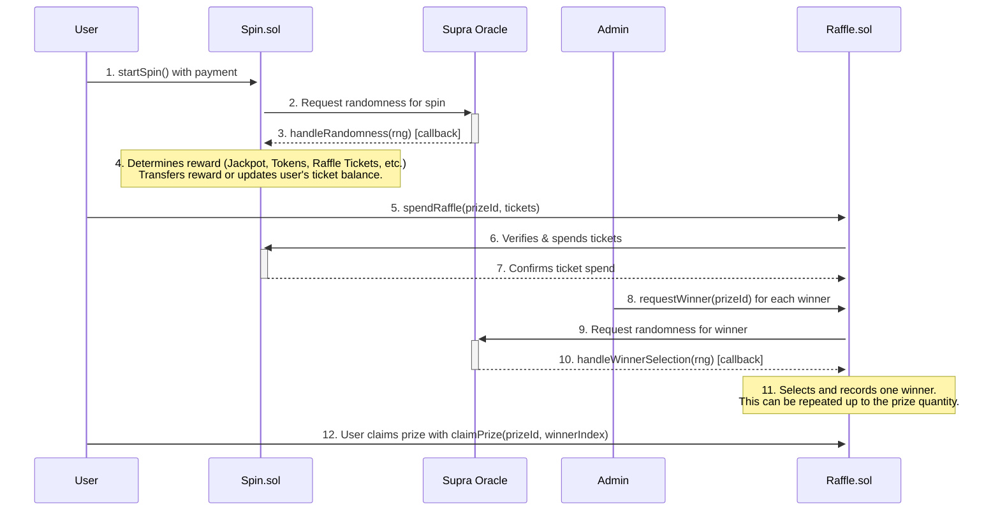

---

## 1. The Spin Contract (`Spin.sol`)

This is the core of the feature. It manages the user's ability to spin, the rewards, and the daily streak mechanic.

### Spinning Process

-   **Initiation**: A user calls the `startSpin()` function, sending a payment equal to the `spinPrice`.
-   **Cooldown**: The `canSpin` modifier ensures a user can only spin once per calendar day. This check is bypassed for whitelisted addresses. An attempt to spin more than once a day will result in an `AlreadySpunToday` error.
-   **Randomness**: The contract requests a random number from the Supra oracle. The spin is considered "pending" until the oracle returns a value.
-   **Reward Callback**: The Supra oracle calls `handleRandomness()` with the random number. This function is protected against re-entrancy and can only be called by the trusted oracle address.

### Reward Determination Logic

The `determineReward` function uses a multi-stage process to assign a reward based on a pseudo-random number (`rng`) from the Supra oracle. The `rng` is normalized to a value between 0 and 999,999.

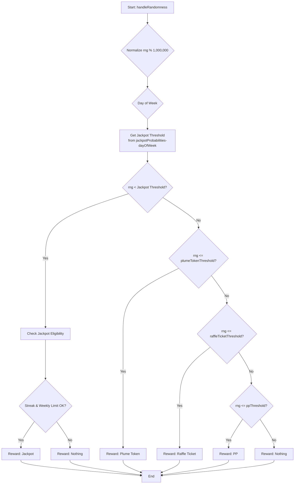

**Reward Tiers & Probabilities:**

| Reward Category | Probability Logic | Notes |
| :--- | :--- |:---|
| **Jackpot** | `rng < jackpotProbabilities-dayOfWeek` | The probability changes daily. Requires passing additional eligibility checks. |
| **Plume Token** | `rng <= plumeTokenThreshold` | A fixed amount of PLUME tokens. |
| **Raffle Ticket** | `rng <= raffleTicketThreshold` | Amount is `baseRaffleMultiplier * streakCount`. |
| **PP** | `rng <= ppThreshold` | A fixed amount of Plume Points. |
| **Nothing** | `rng > ppThreshold` | The default outcome if no other tier is met. |

**Jackpot Eligibility:**
Even if a user's `rng` falls within the jackpot range, they must meet two additional criteria:
1.  **Weekly Limit**: Only one jackpot can be won per campaign week across all users. The `lastJackpotClaimWeek` variable prevents further jackpot rewards within the same week. If this check fails, the reward defaults to "Nothing".
2.  **Streak Requirement**: The user's `streakCount` must be greater than or equal to `currentWeek + 2`. This means the required streak to be eligible for the jackpot increases as the campaign progresses. If this check fails, the reward also defaults to "Nothing".

### Daily Streak Mechanic

The contract calculates a user's streak of consecutive daily spins to reward consistent engagement. The core logic resides in the internal `_computeStreak` function.

- **Calculation**: The streak is based on calendar days, not 24-hour periods. This is achieved by dividing the `lastSpinTimestamp` and `block.timestamp` by `SECONDS_PER_DAY` (86,400) and comparing the resulting day numbers.
    - If `today == lastDaySpun`, the streak is unchanged.
    - If `today == lastDaySpun + 1`, the streak is incremented.
    - If `today > lastDaySpun + 1`, the streak is considered broken and resets to `1` (for the current day's spin).
- **Impact**: The `streakCount` directly multiplies the number of raffle tickets awarded, significantly increasing rewards for daily players. It is also a critical requirement for jackpot eligibility.

---
### `Spin.sol` Technical Reference

#### **Key Functions**
| Function | Description | Access |
|:---|:---|:---|
| `startSpin()` | User-callable function to initiate a spin by sending the required `spinPrice`. | Public |
| `handleRandomness(...)` | The callback function for the Supra oracle. Processes the spin result and updates user state. | `SUPRA_ROLE` |
| `spendRaffleTickets(...)` | Allows the `Raffle` contract to deduct tickets from a user's balance. | `raffleContract` only |
| `pause()` / `unpause()` | Pauses or unpauses the `startSpin` functionality. | `ADMIN_ROLE` |
| `adminWithdraw(...)` | Allows admin to withdraw PLUME tokens from the contract balance. | `ADMIN_ROLE` |
| `cancelPendingSpin(address user)` | Escape hatch to cancel a user's spin request that is stuck pending an oracle callback. | `ADMIN_ROLE` |
| `set...()` functions | A suite of functions (`setSpinPrice`, `setRaffleContract`, etc.) for configuring contract parameters. | `ADMIN_ROLE` |
| `currentStreak(address user)` | View function to get a user's current consecutive daily spin streak. | Public View |
| `getUserData(address user)` | View function that returns a comprehensive struct of a user's spin-related data. | Public View |
| `getWeeklyJackpot()` | View function to get the current week's jackpot prize and required streak. | Public View |

#### **Events**
-   `SpinRequested(uint256 indexed nonce, address indexed user)`: Emitted when a user successfully initiates a spin.
-   `SpinCompleted(address indexed walletAddress, string rewardCategory, uint256 rewardAmount)`: Emitted after the oracle callback is processed, detailing the reward.
-   `RaffleTicketsSpent(address indexed walletAddress, uint256 ticketsUsed, uint256 remainingTickets)`: Emitted when the `Raffle` contract spends a user's tickets.
-   `NotEnoughStreak(string message)`: Emitted if a user meets the odds for a jackpot but does not have the required streak count.
-   `JackpotAlreadyClaimed(string message)`: Emitted if a user meets the odds for a jackpot but it has already been won that week.

#### **Errors**
-   `AlreadySpunToday()`: Reverts if a user tries to spin more than once in a calendar day.
-   `CampaignNotStarted()`: Reverts if `startSpin()` is called before the campaign is enabled by an admin.
-   `InvalidNonce()`: Reverts if the `handleRandomness` callback receives a nonce that does not correspond to a pending spin.
-   `SpinRequestPending(address user)`: Reverts if a user tries to `startSpin()` while another spin is already pending an oracle callback.

---

## 2. The Raffle Contract (`Raffle.sol`)

This contract allows users to spend the raffle tickets they've earned from the Spin contract to enter drawings for prizes that can have **multiple winners**.

### Raffle Process

-   **Prize Management**: An admin can call `addPrize` and `editPrize`. A critical parameter is `quantity`, which defines how many winners a single prize can have.
-   **Entering a Raffle**: A user calls `spendRaffle(prizeId, ticketAmount)` to enter a specific prize drawing. The `Raffle` contract communicates with the `Spin` contract to verify the user has enough `raffleTicketsBalance` and then to deduct the spent amount.

### Multi-Winner Selection

Winner selection is an admin-initiated process that can be repeated for each available prize slot. It is designed to be fair and transparent.

1.  **Request**: The admin calls `requestWinner(prizeId)`. This can be done as long as the number of `winnersDrawn` is less than the prize `quantity`.
2.  **Oracle Callback**: The function requests a random number from the Supra oracle. The oracle's callback, `handleWinnerSelection`, receives the random number and performs a binary search on the ticket entries to find the winner.
3.  **Recording Winner**: The winner's details are stored in the `prizeWinners` array for that prize.
4.  **Repeat**: This process can be repeated by the admin until the `quantity` of winners for that prize has been drawn. Once `winnersDrawn == quantity`, the prize automatically becomes inactive.

### Claiming a Prize (Multi-Winner Aware)

-   **Individual Claims**: Each winner must call `claimPrize(prizeId, winnerIndex)` to claim their specific prize. Since a prize can have multiple winners, the `winnerIndex` (starting from 0) is used to identify which winning slot is being claimed.
-   **Independent Status**: Each winner's claim status is tracked independently. One user claiming their prize has no effect on the ability of other winners to claim theirs. The actual delivery of the prize is handled off-chain.

---
### `Raffle.sol` Technical Reference

#### Data Structures

**`Prize` Struct**
```solidity
struct Prize {
    string name;
    string description;
    uint256 value;
    uint256 endTimestamp;
    bool isActive;
    uint256 quantity;
    // --- Deprecated Fields ---
    address winner;
    uint256 winnerIndex;
    bool claimed;
}
```
> *Note: The `winner`, `winnerIndex`, and `claimed` fields on the `Prize` struct are deprecated and are no longer used in favor of the multi-winner `prizeWinners` mapping.*

**`Winner` Struct**
```solidity
struct Winner {
    address winnerAddress;
    uint256 winningTicketIndex;
    uint256 drawnAt;
    bool claimed;
}
```

#### **Key Functions**
| Function | Description | Access |
|:---|:---|:---|
| `spendRaffle(prizeId, ticketAmount)` | User-callable function to spend raffle tickets and enter a prize drawing. | Public |
| `requestWinner(prizeId)` | Initiates the winner selection process for a specific prize. | `ADMIN_ROLE` |
| `handleWinnerSelection(...)` | The callback from the Supra oracle. Finds and records a winner. | `SUPRA_ROLE` |
| `claimPrize(prizeId, winnerIndex)` | User-callable for a winner to claim their prize slot. | Public |
| `addPrize(...)` / `editPrize(...)` / `removePrize(...)` | Functions for managing prize details. | `ADMIN_ROLE` |
| `setPrizeActive(prizeId, active)` | Manually activates or deactivates a prize. | `ADMIN_ROLE` |
| `cancelWinnerRequest(prizeId)` | Escape hatch to cancel a pending VRF request for a winner drawing. | `ADMIN_ROLE` |
| `getPrizeDetails(...)` | View function to get all public details about a specific prize. | Public View |
| `getPrizeWinners(prizeId)` | View function to get an array of all the `Winner` structs for a prize. | Public View |
| `getUserWinnings(address user)` | View function to get an array of prize IDs that a specific user has won. | Public View |

#### **Events**
-   `PrizeAdded(uint256 indexed prizeId, string name)`: Emitted when a new prize is created.
-   `PrizeEdited(uint256 indexed prizeId, ...)`: Emitted when an existing prize is modified via `editPrize`.
-   `TicketSpent(address indexed user, uint256 indexed prizeId, uint256 tickets)`: Emitted when a user successfully spends tickets on a prize.
-   `WinnerRequested(uint256 indexed prizeId, uint256 indexed requestId)`: Emitted when an admin requests a winner to be drawn.
-   `WinnerSelected(uint256 indexed prizeId, address indexed winner, uint256 winningTicketIndex)`: Emitted when the oracle callback successfully selects and records a winner.
-   `PrizeClaimed(address indexed user, uint256 indexed prizeId, uint256 winnerIndex)`: Emitted when a winner successfully claims their prize.

#### **Errors**
-   `AllWinnersDrawn()`: Reverts if `requestWinner` is called after all available winner slots for a prize have been filled.
-   `EmptyTicketPool()`: Reverts if `requestWinner` is called for a prize that has no ticket entries.
-   `InsufficientTickets()`: Reverts if a user tries to spend more raffle tickets than they have.
-   `WinnerNotDrawn()`: Reverts if a user tries to claim a prize before the winner selection process is complete for that slot.
-   `NotAWinner()`: Reverts if a user tries to claim a prize they did not win.
-   `WinnerClaimed()`: Reverts if a winner tries to claim the same prize slot more than once.
-   `WinnerRequestPending(uint256 prizeId)`: Reverts if `requestWinner` is called for a prize that already has a pending VRF request.

