## SUMMARY OF FILE: contracts/plume/src/PlumeStaking.sol
### PlumeStaking Contract
The `PlumeStaking` contract is a proxy entry point for the Plume Staking system, inheriting functionalities from `SolidStateDiamond`. It handles the initialization of the staking system under specific parameters, and maintains control over configuration settings such as minimum stake amounts and validator commission limits.

#### Contract: PlumeStaking
This contract is part of the Plume system, built on a Diamond Proxy architecture. It serves as a central configuration point, setting parameters and ownership within the staking protocol.

#### Function: initializePlume
```solidity
function initializePlume(address initialOwner, uint256 minStake, uint256 cooldown, uint256 maxSlashVoteDuration, uint256 maxValidatorCommission) external virtual onlyOwner
```
This function is designed to initialize the Plume Staking contract with critical parameters required for its operation. These include the minimum stake amount, cooldown interval, and maximum slash vote duration. It also verifies validity of parameters such as the maximum validator commission rate. If the initial owner is different from the current owner, it transfers ownership accordingly. The function ensures that initialization occurs only once by checking an `initialized` flag.

#### Function: isInitialized
```solidity
function isInitialized() external view returns (bool)
```
This view function checks whether the staking system has been initialized. It returns a boolean based on the `initialized` status from storage.

#### Storage Variables 
- **$.initialized**: Indicates whether the contract has been initialized.
- **$.minStakeAmount**: Sets the minimum amount required to stake.
- **$.cooldownInterval**: Defines cooldown period before slash votes occur.
- **$.maxSlashVoteDurationInSeconds**: Limits the duration of slash votes.
- **$.maxAllowedValidatorCommission**: Caps validator commission rates to ensure fair practices.
- **$.maxCommissionCheckpoints**: Sets a default limit on commission checkpoints to 500.


## SUMMARY OF FILE: contracts/plume/src/facets/ValidatorFacet.sol
The `ValidatorFacet` Solidity contract manages validators, handling operations like adding, updating, commission management, capacity updates, and validator status.

### Contract Definition
- **Contract Name:** ValidatorFacet
- **Inherits:** ReentrancyGuardUpgradeable, OwnableInternal

### Functions

#### addValidator
- **Purpose:** Adds a new validator with configured commission and addresses.
- **Interface:** `function addValidator(uint16 validatorId, uint256 commission, address l2AdminAddress, address l2WithdrawAddress, string calldata l1ValidatorAddress, string calldata l1AccountAddress, address l1AccountEvmAddress, uint256 maxCapacity) external`
- **Summary:** Checks basic validations, updates mappings and emits `ValidatorAdded` event.

#### setValidatorCapacity
- **Purpose:** Updates the validator's staking capacity.
- **Interface:** `function setValidatorCapacity(uint16 validatorId, uint256 maxCapacity) external`
- **Summary:** Modifies maximum staking capacity and emits `ValidatorCapacityUpdated`.

#### setValidatorStatus
- **Purpose:** Changes the active status of a validator.
- **Interface:** `function setValidatorStatus(uint16 validatorId, bool newActiveStatus) external`
- **Summary:** Modifies active state, handles associated behaviors and rates, and emits `ValidatorStatusUpdated`.

#### setValidatorCommission
- **Purpose:** Updates the commission rate for a validator.
- **Interface:** `function setValidatorCommission(uint16 validatorId, uint256 newCommission) external`
- **Summary:** Checks and updates validator's commission, uses checkpointing for reward logic.

#### setValidatorAddresses
- **Purpose:** Updates validator-related addresses.
- **Interface:** `function setValidatorAddresses(uint16 validatorId, address newL2AdminAddress, address newL2WithdrawAddress, string calldata newL1ValidatorAddress, string calldata newL1AccountAddress, address newL1AccountEvmAddress) external`
- **Summary:** Manages address updates, validates inputs, and triggers `ValidatorAddressesSet`.

#### acceptAdmin
- **Purpose:** Allows a proposed admin to accept their role for a validator.
- **Interface:** `function acceptAdmin(uint16 validatorId) external nonReentrant`
- **Summary:** Finalizes the admin transfer initiated in `setValidatorAddresses`.

#### requestCommissionClaim
- **Purpose:** Initiates a commission claim, subject to time-lock.
- **Interface:** `function requestCommissionClaim(uint16 validatorId, address token) external`
- **Summary:** Handles initiation, ensures commission is settled up to time, and locks amount.

#### finalizeCommissionClaim
- **Purpose:** Completes the commission claim process after time-lock.
- **Interface:** `function finalizeCommissionClaim(uint16 validatorId, address token) external returns (uint256)`
- **Summary:** Validates expiry, disburses payment from treasury to recipient and emits event.

#### voteToSlashValidator
- **Purpose:** Cast a vote to slash a malicious validator, enabling automated slashing.
- **Interface:** `function voteToSlashValidator(uint16 validatorId, uint256 voteExpiration) external`
- **Summary:** Ensures voting conditions, maintains vote integrity, and invokes slashing if needed.

#### slashValidator
- **Purpose:** Allows manual enforcement of slashing conditions.
- **Interface:** `function slashValidator(uint16 validatorId) external`
- **Summary:** Validates all conditions, performs slashing with penalties, and handles events.

#### Various Other Helpers
- Includes utilities for cleaning expired votes, tracking commission, managing validators/tokens, and providing essential data interfaces.

### Storage Variables

#### PlumeStakingStorage
- **Definition:** Handles all validator-related storage, including mappings of validator IDs, commissions, states, and voting.
- **Summary:** Centralized management of validator data, critical for maintaining state integrity and managing operations.

Overall, `ValidatorFacet` plays a pivotal role in managing validators' lifecycle, ensuring efficient and secure handling of their operations.


## SUMMARY OF FILE: contracts/plume/src/facets/StakingFacet.sol
### Summary of `StakingFacet` Contract
The `StakingFacet` contract provides functionalities related to staking, unstaking, restaking, and withdrawal of PLUME tokens associated with validators. It incorporates robust validation, reward handling, and state management reliant on the `PlumeStakingStorage`, `PlumeRewardLogic`, and `PlumeValidatorLogic` libraries, leveraging `ReentrancyGuardUpgradeable` for safety.

#### Contract Definition
`contract StakingFacet is ReentrancyGuardUpgradeable`

### Functions Overview

#### `_checkValidatorSlashedAndRevert`
```solidity
function _checkValidatorSlashedAndRevert(uint16 validatorId) internal view
```
Validates that a validator is not slashed; reverts if a slashed validator is specified.

#### `_validateValidatorForStaking`
```solidity
function _validateValidatorForStaking(uint16 validatorId) internal view
```
Checks the existence and activity of a validator, ensuring it's not slashed.

#### `_validateStakeAmount`
```solidity
function _validateStakeAmount(uint256 amount) internal view
```
Ensures a stake amount is non-zero and meets minimum requirements.

#### `_validateStaking`
```solidity
function _validateStaking(uint16 validatorId, uint256 amount) internal view
```
Combines validator and stake amount validations for staking operations.

#### `_validateValidatorCapacity`
```solidity
function _validateValidatorCapacity(uint16 validatorId, uint256 stakeAmount) internal view
```
Validates that staking does not exceed a validator's capacity.

#### `_validateValidatorPercentage`
```solidity
function _validateValidatorPercentage(uint16 validatorId, uint256 stakeAmount) internal view
```
Ensures validator's percentage limits are not exceeded by new stake amounts.

#### `_validateCapacityLimits`
```solidity
function _validateCapacityLimits(uint16 validatorId, uint256 stakeAmount) internal view
```
Performs both capacity and percentage validation checks.

#### `_validateValidatorForUnstaking`
```solidity
function _validateValidatorForUnstaking(uint16 validatorId) internal view
```
Ensures a validator exists and isn't slashed for unstaking operations.

#### `_performStakeSetup`
```solidity
function _performStakeSetup(address user, uint16 validatorId, uint256 stakeAmount) internal returns (bool isNewStake)
```
Executes setup and validation when initiating a new stake, updating records and validating capacity limits.

#### `_performRestakeWorkflow`
```solidity
function _performRestakeWorkflow(address user, uint16 validatorId, uint256 amount, string memory fromSource) internal
```
Handles restaking from cooled or parked funds, ensuring validations and stake updates.

#### `stake`
```solidity
function stake(uint16 validatorId) external payable returns (uint256)
```
Allows user to stake PLUME tokens to a validator using wallet funds.

### Variable Descriptions

#### `$`
`PlumeStakingStorage.Layout` instance managing the entire staking state.

#### `msg.sender`
Address representing the caller of a function.

#### `stakeAmount`
`uint256` representing the amount of funds being staked or restaked.

### Concluding Summary
The `StakingFacet` is comprehensive in its facilities to manage stake-related operations rigorously. It ensures precise stake setup, follows safe withdrawal/logistic paths, handles complex validation scenarios and calculation for various states involved in staking.


## SUMMARY OF FILE: contracts/plume/src/facets/ManagementFacet.sol
### Contract Summary: ManagementFacet
The ManagementFacet contract handles administrative functions for a staking platform. It incorporates various utility libraries and inherits from OpenZeppelin and Solidstate contracts, adding protective functionalities like reentrancy guards.

### Function: setMinStakeAmount
```solidity
function setMinStakeAmount(uint256 _minStakeAmount) external
```
Sets the minimum stake amount required, ensuring it isn't zero. Requires admin role to execute. Emits `MinStakeAmountSet` event.

### Function: setCooldownInterval
```solidity
function setCooldownInterval(uint256 interval) external
```
Sets a new cooldown period for unstaking. If the interval is either zero or shorter than max slash vote duration, it reverts. Requires admin role.

### Variable: $.minStakeAmount
Represents the minimum staking amount set in the system. Changes dynamically based on admin actions.

### Variable: $.cooldownInterval
Specifies the time a staker must wait before unstaking after initiating withdrawal. Can change based on governance decisions.


## SUMMARY OF FILE: contracts/plume/src/facets/RewardsFacet.sol
### Contract: RewardsFacet

The `RewardsFacet` is a Solidity smart contract implementing a functionality for managing reward tokens associated with a staking system. It handles reward token management, rate setting, reward calculation, claiming mechanisms, and interacts with the PlumeStakingRewardTreasury for distributing rewards. Being part of a diamond architecture, it inherits from `ReentrancyGuardUpgradeable` and `OwnableInternal` for security and ownership management.

#### Constants
- **BASE**: `uint256` - Represents a base multiplier, set to `1e18`.
- **MAX_REWARD_RATE**: `uint256` - Maximum reward rate threshold, defined as `3171 * 1e9`.

#### Storage Variable
- **TREASURY_STORAGE_POSITION**: `bytes32` - A slot identifier for storing the treasury address in contract storage.

#### Functions

- **getTreasuryAddress**: Internal view function returning the currently set treasury address from storage.

- **setTreasuryAddress**: Internal function to store a new treasury address.

- **onlyRole**: Modifier ensuring that the caller possesses a specific access role.

- **_earned**: Calculates the earned rewards for a user from a specific validator, updating its records.

- **_calculateTotalEarned**: Aggregates a user's total rewards across all validators.

- **setTreasury**: Allows an admin to set a new treasury address, emitting the `TreasurySet` event.

- **addRewardToken**: Enables the addition of new reward tokens to the system with restrictions on rates.

- **removeRewardToken**: Removes a reward token from the list, preventing new accruals but maintains historical data for ongoing claims.

- **setRewardRates**: Updates reward rates for multiple tokens with verification against max thresholds and using rate checkpoints.

- **setMaxRewardRate**: Adjusts the maximum allowable reward rate for a token, enforced across all validators.

- **claim**: Multiple versions to allow claims for specific and all tokens/validators, applying non-reentrancy and updating global state prior to transferring rewards.

- **_validateTokenForClaim**: Confirms whether a token is eligible for claiming, checking current and pending reward status.

- **_validateValidatorForClaim**: Verifies validator eligibility based on existence and sanction state.

- **_processValidatorRewards**: Handles user reward settlement for a distinct validator/token combination.

- **_updateUserRewardState**: Resets user accrual records during reward claims.

- **_finalizeRewardClaim**: Completes the reward claim process by transferring accrued rewards from the treasury.

- **_clearPendingRewardFlags**: Manages and clears reward claim flags post-claim.

- **_processAllValidatorRewards**: Computes total rewards from all validators for a user and a specified token.

- **_transferRewardFromTreasury**: Transfers user rewards from the treasury after ensuring setup validity.


## SUMMARY OF FILE: contracts/plume/src/facets/AccessControlFacet.sol
# AccessControlFacet

**Contract Description:**
The `AccessControlFacet` contract facilitates role management using SolidState's AccessControl library. It defines multiple roles for managing access permissions within the contract system. This contract relies on SolidState's storage operations and the Plume project's specific role definitions.

## Functions

### initializeAccessControl
- **Description:** Initializes the contract's access control by setting up role hierarchies and granting initial roles to the contract deployer.
- **Function Signature:** `function initializeAccessControl() external`
- **Details:** It replaces the old initialization flag with a new one from PlumeStakingStorage, avoiding re-initialization issues by enforcing a one-time setup (caller must have default admin rights). Initial roles granted include `ADMIN_ROLE` and `UPGRADER_ROLE`.

### hasRole
- **Description:** Checks if an account possesses a specific role.
- **Function Signature:** `function hasRole(bytes32 role, address account) external view returns (bool)`
- **Details:** Uses `_hasRole` to verify role membership for an account.

### getRoleAdmin
- **Description:** Returns the admin role for a specified role.
- **Function Signature:** `function getRoleAdmin(bytes32 role) external view returns (bytes32)`
- **Details:** Retrieves role admin via `_getRoleAdmin` for access governance.

### grantRole
- **Description:** Assigns a role to an account, requiring related admin permissions from the caller.
- **Function Signature:** `function grantRole(bytes32 role, address account) external`
- **Details:** Uses `_grantRole` to delegate role, ensuring caller has admin rights for specific role modifications.

### revokeRole
- **Description:** Revokes a role from an account; caller must have the required admin role.
- **Function Signature:** `function revokeRole(bytes32 role, address account) external`
- **Details:** Ensures governance consistency by requiring corresponding role administrator to execute revocation.

### renounceRole
- **Description:** Permits an account to relinquish its role.
- **Function Signature:** `function renounceRole(bytes32 role, address account) external`
- **Details:** Ensures self-managed role relinquishment, validating the requesting account's identity for security.

### setRoleAdmin
- **Description:** Allows modification of admin roles, demanding `ADMIN_ROLE` by the caller.
- **Function Signature:** `function setRoleAdmin(bytes32 role, bytes32 adminRole) external`
- **Details:** Uses `_setRoleAdmin` for restructuring role oversight within governance framework.


## Variables

### DEFAULT_ADMIN_ROLE
- **Definition:** `bytes32 public constant DEFAULT_ADMIN_ROLE = 0x00;`
- **Explanation:** SolidState's default role identifier for top-tier admin access.

### ADMIN_ROLE
- **Definition:** `bytes32 public constant ADMIN_ROLE = PlumeRoles.ADMIN_ROLE;`
- **Explanation:** Directly related to high-level administrative tasks; context-specific from PlumeRoles.

### UPGRADER_ROLE
- **Definition:** `bytes32 public constant UPGRADER_ROLE = PlumeRoles.UPGRADER_ROLE;`
- **Explanation:** Assigned for contract upgrade activities, sourced from PlumeRoles.

### VALIDATOR_ROLE
- **Definition:** `bytes32 public constant VALIDATOR_ROLE = PlumeRoles.VALIDATOR_ROLE;`
- **Explanation:** Ensures code validation processes; inline with PlumeRoles definitions.

### REWARD_MANAGER_ROLE
- **Definition:** `bytes32 public constant REWARD_MANAGER_ROLE = PlumeRoles.REWARD_MANAGER_ROLE;`
- **Explanation:** Pertains to reward handling operations, based on PlumeRoles setup.

### TIMELOCK_ROLE
- **Definition:** `bytes32 public constant TIMELOCK_ROLE = PlumeRoles.TIMELOCK_ROLE;`
- **Explanation:** Governs timelock functionalities as per PlumeRoles plan.


## SUMMARY OF FILE: contracts/plume/src/proxy/PlumeStakingRewardTreasuryProxy.sol
## Project File List Summary
The project comprises various scripts and Solidity contracts used for deployment, upgrade, and testing purposes. A notable collection of scripts is organized under the 'script' directory, including deployment scripts (e.g., `DeployDateTimeContract.s.sol`), upgrade scripts (e.g., `UpgradeMockPUSD.s.sol`), and specific facet scripts for fixing and querying (e.g., `FixAccessControlRoles.s.sol`). Under the 'src' directory, core contracts like `Plume.sol` and several facets such as `AccessControlFacet.sol`, `RewardsFacet.sol`, and `ValidatorFacet.sol` are outlined, along with helper libraries and interfaces. Additionally, there are mock contracts and multiple proxy implementations (e.g., `PlumeProxy.sol`, `RaffleProxy.sol`). The project also encompasses various tests stored in the 'test' directory to ensure seamless operation and integration.

## PlumeStakingRewardTreasuryProxy Contract Summary
The `PlumeStakingRewardTreasuryProxy` is a Solidity contract serving as a proxy for `PlumeStakingRewardTreasury`. It extends from OpenZeppelin's `ERC1967Proxy`, a standard implementation for proxy contracts supporting upgradable patterns. The key feature is its constant `PROXY_NAME`, ensuring unique bytecode identification of the proxy, and its ability to receive Ether. The constructor initializes the proxy with a specified logic contract and an optional data payload, while enabling dynamic upgrades.


## SUMMARY OF FILE: contracts/plume/src/proxy/SPINProxy.sol
The provided text contains a comprehensive file list from a project, predominantly written in Solidity, which involves deployment and upgrade scripts, smart contract source files, interfaces, proxies, spin-related files, and tests. 

1. **Deployment and Upgrade Scripts**: These scripts facilitate the deployment or updating of smart contracts. They include deployment scripts for a variety of contracts like `MockPUSD`, `PlumeStaking`, `PlumeStakingRewardTreasury`, and others. Upgrade scripts are similarly numerous and provide functionality for enhancing or changing existing contracts.

2. **Smart Contract Files**: 
   - **Source Files**: Contracts such as `Plume.sol` and `PlumeStaking.sol` suggest functionalities related to staking mechanisms and token management.
   - **Facets**: Include various access control and rewards functionalities.
   - **Helpers**: Likely provide auxiliary functionalities, possibly interacting with underlying systems such as Ethereum.

3. **Interfaces and Libraries**: A variety of interfaces suggest modularity and implement different contract functionalities.

4. **Proxies**: Proxy files indicate the use of upgradeable contracts, a common pattern to ensure contracts can be updated without disruption.

5. **Spin and Mocks**: Contract files related to Spin suggest gamified or lottery-style mechanisms, while Mock files suggest test doubles used for testing.

6. **Tests**: Files such as `ForkTestPlumeStaking.s.sol` indicate the presence of robust testing mechanisms, emphasizing security and functionality verification.


## SUMMARY OF FILE: contracts/plume/src/proxy/PlumeStakingProxy.sol
The document provides a list of various Solidity script files associated with a project focused on deploying, upgrading, and managing smart contracts related to PlumeStaking and SpinRaffle. These scripts are segregated into categories such as scripts for deployment, facets for specific contract functionalities, upgrades, helpers, interfaces, and mock and proxy contracts. 

The core components include contracts for PlumeStaking, PlumeStakingRewardTreasury, and various facets including AccessControl, Management, Rewards, and more. The interfaces outline the contracts' interaction standards, while mock contracts simulate specific functionalities for testing purposes. Furthermore, the library files such as PlumeErrors and PlumeEvents likely serve to manage errors and events across the contracts.

The test files are indicative of comprehensive unit testing practices to ensure contract reliability and performance under various conditions. Overall, the file list depicts a robust and modular structuring of the project's Solidity code base, emphasizing upgradability, precise access control, and extensive testing.


## SUMMARY OF FILE: contracts/plume/src/proxy/RaffleProxy.sol
The `RaffleProxy` contract is a proxy contract that inherits from OpenZeppelin's `ERC1967Proxy`, which implements the Ethereum Proxy pattern allowing for contract upgrades. It rejects all Ether transfers to the proxy through the `receive` function by reverting with an error. 

### Contract: RaffleProxy
This contract serves as a proxy for a "Raffle" logic contract, ensuring upgradability and maintaining a unique identifier for each instance.

### Constructor
```solidity
constructor(address logic, bytes memory data) ERC1967Proxy(logic, data)
```
**Summary:** Initializes the proxy with a logic contract address and initializes it with optional data, leveraging the ERC1967 proxy mechanism to enable upgrades.

### receive Function
```solidity
receive() external payable
```
**Summary:** This fallback function is meant to catch any Ethereum transfers to the contract, which it prevents by reverting with the `ETHTransferUnsupported` error.

### Storage Variables
- **PROXY_NAME:**
  ```solidity
  bytes32 public constant PROXY_NAME = keccak256("RaffleProxy");
  ```
  **Summary:** A constant variable defining the name for the proxy contract to ensure each proxy can be uniquely identified by its bytecode.


## SUMMARY OF FILE: contracts/plume/src/proxy/PlumeProxy.sol
# PlumeProxy Contract
The `PlumeProxy` contract is a proxy implementation based on the ERC1967 standard from OpenZeppelin. It is designed to delegate calls to a logic contract which contains the actual implementation logic. The contract primarily features a constructor and a fallback function.

## Contract Definition
This contract is defined as `PlumeProxy` inheriting from OpenZeppelin's `ERC1967Proxy`. It is utilized to manage interactions with the logic contract while maintaining upgradeability.

## Variables
- `error ETHTransferUnsupported`: Defines an error type to indicate that ETH transfers to this contract are unsupported.

- `bytes32 public constant PROXY_NAME = keccak256("PlumeProxy");`
  - **Description**: Holds the hashed name of the proxy to ensure the uniqueness of its bytecode.

## Constructor
- **Function Definition**: `constructor(address logic, bytes memory data)`
  - **Summary**: Initializes the `PlumeProxy` contract by invoking the `ERC1967Proxy` constructor with the given logic address and initialization data.

## Fallback Function
- **Function Definition**: `receive() external payable`
  - **Summary**: A fallback function implementation designed to revert transactions on receiving ETH, enforcing that this contract cannot hold ETH.


## SUMMARY OF FILE: contracts/plume/src/PlumeStakingRewardTreasury.sol
The `PlumeStakingRewardTreasury` is a Solidity smart contract designed to manage the holding and distribution of reward tokens for the PlumeStaking system. It employs the UUPS upgrade pattern for upgradability and uses roles managed by AccessControl for authorization purposes. Key roles include ADMIN_ROLE, DISTRIBUTOR_ROLE, and UPGRADER_ROLE, each performing specific duties within the contract's structure.

### Contract Definition
- **Contract Name**: `PlumeStakingRewardTreasury`
- **Inheritance**: Implements `IPlumeStakingRewardTreasury`, inherits `Initializable`, `AccessControlUpgradeable`, `ReentrancyGuardUpgradeable`, `UUPSUpgradeable`.

### State Variables:
- **PLUME_NATIVE**: `address public constant PLUME_NATIVE = 0xEeeeeEeeeEeEeeEeEeEeeEEEeeeeEeeeeeeeEEeE;`
  - Represents the native PLUME token address.
- **DISTRIBUTOR_ROLE**: `bytes32 public constant DISTRIBUTOR_ROLE = keccak256("DISTRIBUTOR_ROLE");`
  - A specific role for entities that can distribute rewards.
- **ADMIN_ROLE**: `bytes32 public constant ADMIN_ROLE = keccak256("ADMIN_ROLE");`
  - A role for administrative access within the contract.
- **UPGRADER_ROLE**: `bytes32 public constant UPGRADER_ROLE = keccak256("UPGRADER_ROLE");`
  - Role given to entities allowed to perform contract upgrades.
- **_rewardTokens**: `address[] private _rewardTokens;`
  - Array storing all registered reward token addresses.
- **_isRewardToken**: `mapping(address => bool) private _isRewardToken;`
  - A mapping to check if a token is recognized as a reward token.

### Functions
- **initialize**
  - 
  `function initialize(address admin, address distributor) public initializer`
  - Initializes the contract, sets up roles for admin and distributor. Checks for valid addresses to ensure no zero addresses are set.

- **_authorizeUpgrade**
  - 
  `function _authorizeUpgrade(address newImplementation) internal override onlyRole(UPGRADER_ROLE)`
  - Restricts contract upgrades to entities with the UPGRADER_ROLE.

- **addRewardToken**
  - 
  `function addRewardToken(address token) external onlyRole(ADMIN_ROLE)`
  - Adds a new token to the list of reward tokens, only callable by someone with the ADMIN_ROLE.

- **distributeReward**
  - 
  `function distributeReward(address token, uint256 amount, address recipient) external override nonReentrant onlyRole(DISTRIBUTOR_ROLE)`
  - Distributes a specified amount of reward token or native PLUME to a recipient, ensuring the address has the requisite balance.

- **getRewardTokens**
  - 
  `function getRewardTokens() external view override returns (address[] memory)`
  - Returns the list of all reward tokens registered within the contract.

- **getBalance**
  - 
  `function getBalance(address token) external view override returns (uint256)`
  - Provides the current balance of a specified token within the treasury, with special handling for PLUME_NATIVE.

- **isRewardToken**
  - 
  `function isRewardToken(address token) external view returns (bool)`
  - Checks if a given address is listed as a reward token.

- **receive**
  - 
  `receive() external payable`
  - Function to handle direct transfers of PLUME, triggering the `PlumeReceived` event with sender and amount data.


## SUMMARY OF FILE: contracts/plume/src/Plume.sol
### Plume Contract Summary

The `Plume` contract is a governance ERC20 token for the Plume Network, authored by Eugene Y. Q. Shen. It is built on OpenZeppelin's upgradeable contract framework, allowing it to be paused, minted, burned, and permit operations (signature-based approvals). It also includes access control features to manage roles and an upgradeable proxy pattern via `UUPSUpgradeable`.

### Storage Variables

- **`UPGRADER_ROLE`** (`bytes32`): Defines the role identifier for any account that can upgrade the contract.
- **`MINTER_ROLE`** (`bytes32`): Signifies accounts that are permitted to mint new tokens.
- **`BURNER_ROLE`** (`bytes32`): Indicates who can burn tokens from addresses.
- **`PAUSER_ROLE`** (`bytes32`): Specifies accounts that can pause contract functions.

### Functions

- **`constructor()`**
  *Initializes the contract to disallow any subsequent initialization calls.*
  ```solidity
  constructor() { _disableInitializers(); }
  ```

- **`initialize(address owner)`**
  *Initializes the contract with roles assigned to the owner, setting up token metadata and enabling necessary upgrades and permissions.*
  ```solidity
  function initialize(address owner) public initializer { ... }
  ```

- **`reinitialize()`**
  *Allows reinitialization of the contract, specifically altering the token's symbol.*
  ```solidity
  function reinitialize() public reinitializer(1) onlyRole(UPGRADER_ROLE) { ... }
  ```

- **`_authorizeUpgrade(address newImplementation)`**
  *Ensures only addresses with the UPGRADER_ROLE can authorize contract upgrades.*
  ```solidity
  function _authorizeUpgrade(address newImplementation) internal override onlyRole(UPGRADER_ROLE) { }
  ```

- **`_update(address from, address to, uint256 value)`**
  *Ensures proper balance updates in transfers, overriding required base functions.*
  ```solidity
  function _update(address from, address to, uint256 value) internal override(ERC20Upgradeable, ERC20PausableUpgradeable) { ... }
  ```

- **`mint(address to, uint256 amount)`**
  *Mints new tokens to a specified address, available only to MINTER_ROLE.*
  ```solidity
  function mint(address to, uint256 amount) external onlyRole(MINTER_ROLE) { ... }
  ```

- **`burn(address from, uint256 amount)`**
  *Burns a set number of tokens from a given address, restricted to BURNER_ROLE.*
  ```solidity
  function burn(address from, uint256 amount) external onlyRole(BURNER_ROLE) { ... }
  ```

- **`pause()`**
  *Pauses token-related operations within the contract under PAUSER_ROLE permissions.*
  ```solidity
  function pause() external onlyRole(PAUSER_ROLE) { ... }
  ```

- **`unpause()`**
  *Resumes normal operations in the contract, undoing a pause directive.*
  ```solidity
  function unpause() external onlyRole(PAUSER_ROLE) { ... }
  ```


## SUMMARY OF FILE: contracts/plume/src/spin/DateTime.sol
### DateTime Contract
The `DateTime` contract provides date and time utility functions for Ethereum contracts. It converts Unix timestamps to human-readable date components and vice versa.

#### Struct: `_DateTime`
- **Definition:** Struct representing a full date and time.
- **Purpose:** To hold date and time components like year, month, day, hour, minute, second, and weekday.

#### Constants:
- **DAY_IN_SECONDS, YEAR_IN_SECONDS, LEAP_YEAR_IN_SECONDS, etc.**
  - **Purpose:** Define time-based constants used in date calculations.

#### Functions:
- **isLeapYear(uint16 year) → bool**
  - **Summary:** Determines if a given year is a leap year.
- **leapYearsBefore(uint256 year) → uint256**
  - **Summary:** Computes the number of leap years before a given year.
- **getDaysInMonth(uint8 month, uint16 year) → uint8**
  - **Summary:** Returns the number of days in a specific month and year.
- **parseTimestamp(uint256 timestamp) → _DateTime**
  - **Summary:** Decomposes a timestamp into a `_DateTime` structure with components like year, month, and day.
- **getYear(uint256 timestamp) → uint16**
  - **Summary:** Extracts the year from a timestamp.
- **getMonth(uint256 timestamp) → uint8**
  - **Summary:** Extracts the month from a timestamp.
- **getDay(uint256 timestamp) → uint8**
  - **Summary:** Extracts the day from a timestamp.
- **getHour(uint256 timestamp) → uint8**
  - **Summary:** Extracts the hour from a timestamp.
- **getMinute(uint256 timestamp) → uint8**
  - **Summary:** Extracts the minute from a timestamp.
- **getSecond(uint256 timestamp) → uint8**
  - **Summary:** Extracts the second from a timestamp.
- **getWeekday(uint256 timestamp) → uint8**
  - **Summary:** Computes the day of week for a timestamp.
- **toTimestamp**
  - Various overloads to convert date components into a Unix timestamp.
- **getWeekNumber(uint256 timestamp) → uint8**
  - **Summary:** Determines the week number for a given timestamp.
- **getDaysSinceYearStart(uint16 year, uint8 month, uint8 day) → uint256**
  - **Summary:** Calculates the number of days since the start of a calendar year.


## SUMMARY OF FILE: contracts/plume/src/spin/Spin.sol
# Spin Contract Summary
This contract is an upgradable Solidity smart contract implementing a spinning game with reward mechanics. It integrates multiple upgradable features from OpenZeppelin, such as access control, pausable, and reentrancy guard. The players can spin to gain rewards like jackpot prizes, tokens, or raffle tickets, using randomness generated by the Supra Oracle.

## Contract Definition
```solidity
contract Spin is Initializable, AccessControlUpgradeable, UUPSUpgradeable, PausableUpgradeable, ReentrancyGuardUpgradeable { ... }
```

The Spin contract is initialized via the `initialize` function and can be upgraded via UUPS proxy mechanisms.

## Functions
### initialize
Initializes the Spin contract with necessary dependencies and roles, setting default values.
```solidity
function initialize(address supraRouterAddress, address dateTimeAddress) public initializer { ... }
```
### startSpin
Begins the spin process using randomness. Requires appropriate payment and emits a SpinRequested event.
```solidity
function startSpin() external payable whenNotPaused canSpin { ... }
```
### handleRandomness
Handles randomness received from a Supra Router to determine and apply spin rewards.
```solidity
function handleRandomness(uint256 nonce, uint256[] memory rngList) external { ... }
```
### determineReward
Determines the reward category based on random values and user streak.
```solidity
function determineReward(uint256 randomness, uint256 streakForReward) internal view returns (string memory, uint256) { ... }
```
### currentStreak
Returns the user's current streak count.
```solidity
function currentStreak(address user) public view returns (uint256) { ... }
```
### spendRaffleTickets
Allows the raffle contract to deduct raffle tickets from a user's account.
```solidity
function spendRaffleTickets(address user, uint256 amount) external { ... }
```
### adminWithdraw
Allows admins to withdraw PLUME tokens from the contract.
```solidity
function adminWithdraw(address payable recipient, uint256 amount) external { ... }
```
### pause / unpause
Pauses or unpauses the contract’s operations.
```solidity
function pause() external onlyRole(ADMIN_ROLE) { ... }
```
```solidity
function unpause() external onlyRole(ADMIN_ROLE) { ... }
```
### _authorizeUpgrade
Allows admin-authorized contract upgrades.
```solidity
function _authorizeUpgrade(address newImplementation) internal override onlyRole(ADMIN_ROLE) { ... }
```

## Storage Variables
- `ADMIN_ROLE`, `SUPRA_ROLE`: Keccak256 hashed constants for role identification.
- `admin`: Address of the system admin.
- `lastJackpotClaimWeek`: Tracks weeks of last jackpot claim.
- `userData`: Mapping to store each user’s gaming data.
- `jackpotProbabilities`: An array for storing daily jackpot probabilities.
- `baseRaffleMultiplier`, `PP_PerSpin`: Constants defining base raffle and spin points.
- `plumeAmounts`, `userNonce`, `rewardProbabilities`: Govern reward mechanics.
- `supraRouter`, `dateTime`: External contract interfaces.
- `campaignStartDate`, `enableSpin`, `spinPrice`: Controls game campaign status and price.
- `pendingNonce`, `isSpinPending`: Manages transactional state of spins.

These variables are vital for managing access control, current game state, and historical gameplay data.


## SUMMARY OF FILE: contracts/plume/src/spin/Raffle.sol
### Raffle Contract
The Raffle contract is a system for managing prize draws using a raffle ticket system. It extends Initializable, AccessControlUpgradeable, and UUPSUpgradeable contracts to facilitate upgradeability and access control.

#### Contracts & Interfaces:
- **ISpin**: Interface for user interactions related to raffle tickets.
- **ISupraRouterContract**: Interface for handling random number generation requests.

#### Key Functionalities:
1. **initialize**: Initializes the contract, sets key contracts, and configures initial roles and prize ID.
2. **addPrize**: Allows admin to add a new prize.
3. **editPrize**: Updates existing prize details.
4. **spendRaffle**: Users spend tickets to enter a raffle.
5. **requestWinner**: Admin initiates a process to select a winner through VRF.
6. **handleWinnerSelection**: Callback from VRF to select the winner.
7. **claimPrize**: Users claim their prizes if they have won.
8. **upgradability & roles**: Admin roles and prize active status functions.

The contract also includes storage for managing prizes, tickets, winners, and integrates SupraOracles for VRF to ensure random and fair winner selection. Notably, it caters to multi-winner draws.


## Main List of Files in Project

script/DeployDateTimeContract.s.sol
script/DeployMockPUSD.s.sol
script/DeployPlumeStaking.s.sol
script/DeployPlumeStakingRewardTreasury.s.sol
script/DeploySpinRaffleContracts.s.sol
script/QueryDiamondState.s.sol
script/UpgradeMockPUSD.s.sol
script/UpgradePlumeStakingRewardTreasury.s.sol
script/UpgradeRaffleContract.s.sol
script/UpgradeSpinContract.s.sol
script/UpgradeStakingFacet.s.sol
script/UpgradeStakingFacetDeployed.s.sol
script/deploy/DeployMockPUSD.s.sol
script/deploy/DeployPlumeStakingRewardTreasury.s.sol
script/deploy/DeployToken.s.sol
script/facets/FixAccessControlRoles.s.sol
script/facets/FixRewardsFacet.s.sol
script/facets/QueryDiamondState.s.sol
script/facets/RemoveOldRewardsSelectors.s.sol
script/facets/UpgradeAccessControlFacet.s.sol
script/facets/UpgradeRewardsFacet.s.sol
script/upgrade/AddGetRewardRateSelector.s.sol
script/upgrade/UpgradeMockPUSD.s.sol
script/upgrade/UpgradePlumeStaking.s.sol
script/upgrade/UpgradePlumeStakingDiamond.s.sol
script/upgrade/UpgradePlumeStakingRewardTreasury.s.sol
script/upgrade/UpgradeRewardFacet.s.sol
script/upgrade/UpgradeRewardsAndStakingFacets.s.sol
script/upgrade/UpgradeStakingAndRewardsFacets.s.sol
script/upgrade/UpgradeValidatorFacet.s.sol
src/Plume.sol
src/PlumeStaking.sol
src/PlumeStakingRewardTreasury.sol
src/facets/AccessControlFacet.sol
src/facets/ManagementFacet.sol
src/facets/RewardsFacet.sol
src/facets/StakingFacet.sol
src/facets/ValidatorFacet.sol
src/helpers/ArbSys.sol
src/interfaces/IAccessControl.sol
src/interfaces/IDateTime.sol
src/interfaces/IDeploy.sol
src/interfaces/IDeployer.sol
src/interfaces/IPlumeStaking.sol
src/interfaces/IPlumeStakingRewardTreasury.sol
src/interfaces/ISupraRouterContract.sol
src/lib/PlumeErrors.sol
src/lib/PlumeEvents.sol
src/lib/PlumeRewardLogic.sol
src/lib/PlumeRoles.sol
src/lib/PlumeStakingStorage.sol
src/lib/PlumeValidatorLogic.sol
src/mocks/MockPUSD.sol
src/proxy/MockPUSDProxy.sol
src/proxy/PlumeProxy.sol
src/proxy/PlumeStakingProxy.sol
src/proxy/PlumeStakingRewardTreasuryProxy.sol
src/proxy/RaffleProxy.sol
src/proxy/SPINProxy.sol
src/spin/DateTime.sol
src/spin/Raffle.sol
src/spin/Spin.sol
test/ForkTestPlumeStaking.s.sol
test/MockPUSD.t.sol
test/PlumeStakingDiamond.t.sol
test/PlumeStakingStressTest.t.sol
test/Raffle.t.sol
test/RaffleMigrationTest.t.sol
test/Security.t.sol
test/Spin.t.sol
test/TestUtils.sol

### README.md

# PlumeStaking and Spin/Raffle Contracts

> [!NOTE]
> **Plume Staking is now live on Plume!**
> Try it out here: [https://staking.plume.org/](https://staking.plume.org/)

## Table of Contents

1. [PlumeStaking System](#plumestaking-system)
   - [Overview](#overview)
   - [Architecture](#architecture)
     - [Diamond Pattern Implementation](#diamond-pattern-implementation)
     - [Treasury System](#treasury-system)
   - [Core Concepts](#core-concepts)
     - [Staking Mechanism](#staking-mechanism)
     - [Reward Distribution](#reward-distribution)
     - [Slashing Mechanism](#slashing-mechanism)
     - [Commission System](#commission-system)
   - [Contract Reference](#contract-reference)
     - [StakingFacet](#stakingfacet)
     - [RewardsFacet](#rewardsfacet)
     - [ValidatorFacet](#validatorfacet)
     - [ManagementFacet](#managementfacet)
     - [AccessControlFacet](#accesscontrolfacet)
   - [Events Reference](#events-reference)
   - [Errors Reference](#errors-reference)
   - [Constants and Roles](#constants-and-roles)
2. [Testing](#testing)
   - [Running Tests](#running-tests)
   - [Gas Considerations](#gas-considerations)
3. [Spin and Raffle Contracts](#spin-and-raffle-contracts)
   - [Environment Setup](#environment-setup)
   - [Build Instructions](#build-instructions)
   - [Deployment Guide](#deployment-guide)
   - [Upgrade Process](#upgrade-process)
   - [Launch Steps](#launch-steps)

---

## PlumeStaking System

### High-Level Architecture Overview

PlumeStaking is a Diamond proxy-based staking system that separates concerns across multiple facets. The system implements a delegated proof-of-stake mechanism where users stake PLUME tokens to validators and earn rewards in multiple ERC20 tokens.

**Core Design Principles:**
- **Diamond Pattern (EIP-2535)**: Modular architecture allowing selective upgrades without full redeployment
- **Checkpoint-Based Rewards**: Historical rate tracking enables accurate reward calculations across rate changes
- **Validator-Specific Accounting**: Each validator maintains independent reward rates and commission structures
- **Lazy Evaluation**: Rewards calculated on-demand rather than continuously updated
- **Separate Treasury**: Reward funds custody isolated from staking logic

**Key Mechanics:**
1. Users stake PLUME to validators, earning rewards based on validator-specific emission rates
2. Validators earn commission on generated rewards (configurable per validator, max 50%)
3. Unstaking initiates a cooldown period before funds become withdrawable
4. Slashing requires unanimous vote from all other active validators
5. All reward distributions flow through a separate treasury contract

**Initialization:**
```solidity
// After Diamond deployment, initialize PlumeStaking
plumeStaking.initializePlume(initialOwner, minStake, cooldown, maxSlashVoteDuration, maxValidatorCommission)

// Initialize AccessControlFacet
accessControlFacet.initializeAccessControl()
```

### Architecture

#### Diamond Pattern Implementation

PlumeStaking uses the EIP-2535 Diamond standard to organize functionality into modular facets:

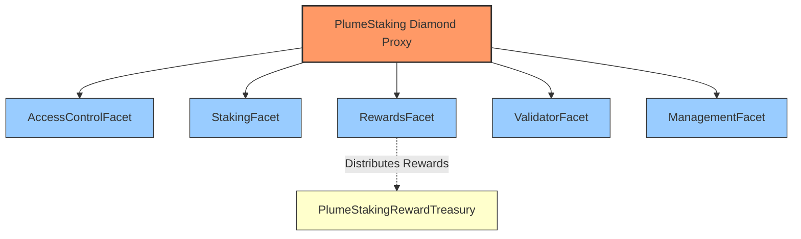

**Facet Responsibilities:**
- **AccessControlFacet**: OpenZeppelin AccessControl implementation
- **StakingFacet**: stake(), unstake(), withdraw(), restake(), restakeRewards()
- **RewardsFacet**: Reward calculation, distribution, treasury integration
- **ValidatorFacet**: Validator lifecycle, slashing, commission management
- **ManagementFacet**: System parameters, admin functions

#### Treasury System

The protocol separates fund custody from staking logic using a dedicated treasury contract:

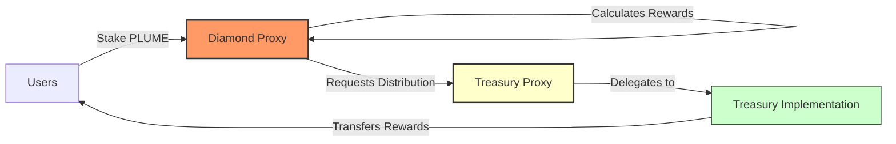

**Treasury Implementation:**
- UUPS upgradeable proxy pattern
- Role-based access (only Diamond can distribute)
- Multi-token support
- Direct transfers to users

### Core Concepts

#### Staking Mechanism

Staking lifecycle:

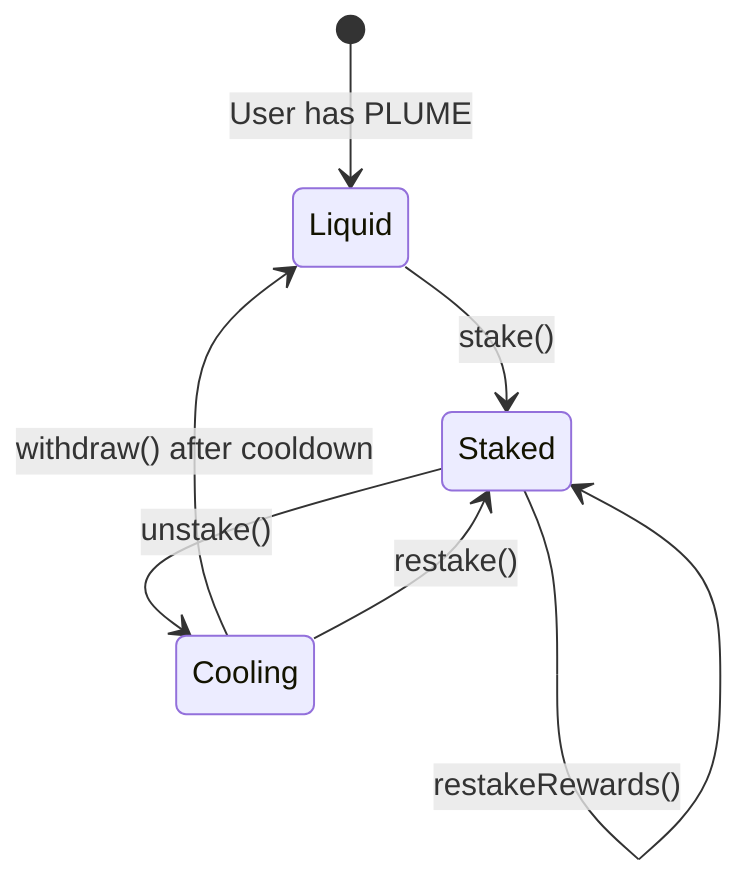

**Implementation Details:**
- Global minimum stake amount check
- Per-validator capacity limits
- Validator must be active and not slashed
- stake() accepts msg.value, stakeOnBehalf() allows third-party staking
- Cooldown period prevents immediate withdrawals after unstaking

#### Reward Calculation System

The reward system uses a sophisticated checkpoint-based mechanism to handle variable rates, validator-specific multipliers, and commission deductions.

##### Core Components

**1. Validator-Level Rate Tracking**
The system tracks reward rates exclusively at the validator level. When a reward token is added or its rate is updated via `setRewardRates`, a rate checkpoint is created for *every* active validator. This ensures all reward calculations are based on a specific validator's rate history.

**2. Checkpoint Structure**
```solidity
struct RateCheckpoint {
    uint256 timestamp;       // When rate changed
    uint256 rate;           // New rate (tokens/second/staked token)
    uint256 cumulativeIndex; // Accumulated rewards up to this point
}
```

**3. Key Storage Mappings**
- `validatorRewardRateCheckpoints[validatorId][token]`: Rate history
- `validatorCommissionCheckpoints[validatorId]`: Commission history
- `validatorRewardPerTokenCumulative[validatorId][token]`: Accumulated rewards
- `userValidatorRewardPerTokenPaid[user][validatorId][token]`: User's last settled index

##### Calculation Algorithm

**Step 1: Time Segmentation**

When calculating rewards, the system identifies all rate change points:

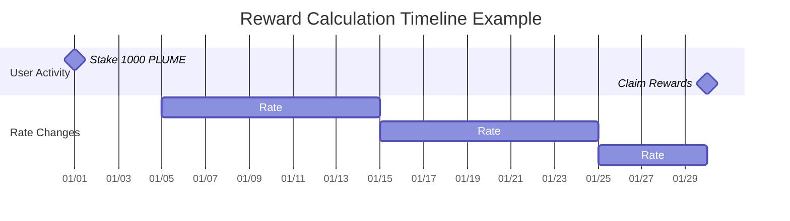

**Step 2: Segment Processing**

For each time segment between checkpoints:

```
Segment Gross Reward = Stake × Rate × Duration
Segment Commission = Gross Reward × Commission Rate
Segment Net Reward = Gross Reward - Commission
```

**Step 3: Mathematical Formula**

For a user with stake `S` over time period `[t₀, t₁]`:

```
Total Net Reward = Σᵢ [Sᵢ × Rᵢ × Δtᵢ × (1 - Cᵢ)]

Where:
- i = each time segment
- Sᵢ = stake amount in segment i
- Rᵢ = reward rate in segment i
- Δtᵢ = duration of segment i
- Cᵢ = commission rate in segment i
```

##### Detailed Calculation Example

**Setup:**
- User stakes 1,000 PLUME on January 1st
- REWARD_TOKEN with 18 decimals
- All rates use REWARD_PRECISION = 1e18

**Timeline:**

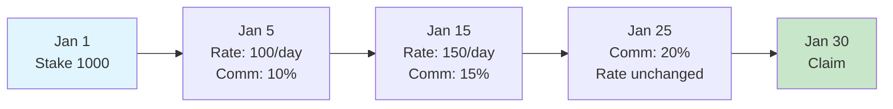

**Checkpoint Creation:**

```javascript
// Reward Rate Checkpoints
Checkpoint 0: { 
    timestamp: Jan 5, 
    rate: 100e18,     // 100 tokens/day/staked token
    cumulativeIndex: 0 
}
Checkpoint 1: { 
    timestamp: Jan 15, 
    rate: 150e18, 
    cumulativeIndex: 1000e18  // Accumulated from previous segment
}

// Commission Checkpoints
Checkpoint 0: { timestamp: Jan 5,  rate: 0.1e18 }   // 10%
Checkpoint 1: { timestamp: Jan 15, rate: 0.15e18 }  // 15%
Checkpoint 2: { timestamp: Jan 25, rate: 0.2e18 }   // 20%
```

**Calculation Process:**

| Segment | Duration | Rate | Stake | Gross Rewards | Commission | Net Rewards |
|---------|----------|------|-------|---------------|------------|-------------|
| Jan 1-5 | 4 days | 0 | 1,000 | 0 | 0% | 0 |
| Jan 5-15 | 10 days | 100/day | 1,000 | 1,000,000 | 10% (100,000) | 900,000 |
| Jan 15-25 | 10 days | 150/day | 1,000 | 1,500,000 | 15% (225,000) | 1,275,000 |
| Jan 25-30 | 5 days | 150/day | 1,000 | 750,000 | 20% (150,000) | 600,000 |
| **Total** | | | | **3,250,000** | **475,000** | **2,775,000** |

##### Implementation Details

**1. Finding Relevant Checkpoints (Binary Search)**

```solidity
function findCheckpointIndex(checkpoints, timestamp) {
    uint256 low = 0;
    uint256 high = checkpoints.length - 1;
    
    while (low <= high) {
        uint256 mid = (low + high) / 2;
        if (checkpoints[mid].timestamp <= timestamp) {
            if (mid == high || checkpoints[mid + 1].timestamp > timestamp) {
                return mid;  // Found the right checkpoint
            }
            low = mid + 1;
        } else {
            high = mid - 1;
        }
    }
    return 0;
}
```

> *Note: The function above is a simplified example for illustrative purposes. The actual implementation in `src/lib/PlumeRewardLogic.sol` is more robust and uses specialized functions such as `findRewardRateCheckpointIndexAtOrBefore` and `findCommissionCheckpointIndexAtOrBefore` to handle edge cases.*

**2. Time Segment Generation**

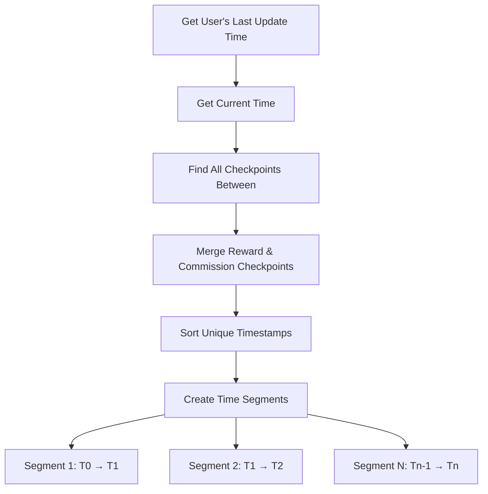

**3. Per-Segment Calculation Flow**

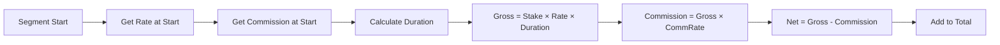

**4. Precision Handling**

All calculations use REWARD_PRECISION (1e18) to maintain accuracy:

```solidity
// Rate stored as tokens per second with 1e18 precision
uint256 ratePerSecond = 100e18 / 86400;  // 100 tokens/day

// Calculation preserves precision
uint256 rewardPerToken = duration * ratePerSecond;
uint256 grossReward = (stake * rewardPerToken) / REWARD_PRECISION;
```

##### Edge Cases

**1. Validator Slashing**
- Rewards stop accruing at slashedAtTimestamp
- Existing unclaimed rewards remain claimable
- No new rewards after slash time

**2. Mid-Stake Rate Changes**
- New stakers start earning from their stake timestamp
- Rate changes don't affect past earnings
- Checkpoint index tracking prevents double-claiming

**3. Zero Rates**
- Supported for pausing rewards
- Checkpoints still created for consistency
- Previous rewards remain claimable

##### Gas Optimization

**1. Checkpoint Efficiency**
- Binary search reduces lookup from O(n) to O(log n)
- Checkpoints only created on rate changes
- User checkpoint indices tracked to avoid re-processing

**2. Batch Operations**
- `claimAll()` processes all tokens in one transaction
- Validator commission settled across all tokens simultaneously
- Single update for all user rewards per validator

This checkpoint-based system ensures perfect accuracy regardless of when users claim, while maintaining gas efficiency through optimized data structures and algorithms.

#### Reward Token Lifecycle & Historical Tokens

Plume supports adding and removing reward tokens without disrupting historical reward accuracy:

- **Adding a token** (`addRewardToken`) immediately pushes the token into `rewardTokens`, marks it `isRewardToken=true`, and creates an *initial* reward-rate checkpoint for **every validator** at the chosen `initialRate`.  The token is also appended to the immutable `historicalRewardTokens` list.
- **Removing a token** (`removeRewardToken`) does **not** delete checkpoints. Instead it:
  1. Records `tokenRemovalTimestamps[token] = block.timestamp` so future calculations cap at this moment.
  2. Forces a final **zero-rate checkpoint** for each validator, guaranteeing no further accrual.
  3. Leaves all historical checkpoints intact so users can still claim previously-earned rewards.
- Users can therefore continue to claim even after a token is no longer active.  View/claim helpers automatically fall back to historical calculations when `isRewardToken[token] == false` but `isHistoricalRewardToken[token] == true`.
- Administrative helpers exist to *manually* add or remove entries from the historical list (`addHistoricalRewardToken`, `removeHistoricalRewardToken`).  These functions were used to migrate the contract state from v1 to v2 version. 
- The events `HistoricalRewardTokenAdded` / `HistoricalRewardTokenRemoved` capture these changes for off-chain indexers.

#### Slashing Mechanism

Slashing is driven by **unanimous votes** from *all other active validators* and can execute in two ways:

1. **Auto-Slash (preferred)** – when the last required validator casts its vote via `voteToSlashValidator`, the contract immediately calls the internal `_performSlash` and the validator is slashed in the *same* transaction. No privileged role is needed.
2. **Timed Slash** – if unanimity was reached but the auto-slash failed (e.g., a re-org removed a vote) anyone with `TIMELOCK_ROLE` may call `slashValidator` to perform the slash once the vote set is valid.

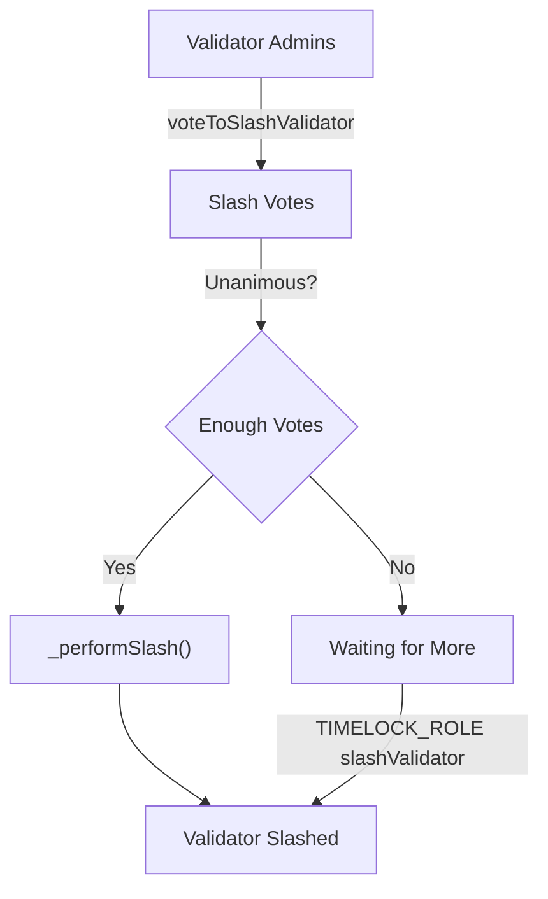

Key details:
- **Vote Expiry:** Each vote carries an `expiration` ≤ `maxSlashVoteDurationInSeconds`. Expired votes are cleaned up automatically by `_cleanupExpiredVotes` (invoked in voting & slashing paths).
- **Eligibility:** Only *active & non-slashed* validators may vote; a validator cannot vote to slash itself.
- **Cooldown Safety:** Admins must ensure `cooldownInterval > maxSlashVoteDuration` (enforced by `setCooldownInterval`). This guarantees users can always withdraw if a slash fails to pass.
- **Commission & Rewards:** Upon slashing, all stake & cooling amounts are burned; reward & commission accrual stops at `slashedAtTimestamp`.
- **Post-Slash Cleanup:** Users cannot recover losses, so admins use `adminClearValidatorRecord` / `adminBatchClearValidatorRecords` to erase orphaned state.

##### Effects of a Successful Slash

When `_performSlash` runs, the contract immediately:

1. **Burns 100 % of the validator’s stake and cooling balances.**  Both `validatorTotalStaked` and `validatorTotalCooling` are zeroed and the global aggregates (`totalStaked`, `totalCooling`) are reduced accordingly.
2. **Marks the validator as `slashed = true` and `active = false`.**  A `slashedAtTimestamp` is stored; reward logic caps accrual at this timestamp for all future calculations.
3. **Stops Reward & Commission Accrual.**  Reward‐rate calculations reference `slashedAtTimestamp`, so no new rewards or commission can accumulate after the slash block.
4. **Clears the stakers list and voting records** to prevent further interactions or double-slashing.
5. **Emits `ValidatorSlashed` and `ValidatorStatusUpdated` events** with the total stake+cooling amount burned so off-chain indexers can reconcile supply changes.

After these state changes, affected users must rely on the admin cleanup functions to remove now-irrecoverable records tied to the slashed validator.

#### Commission System

Validator commission flow:

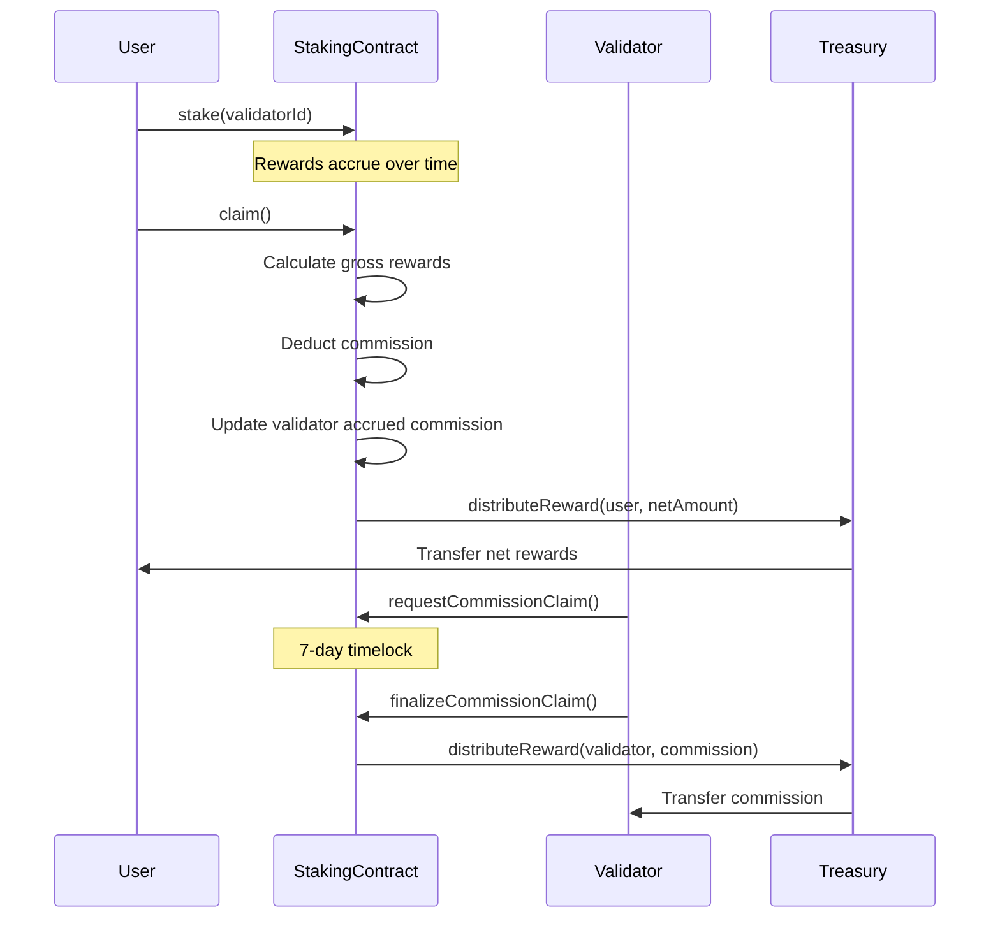

**Implementation:**
- Each validator keeps its **own** commission checkpoint history.  To defend against unbounded growth:
  •  `setMaxCommissionCheckpoints` caps the length (default 500).  Attempts to exceed revert with `MaxCommissionCheckpointsExceeded`.<br>  •  Admins can **prune** old data via `pruneCommissionCheckpoints` / `pruneRewardRateCheckpoints` (gas-heavy, irreversible).  Successful pruning emits `CommissionCheckpointsPruned` or `RewardRateCheckpointsPruned` respectively.
- 7-day timelock on withdrawals (COMMISSION_CLAIM_TIMELOCK)
- forceSettleValidatorCommission() for manual settlement

**Force Settlement Mechanism:**

```solidity
function forceSettleValidatorCommission(uint16 validatorId) external
```

- Permissionless function to trigger commission settlement
- Iterates all reward tokens and calculates accrued commission
- Updates validator's commission balance
- Gas costs borne by caller
- Useful before commission rate changes or validator updates

### Contract Reference

#### StakingFacet

Core staking operations and user balance management.

##### Write Functions

| Function | Description | Requirements |
|----------|-------------|--------------|
| `stake(uint16 validatorId)` | Stake PLUME tokens to a validator | - Payable (msg.value = stake amount)<br>- Validator must be active<br>- Validator not slashed<br>- Amount ≥ minimum stake<br>- Validator has capacity |
| `stakeOnBehalf(uint16 validatorId, address staker)` | Stake PLUME for another user | Same as stake() |
| `unstake(uint16 validatorId)` | Unstake all tokens from a validator | - Has stake with validator<br>- Validator not slashed<br>- Starts cooldown period |
| `unstake(uint16 validatorId, uint256 amount)` | Unstake specific amount | - Has sufficient stake<br>- Validator not slashed<br>- Starts cooldown period |
| `restake(uint16 validatorId, uint256 amount)` | Move cooling tokens back to staked | - Has cooling tokens<br>- Validator active<br>- Validator not slashed |
| `withdraw()` | Withdraw tokens after cooldown | - Has completed cooldowns<br>- Automatically skips slashed validators |
| `restakeRewards(uint16 validatorId)` | Claim and restake PLUME rewards | - Has PLUME rewards<br>- PLUME token must be an active reward token<br>- Transfers rewards from Treasury to back new stake<br>- Validator active<br>- Validator not slashed |

##### View Functions

| Function | Returns | Description |
|----------|---------|-------------|
| `amountStaked()` | `uint256` | Total PLUME staked by caller |
| `amountCooling()` | `uint256` | Total PLUME in cooldown (excludes slashed validators) |
| `amountWithdrawable()` | `uint256` | PLUME ready to withdraw |
| `stakeInfo(address user)` | `StakeInfo struct` | Complete staking information for user |
| `totalAmountStaked()` | `uint256` | System-wide staked PLUME |
| `totalAmountCooling()` | `uint256` | System-wide cooling PLUME |
| `totalAmountWithdrawable()` | `uint256` | System-wide withdrawable PLUME |
| `getUserValidatorStake(address, uint16)` | `uint256` | User's stake with specific validator |
| `getUserCooldowns(address)` | `CooldownEntry[]` | Active cooldowns (excludes slashed validators) |

#### RewardsFacet

Reward token management and distribution system.

##### Write Functions

| Function | Description | Access Control |
|----------|-------------|----------------|
| `setTreasury(address treasury)` | Set reward treasury address | REWARD_MANAGER_ROLE |
| `addRewardToken(address token, uint256 initialRate, uint256 maxRate)` | Add new reward token and set its initial rate for all validators | REWARD_MANAGER_ROLE |
| `removeRewardToken(address token)` | Remove reward token and create a final zero-rate checkpoint | REWARD_MANAGER_ROLE |
| `setRewardRates(address[] tokens, uint256[] rates)` | Set emission rates for multiple tokens, creating new checkpoints for all validators | REWARD_MANAGER_ROLE |
| `setMaxRewardRate(address token, uint256 rate)` | Set maximum rate limit for a token | REWARD_MANAGER_ROLE |
| `claim(address token, uint16 validatorId)` | Claim rewards for a specific token from a specific validator | Public |
| `claim(address token)` | Claim from all validators | Public |
| `claimAll()` | Claim all tokens from all validators | Public |

##### View Functions

| Function | Returns | Description |
|----------|---------|-------------|
| `earned(address user, address token)` | `uint256` | Total accumulated rewards across validators |
| `getClaimableReward(address user, address token)` | `uint256` | Currently claimable amount |
| `getRewardTokens()` | `address[]` | List of reward tokens |
| `getMaxRewardRate(address token)` | `uint256` | Maximum allowed rate |
| `getRewardRate(address token)` | `uint256` | Current emission rate |
| `tokenRewardInfo(address token)` | `RewardInfo struct` | Detailed token information |
| `getTreasury()` | `address` | Current treasury address |
| `getPendingRewardForValidator(address, uint16, address)` | `uint256` | Pending rewards for specific validator |

#### ValidatorFacet

Validator lifecycle management and slashing operations.

##### Write Functions

| Function | Description | Access Control |
|----------|-------------|----------------|
| `addValidator(uint16 validatorId, uint256 commission, address l2AdminAddress, ... , uint256 maxCapacity)` | Register new validator | VALIDATOR_ROLE |
| `setValidatorCapacity(uint16, uint256)` | Update staking capacity | VALIDATOR_ROLE |
| `setValidatorStatus(uint16, bool)` | Activate/deactivate validator | VALIDATOR_ROLE |
| `setValidatorCommission(uint16 validatorId, uint256 newCommission)` | Update commission rate for a validator | Validator Admin |
| `setValidatorAddresses(uint16, ...)` | Update admin/withdraw addresses. Admin changes initiate a two-step transfer. | Validator Admin |
| `acceptAdmin(uint16 validatorId)` | Accept pending admin role and complete two-step validator admin transfer | Pending Admin |
| `requestCommissionClaim(uint16 validatorId, address token)` | Start commission claim timelock for a specific token | Validator Admin |
| `finalizeCommissionClaim(uint16 validatorId, address token)` | Complete commission claim after timelock | Validator Admin |
| `voteToSlashValidator(uint16, uint256)` | Vote to slash another validator | Validator Admin |
| `slashValidator(uint16)` | Execute slashing if unanimity already reached (fallback) | TIMELOCK_ROLE |
| `cleanupExpiredVotes(uint16)` | Remove expired votes and return current valid count | Public |
| `forceSettleValidatorCommission(uint16)` | Manually settle accrued commission | Public |

##### View Functions

| Function | Returns | Description |
|----------|---------|-------------|
| `getValidatorInfo(uint16)` | `ValidatorInfo struct` | Complete validator details including slash status |
| `getValidatorStats(uint16)` | `ValidatorStats struct` | Key metrics for validator |
| `getUserValidators(address)` | `uint16[]` | Validators user has staked with (excludes slashed) |
| `getAccruedCommission(uint16, address)` | `uint256` | Unclaimed commission amount |
| `getValidatorsList()` | `ValidatorData[]` | All validators with core data |
| `getActiveValidatorCount()` | `uint256` | Number of active, non-slashed validators |
| `getSlashVoteCount(uint16)` | `uint256` | Current votes to slash validator |

#### ManagementFacet

System parameter configuration and administrative functions.

##### Write Functions

| Function | Description | Access Control |
|----------|-------------|----------------|
| `setMinStakeAmount(uint256)` | Set minimum stake requirement | ADMIN_ROLE |
| `setCooldownInterval(uint256)` | Set unstaking cooldown duration | ADMIN_ROLE |
| `adminWithdraw(address, uint256, address)` | Emergency fund withdrawal | TIMELOCK_ROLE |
| `setMaxSlashVoteDuration(uint256)` | Set vote expiration time | ADMIN_ROLE |
| `setMaxAllowedValidatorCommission(uint256)` | Set system-wide commission cap | ADMIN_ROLE |
| `adminClearValidatorRecord(address, uint16)` | Clear slashed validator records | ADMIN_ROLE |
| `adminBatchClearValidatorRecords(address[], uint16)` | Batch clear records | ADMIN_ROLE |
| `setMaxCommissionCheckpoints(uint16)` | Set max commission checkpoints per validator | ADMIN_ROLE |
| `setMaxValidatorPercentage(uint256)` | Set max % of total stake a validator can hold | ADMIN_ROLE |
| `pruneCommissionCheckpoints(uint16, uint256)` | Prune oldest commission checkpoints | ADMIN_ROLE |
| `pruneRewardRateCheckpoints(uint16, address, uint256)` | Prune oldest reward rate checkpoints | ADMIN_ROLE |
| `addHistoricalRewardToken(address)` | Add token to historical reward list (non-active) | ADMIN_ROLE |
| `removeHistoricalRewardToken(address)` | Remove token from historical reward list | ADMIN_ROLE |

##### View Functions

| Function | Returns | Description |
|----------|---------|-------------|
| `getMinStakeAmount()` | `uint256` | Current minimum stake |
| `getCooldownInterval()` | `uint256` | Current cooldown duration |

#### AccessControlFacet

OpenZeppelin AccessControl implementation.

##### Initialization

```solidity
// Must be called after facet deployment
accessControlFacet.initializeAccessControl()
```

Grants DEFAULT_ADMIN_ROLE and ADMIN_ROLE to caller, sets up role hierarchy.

### Events Reference

#### Staking Events

| Event | Emitted When | Parameters |
|-------|--------------|------------|
| `Staked` | User stakes tokens | `user`, `validatorId`, `amount`, `fromCooling`, `fromParked`, `pendingRewards` |
| `StakedOnBehalf` | Staking for another user | `sender`, `staker`, `validatorId`, `amount` |
| `Unstaked` | Unstaking initiated | `user`, `validatorId`, `amount` |
| `CooldownStarted` | Cooldown period begins | `staker`, `validatorId`, `amount`, `cooldownEnd` |
| `Withdrawn` | Tokens withdrawn after cooldown | `staker`, `amount` |
| `RewardsRestaked` | Rewards claimed and restaked | `staker`, `validatorId`, `amount` |

#### Reward Events

| Event | Emitted When | Parameters |
|-------|--------------|------------|
| `RewardTokenAdded` | New reward token registered | `token` |
| `RewardTokenRemoved` | Reward token removed | `token` |
| `RewardRatesSet` | Emission rates updated | `tokens[]`, `rates[]` |
| `MaxRewardRateUpdated` | Maximum rate changed | `token`, `newMaxRate` |
| `RewardRateCheckpointCreated` | Rate checkpoint created | `token`, `validatorId`, `rate`, `timestamp`, `index`, `cumulativeIndex` |
| `RewardClaimed` | User claims rewards | `user`, `token`, `amount` |
| `RewardClaimedFromValidator` | Rewards claimed from specific validator | `user`, `token`, `validatorId`, `amount` |
| `TreasurySet` | Treasury address updated | `treasury` |

#### Validator Events

| Event | Emitted When | Parameters |
|-------|--------------|------------|
| `ValidatorAdded` | New validator registered | `validatorId`, `commission`, `l2Admin`, `l2Withdraw`, `l1Val`, `l1Acc`, `l1AccEvm` |
| `ValidatorUpdated` | Validator details modified | Same as ValidatorAdded |
| `ValidatorStatusUpdated` | Active/slash status changed | `validatorId`, `active`, `slashed` |
| `ValidatorCommissionSet` | Commission rate updated | `validatorId`, `oldCommission`, `newCommission` |
| `ValidatorAddressesSet` | Admin/withdraw addresses changed | All old and new addresses |
| `ValidatorCapacityUpdated` | Capacity limit changed | `validatorId`, `oldCapacity`, `newCapacity` |
| `ValidatorCommissionClaimed` | Commission withdrawn | `validatorId`, `token`, `amount` |
| `SlashVoteCast` | Vote to slash submitted | `targetValidatorId`, `voterValidatorId`, `voteExpiration` |
| `ValidatorSlashed` | Validator slashed | `validatorId`, `slasher`, `penaltyAmount` |
| `ValidatorCommissionCheckpointCreated` | Commission checkpoint created | `validatorId`, `rate`, `timestamp` |

#### Administrative Events

| Event | Emitted When | Parameters |
|-------|--------------|------------|
| `MinStakeAmountSet` | Minimum stake updated | `amount` |
| `CooldownIntervalSet` | Cooldown duration updated | `interval` |
| `AdminWithdraw` | Emergency withdrawal | `token`, `amount`, `recipient` |
| `MaxSlashVoteDurationSet` | Vote expiration updated | `duration` |
| `MaxAllowedValidatorCommissionSet` | Commission cap updated | `oldMaxRate`, `newMaxRate` |
| `AdminClearedSlashedStake` | Slashed stake cleared by admin | `user`, `slashedValidatorId`, `amountCleared` |
| `AdminClearedSlashedCooldown` | Slashed cooldown cleared by admin | `user`, `slashedValidatorId`, `amountCleared` |
| `MaxCommissionCheckpointsSet` | Max commission checkpoints updated | `newLimit` |
| `CommissionCheckpointsPruned` | Old commission checkpoints pruned | `validatorId`, `count` |
| `RewardRateCheckpointsPruned` | Old reward rate checkpoints pruned | `validatorId`, `token`, `count` |
| `HistoricalRewardTokenAdded` | Token added to historical list | `token` |
| `HistoricalRewardTokenRemoved` | Token removed from historical list | `token` |
| `AdminProposed` | New validator admin proposed | `validatorId`, `proposedAdmin` |

### Errors Reference

#### Critical Errors

| Error | Thrown When |
|-------|-------------|
| `ValidatorDoesNotExist(uint16)` | Invalid validator ID |
| `ValidatorInactive(uint16)` | Validator not active |
| `ValidatorAlreadySlashed(uint16)` | Validator already slashed |
| `ActionOnSlashedValidatorError(uint16)` | Operation on slashed validator |
| `NotValidatorAdmin(address)` | Caller not validator admin |
| `Unauthorized(address, bytes32)` | Missing required role |
| `TreasuryNotSet()` | Treasury not configured |

#### Staking Errors

| Error | Thrown When |
|-------|-------------|
| `InvalidAmount(uint256)` | Zero or invalid amount |
| `NoActiveStake()` | No stake to unstake |
| `StakeAmountTooSmall(uint256, uint256)` | Below minimum stake |
| `InsufficientFunds(uint256, uint256)` | Insufficient balance |
| `CooldownPeriodNotEnded()` | Cooldown not complete |
| `NoRewardsToRestake()` | No rewards available |
| `ExceedsValidatorCapacity(uint16, uint256, uint256, uint256)` | Over validator capacity |
| `ValidatorPercentageExceeded()` | Over 33% total stake |

#### Commission/Reward Errors

| Error | Thrown When |
|-------|-------------|
| `CommissionExceedsMaxAllowed(uint256, uint256)` | Commission > max allowed |
| `InvalidMaxCommissionRate(uint256, uint256)` | Max rate > 50% |
| `PendingClaimExists(uint16, address)` | Claim already pending |
| `NoPendingClaim(uint16, address)` | No claim to finalize |
| `ClaimNotReady(uint16, address, uint256)` | Timelock not passed |
| `TokenDoesNotExist(address)` | Unknown reward token |
| `RewardRateExceedsMax()` | Rate > max allowed |

#### Slashing Errors

| Error | Thrown When |
|-------|-------------|
| `SlashVoteDurationTooLong()` | Vote expiration > max |
| `CannotVoteForSelf()` | Self-voting attempt |
| `AlreadyVotedToSlash(uint16, uint16)` | Duplicate vote |
| `UnanimityNotReached(uint256, uint256)` | Missing votes |
| `SlashVoteExpired(uint16, uint16)` | Vote expired |
| `CooldownTooShortForSlashVote(uint256, uint256)` | cooldownInterval ≤ maxSlashVoteDuration |
| `SlashVoteDurationTooLongForCooldown(uint256, uint256)` | Proposed vote duration ≥ cooldownInterval |
| `SlashVoteDurationExceedsCommissionTimelock(uint256, uint256)` | Proposed vote duration ≥ commission timelock |
| `NotPendingAdmin(address,uint16)` | Caller tries to accept admin without being the pending admin |
| `NoPendingAdmin(uint16)` | acceptAdmin called with no pending admin |

See PlumeErrors.sol for complete list.

### Constants and Roles

#### System Roles

| Role | Purpose | Key Permissions |
|------|---------|-----------------|
| `ADMIN_ROLE` | System administration | - Manage all other roles<br>- Set system parameters<br>- Emergency functions<br>- Clear slashed records |
| `UPGRADER_ROLE` | Contract upgrades | - Execute diamondCut<br>- Upgrade facets |
| `VALIDATOR_ROLE` | Validator management | - Add validators<br>- Set capacities<br>- Update statuses |
| `REWARD_MANAGER_ROLE` | Reward configuration | - Set reward rates<br>- Manage tokens<br>- Configure treasury |
| `TIMELOCK_ROLE` | Time-sensitive operations | - Execute slashing<br>- Set cooldown interval |

#### System Constants

| Constant | Value | Usage |
|----------|-------|--------|
| `PLUME_NATIVE` | 0xEeeeeEeeeEeEeeEeEeEeeEEEeeeeEeeeeeeeEEeE | Native PLUME token address |
| `REWARD_PRECISION` | 1e18 | Precision for rate calculations |
| `COMMISSION_CLAIM_TIMELOCK` | 7 days | Validator commission withdrawal delay |
| `STORAGE_SLOT` | keccak256("plume.staking.storage") | Diamond storage location |

---

## Testing

### Running Tests
The core test suite can be run using the following Forge command, which specifically targets the `PlumeStakingDiamond` tests with high verbosity:

```bash
forge test --match-contract PlumeStakingDiamond  -vvvv --via-ir
```

### Gas Considerations

**Notice on Loop Operations:** The PlumeStaking contract's design accounts for the current operational scale. At present, the system operates with 10 validators and one primary reward token. As there are no immediate plans to scale to hundreds of validators or tens of reward tokens, functions that loop through all validators or reward tokens are computationally safe and are not expected to exceed block gas limits under these conditions. Developers should remain mindful of these looping patterns if the system's scale significantly increases in the future.

---

## Spin and Raffle Contracts


More detailed info is available [here](SPIN.md).


### Environment Setup

`.env` configuration:

```bash
# Network
RPC_URL="https://rpc.plume.org"
PRIVATE_KEY=<DEPLOY_WALLET_PRIVATE_KEY>

# Contract Addresses (for upgrades)
SPIN_PROXY_ADDRESS=<NEEDED_FOR_UPGRADE>
RAFFLE_PROXY_ADDRESS=<NEEDED_FOR_UPGRADE>

# Supra Oracle
SUPRA_ROUTER_ADDRESS=0xE1062AC81e76ebd17b1e283CEed7B9E8B2F749A5
SUPRA_DEPOSIT_CONTRACT_ADDRESS=0x6DA36159Fe94877fF7cF226DBB164ef7f8919b9b
SUPRA_GENERATOR_CONTRACT_ADDRESS=0x8cC8bbE991d8B4371551B4e666Aa212f9D5f165e

# Utilities
DATETIME_ADDRESS=0x06a40Ec10d03998634d89d2e098F079D06A8FA83
BLOCKSCOUT_URL=https://explorer.plume.org/api?
```

### Build Instructions

```bash
forge clean && forge build --via-ir --build-info
```

### Deployment Guide

Deploy Spin and Raffle contracts with Supra whitelisting:

```bash
source .env && forge script script/DeploySpinRaffleContracts.s.sol \
    --rpc-url https://rpc.plume.org \
    --broadcast \
    --via-ir
```
Save proxy addresses from deployment output for upgrades.

### Upgrade Process

```bash
# Spin Contract
source .env && forge script script/UpgradeSpinContract.s.sol \
    --rpc-url https://rpc.plume.org \
    --broadcast \
    --via-ir

# Raffle Contract
source .env && forge script script/UpgradeRaffleContract.s.sol \
    --rpc-url https://rpc.plume.org \
    --broadcast \
    --via-ir
```

### Launch Steps

```solidity
// 1. Configure Raffle Prizes
raffle.addPrize(prizeId, prizeDetails);

// 2. Set Campaign Start Date (Spin)
spin.setCampaignStartDate(startTimestamp);

// 3. Enable Spin
spin.setEnabledSpin(true);
```

---

*This documentation is maintained alongside the smart contracts. For the latest updates, please refer to the repository.*


### SPIN.md

# Daily Spin & Raffle Contracts

> [!NOTE]
> **The Daily Spin is now live on Plume!**
> Try it out here: [https://portal.plume.org/daily-spin](https://portal.plume.org/daily-spin)

This document provides a technical overview of the `Spin.sol` and `Raffle.sol` smart contracts, which together create a gamified daily spin and raffle system.

## Table of Contents
1.  [High-Level Overview](#high-level-overview)
2.  [The Spin Contract (`Spin.sol`)](#1-the-spin-contract-spin.sol)
    -   [Spinning Process](#spinning-process)
    -   [Reward Determination Logic](#reward-determination-logic)
    -   [Daily Streak Mechanic](#daily-streak-mechanic)
    -   [`Spin.sol` Technical Reference](#spin.sol-technical-reference)
3.  [The Raffle Contract (`Raffle.sol`)](#2-the-raffle-contract-raffle.sol)
    -   [Raffle Process](#raffle-process)
    -   [Multi-Winner Selection](#multi-winner-selection)
    -   [Claiming a Prize](#claiming-a-prize-multi-winner-aware)
    -   [`Raffle.sol` Technical Reference](#raffle.sol-technical-reference)

## High-Level Overview

The daily spin is a feature where users pay a fee to spin a virtual wheel once per day for a chance to win various rewards, including raffle tickets. These tickets can then be used in a separate raffle system to win larger prizes. The system is built around two main contracts, `Spin.sol` and `Raffle.sol`, and uses the Supra oracle for verifiable on-chain randomness.

The overall process can be visualized as follows:

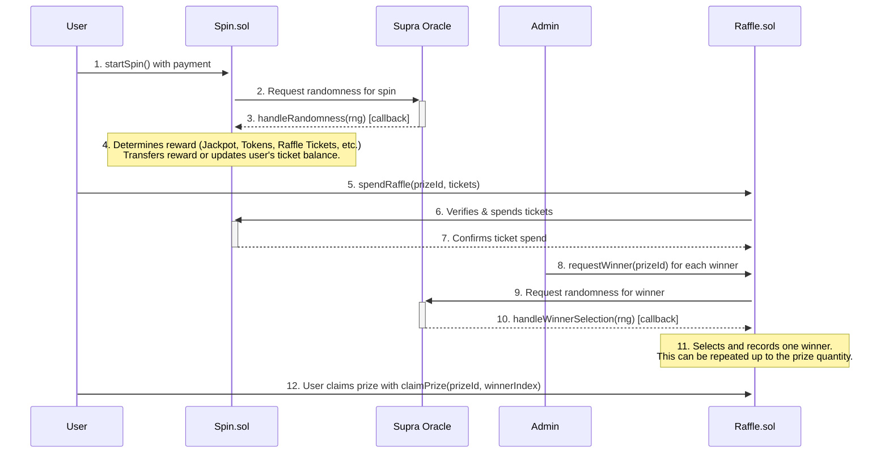

---

## 1. The Spin Contract (`Spin.sol`)

This is the core of the feature. It manages the user's ability to spin, the rewards, and the daily streak mechanic.

### Spinning Process

-   **Initiation**: A user calls the `startSpin()` function, sending a payment equal to the `spinPrice`.
-   **Cooldown**: The `canSpin` modifier ensures a user can only spin once per calendar day. This check is bypassed for whitelisted addresses. An attempt to spin more than once a day will result in an `AlreadySpunToday` error.
-   **Randomness**: The contract requests a random number from the Supra oracle. The spin is considered "pending" until the oracle returns a value.
-   **Reward Callback**: The Supra oracle calls `handleRandomness()` with the random number. This function is protected against re-entrancy and can only be called by the trusted oracle address.

### Reward Determination Logic

The `determineReward` function uses a multi-stage process to assign a reward based on a pseudo-random number (`rng`) from the Supra oracle. The `rng` is normalized to a value between 0 and 999,999.

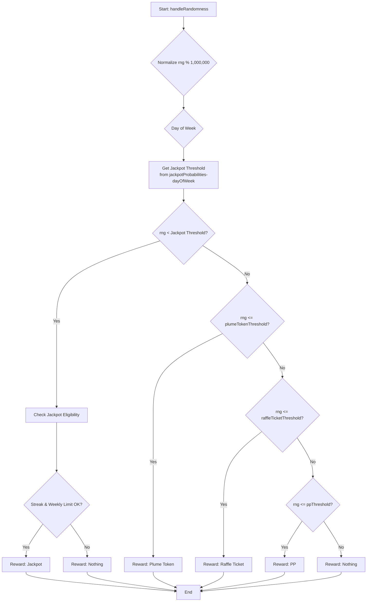

**Reward Tiers & Probabilities:**

| Reward Category | Probability Logic | Notes |
| :--- | :--- |:---|
| **Jackpot** | `rng < jackpotProbabilities-dayOfWeek` | The probability changes daily. Requires passing additional eligibility checks. |
| **Plume Token** | `rng <= plumeTokenThreshold` | A fixed amount of PLUME tokens. |
| **Raffle Ticket** | `rng <= raffleTicketThreshold` | Amount is `baseRaffleMultiplier * streakCount`. |
| **PP** | `rng <= ppThreshold` | A fixed amount of Plume Points. |
| **Nothing** | `rng > ppThreshold` | The default outcome if no other tier is met. |

**Jackpot Eligibility:**
Even if a user's `rng` falls within the jackpot range, they must meet two additional criteria:
1.  **Weekly Limit**: Only one jackpot can be won per campaign week across all users. The `lastJackpotClaimWeek` variable prevents further jackpot rewards within the same week. If this check fails, the reward defaults to "Nothing".
2.  **Streak Requirement**: The user's `streakCount` must be greater than or equal to `currentWeek + 2`. This means the required streak to be eligible for the jackpot increases as the campaign progresses. If this check fails, the reward also defaults to "Nothing".

### Daily Streak Mechanic

The contract calculates a user's streak of consecutive daily spins to reward consistent engagement. The core logic resides in the internal `_computeStreak` function.

- **Calculation**: The streak is based on calendar days, not 24-hour periods. This is achieved by dividing the `lastSpinTimestamp` and `block.timestamp` by `SECONDS_PER_DAY` (86,400) and comparing the resulting day numbers.
    - If `today == lastDaySpun`, the streak is unchanged.
    - If `today == lastDaySpun + 1`, the streak is incremented.
    - If `today > lastDaySpun + 1`, the streak is considered broken and resets to `1` (for the current day's spin).
- **Impact**: The `streakCount` directly multiplies the number of raffle tickets awarded, significantly increasing rewards for daily players. It is also a critical requirement for jackpot eligibility.

---
### `Spin.sol` Technical Reference

#### **Key Functions**
| Function | Description | Access |
|:---|:---|:---|
| `startSpin()` | User-callable function to initiate a spin by sending the required `spinPrice`. | Public |
| `handleRandomness(...)` | The callback function for the Supra oracle. Processes the spin result and updates user state. | `SUPRA_ROLE` |
| `spendRaffleTickets(...)` | Allows the `Raffle` contract to deduct tickets from a user's balance. | `raffleContract` only |
| `pause()` / `unpause()` | Pauses or unpauses the `startSpin` functionality. | `ADMIN_ROLE` |
| `adminWithdraw(...)` | Allows admin to withdraw PLUME tokens from the contract balance. | `ADMIN_ROLE` |
| `cancelPendingSpin(address user)` | Escape hatch to cancel a user's spin request that is stuck pending an oracle callback. | `ADMIN_ROLE` |
| `set...()` functions | A suite of functions (`setSpinPrice`, `setRaffleContract`, etc.) for configuring contract parameters. | `ADMIN_ROLE` |
| `currentStreak(address user)` | View function to get a user's current consecutive daily spin streak. | Public View |
| `getUserData(address user)` | View function that returns a comprehensive struct of a user's spin-related data. | Public View |
| `getWeeklyJackpot()` | View function to get the current week's jackpot prize and required streak. | Public View |

#### **Events**
-   `SpinRequested(uint256 indexed nonce, address indexed user)`: Emitted when a user successfully initiates a spin.
-   `SpinCompleted(address indexed walletAddress, string rewardCategory, uint256 rewardAmount)`: Emitted after the oracle callback is processed, detailing the reward.
-   `RaffleTicketsSpent(address indexed walletAddress, uint256 ticketsUsed, uint256 remainingTickets)`: Emitted when the `Raffle` contract spends a user's tickets.
-   `NotEnoughStreak(string message)`: Emitted if a user meets the odds for a jackpot but does not have the required streak count.
-   `JackpotAlreadyClaimed(string message)`: Emitted if a user meets the odds for a jackpot but it has already been won that week.

#### **Errors**
-   `AlreadySpunToday()`: Reverts if a user tries to spin more than once in a calendar day.
-   `CampaignNotStarted()`: Reverts if `startSpin()` is called before the campaign is enabled by an admin.
-   `InvalidNonce()`: Reverts if the `handleRandomness` callback receives a nonce that does not correspond to a pending spin.
-   `SpinRequestPending(address user)`: Reverts if a user tries to `startSpin()` while another spin is already pending an oracle callback.

---

## 2. The Raffle Contract (`Raffle.sol`)

This contract allows users to spend the raffle tickets they've earned from the Spin contract to enter drawings for prizes that can have **multiple winners**.

### Raffle Process

-   **Prize Management**: An admin can call `addPrize` and `editPrize`. A critical parameter is `quantity`, which defines how many winners a single prize can have.
-   **Entering a Raffle**: A user calls `spendRaffle(prizeId, ticketAmount)` to enter a specific prize drawing. The `Raffle` contract communicates with the `Spin` contract to verify the user has enough `raffleTicketsBalance` and then to deduct the spent amount.

### Multi-Winner Selection

Winner selection is an admin-initiated process that can be repeated for each available prize slot. It is designed to be fair and transparent.

1.  **Request**: The admin calls `requestWinner(prizeId)`. This can be done as long as the number of `winnersDrawn` is less than the prize `quantity`.
2.  **Oracle Callback**: The function requests a random number from the Supra oracle. The oracle's callback, `handleWinnerSelection`, receives the random number and performs a binary search on the ticket entries to find the winner.
3.  **Recording Winner**: The winner's details are stored in the `prizeWinners` array for that prize.
4.  **Repeat**: This process can be repeated by the admin until the `quantity` of winners for that prize has been drawn. Once `winnersDrawn == quantity`, the prize automatically becomes inactive.

### Claiming a Prize (Multi-Winner Aware)

-   **Individual Claims**: Each winner must call `claimPrize(prizeId, winnerIndex)` to claim their specific prize. Since a prize can have multiple winners, the `winnerIndex` (starting from 0) is used to identify which winning slot is being claimed.
-   **Independent Status**: Each winner's claim status is tracked independently. One user claiming their prize has no effect on the ability of other winners to claim theirs. The actual delivery of the prize is handled off-chain.

---
### `Raffle.sol` Technical Reference

#### Data Structures

**`Prize` Struct**
```solidity
struct Prize {
    string name;
    string description;
    uint256 value;
    uint256 endTimestamp;
    bool isActive;
    uint256 quantity;
    // --- Deprecated Fields ---
    address winner;
    uint256 winnerIndex;
    bool claimed;
}
```
> *Note: The `winner`, `winnerIndex`, and `claimed` fields on the `Prize` struct are deprecated and are no longer used in favor of the multi-winner `prizeWinners` mapping.*

**`Winner` Struct**
```solidity
struct Winner {
    address winnerAddress;
    uint256 winningTicketIndex;
    uint256 drawnAt;
    bool claimed;
}
```

#### **Key Functions**
| Function | Description | Access |
|:---|:---|:---|
| `spendRaffle(prizeId, ticketAmount)` | User-callable function to spend raffle tickets and enter a prize drawing. | Public |
| `requestWinner(prizeId)` | Initiates the winner selection process for a specific prize. | `ADMIN_ROLE` |
| `handleWinnerSelection(...)` | The callback from the Supra oracle. Finds and records a winner. | `SUPRA_ROLE` |
| `claimPrize(prizeId, winnerIndex)` | User-callable for a winner to claim their prize slot. | Public |
| `addPrize(...)` / `editPrize(...)` / `removePrize(...)` | Functions for managing prize details. | `ADMIN_ROLE` |
| `setPrizeActive(prizeId, active)` | Manually activates or deactivates a prize. | `ADMIN_ROLE` |
| `cancelWinnerRequest(prizeId)` | Escape hatch to cancel a pending VRF request for a winner drawing. | `ADMIN_ROLE` |
| `getPrizeDetails(...)` | View function to get all public details about a specific prize. | Public View |
| `getPrizeWinners(prizeId)` | View function to get an array of all the `Winner` structs for a prize. | Public View |
| `getUserWinnings(address user)` | View function to get an array of prize IDs that a specific user has won. | Public View |

#### **Events**
-   `PrizeAdded(uint256 indexed prizeId, string name)`: Emitted when a new prize is created.
-   `PrizeEdited(uint256 indexed prizeId, ...)`: Emitted when an existing prize is modified via `editPrize`.
-   `TicketSpent(address indexed user, uint256 indexed prizeId, uint256 tickets)`: Emitted when a user successfully spends tickets on a prize.
-   `WinnerRequested(uint256 indexed prizeId, uint256 indexed requestId)`: Emitted when an admin requests a winner to be drawn.
-   `WinnerSelected(uint256 indexed prizeId, address indexed winner, uint256 winningTicketIndex)`: Emitted when the oracle callback successfully selects and records a winner.
-   `PrizeClaimed(address indexed user, uint256 indexed prizeId, uint256 winnerIndex)`: Emitted when a winner successfully claims their prize.

#### **Errors**
-   `AllWinnersDrawn()`: Reverts if `requestWinner` is called after all available winner slots for a prize have been filled.
-   `EmptyTicketPool()`: Reverts if `requestWinner` is called for a prize that has no ticket entries.
-   `InsufficientTickets()`: Reverts if a user tries to spend more raffle tickets than they have.
-   `WinnerNotDrawn()`: Reverts if a user tries to claim a prize before the winner selection process is complete for that slot.
-   `NotAWinner()`: Reverts if a user tries to claim a prize they did not win.
-   `WinnerClaimed()`: Reverts if a winner tries to claim the same prize slot more than once.
-   `WinnerRequestPending(uint256 prizeId)`: Reverts if `requestWinner` is called for a prize that already has a pending VRF request.

